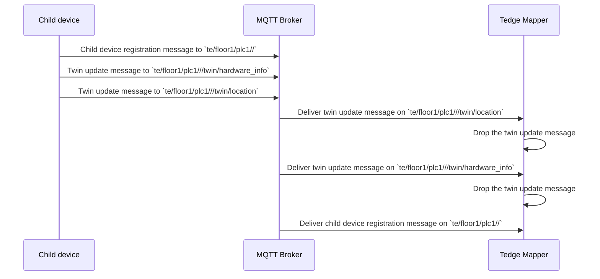
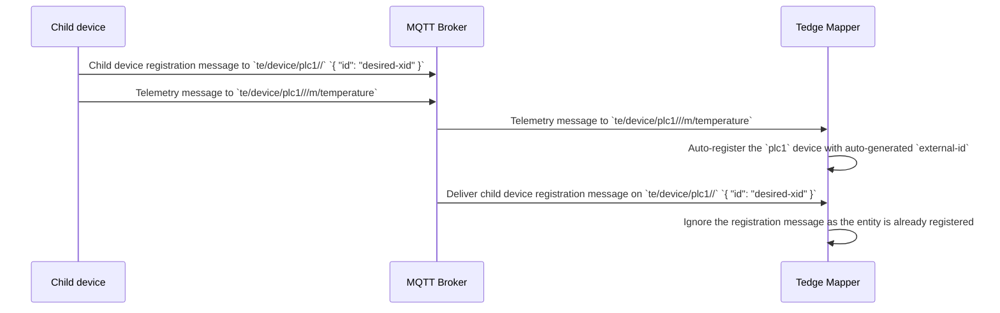
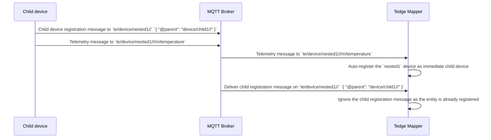

# Cumulocity Mapper Message Processing

* Date: __2023-11-29__
* Status: __Approved__

## Background

Since MQTT protocol does not offer any guarantees about ordered message delivery across topics,
and since we use different topics for entity registration messages and all other messages,
even if a client sends the registration message first, followed by a telemetry message,
the telemetry message might get delivered first, before the registration message.
This could lead to the following issues when the mapper processes these messages:

### Out of order delivery of registration and non-registration messages

Since the registration messages and other messages are sent to different topics,
even if a publishing client sends them in order: registration message followed by a twin update message,
the MQTT broker may deliver those messages in the reverse order to the mapper,
as MQTT protocol does not guarantee any ordering across topics.
This case is illustrated in the following diagram:

When the mapper receives the twin update messages first, they are ignored as that entity is not registered yet.
Even though the entity registration message is processed later, the ignored twin updates are not processed again,
until the mapper is restarted, and these retained messages are re-delivered to the mapper.

### Out of order delivery on mapper restart

The message delivery problem gets even worse during a mapper restart,
as there could be hundreds of retained messages: registration messages, twin update messages and command metadata messages,
all delivered in quick succession to the mapper.
Due to the sheer volume of these messages, the chances of out of order delivery is also very high,
leading to the mapper dropping a lot of critical messages, leaving the entity store in a partial/broken state.

### Auto-registration interfering with explicit registration

When auto-registration is enabled, and if some users use explicit registration along with it,
the above mentioned out-of-order message delivery can lead to entities getting created with the wrong metadata,
like the `external-id` derived by the auto-registration logic,
even if the user had explicitly provided those values in their registration message.

This case is illustrated in the following diagram:

Here the end-result is even more catastrophic, as the user expects a device with external-id: `desired-xid`,
but the mapper has created one with the auto-generated external-id, which can't be changed afterwards.

Here is another variant of the same issue, with nested child devices, for whom explicit registration is mandatory:

Here a device that was meant to be registered as a nested child device got registered as immediate child device,
which can't be undone/corrected when the actual registration message eventually arrives.

## Solution Proposal

The key ideas are as follows:

* Cache any data messages received for an entity before its registration message is.
* Cache any child devices that are registered before their parents are
* When a registration message is received, process its cached data along with all of its cached children
* Bounded caches are used to cache telemetry messages from all entities, to limit uncontrolled growth of such cached data.
* The entity store is persisted on disk and rebuilt on every restart, to minimize message races on startup
* Auto-registration must be turned off if explicit registration is used for any entity

### Live mapper

When the mapper is live, if telemetry messages for a new entity is received before its registration message,
they are kept in a bounded in-memory cache until the registration message arrives.
The cache is a fixed-size buffer (e.g: a ring buffer) where newer entries replace older ones once the buffer is full.
All non-telemetry data like twin updates, capability messages etc are cached in an "unregistered entity store",
and are moved to the entity store once the registration message eventually arrives.

Any nested entity registration messages that arrives before their ancestors are registered
are also be kept in the same "unregistered entity store" until all their ancestors are registered.

There will also be max time limit for an unregistered entity to stay cached, after which it will be dropped.

### Mapper restart

To minimize the message races on a restart, especially between all the entities that were previously registered
before the mapper went down and any data messages for that entity that may have come while the mapper was down,
a persistent copy of the entity store is maintained on the disk, and kept up-to-date, while the mapper is live.
On restart, the in-memory entity store is rebuilt from the persistent copy before processing any new messages.
This helps in avoiding any message races for all those previously registered entities,
as any queued data messages can be processed straight-away as soon as the persistent entity store is restored.
This also helps in avoiding the duplicate processing of all the previously registered entities,
when those exact same retained registration messages are delivered again on startup.

While the mapper is down, there could still be newer entities for which
the registration messages and other telemetry messages are published.
On startup, a message delivery race for such entities can still happen,
but they are handled the same way such messages are handled by the live mapper:
keep the data messages cached until the registration message eventually arrives.

### Auto registration interference

To avoid any conflicts between auto-registration and explicit registration,
resulting in nested child devices from wrongly getting auto-registered as immediate child devices,
we can just instruct the users to turn-off auto-registration if they have nested child devices in their deployment.
Explicit registration must be used even for immediate child devices in such deployments.
Or to say it differently, use auto-registration only in simple deployments where there are only immediate child devices.

## Solution enhancements

### Disk based caches for telemetry messages

To avoid any risk of Out of memory (OOM) events due to the in-memory caching of the telemetry messages,
a disk based persistent message queue (e.g: an append-only-log), per entity,
is used to cache those "early" telemetry messages.
An append-only-log is proposed as the disk persistent queue, for better performance while processing
those early telemetry messages.

This persistent message queue is only used for caching telemetry messages and not for persisting the entity store,
because re-ordering of earlier messages would be required while processing entity registration messages
(e.g: nested child device registration messages received before its parents) which requires random access in the store,
which is inherently not easy in a queue-like data structure.

### Handling rogue clients

Even though small fixed-size in-memory caches are used to store the early telemetry messages,
there is the risk of those messages lying around in that cache forever (or until the next mapper restart),
if that entity is never registered (e.g: a rogue client pounding data without ever registering itself).
A timer based eviction can be applied on these caches to mitigate this problem.

Another option is to use disk-based caches instead of in-emory ones for early telemetry messages as well.
On the next restart of the mapper, these caches can just be deleted to avoid disk exhaustion.
The timer based eviction can be applied on these disk caches as well,
to avoid the risk of disk exhaustion even when the mapper is live.

## Rejected proposals

The alternate solution approaches that were rejected in favour of the finalized one are documented below.

### Use MQTT broker for caching messages

When data messages are received before the registration messages when the mapper is live,
cache those messages in a cloud-specific topic (e.g: `c8y-internal/...`)
and when the registration message eventually arrives, dynamically subscribe to this internal topic
to retrieve all the messages received earlier.

Instead of using a separate disk persistence mechanism to persist the entity store,
it could be rebuilt using the same retained messages on the MQTT broker as well.

#### Reason for rejection

Reading messages from a new dynamically subscribed topic, while messages are processed from existing subscriptions,
is not as straight forward as reading those older messages from an in-memory or disk-based cache.
Mainly because there is no clear indication of the end of that message stream, without relying on timeouts.
Even a time can happen for two different reasons: all the messages exhausted or the broker was just slow to respond.
This uncertainty makes this solution fragile.

Even on restart, it is not easy to distinguish the previously registered entities from any new registration messages
that may have arrived while the mapper was down.
This problem doesn't exist while using a persisted entity store, which only contains previously registered entities.
This can also be used to easily distinguish new registrations from the previously registered ones.

### Provide client feedback for entity registration

When an entity is registered, the mapper can send a feedback on some MQTT topic,
which the clients must wait on, before sending any other data associated to that entity.
This avoids the message race itself as the client won't send any data until this feedback is received.

#### Reason for rejection

One option is to send the feedback on the same topic on which the registration message was received on,
with a field like `"@registered" : "true"`, in addition to any other enhancements done by the mapper,
like the generated `@id` field, if one wasn't provided in the original request.
But when multiple mappers are in picture, there is the risk of one overwriting the enhancement of the other.

The other option is to send the feedback on dedicated cloud specific topics.
Then the clients need to wait on multiple cloud specific topics for the feedback.
This design goes against the cloud agnostic principle that we follow for all APIs.

Despite all that, emulating a request-response pattern with MQTT is not very straightforward either.
Providing an HTTP endpoint to check registration status of the entity would be better,
but for those customers who only want to use MQTT, we'll have to provide an MQTT-only solution anyway.
