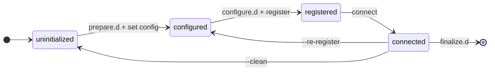

# `tedge bootstrap`: one-shot device onboarding

* Date: __2026-08-25__
* Status: __Proposed__

## The problem

Onboarding a device to a cloud is a multi-step, order-sensitive sequence
that the user drives by hand:

```sh
tedge config set c8y.url example.cumulocity.com
tedge cert download c8y        # or: tedge cert create && tedge cert upload c8y
tedge connect c8y
```

However the configure for users is getting more and more complex, and it makes navigating these differences difficult. Below shows just some of the decisions the user is faced with:

* Is Cumulocity using a custom domain for the http endpoint? If so it needs to set c8y.http and c8y.mqtt independently
* Should I use the Cumulocity Core MQTT (port 8883) or the MQTT Service (port 9883)
* Is the device behind a HTTP Proxy?
* Should I use Cumulocity basic auth or Cumulocity CA, or can I use my own PKI?

Every downstream consumer re-invents a wrapper around this sequence.
The getting-started docs walk through it step by step, and several projects ship their own bootstrap scripts:

* [tedge-standalone](https://github.com/thin-edge/tedge-standalone/blob/main/src/tedge/bootstrap.sh)
* [tedge-demo-container](https://github.com/thin-edge/tedge-demo-container/blob/main/images/common/bootstrap.sh)
* c8y-tedge plugin for go-c8y-cli:
  [bootstrap via ssh](https://github.com/thin-edge/c8y-tedge/blob/main/commands/bootstrap),
  [bootstrap-container](https://github.com/thin-edge/c8y-tedge/blob/main/commands/bootstrap-container)
  (guided questionnaire)

Each wrapper has its own flags, failure handling, and logging -
and none of it flows back into the core.

At the same time, device manufacturers want to embed thin-edge.io
into their own application packaging and device UIs.
They need to customize parts of the onboarding -
platform-specific steps, sometimes the registration mechanism itself -
and today their only option is to fork the flow into yet another script.

## The proposal

A built-in `tedge bootstrap` command:
an opinionated, idempotent, automation-friendly core flow,
extensible at defined points via drop-in hooks and cloud descriptors.

### Goals

* **Easy**: a single command takes a factory-fresh device to "connected and registered".
* **Automatable**: fully non-interactive via flags and environment variables;
  suitable for cloud-init, container entrypoints, and vendor UIs.
* **Consistent**: the same command, output, and failure semantics on every distribution and vendor platform.
* **Customizable**: integrators add platform steps
  and even fulfil registration with their own provisioning mechanism,
  without replacing the core flow.
* **Idempotent**: re-running on a bootstrapped device is a defined, successful outcome;
  an aborted run resumes where it left off.

## How it works

Bootstrap runs a fixed sequence of steps:

```text
tedge bootstrap <cloud> [flags]
 │
 ├── prepare.d/       hooks: preflight, server trust, endpoint resolution -
 │                    the target URL is passed as intent (--url), nothing written yet
 ├── [set config]     built-in: urls (c8y: loginOptions discovery), --set / env
 ├── configure.d/     hooks: react to the resolved config (derived urls),
 │                    and stage the imminent registration (QR codes, displays)
 ├── [register]       built-in method (c8y: ca | self-signed | basic) …
 ├── register.d/      … or fulfilled by hooks (DPS, fleet provisioning, vendor PKI)
 ├── [connect]        built-in: existing connect/reconnect flow
 └── finalize.d/      hooks: container restarts, vendor telemetry, license activation
```

Four of the five steps carry a drop-in hook directory,
so users and package maintainers can insert their own work into the sequence -
a connectivity preflight, a proxy to configure, a license to activate,
a vendor UI to signal - without forking the flow.
`prepare` and `finalize` are hooks only, the core does nothing there;
`configure` runs its built-in step and then its hooks;
`register` runs *either* a built-in method *or* its hooks;
and `connect` is the core's alone.
Hooks run inside the same invocation:
they appear in its output and its `--dry-run` preview,
and a failing hook fails the bootstrap.
With no hooks installed, this is the plain built-in flow.

One run in sequence -
the core orchestrates, hooks and cloud are callees,
and the register step is the single either/or,
resolved by the chosen method:


The steps are transitions, not states.
Each one establishes a durable condition of the device
and is skipped when that condition already holds,
which is what makes re-runs and resumed runs safe:
bootstrap walks the same sequence every time
and performs only the transitions that are missing.



The states are exactly what the skip checks inspect:
*configured* is the persisted settings,
*registered* is the registration artifacts at their configured paths,
*connected* is the health check that the connect step re-verifies.
`prepare` and `finalize` establish nothing durable,
which is why they are pure hook phases at the boundaries.

`--re-register` and `--clean` are the two deliberate backward transitions,
distinguished by what they unwind.
Settings are inputs (from flags, the factory image, the operator);
registration artifacts are outputs.
`--re-register` discards only the outputs:
it deletes the registration artifacts and stops the mapper,
dropping the device back to *configured*
so the register transition runs again -
against the kept inputs, so the re-run needs no flags.
`--clean` unwinds the instance completely:
everything `--re-register` removes,
plus the instance's own configuration,
returning it to *uninitialized* -
the run then needs its inputs supplied afresh
(flags, environment, or the wizard).
The standalone form of the same unwind,
decommission without bootstrapping again,
is the future `tedge mapper remove`.
`--offline` is the deliberate forward *stop*:
the run advances as far as *configured* with the services staged,
defers the transitions that need the cloud, and exits 0;
the same command run online performs the rest
(see [Offline provisioning](#unattended-provisioning)).
The console checklist speaks the same language -
`registered 44s` reports a state reached, not merely a step run,
and a deferred step is named as deferred instead of ticked.

The registration step is cloud specific. The cloud defines what steps it needs to do, rather than using hooks to extend the existing cloud actions.
A package that brings a new cloud ships a **cloud bootstrap descriptor**:
what the cloud needs to know, and which registration methods it offers.
The descriptor executes nothing itself -
it delegates to a `register.d` hook,
passing the cloud name and the method the user chose.
ThingsBoard, for instance, declares three ways to authorize a device
(an access token, an X.509 certificate, or a provisioning key and secret),
and one packaged hook implements all three.
That is enough for a custom cloud to behave like a built-in one:
`--register` validates against its methods,
the interactive wizard asks its questions,
and `tedge bootstrap thingsboard` reads exactly like `tedge bootstrap c8y`.

The two hook directories around the configure step are complementary.
`prepare.d` runs before anything is resolved or written,
so the target URL reaches it as intent (`--url`) rather than as configuration;
these hooks may write config themselves -
installing server trust, resolving endpoints, generating a device id -
which the configure step then re-reads.
`configure.d` runs after the endpoints are written,
for hooks that react to the outcome.

The step names follow the software management plugin API (`prepare` … `finalize`),
the established vocabulary for executable extension contracts;
`init` was rejected, since it already means something else in `tedge init`.

## Command usage

### Connecting to Cumulocity in one command

```sh
sudo tedge bootstrap c8y --url example.cumulocity.com --device-id rpi4-0001
```

```text
┌  Bootstrapping the device to Cumulocity
│
◇  prepared 0.0s
│
◇  configured 0.1s
│
Register the device on example.cumulocity.com:

    device id:         rpi4-0001
    one-time password: <one_time_password>

    Open the following URL to register the device:

    https://example.cumulocity.com/apps/devicemanagement/index.html#/deviceregistration?externalId=rpi4-0001&one-time-password=<one_time_password>

Waiting for the device to be registered ...
◇  registered 44s
│
◇  connected 2.1s
│
◇  finalized 0.0s
│
└  Bootstrap completed successfully in 47s
   ────────────────────────────────────────────
   device id  rpi4-0001
   cloud      Cumulocity
   register   c8y-ca
   url        example.cumulocity.com
   log        /var/log/tedge/tedge-bootstrap-1234.log
```

The default `c8y-ca` method uses the Cumulocity CA feature. The device prints the registration URL to the user which can use it to register the device in the Cumulocity tenant, which allows the device to download the x509 certificate, and afterwards connect to Cumulocity.

For factory provisioning, where the one-time password is pre-staged,
the same command is fully headless -
the password travels as an environment variable
(the same `DEVICE_ONE_TIME_PASSWORD` that `tedge cert download c8y` accepts),
never on the command line where `ps` would show it:

```sh
sudo DEVICE_ONE_TIME_PASSWORD="$OTP" tedge bootstrap c8y --url "$URL" --device-id "$SERIAL"
```

### Self-signed and basic auth

Self-signed certificate upload requires user credentials at bootstrap time
(tenant-management permissions):

```sh
# interactive: prompts for username/password (existing UploadCertCmd behaviour)
sudo tedge bootstrap c8y --url "$URL" --register self-signed

# automation: credentials via environment, never via argv
C8Y_USER=admin C8Y_PASSWORD=... sudo -E tedge bootstrap c8y --url "$URL" --register self-signed
```

Basic auth performs the Cumulocity device-credentials handshake:

```sh
sudo tedge bootstrap c8y --url "$URL" --register basic
```

The device requests credentials (`POST /devicecontrol/deviceCredentials`)
and polls until an operator approves the request in the registration UI;
the registration URL is printed as for `c8y-ca`,
pre-filled with the device id
(no one-time password - the basic handshake has none).
The received credentials are stored with mode `600`
under the mapper's directory (`mappers/c8y/credentials.toml`) -
held in zeroize-on-drop buffers while in memory,
following the mqtt_channel password convention -
`c8y.credentials_path` is pointed at it
(an explicitly configured path is respected instead),
then `c8y.auth_method basic` and `device.id` are persisted
and the device connects.

A security token
(8 characters from a look-alike-free alphabet, overridable via `C8Y_SECURITY_TOKEN`)
is sent with the credentials request and displayed on the console.
On tenants configured to demand it,
the operator enters the same value when accepting the registration,
proving the credentials go to the device they are looking at;
elsewhere it can be ignored.

The request itself authenticates with the tenant's bootstrap credentials,
which are the method's declared inputs -
nothing secret is hardcoded:
the bootstrap user defaults to the standard `management/devicebootstrap`
(a descriptor default, overridable per tenant),
while the bootstrap password has no default -
an interactive run prompts for it without echo,
automation supplies `$C8Y_BOOTSTRAP_PASSWORD`,
and a non-interactive run without it fails upfront
naming the variable, instead of a mid-poll HTTP 401.

When the device credentials already exist -
the operator pre-registered the device in Cumulocity
and holds the issued username and password -
no exchange is needed at all: `--register basic-preregistered`
stores them directly.
The wizard's method question is the "is the device already
pre-registered?" conditional, hoisted to where automation can
express it too: each answer prompts only its own inputs
(`$C8Y_DEVICE_USER` / `$C8Y_DEVICE_PASSWORD`),
and the non-interactive form is one flag rather than an
interactive-only branch.
The device id is derived from the issued username's
`t<tenant-id>/device_<device-id>` convention
(an explicit `--device-id` wins, with a warning when they conflict -
the cloud only accepts the matching client id),
and an online run verifies the credentials with an authenticated
no-op request before storing them,
so a typo fails at bootstrap time
instead of as an opaque MQTT `NotAuthorized` later.
Since there is no exchange, the method also completes under
`--offline`: the pre-registered fleet is zero-touch -
bench-provision, ship, and the staged services connect themselves
on first network contact.

### Azure and AWS

Only Cumulocity has a device-side registration story today;
`tedge cert upload` exists only for Cumulocity,
and the Azure/AWS getting-started guides require manual cloud-side steps.

However AWS does have a Just-in-Time registration method which allows the registration to be confirmed on the cloud side, after the device connects for the first time.

### Settings

There is a distinction between **persistent device settings**
(config keys that belong in `tedge.toml`: URLs, feature flags, proxy address)
and **run parameters of one bootstrap invocation**
(registration method, one-time password, wait/timeout behaviour)
which must not be persisted.

Persistent settings reach the device through the existing, validated config path,
with precedence flags > environment > existing config:

* **Repeatable `--set` flags** - any writable config key to corresponding tedge.toml or mapper.toml file:

  ```sh
  sudo tedge bootstrap c8y --url "$URL" \
    --set c8y.software_management.api=advanced \
    --set proxy.address=http://gateway:8080
  ```

* **Environment variables** - already supported for every key by `tedge_config`;
  the natural channel for cloud-init, containers, and systemd units:

  ```sh
  TEDGE_C8Y_URL=example.cumulocity.com tedge bootstrap c8y
  ```

* **Pre-seeded `tedge.toml`** - a vendor package or factory image
  ships its defaults directly in `/etc/tedge/tedge.toml`;
  bootstrap treats existing config as the base layer.

Run parameters are flags/env only;
for unattended firstboot provisioning they are staged in a mode-`600` environment file
consumed by the service that invokes bootstrap
(see [Unattended provisioning](#unattended-provisioning)).

A dedicated answers file (`tedge bootstrap --file factory.toml`) was rejected:
its config portion would duplicate `tedge.toml`,
and its run-parameter portion is too small to justify a new schema.
File-driven runs exist without a new dialect:
`--from` replays [captured invocations](#captured-invocations-and-clean-re-runs),
whose fields are the CLI flags themselves.

"Which features should be enabled" collapses into the same mechanism:
advanced software management, firmware update, log/config plugin types
are all config keys,
and `tedge config list --doc` already gives a vendor settings UI
the full schema with documentation.

Cloud profiles reuse the existing `--profile` / `TEDGE_CLOUD_PROFILE` conventions,
so a device can be bootstrapped to several instances of the same cloud:

```sh
sudo tedge bootstrap c8y --url "$URL" --profile second
```

### Unattended provisioning

**Fleet rollout via cloud-init.**
Fleet tooling (e.g. `go-c8y-cli`) pre-registers each device id
with a known one-time password before the devices first boot,
and the user-data is templated per device:

```yaml
#cloud-config
runcmd:
  - curl -fsSL https://thin-edge.io/install.sh | sh -s
  - |
    TEDGE_C8Y_SOFTWARE_MANAGEMENT_API=advanced \
    DEVICE_ONE_TIME_PASSWORD="$(cat /run/provisioning/otp)" \
    tedge bootstrap c8y \
      --url customer.cumulocity.com \
      --device-id "gateway-$(cat /sys/class/net/eth0/address | tr -d ':')" \
      2>> /var/log/tedge-bootstrap.log
```

No human is involved:
the pre-staged one-time password makes the CA enrollment non-interactive,
persistent settings arrive via `TEDGE_*` variables,
and the exit code plus the kept log give the provisioning system its audit trail.

**Factory image with firstboot provisioning.**
A manufacturer builds one OS image for all devices
and injects only per-device data at flash time.
The image pre-seeds the common settings:

```toml
# /etc/tedge/tedge.toml - shipped in the image, common to all devices
[c8y]
url = "factory.cumulocity.com"

[c8y.software_management]
api = "advanced"
```

The flashing station writes one small per-device file (mode `600`)
to the boot partition:

```sh
# /boot/firstboot/tedge-bootstrap.env - written per device at flash time
TEDGE_DEVICE_ID=SN-004211
DEVICE_ONE_TIME_PASSWORD=<pre-staged secret>
```

A oneshot systemd unit in the image consumes it on first boot:

```ini
# /etc/systemd/system/tedge-bootstrap.service
[Unit]
Description=thin-edge.io first-boot onboarding
ConditionPathExists=/boot/firstboot/tedge-bootstrap.env
After=network-online.target
Wants=network-online.target

[Service]
Type=oneshot
EnvironmentFile=/boot/firstboot/tedge-bootstrap.env
ExecStart=/usr/bin/tedge bootstrap c8y
ExecStartPost=/usr/bin/shred -u /boot/firstboot/tedge-bootstrap.env

[Install]
WantedBy=multi-user.target
```

If the device boots without network, the unit fails and retries on the next boot;
idempotency makes the retry safe.

**Offline provisioning.**
A bench line configures devices with no internet at all:

```sh
sudo tedge bootstrap c8y --url "$URL" --device-id "$SERIAL" --offline
```

`--offline` stops the state machine at *configured*, deliberately,
and exits 0 - the right signal for factory automation
that gates on the exit code.
Settings are applied
(endpoint discovery is skipped and the URL used as-is;
a later online run with `--url` re-discovers),
hooks run and receive `--offline` so they can self-adapt
(the connectivity preflight skips itself),
and the deferrals are named on the checklist and the summary card
instead of ticking states that were not reached:

* Obtaining credentials is deferred for the methods that need an
  exchange with the cloud,
  but the local half of registration is still persisted -
  the device id, and for `basic` the auth switch and credentials path -
  since that is configuration, not registration.
  Registration inputs are not collected,
  and no registration URL or one-time password is generated -
  a password printed offline would not survive
  to the online run that actually registers.
* Registration that needs no exchange completes offline:
  `basic-preregistered` stores the issued credentials,
  and register hooks still run and may fulfil registration locally
  (a vendor PKI signing against a local CA or HSM);
  the device then continues as registered.
* The connect step keeps the `tedge connect --offline` semantics:
  all services are started and enabled,
  only the cloud checks are skipped.
  The staged services retry by themselves,
  so the device connects on its own
  once the credentials and the network exist.
  The one hard requirement is a device identity
  (the bridge configuration carries it):
  without `--device-id`, a configured `device.id`,
  or a certificate to derive it from,
  the staging is deferred with a message saying so.
* `finalize.d` is deferred: it means "bootstrapped *and* connected".

Completion is re-running the same command once online:
the standing idempotent transitions perform whatever was deferred.
`--offline` is a run-shape flag,
so `--save` does not capture it -
a saved invocation describes the target state,
and replaying it online completes the bootstrap.

The unattended form of that completion composes
`--save`/`--from` with the firstboot unit above:

1. The bench run captures the fleet-wide invocation:
   `TEDGE_DEVICE_ID=<serial> tedge bootstrap c8y --url <url> --offline --save /etc/tedge/bootstrap.json`.
   The supply channel decides the capture:
   `--device-id` bakes the id into the file (a device-specific invocation),
   while an id supplied via the `TEDGE_DEVICE_ID` environment override
   is captured by *name* in the env check-list -
   keeping the file fleet-generic,
   with the id arriving per device at replay time.
2. The flashing station writes the per-device secrets
   to the mode-600 environment file
   (`TEDGE_DEVICE_ID`, `DEVICE_ONE_TIME_PASSWORD`).
3. A oneshot unit replays `tedge bootstrap --from /etc/tedge/bootstrap.json`
   on the first networked boot
   (`EnvironmentFile=`, `shred` after success, retry on the next boot).

Since an offline run collects no registration inputs,
its saved invocation lists the chosen method's *required* inputs
by name, so `--from` refuses to start while the environment
is incomplete - and the file is editable,
so effectively-required variables can be added
(a headless c8y-ca completion needs the pre-staged
`DEVICE_ONE_TIME_PASSWORD`, though the method could generate one:
there is no console to show a generated registration URL on).
Secrets stay out of the invocation file by design:
its values are per-fleet while the secrets are per-device,
and `EnvironmentFile=` already carries them
with the right permissions and lifecycle.

## Captured invocations and clean re-runs

`bootstrap → capture → unwind → replay` makes bootstrap repeatable,
testable, and templatable across a fleet.

**`--save <file>`** writes the effective invocation -
the wizard's "equivalent command" as a declarative document.
The file is always a JSON array (even for a single instance),
so appending another instance is a plain array edit.
The fields are the CLI flags themselves,
and registration inputs are captured by environment-variable name only;
secret values never enter the file.
`--save` works with `--dry-run`:
walk the wizard, save the answers, apply nothing.

```sh
sudo tedge bootstrap --dry-run --save answers.json   # wizard: collect answers, apply nothing
sudo tedge bootstrap --from answers.json             # apply - now, or on the next device
```

```json
[
  {
    "cloud": "c8y",
    "url": "example.cumulocity.com",
    "register": "c8y-ca",
    "device_id": "demo01",
    "set": { "c8y.mqtt_service.enabled": "true" }
  }
]
```

**`--from <file>`** replays the invocations in order,
stopping at the first failure.
This covers multi-instance defaults:
one instance per run stays the contract
(flags cannot be disambiguated across clouds in one command line),
and a device that should default to two Cumulocity instances
ships a two-element invocation file.
The environment variables an invocation lists must be set when replaying;
missing ones fail upfront, by name.
The array is the only accepted shape:
a statement of intent whose vocabulary is the CLI contract,
not a transcript and not a second config dialect.

**`--re-register`** removes what the skip-if-registered checks look at -
the instance's credentials file and its certificates -
and stops the instance's mapper,
so registration re-runs instead of skipping.
Configuration is untouched:
a bare `tedge bootstrap c8y --re-register`
renews the device's registration
against the existing URL and settings.
The default instance's certificate is the shared device certificate,
so it is removed together with the private key
with a warning naming the other clouds configured on the device;
a custom-named instance never removes the shared certificate,
since it does not own it.

**`--clean`** unwinds the instance's configuration as well:
everything `--re-register` removes,
plus the keys bootstrap manages for the instance -
in the cloud's `tedge.toml` section
(`c8y.*`, or the profile's `c8y.profiles.<p>.*`)
or in a custom mapper's `mapper.toml`:
the endpoints, the auth method and credentials path,
the device id and `cloud_type` of a custom mapper,
the conflict-free instance defaults (bridge topic prefix, proxy port,
per-profile certificate paths),
and the settings the run itself applies
(descriptor-implied values and `--set` values scoped to the instance).
The rest of the cloud's section is the user's
(software management, SmartREST templates, proxies, feature switches)
and is never removed: bootstrap unwinds only what it writes.
Device-global keys (`proxy.address`, the shared `device.id`)
are never cleaned either - they are not the instance's to remove -
and neither is package-shipped content
(the rest of `mapper.toml`, bridge rules, flows):
bootstrap cannot recreate what it did not write,
so removing `mappers/<name>/` outright
belongs to the future `tedge mapper remove`.

Hooks receive `--re-register` on either kind of run
(`--clean` implies it), plus `--clean` on a full unwind:
a hook keys its idempotency guard on `--re-register`
and its own state removal on `--clean`.

## Hooks

Hooks are executables in per-phase drop-in directories -
the same model as the six existing plugin mechanisms
(sm-plugins, config-, log-, diag-plugins, workflows, flows):
ship a working default, make it extensible by dropping in a file.

### Hook contract

The contract follows the diagnostic-plugin contract
(`docs/src/references/diagnostic-plugin.md`), applied per phase:

* **Location**: layered search path, earlier directories taking precedence
  by filename - the convention of `log.plugin_paths` and
  `configuration.plugin_paths` (diag has no override semantics at all):
  `/etc/tedge/bootstrap.d/<phase>.d/` (site customization)
  over `/usr/share/tedge/bootstrap.d/<phase>.d/` (shipped by packages).
  The list itself comes from `--plugin-dir`, `TEDGE_BOOTSTRAP_PLUGIN_PATHS`,
  or `tedge config set bootstrap.plugin_paths` (highest to lowest precedence).
* **Ordering**: lexical, by convention with numeric prefixes (`10_proxy`, `50_dps_enroll`).
* **Disabling**: a `.ignore` suffix disables a hook without deleting it.
  A `.ignore` marker wins over a same-named hook in its own and later layers,
  so a site marker disables a packaged hook.
* **Diagnosability**: a non-executable entry in a hook directory
  is reported with a warning, never silently skipped;
  when a phase requires hooks but none are found,
  the error lists the directories that were searched.
* **Invocation**:

  ```sh
  <hook> <phase> --cloud <cloud> --config-dir <dir> [--url <url>] [--profile <name>] [--re-register] [--clean] [--offline] [--register-method <name>]
  ```

  `--url` carries the target cloud URL as intent.
  It matters most for `prepare.d`,
  which runs before the URL is persisted and cannot read it from the config;
  on re-runs where the URL lives only in the existing configuration,
  hooks fall back to `tedge config get`.
  `--register-method` is passed to register-phase hooks
  when the user selected a method declared by the cloud's
  [descriptor](#cloud-descriptors),
  so one cloud's hook can implement several methods.
* **Stdio**: hook stdout is operator-facing -
  shown on the console rail under the current phase
  (a QR code, a link, a generated identity).
  Hook stderr is diagnostics -
  written to the bootstrap log, shown live with `--verbose`,
  and replayed on the console when the hook fails.
* **Environment**: hooks inherit the environment
  (including `TEDGE_*` overrides and wizard-collected registration inputs).
  When a device id is known, it is exported to all phases as `TEDGE_DEVICE_ID` -
  the config env override for `device.id`,
  so `tedge config get device.id` inside a hook
  resolves to the bootstrapped identity even before it is persisted.
* **Exit codes**: `0` = done, `2` = skipped / not applicable,
  anything else = abort bootstrap, reporting which hook failed.
  The skip code lets a vendor ship all hooks on all hardware variants
  and have each hook self-select.
* **Timeout**: per hook, SIGTERM then SIGKILL, as in the diagnostic runner.
* **Secrets**: never passed via argv (visible in `ps`).
  Secrets reach hooks via environment variables
  or mode-`600` files referenced by path (the `c8y.credentials_path` precedent).
* **Privileges**: the hook directories are added to the sudoers rule written by
  `configuration/package_scripts/tedge/preinst`,
  with the same `[a-zA-Z0-9]*` name restriction as the existing plugin directories.

When a `c8y-ca` registration is about to run
(device id and host known, no certificate yet or a `--re-register` run),
configure-phase and later hooks additionally receive `C8Y_REGISTRATION_URL`:
the device-registration URL pre-filled with the one-time password,
which bootstrap generates upfront for this purpose
(the register step then uses the same one).
The URL is computed after the prepare phase,
so a prepare hook may itself generate the device identity
(`tedge config set device.id`, e.g. from a serial number).
The URL carries the password, so it travels via the environment, never argv;
the variable is not `TEDGE_`-prefixed,
since that namespace is reserved for config overrides.
A password supplied by the user is kept secret,
as `tedge cert download c8y` already promises:
not displayed, not in the printed URL, not exported to hooks.

### Example: a vendor app package

A device manufacturer ships thin-edge.io as a containerized app
with its own settings UI.
The app package contains the vendor's hooks:

```text
/usr/share/tedge/bootstrap.d/
├── configure.d/
│   └── 10_industrial_proxy       # apply the plant proxy from the vendor's device settings
└── finalize.d/
    ├── 50_restart_apps           # restart sibling app containers that talk to tedge
    └── 60_notify_ui              # signal "onboarding complete" to the vendor UI
```

The vendor UI collects the URL and registration choice from the end user,
then the app entrypoint runs the same command as any other integrator:

```sh
tedge bootstrap c8y --url "$UI_URL" --register "$UI_REGISTER_METHOD"
```

The vendor ships every hook on every hardware variant
and lets each one self-select:
a hook that does not apply exits `2` and is skipped,
so one package covers the whole product line.

### Example: QR-code registration

The `c8y-ca` method waits for an operator to approve the registration
in the Cumulocity UI.
Where the operator stands next to the device with a phone,
a small site hook renders the registration URL as a QR code,
using the `C8Y_REGISTRATION_URL` variable:

```sh
#!/bin/sh
# /etc/tedge/bootstrap.d/configure.d/90_qr_code
[ -n "$C8Y_REGISTRATION_URL" ] || exit 2
command -v qrencode >/dev/null 2>&1 || exit 2
echo "Scan to register the device:"
qrencode -t ANSIUTF8 --margin=2 "$C8Y_REGISTRATION_URL"
```

```text
$ sudo tedge bootstrap c8y --device-id demo01 --re-register
...
│  Scan to register the device:
│  █████████████████████████████
│  ██ ▄▄▄▄▄ █▀▄██ █▄███ ▄▄▄▄▄ ██
│  ██ █   █ █▀▀▀  ▄█▀█▄ █   █ ██     (scannable QR of the
│  ██ █▄▄▄█ █▀█  █ █▀ ▄ █▄▄▄█ ██      registration URL)
│  █████████████████████████████
◇  configured 0.1s
│
Register the device on example.cumulocity.com:

    device id:         demo01
    one-time password: <one_time_password>
...
```

The `configure.d` phase runs directly before the register step,
so the QR appears just above the printed prompt,
and the phone lands on the registration page
with the one-time password pre-filled.
The same variable can drive an e-ink panel, a push notification,
or a vendor-UI signal.

Runnable examples for every extension surface -
this QR hook, a connectivity preflight, a server-trust installer,
nearest-endpoint selection, a generated device id,
a device-global proxy question, a bootstrap-completed event,
a jump-to-device link, a minimal custom cloud,
and a sample invocation file -
are maintained under `tests/RobotFramework/tests/bootstrap/examples/`
as the basis for system tests.

## Registration is pluggable

### Hooks

`register.d` hooks never run around the built-in registration step:
the register phase runs either a built-in method or the hooks,
never both.
Which one runs is derived from the resolved registration method,
not from the presence of hooks -
dropping a script into `register.d/` does not by itself change
how a c8y device registers.
The hooks fulfil registration when the resolved method is hook-executed:
that is the default for clouds without a built-in method
(Azure, AWS, custom mappers),
while on c8y a hook-executed method must first be declared
by a descriptor override and then selected with `--register`
(see [Built-in clouds are customizable the same way](#built-in-clouds-are-customizable-the-same-way)).

Running them alongside built-in methods was rejected:
the phase would carry two meanings depending on the method,
and a hook that forgets to self-skip on `--register-method`
would silently corrupt a built-in method's run -
a class of bug that cannot exist when a register hook
only runs when its method was chosen.
Registration-context hooks (QR codes, displays, vendor-UI signals)
live at the `configure.d` boundary instead:
the last slot before registration,
where everything is resolved and `C8Y_REGISTRATION_URL` is delivered -
which also fits `c8y-ca`'s timing,
since it blocks polling for approval,
so a display must be up before the register step starts.
Hook-executed methods need no such slot;
the register hook is its own presenter.

The core does not use the hook exit codes as proof of registration.
After the register phase it verifies the expected artifacts exist -
a certificate and key at the configured `device.cert_path` / `device.key_path`,
or credentials at `c8y.credentials_path` for basic auth -
and only then proceeds to connect.
The connect step is the real backstop:
artifact existence alone is not sufficient
(a hook can produce a certificate that does not match the private key),
and the connect step reports that case.
Verification could additionally check that the certificate and key match
before attempting to connect.

**Example: Azure at scale with a DPS hook.**
An integrator uses Azure Device Provisioning Service
so that no human touches the IoT Hub portal.
They ship one register hook:

```sh
#!/bin/sh
# /usr/share/tedge/bootstrap.d/register.d/50_dps_enroll
# args: <phase> --cloud <cloud> [--profile <name>] --config-dir <dir>
[ "$3" = "az" ] || exit 2   # not applicable for other clouds

CERT_PATH=$(tedge config get device.cert_path)
KEY_PATH=$(tedge config get device.key_path)

# enroll with DPS using the group claim certificate baked into the image;
# DPS returns the assigned hub and the device certificate
# Note: dps-enroll is not a real command
dps-enroll \
    --claim-cert /etc/vendor/claim.pem \
    --out-cert "$CERT_PATH" \
    --out-key "$KEY_PATH" \
    --print-assigned-hub > /tmp/assigned-hub

tedge config set az.url "$(cat /tmp/assigned-hub)"
```

The operator runs `sudo tedge bootstrap az`:
bootstrap finds no built-in device-side registration method for Azure,
runs the `register.d` hooks,
verifies that a certificate and key now exist at the configured paths,
and proceeds to connect.

### Cloud descriptors

Different clouds offer different registration options -
ThingsBoard alone has three (token, provisioning API, X.509) -
and for custom clouds the core cannot know what they are.
A single undifferentiated "delegate to hooks" bucket hides that choice:
users cannot discover the options,
and a register hook cannot know which option the user wanted.

Cloud bootstrap descriptors are small, optional metadata files
shipped by the package that ships the hooks,
declaring per cloud the registration methods, their inputs,
and required settings:

```toml
# /usr/share/tedge/bootstrap.d/clouds.d/thingsboard.toml  (from tedge-mapper-thingsboard)
cloud = "thingsboard"
description = "ThingsBoard IoT platform"

[url]
description = "ThingsBoard region"
default = "mqtt.thingsboard.cloud"
choices = ["mqtt.thingsboard.cloud", "eu.thingsboard.cloud", "us.thingsboard.cloud"]

[[register]]
name = "token"
default = true
description = "Use a device access token created in the ThingsBoard UI (Devices -> Add device)"

[[register.inputs]]
name = "access token"
env = "TB_ACCESS_TOKEN"
secret = true

[[register]]
name = "provision"
description = "Provision automatically via the Device Provisioning API (needs a provisioning profile)"

[[register.inputs]]
name = "provision key"
env = "TB_PROVISION_KEY"
secret = true

[[register.inputs]]
name = "provision secret"
env = "TB_PROVISION_SECRET"
secret = true

[[register]]
name = "certificate"
description = "X.509 device certificate registered in ThingsBoard by an operator"

# Choosing this method implies X.509 auth in mapper.toml
[register.set]
auth_method = "certificate"

[[settings]]
key = "transport.port"
description = "MQTT transport port"
default = "8883"
choices = ["1883", "8883"]
```

Descriptors are layered like hooks
(`<config-dir>/bootstrap.d/clouds.d/` per site
over `/usr/share/tedge/bootstrap.d/clouds.d/` from packages,
earlier layers taking precedence per cloud,
with the compiled-in built-ins as the lowest layer)
and are metadata only:
registration is executed by the built-in methods or the register hooks,
and the outcome is verified independently,
so a wrong descriptor cannot fake a successful registration.

One descriptor feeds five consumers:

* **A generalized `--register`**: users write the cloud's own vocabulary
  (`--register token`), validated against the descriptor
  ("Unknown registration method \"nope\" for thingsboard; available: token, certificate")
  and passed to register hooks as `--register-method token`.
* **Upfront validation**: a method's required inputs (environment variables)
  are checked before the pipeline starts, instead of failing mid-hook.
* **The interactive wizard** (below).
* **Live documentation**: `--describe` renders the resolved descriptors
  as the reference for automation authors (below).
* **Vendor UIs**: the machine-readable options contract that
  `tedge config list --doc` provides for built-in clouds,
  now also available for custom clouds.

The descriptor schema is API surface that must be versioned and documented,
and a descriptor can drift from what its hook does
(mitigated by outcome verification).
The schema is therefore kept small -
cloud (with optional derived `type` and implied `set` values),
methods, env-var inputs, settings,
with optional defaults and choice lists -
resisting per-field types, validation rules, and conditionals
until a real consumer needs them.

### Method names are cloud vocabulary

Registration method names are scoped by the cloud:
declared in one cloud's descriptor, validated against that cloud's descriptor,
and delivered (as `--register-method`) only to hooks that self-selected on that cloud.
A method name never addresses a hook file,
and two clouds using the same method name cannot interfere.
The command line carries the scope positionally
(`tedge bootstrap thingsboard --register provision`),
and the register phase's output states the pair
(`using the thingsboard "provision" method`).

Generic names are a convention:
mapper packages are encouraged to reuse a small shared vocabulary -
`token` (store an operator-supplied credential),
`provision` (zero-touch exchange of staged secrets via a cloud API,
e.g. ThingsBoard device provisioning, AWS fleet provisioning, Azure DPS),
`certificate` (X.509, registered by an operator),
`basic` (username/password) -
so `--register provision` means the same kind of onboarding on every cloud,
with the method's `description` carrying the cloud-specific mechanics.
Proprietary mechanisms keep their proper names (`c8y-ca`).

A method may declare a `[register.set]` table:
config values implied by choosing it (e.g. `auth_method = "certificate"`),
applied during the configure step before any explicit `--set` values -
generalizing what the built-in c8y `basic` method does
when it switches `c8y.auth_method`.

The URL, inputs, and settings may declare a `default` and a `choices` list:
the wizard shows a choice list as a numbered pick with the default pre-selected,
and a plain default in brackets, accepted with an empty answer.
The `[url]` block additionally supports `fixed = true`
for vendor packages locked to one endpoint:
the wizard states the URL instead of prompting,
and non-interactive runs use it without requiring `--url`
(an explicit `--url` still wins).
The two defaults have different scope:
a setting default is wizard pre-fill only
(shipped configuration defaults belong in the mapper's own `mapper.toml`),
while an input default (an environment variable, e.g. a bootstrap user)
applies in non-interactive runs too,
because env inputs have no other home for a default.

### Method parameters are inputs, not flags

The command line carries only universal flags
(`--url`, `--register`, `--device-id`, `--set`, and the run-shape flags);
everything a specific method needs is a declared input,
supplied via its environment variable or the wizard.
This holds for the built-in methods too:
the c8y-ca one-time password is an input on the `c8y-ca` method
in the compiled-in descriptor -
`$DEVICE_ONE_TIME_PASSWORD`, the same variable
`tedge cert download c8y` accepts -
optional and secret.
When absent, a password is generated
so the registration URL can be printed and QR-coded;
a supplied password is kept secret
(prompted without echo, not displayed, not in the URL).
The `basic` method's bootstrap credentials work the same way
(`$C8Y_BOOTSTRAP_USER` with the standard user as its descriptor default,
`$C8Y_BOOTSTRAP_PASSWORD` secret and required),
which is also how nothing secret ends up hardcoded:
the code carries no credential defaults at all,
and a tenant's custom bootstrap credentials are just different input values.
A secret input's default value is never echoed by a wizard prompt
(shown as `[default set]`),
since a site override may have replaced it with a real secret.

An earlier iteration had a top-level `--one-time-password` flag.
It was removed because a per-method flag on a multi-cloud command
misleads everywhere its method is not in play
(it was silently ignored for `basic`, `self-signed`, and hook methods),
it put a secret on the command line where `ps` can read it,
and `--save` could not capture it
(invocation files record environment variable names, never values),
so a saved run replayed differently from the run that saved it.
As an input, all three problems disappear,
and pre-registered devices surface properly in the wizard
as an optional question.

### Live documentation: `--describe`

Environment-variable inputs are not visible in `--help`
(clap help is static, descriptors are runtime data),
so the dynamic half of the interface documents itself:
`--describe` renders the resolved descriptors -
compiled-in clouds, packaged clouds and `clouds.d` overrides included -
so it states exactly what this device would ask for,
and a third-party cloud's descriptor is its documentation.

```text
$ tedge bootstrap c8y --describe
Cumulocity (c8y)
  url: Cumulocity URL (the HTTP/S address used to talk to the platform)

  registration methods:
    c8y-ca (default): Request a device certificate from the Cumulocity certificate authority
      - one-time password  $DEVICE_ONE_TIME_PASSWORD  (secret, optional)
        Only needed when the device was pre-registered; leave empty to generate one
    self-signed: Create a self-signed certificate and upload it using user credentials
      - Cumulocity username  $C8Y_USER  (optional)
      - Cumulocity password  $C8Y_PASSWORD  (secret, optional)
    basic: Request username/password device credentials via the bootstrap user (device not registered yet)
      - bootstrap user  $C8Y_BOOTSTRAP_USER  (default: management/devicebootstrap)
      - bootstrap password  $C8Y_BOOTSTRAP_PASSWORD  (secret)
    basic-preregistered: The device is already pre-registered: store its issued username/password
      - device username  $C8Y_DEVICE_USER
      - device password  $C8Y_DEVICE_PASSWORD  (secret)

  settings:
    c8y.mqtt_service.enabled: Select the Cumulocity MQTT connection type (default: false)
      - false: Core MQTT - The standard device endpoint (port 8883)
      - true: MQTT Service - Next-gen endpoint with free-form topics (port 9883); requires the mqtt-service.smartrest tenant feature (Public Preview)
```

Without a cloud argument, `--describe` lists every available cloud.
It is the zero-execution entry of a layered discovery story
for automation authors:

1. `--describe` documents the methods, inputs, and settings
   without running anything.
2. An interactive run ends by printing the equivalent
   non-interactive command, environment variable names included.
3. `--save` records the environment variable names in the invocation
   file, and `--from` checks them upfront before replaying.
4. A non-interactive run missing a required input fails before the
   pipeline starts, naming the variables to set.

### Built-in clouds are customizable the same way

The built-in clouds' descriptors are compiled in,
but participate in the same layering:
a package or site can ship `clouds.d/c8y.toml`
to customize how Cumulocity bootstrap presents itself -
e.g. a company offering its tenant instances as a URL pick-list:

```toml
# /etc/tedge/bootstrap.d/clouds.d/c8y.toml  (site override)
cloud = "c8y"
description = "Cumulocity"

[url]
description = "Cumulocity instance"
default = "example.cumulocity.com"
choices = ["example.cumulocity.com", "tedge-dev05.preprod.c8y.io"]

[[register]]
name = "c8y-ca"
default = true
description = "Request a device certificate from the Cumulocity certificate authority"

[[register]]
name = "basic"
default = false
description = "Register with device credentials issued via the Cumulocity bootstrap user"
```

The override rules:

* Overriding replaces the whole descriptor for that cloud
  (no field-level merge),
  so an override restates the methods it wants the wizard to keep offering;
  the compiled-in descriptor is the copy-paste starting point.
* The built-in method implementations are not descriptor-defined:
  `c8y-ca`, `self-signed`, and `basic` always resolve for c8y,
  even when an override omits them.
  Omitting a method hides it from the wizard; it does not disable the flag.
  Their inputs travel with the implementation too:
  a restated built-in method with no declared inputs
  keeps the compiled-in inputs
  (the implementation requires those values regardless,
  so an override cannot silently drop the prompts and upfront validation);
  declaring its own inputs wins.
* Who executes a method is derived from its name, not declared:
  built-in names resolve to their built-in implementations,
  every other declared method is executed by the register hooks.
  There is no anonymous "delegate to hooks" method for c8y -
  a hook-executed method on c8y must be declared by an override,
  so it carries a name, a description, validated inputs,
  and implied config like any other method.
  For clouds whose only automated path is hooks
  (az, aws, descriptor-less custom mappers)
  a hook method remains the default.
* An override can change the default method,
  and can add hook-executed methods to a built-in cloud
  (e.g. a vendor PKI enrollment for c8y).

Whole clouds can be curated away the same way methods can:
a marker file `clouds.d/<cloud>.ignore` hides that cloud -
built-in or not - from the wizard's pick-list
and the no-argument `--describe` listing,
so an integrator whose product only supports Cumulocity
ships `az.ignore` and `aws.ignore` and their customers
are never offered the others.
Hiding follows the method precedent - it curates, it does not disable:
an explicit `tedge bootstrap az` still works
(the az support is compiled into the binary regardless),
and `tedge bootstrap az --describe` still documents it, with a note.
Visibility layers like everything else:
the first directory providing either a descriptor (visible)
or a marker (hidden) for a cloud decides,
a marker beating a sibling descriptor in its own layer,
so a site descriptor can re-offer a cloud a package's marker hides.

Built-in clouds also declare settings in their compiled-in descriptors,
so configuration choices become discoverable in the wizard.
The first example is the Cumulocity MQTT service:

```toml
[[settings]]
key = "mqtt_service.enabled"
name = "Select the Cumulocity MQTT connection type"
default = "false"

[[settings.choices]]
value = "false"
label = "Core MQTT"
description = "The standard device endpoint (port 8883)"

[[settings.choices]]
value = "true"
label = "MQTT Service"
description = "Next-gen endpoint with free-form topics (port 9883); requires the mqtt-service.smartrest tenant feature (Public Preview)"
```

A setting may declare a `name` (the question as a human reads it)
and labeled choices, so the wizard shows:

```text
Select the Cumulocity MQTT connection type:
  1) Core MQTT     The standard device endpoint (port 8883)
  2) MQTT Service  Next-gen endpoint with free-form topics (port 9883); requires the mqtt-service.smartrest tenant feature (Public Preview)
Choice [1]: 2
```

The chosen answer still compiles to the plain
`--set c8y.mqtt_service.enabled=true`,
so the printed equivalent command and non-interactive runs
stay in config vocabulary.
A labeled choice may declare its own `set` table
(further config values implied by that choice);
explicit `--set` values win over implied ones.
Bare-string choice lists (`choices = ["1883", "8883"]`) remain valid
for settings whose values need no labels.

Settings keys are declared relative to the cloud,
and the compiled command targets the instance being bootstrapped:
`c8y.mqtt_service.enabled` for the default instance,
`c8y.profiles.<name>.mqtt_service.enabled` for a profile,
and `<instance>.mqtt_service.enabled` (in the instance's `mapper.toml`)
for a custom-named instance.
A setting may instead declare `global = true`:
its key is then a device-global tedge config key
(e.g. `proxy.address`, asked before anything talks to the network),
applied without a cloud prefix,
and routed to the tedge config even for custom mappers.

Whether a descriptor can declare custom keys
depends on where the setting lands.
A custom mapper's `mapper.toml` is free-form TOML,
so a custom cloud's descriptor can declare any dotted key
and its mapper defines what the key means.
Settings routed to the tedge config -
a built-in cloud's settings, their profiled forms,
and every `global = true` setting -
must be existing tedge config keys:
`tedge.toml` has a fixed schema,
and an unknown key fails with `Unknown tedge config key`.
That failure currently surfaces at the configure step,
after the wizard has already asked the question,
since keys are only validated when the values are applied;
validating declared keys when the descriptors load
would move the failure before the wizard runs.

A descriptor that needs a value outside the config schema
does not have to force it into a settings key:
a register method can declare a non-secret input
(`[[register.inputs]]` with `secret = false`).
The wizard prompts for it like any other input,
non-interactive runs supply it as the environment variable,
every hook phase receives it,
and a hook persists it wherever the integration defines -
its own file, or extra keys in the instance's `mapper.toml`.
The trade-off is lifecycle:
inputs are collected only when the run will register,
so the hook must persist the value at registration time;
settings are configuration and re-apply on every run.

### The wizard

`tedge bootstrap` command (on a terminal, or with `--interactive`)
enters a gather-then-compile wizard:
all answers are collected up front from the descriptors,
the equivalent non-interactive command is printed,
and then the same pipeline runs as for that command.
No prompting happens once the pipeline has started.

```text
$ sudo tedge bootstrap
Select the cloud to bootstrap:
  1) aws          AWS IoT Core
  2) az           Azure IoT Hub
  3) c8y          Cumulocity
  4) thingsboard  ThingsBoard IoT platform
Choice [1]: 4
How should the device obtain its credentials?
  1) token        Provision an access token via the Device Provisioning API
  2) certificate  X.509 device certificate registered in ThingsBoard by an operator
Choice [1]:
ThingsBoard IoT platform URL: tb.example.com
provision key ($TB_PROVISION_KEY): ********

Running: tedge bootstrap thingsboard --url tb.example.com --register token
(with the environment variables: TB_PROVISION_KEY, TB_PROVISION_SECRET)
```

The wizard is a front-end that compiles to the CLI contract
and prints the equivalent command,
teaching the automatable form rather than diverging from it.
Anything answered interactively prints that command —
the full wizard, or a run that only had to ask
for the registration inputs it is about to need —
and it is rendered from the same invocation `--save` writes,
so the command shown and the file replayed never diverge.
Prompts cannot interleave with pipeline output,
since prompting completes before the pipeline starts;
and automation never enters the wizard
(a specified cloud argument with a known URL bypasses it)
but still benefits from the descriptors via validation and error messages.

The wizard is also partial: users generally know their cloud already,
so `tedge bootstrap c8y` on a fresh device
(interactive, and no URL from a flag, a fixed descriptor value,
or the existing configuration)
asks the remaining questions with the cloud question skipped.
Any answer already provided by a flag
(`--register`, `--device-id`, `--set`, `--url`) skips its question too.
The trigger is conservative:
prompting only happens when required information is missing,
so a configured device's re-run and a flag-complete invocation
stay fully non-interactive even on a terminal.

The same rule covers registration inputs on re-runs:
a method's inputs are required *to register*,
so they are validated (and, interactively, prompted for)
only when the run will actually register
(no registration artifacts yet, or `--re-register`).
`tedge bootstrap thingsboard --re-register` on a terminal
asks for the access token it is about to need,
a plain re-run with credentials in place asks for nothing,
and a non-interactive `--re-register` without the secret
fails upfront with the variable names, before the pipeline starts.
A `--clean` run is a fresh device again:
the wizard asks everything, the URL included,
and non-interactive runs must supply the full inputs.
For custom mappers only the instance's own artifacts count as "registered"
(its credentials file and per-instance certificate),
not the shared device certificate it may merely reuse;
packages must not ship credential-file templates,
which would defeat the detection.

Secrets collected by the wizard are passed to hook processes
as environment variables (never argv, never persisted);
in non-interactive use the same variables are inherited
from the calling environment.

## Custom clouds are first class

### A mapper package brings its own cloud

Custom cloud mappers - e.g. the community
[ThingsBoard mapper](https://github.com/thin-edge/tedge-mapper-thingsboard),
a package configuring the generic `tedge-mapper`
via `<config-dir>/mappers/<name>/mapper.toml` -
require no cloud-specific code in the core.
The command accepts a free-form cloud name
(resolved as `tedge connect` does:
`c8y`, `az`, `aws`, dotted profiles like `c8y.prod`,
and anything else as a custom mapper name),
and the pipeline adapts per step:

* **Configure**: `--url` and `--set <name>.<key>=<value>`
  are written to `mappers/<name>/mapper.toml`
  instead of the tedge config keys used for built-in clouds;
  `--set` values that are valid device-global tedge config keys
  (e.g. `proxy.address`) go to the tedge config.
* **Register**: custom clouds have no built-in registration method,
  so registration is done by hooks -
  shipped by the mapper's own package
  into `/usr/share/tedge/bootstrap.d/register.d/`,
  self-selecting on `--cloud` (`exit 2` for other clouds,
  so multiple installed mapper packages coexist).
  The cloud-specific onboarding knowledge lives with the mapper that needs it,
  not in the core.
* **Verify**: the registration artifacts are resolved per cloud -
  the `credentials_path` configured in `mapper.toml`
  (default `<mapper-dir>/credentials.toml`) or the device certificate.
* **Connect**: custom mappers do not use the mosquitto bridge;
  the mapper is its own bridge.
  Bootstrap restarts and enables the `tedge-mapper-<name>` service
  and reuses the `tedge connect <name> --test` health wait
  as the end-to-end proof,
  retrying with the same backoff as the built-in clouds' connection test
  until `--timeout` (default 5m; `--no-wait` for one attempt).

The `tedge-mapper-thingsboard` package ships,
alongside the mapper configuration, one register hook:

```sh
#!/bin/sh
# /usr/share/tedge/bootstrap.d/register.d/40_thingsboard
# args: <phase> --cloud <cloud> --config-dir <dir> [--register-method <name>]
set -e
[ "$3" = "thingsboard" ] || exit 2   # self-select: only handle our own cloud

CRED=/etc/tedge/mappers/thingsboard/credentials.toml
umask 077
case "$*" in
    *"--register-method provision"*)
        # zero-touch: exchange a provision key/secret for a token
        # via POST https://<url>/api/v1/provision (curl), then write $CRED
        ;;
    *)  # default method: the operator created the device in the
        # ThingsBoard UI and has its access token - just store it
        [ -n "$TB_ACCESS_TOKEN" ] || { echo "TB_ACCESS_TOKEN is not set" >&2; exit 1; }
        printf '[thingsboard]\nusername = "%s"\npassword = ""\n' "$TB_ACCESS_TOKEN" > "$CRED"
        ;;
esac
chown tedge:tedge "$CRED"
```

The operator's command has the same shape as for any built-in cloud,
guided by the wizard (`sudo tedge bootstrap`), or directly:

```sh
sudo apt install tedge-mapper-thingsboard
sudo TB_ACCESS_TOKEN=... \
  tedge bootstrap thingsboard --url tb.example.com \
  --set thingsboard.transport.port=8883
```

The URL and settings land in `mappers/thingsboard/mapper.toml`,
the packaged hook stores the access token,
verification finds the credentials file,
and the connect step restarts the `tedge-mapper-thingsboard` service,
waiting for it to report a healthy cloud connection.

A rejected alternative: declaring registration in `mapper.toml` itself
(a `[bootstrap]` section naming a script and expected artifacts).
More discoverable, but it invents a second hook mechanism with its own schema
when the drop-in directory already does the job,
and self-selecting hooks scale fine
since every non-matching hook exits `2` immediately.

### Named instances of built-in clouds

Multiple instances of the same cloud fit the same model,
moving away from cloud profiles toward generically named mappers:
the positional argument stays the instance name
(as for `tedge connect`, `tedge mapper config`, and service names),
and `--type` declares the semantics when creating a non-default name:

```sh
tedge bootstrap c8y                        # first instance: name c8y, type implied
tedge bootstrap c8y-second --type c8y      # second instance: any name, c8y semantics
tedge bootstrap c8y-second                 # re-run: type read from mapper.toml cloud_type
```

`--type` is the CLI surface for the `cloud_type` field
the mapper-dir model already has:
needed only at creation, persisted into the instance's `mapper.toml`.
A third source is a packaged descriptor declaring `type` for its cloud,
so a derived-cloud package needs no flag at all
(see [Derived clouds](#derived-clouds) below).
The type selects the cloud's descriptor (wizard methods, URL block)
and its registration vocabulary,
while everything instance-specific stays under `mappers/<name>/`:
URL, `device.id`, `auth_method`, and (for basic auth) `credentials.toml`.

Non-default c8y instances (named or profiled) get
conflict-free defaults computed by the core:
`bridge.topic_prefix` defaults to the instance name
(`c8y-second`, or `c8y-<profile>`),
and `proxy.bind.port` to the next port not used by any existing
Cumulocity instance
(the default instance, every profile, and every c8y-typed mapper directory;
unconfigured instances count as using the default 8001).
Both apply only when not already configured and not `--set`,
so re-runs are stable and explicit values always win.
Hooks additionally receive `--cloud-type <type>`
so a hook serving c8y semantics can self-select on typed instances too.

Certificates follow a per-instance rule:
with `c8y-ca`, each Cumulocity instance needs its own public certificate
(each tenant's CA signs its own),
so a named instance's certificate and CSR live under
`mappers/<name>/device-certs/`,
while the private key is shared with the default instance:
one key, one CSR per tenant, one certificate per tenant.
Profiles get the same treatment:
for cert-based methods,
`c8y.profiles.<p>.device.cert_path` and `.csr_path`
default to `mappers/c8y.<p>/device-certs/`
unless already configured or `--set`.
Without this, an unconfigured profile resolves the default instance's
certificate path, skips registration as "already present",
and connects with the wrong identity.
The default c8y instance keeps its certificate
at the global `device-certs/` location:
moving it under `mappers/c8y/` would break
existing installations, documents, and certificate tools.

Rejected shapes:
`--name` (`tedge bootstrap c8y --name c8y-second`)
creates two ways to state the identity
and breaks the name-is-the-address symmetry with other commands;
`tedge bootstrap custom --type c8y` makes "custom" a non-name keyword
and buries the actual identity in a flag.

Current limitations:
`self-signed` is not supported for named instances
(the cert create/upload machinery is profile-keyed),
and the connect step requires the generically-named mapper service
(`tedge-mapper-<name>`) to exist -
it rides on the generic-mapper rollout, which is outside bootstrap's scope.

### Derived clouds

A descriptor may declare that its cloud derives from another.
The motivating case is the community `tedge-mapper-c8y-mqttservice` package,
which adds a second, dedicated bridge to the
[Cumulocity MQTT service](../../docs/src/operate/c8y/connect-mqtt-service.md)
(port 9883, free-form topics)
alongside the device's Core MQTT connection:

```toml
# /usr/share/tedge/bootstrap.d/clouds.d/c8y-mqttservice.toml
cloud = "c8y-mqttservice"
type = "c8y"
description = "Cumulocity MQTT service (dedicated bridge on port 9883, alongside the Core MQTT connection)"

[url]
description = "Cumulocity MQTT service endpoint (host:9883); leave empty to derive it from the device's existing Cumulocity connection"

[[register]]
name = "certificate"
default = true
description = "Reuse the device's existing Cumulocity certificate (the device must already be connected to Cumulocity)"
```

The package ships a fully-formed cloud:
`tedge bootstrap c8y-mqttservice` works with neither a `--type` flag
nor pre-seeded config,
and the resolved type is persisted as the instance's `cloud_type`.

Deriving means:

* The base cloud's registration semantics apply.
  Built-in method names keep resolving to their built-in implementations
  on the derived cloud
  (`tedge bootstrap c8y-mqttservice --register basic`
  requests device credentials from that instance's endpoint
  and stores them under that instance's mapper directory),
  while every method the derived descriptor declares itself
  (here `certificate`) is hook-executed, per the usual name rule.
* Inheritance is per-section, favoring the derived descriptor:
  the base's `register` methods and `[url]` spec are inherited
  only when the derived descriptor declares none of its own;
  `[[settings]]` and `[set]` are always the derived cloud's own,
  because the base cloud's questions rarely apply
  (c8y-mqttservice must not re-ask the `mqtt_service.enabled` question).
  Derivation is single-level:
  a base that is itself derived is not resolved further.
* A cloud-level `[set]` table may pin config values
  implied by choosing the cloud
  (applied before the method-level `[register.set]`
  and any explicit `--set`, which both override it).
* Conflict-free instance defaults apply
  (`bridge.topic_prefix`, proxy port),
  as for `--type c8y` instances (above).

A register method need not obtain anything;
it may verify a precondition instead.
The MQTT service authenticates with the same device identity as Core MQTT,
so the package ships two hooks and no registration in the usual sense:
a `configure.d` hook derives the endpoint from the existing connection
(`tedge config get c8y.mqtt` + `:9883`),
and its `certificate` register hook checks the Cumulocity certificate exists,
failing with guidance
("connect the device to Cumulocity first, e.g. `tedge bootstrap c8y`")
when it does not.
The core's artifact verification and the connect step
then prove the outcome as for any other method.

```sh
sudo apt install tedge-mapper-c8y-mqttservice
sudo tedge bootstrap c8y-mqttservice
```

```text
┌  Bootstrapping the device to c8y-mqttservice
│
◇  prepared 0.3s
│
◇  configured 0.0s
│
◇  registered 0.0s
│
│  restarting and enabling the tedge-mapper-c8y-mqttservice service
Waiting for tedge-mapper-c8y-mqttservice to be up... ✓
Waiting for tedge-mapper-bridge-c8y-mqttservice to be up... ✓
◇  connected 0.4s
│
◇  finalized 0.0s
│
└  Bootstrap completed successfully in 0.7s
   ────────────────────────────────────────────
   device id  rmi_mqttsvc01
   cloud      c8y-mqttservice
   register   certificate
   url        example.cumulocity.com:9883
   log        /var/log/tedge/tedge-bootstrap-6695.log
```

The other way to use the MQTT service -
switching the main mapper's single bridge over to it
(SmartREST included, requires the `mqtt-service.smartrest` tenant feature) -
is a setting on the built-in cloud:
the c8y descriptor declares `mqtt_service.enabled`,
so the wizard asks about it,
and `--set c8y.mqtt_service.enabled=true` scripts it.

Deriving does not (yet) change the runtime:
a generically-named instance runs the generic mapper
(configurable bridge + flows engine),
not the full Cumulocity mapper.
`cloud_type` and the proxy-port default in its `mapper.toml`
are forward-looking metadata until the generic-mapper rollout
lets a named instance run cloud-specific components.
The bridge-only c8y-mqttservice mapper fits the generic runtime today,
while a full second Cumulocity mapper over the MQTT service
still needs a cloud profile
(`mappers/c8y.<profile>/mapper.toml` parses the complete c8y schema,
including `mqtt_service.enabled`).

## Rejected alternatives

* **Monolithic built-in command with no extension points.**
  Every integrator wraps it in their own script,
  producing divergent docs, failure handling,
  and no unified logging or dry-run coverage.
* **Full provider plugin dispatch**
  (every registration method an external executable, sm-plugin style,
  with built-ins as default plugins).
  Maximum flexibility, but the core flow itself becomes replaceable,
  so `tedge bootstrap` would mean different things on different devices -
  against the consistency goal.
  The chosen design keeps this path open:
  `--register` values outside the built-in set
  can later fall back to a plugin lookup without breaking the CLI contract.
* **Reusing the agent workflow engine** (TOML state machines).
  The engine is agent-hosted and MQTT-command-driven,
  whereas bootstrap runs from the CLI before the agent is usefully connected;
  reusing it means either a second interpreter or agent-mediated bootstrap.
  Its strengths (reboot-crossing steps, MQTT-observable progress)
  are not needed by the known use cases.
* **A structured progress stream** (`--output json`, one event per phase).
  Built and then removed:
  tests assert on the exit code, the saved invocation file,
  and the resulting device state, without freezing an event schema.
  If a vendor-UI consumer needs live structured progress later,
  one implementation note carries over:
  the composed commands print to stdout,
  so a JSON mode must claim stdout for the stream
  and redirect everything else to stderr.
* **Auto-detecting offline mode** (probe the network and degrade).
  Deferring registration must be a stated intent, not the side effect
  of a network hiccup: an automated line wants a hard failure when a
  supposedly-online bootstrap cannot reach the cloud, and a clean
  success when it deliberately provisions offline.
  `--offline` makes the difference explicit;
  without it, a run that cannot register fails
  (leaving the configured state behind for an idempotent retry).
* **Cloud-specific flags, or a generic `--cloud-arg key=value`.**
  Per-cloud flags mislead on a multi-cloud command
  (visible and silently ignored where their method is not in play,
  as the removed `--one-time-password` demonstrated),
  and a generic key=value flag is a second, stringly-typed spelling
  of the method inputs mechanism that would also put secrets on argv.
  Method parameters are declared inputs instead,
  and `--describe` is their documentation
  (tab completion of dynamic flags never has to be solved:
  there are no dynamic flags).

## Open questions

1. Descriptor schema versioning.
   Cloud descriptors are API surface shared with mapper packages.
   How is the schema versioned and evolved:
   a `version` field, additive-only changes, or both?
   The same question extends to the captured invocation file format,
   which is API surface for replay files.

## TODO

* a `tedge-identity` command as the standard source of the device id,
  composing with bootstrap via the existing supply channels:
  `TEDGE_DEVICE_ID="$(tedge-identity)" tedge bootstrap ...`
  (captured by name, fleet-generic) or a prepare hook calling it
  (the generated-device-id example is its prototype).


* check if zeroized values should be used for sensitive secrets which are prompted by the wizard
