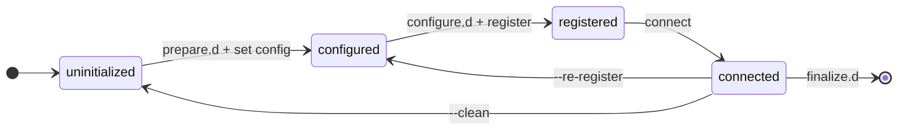

# `tedge bootstrap`: one-shot device onboarding

* Date: __2026-08-25__
* Status: __Proposed__

This record captures the decisions behind `tedge bootstrap` and why the alternatives were rejected.
The behaviour itself is documented for users, and that documentation is the reference:

* [Bootstrap hooks and descriptors](../../docs/src/extend/bootstrap.md) -
  the hook contract, the cloud descriptor format, and worked examples
* [`tedge bootstrap` CLI reference](../../docs/src/references/cli/tedge-bootstrap.md) -
  the flags
* [Runnable examples](../../tests/RobotFramework/tests/bootstrap/examples/) -
  one per extension surface, exercised by the system tests

Where this record and the documentation disagree, the documentation is right and this record is stale.

## The problem

Onboarding a device to a cloud is a multi-step, order-sensitive sequence
that the user drives by hand:

```sh
tedge config set c8y.url example.cumulocity.com
tedge cert download c8y        # or: tedge cert create && tedge cert upload c8y
tedge connect c8y
```

The configuration decisions in front of the user keep growing:

* Is Cumulocity using a custom domain for the http endpoint? If so `c8y.http` and `c8y.mqtt` must be set independently
* Should the device use Core MQTT (port 8883) or the MQTT Service (port 9883)?
* Is the device behind an HTTP proxy?
* Cumulocity basic auth, Cumulocity CA, or the site's own PKI?

Every downstream consumer re-invents a wrapper around this sequence.
The getting-started docs walk through it step by step, and several projects ship their own bootstrap scripts:

* [tedge-standalone](https://github.com/thin-edge/tedge-standalone/blob/main/src/tedge/bootstrap.sh)
* [tedge-demo-container](https://github.com/thin-edge/tedge-demo-container/blob/main/images/common/bootstrap.sh)
* c8y-tedge plugin for go-c8y-cli:
  [bootstrap via ssh](https://github.com/thin-edge/c8y-tedge/blob/main/commands/bootstrap),
  [bootstrap-container](https://github.com/thin-edge/c8y-tedge/blob/main/commands/bootstrap-container)
  (guided questionnaire)

Each wrapper has its own flags, failure handling, and logging,
and none of it flows back into the core.

At the same time, device manufacturers want to embed thin-edge.io
into their own application packaging and device UIs.
They need to customize parts of the onboarding,
platform-specific steps and sometimes the registration mechanism itself,
and today their only option is to fork the flow into yet another script.

## The proposal

A built-in `tedge bootstrap` command:
an opinionated, idempotent, automation-friendly core flow,
extensible at defined points via drop-in hooks and cloud descriptors.

### Goals

* **Easy**: a single command takes a factory-fresh device to "connected and registered".
* **Automatable**: fully non-interactive via flags and environment variables;
  suitable for cloud-init, container entrypoints, and vendor UIs.
* **Consistent**: the same command, output, and failure semantics on every distribution and vendor platform.
* **Customizable**: integrators add platform steps
  and even fulfil registration with their own provisioning mechanism,
  without replacing the core flow.
* **Idempotent**: re-running on a bootstrapped device is a defined, successful outcome;
  an aborted run resumes where it left off.

## Decisions

### A fixed sequence of steps with drop-in hook directories

Bootstrap runs a fixed sequence:
`prepare`, `configure`, `register`, `connect`, `finalize`.
Four of the five steps carry a drop-in hook directory (`<step>.d`);
`connect` is the core's alone.
`prepare` and `finalize` are hooks only, the core does nothing there;
`configure` runs its built-in step and then its hooks;
`register` runs *either* a built-in method *or* its hooks.
With no hooks installed, this is the plain built-in flow.

Hooks run inside the same invocation:
they appear in its output and its `--dry-run` preview,
and a failing hook fails the bootstrap.
The core orchestrates, hooks and cloud are callees.

The step names follow the software management plugin API (`prepare` … `finalize`),
the established vocabulary for executable extension contracts;
`init` was rejected, since it already means something else in `tedge init`.

The hook mechanism itself follows the six existing plugin mechanisms
(sm-plugins, config-, log-, diag-plugins, workflows, flows):
ship a working default, make it extensible by dropping in a file.
The contract borrows from the diagnostic plugin
(layered search path with per-file-name precedence,
`.ignore` markers, lexical ordering)
and adds three decisions of its own:

* **Exit code `2` means "not applicable"**,
  so a vendor ships every hook on every hardware variant
  and each hook self-selects.
* **Stdout is operator-facing, stderr is diagnostics.**
  Stdout is shown under the current step (a QR code, a link, a generated identity);
  stderr goes to the bootstrap log and is replayed only when the hook fails.
* **Secrets never travel on argv**, where `ps` can read them.
  They reach hooks via the environment or mode-`600` files referenced by path.
  Context the CLI itself reads (`TEDGE_CONFIG_DIR`, `TEDGE_CLOUD_PROFILE`)
  is exported under the names the CLI already understands,
  so a hook runs `tedge` as the operator would instead of forwarding flags.
  The `TEDGE_` prefix is reserved for config overrides;
  bootstrap-specific values such as `C8Y_REGISTRATION_URL` live outside it.

The Enter/Leave transition scripts of Mender were considered as an alternative shape.
For a linear five-step flow, Leave of one step and Enter of the next are the same instant,
so the symmetry would mostly produce empty directories,
and Mender's model wraps states it does not own,
whereas the `register.d` slot deliberately *replaces* the built-in step.
The named-step directories were kept.

### Steps are transitions between durable states

Each step establishes a durable condition of the device
and is skipped when that condition already holds.
That is what makes re-runs and resumed runs safe:
bootstrap walks the same sequence every time
and performs only the transitions that are missing.



The states are exactly what the skip checks inspect:
*configured* is the persisted settings,
*registered* is the registration artifacts at their configured paths,
*connected* is the health check that the connect step re-verifies.
`prepare` and `finalize` establish nothing durable,
which is why they are pure hook phases at the boundaries.

`--re-register` and `--clean` are the two deliberate backward transitions,
distinguished by what they unwind.
Settings are inputs (from flags, the factory image, the operator);
registration artifacts are outputs.
`--re-register` discards only the outputs,
dropping the device back to *configured* so the register transition runs again
against the kept inputs.
`--clean` also removes the instance's own configuration,
returning it to *uninitialized*.
Bootstrap unwinds only what it writes:
the rest of the cloud's config section, device-global keys,
and package-shipped content are never removed.
Removing a mapper directory outright belongs to the future `tedge mapper remove`.

`--offline` is the deliberate forward *stop*:
the run advances as far as *configured* with the services staged,
defers the transitions that need the cloud, and exits 0.
The same command run online performs the rest.
Auto-detecting offline mode was rejected:
deferring registration must be a stated intent,
since an automated line wants a hard failure
when a supposedly-online bootstrap cannot reach the cloud.
`--offline` is a run-shape flag, so `--save` does not capture it:
a saved invocation describes the target state.

### Persistent settings and run parameters are different things

Persistent device settings (URLs, feature flags, proxy address)
belong in `tedge.toml` and reach the device through the existing validated config path,
with precedence flags > environment > existing config:
repeatable `--set` flags, `TEDGE_*` environment variables,
or a pre-seeded `tedge.toml` shipped by the image.
Run parameters of one invocation (registration method, one-time password, wait behaviour)
are flags or environment only and are never persisted.

A dedicated answers file was rejected:
its config portion would duplicate `tedge.toml`,
and its run-parameter portion is too small to justify a new schema.
File-driven runs exist without a new dialect:
`--save` captures the effective invocation as a JSON array
whose fields are the CLI flags themselves,
and `--from` replays it.
Registration inputs are captured by environment-variable name only,
so secret values never enter the file,
and a missing variable fails upfront by name.
The array is the only accepted shape:
a statement of intent whose vocabulary is the CLI contract,
not a transcript and not a second config dialect.

### Registration is pluggable, and the outcome is verified

`register.d` hooks never run around the built-in registration step:
the register phase runs either a built-in method or the hooks, never both.
Which one runs is derived from the resolved registration method,
not from the presence of hooks.
Running them alongside built-in methods was rejected:
the phase would carry two meanings depending on the method,
and a hook that forgets to self-skip on `--register-method`
would silently corrupt a built-in method's run.
Registration-context hooks (QR codes, displays, vendor-UI signals)
live at the `configure.d` boundary instead:
the last slot before registration,
where everything is resolved and `C8Y_REGISTRATION_URL` is delivered.

The core does not use hook exit codes as proof of registration.
After the register phase it verifies that the expected artifacts exist
(a certificate and key, or a credentials file),
and the connect step is the real backstop.

Only Cumulocity has built-in registration methods (`c8y-ca`, `self-signed`, `basic`, `basic-preregistered`).
Azure and AWS have no device-side registration story in the core,
so on those clouds, and on custom mappers, a hook-executed method is the default.
The `basic` method sends a security token with its credentials request
so an operator can prove the request came from the device they are looking at;
`basic-preregistered` needs no exchange at all and therefore also completes under `--offline`.

### Cloud descriptors are metadata, not code

Different clouds offer different registration options,
and for custom clouds the core cannot know what they are.
A single "delegate to hooks" bucket hides that choice from users and from the hooks.
Cloud descriptors are small TOML files shipped by the package that ships the hooks,
declaring per cloud the registration methods, their inputs, and settings.
They are layered like hooks, with the compiled-in built-ins as the lowest layer.

Descriptors execute nothing.
Registration is done by the built-in methods or the register hooks,
and the outcome is verified independently,
so a wrong descriptor cannot fake a successful registration.
One descriptor feeds five consumers:
`--register` validation, upfront input validation,
the interactive wizard, `--describe`, and vendor UIs.

The schema is API surface shared with mapper packages and is deliberately kept small:
cloud (with an optional derived `type`), methods (with implied `set` values),
environment-variable inputs, settings, defaults and choice lists.
Per-field types, validation rules, and conditionals are resisted until a real consumer needs them.

Further decisions about descriptors:

* **Method names are cloud vocabulary.**
  A name is scoped by its cloud and never addresses a hook file.
  Packages are encouraged to reuse a small shared vocabulary
  (`token`, `provision`, `certificate`, `basic`)
  so `--register provision` means the same kind of onboarding on every cloud;
  proprietary mechanisms keep their proper names (`c8y-ca`).
* **Who executes a method is derived from its name.**
  Built-in names resolve to their built-in implementations,
  every other declared method is executed by the register hooks.
  A hook-executed method on c8y must be declared by a descriptor override,
  so it carries a name, a description, and validated inputs like any other.
* **Overriding a built-in descriptor replaces it whole.**
  No field-level merge; the compiled-in descriptor is the copy-paste starting point.
  Omitting a built-in method hides it from the wizard but does not disable the flag,
  and a restated built-in method keeps its compiled-in inputs unless it declares its own.
* **`.ignore` markers curate, they do not disable.**
  A hidden cloud disappears from the wizard and the `--describe` listing,
  but `tedge bootstrap az` still works.
* **Settings routed to the tedge config must be existing config keys.**
  A custom mapper's `mapper.toml` is free-form, so its descriptor may declare any key.
  A value outside the config schema is better declared as a non-secret method input,
  which a hook persists wherever the integration defines.

### Method parameters are inputs, not flags

The command line carries only universal flags
(`--url`, `--register`, `--device-id`, `--set`, and the run-shape flags).
Everything a specific method needs is a declared input,
supplied via its environment variable or the wizard.
This holds for the built-in methods too:
the code carries no credential defaults at all,
and a tenant's custom bootstrap credentials are just different input values.

An earlier iteration had a top-level `--one-time-password` flag.
It was removed because a per-method flag on a multi-cloud command
misleads everywhere its method is not in play,
it put a secret on the command line,
and `--save` could not capture it.
As an input, all three problems disappear.
A generic `--cloud-arg key=value` was rejected for the same reasons.

Environment-variable inputs are not visible in `--help`,
since clap help is static and descriptors are runtime data,
so `--describe` renders the resolved descriptors
and is the zero-execution entry of the discovery story:
`--describe`, then the equivalent command an interactive run prints,
then `--save`/`--from`, then upfront validation naming the missing variables.

### The wizard compiles to the CLI contract

An interactive run gathers all answers up front from the descriptors,
prints the equivalent non-interactive command,
and then runs the same pipeline as that command.
No prompting happens once the pipeline has started,
so prompts cannot interleave with pipeline output.
The printed command is rendered from the same invocation `--save` writes,
so the command shown and the file replayed never diverge.

The trigger is conservative:
prompting only happens when required information is missing,
so a configured device's re-run and a flag-complete invocation
stay fully non-interactive even on a terminal.
Registration inputs are validated, and interactively prompted for,
only when the run will actually register.

### Custom clouds are first class

The command accepts a free-form cloud name, resolved as `tedge connect` does,
so a custom mapper package requires no cloud-specific code in the core.
Its URL and settings land in `mappers/<name>/mapper.toml`,
its registration is done by the hooks the package ships,
and the connect step reuses the `tedge connect <name> --test` health wait
as the end-to-end proof.
A mapper that is its own bridge must report `up` only once connected to the cloud;
the check cannot tell a running-but-disconnected mapper apart otherwise.

Declaring registration in `mapper.toml` itself
(a `[bootstrap]` section naming a script and expected artifacts) was rejected:
it invents a second hook mechanism with its own schema
when the drop-in directory already does the job.

### Named instances use the name as the address

Multiple instances of the same cloud follow the generically-named-mapper model:
the positional argument is the instance name,
and `--type` declares the semantics when creating a non-default name,
persisted as `cloud_type` in the instance's `mapper.toml`.
A packaged descriptor may declare the type instead, so a derived-cloud package needs no flag.

Rejected shapes:
`--name` creates two ways to state the identity
and breaks the name-is-the-address symmetry with `tedge connect` and service names;
`tedge bootstrap custom --type c8y` makes "custom" a non-name keyword.

Non-default c8y instances get conflict-free defaults computed by the core
(`bridge.topic_prefix`, the next free proxy port),
applied only when not already configured, so re-runs are stable.
Certificates follow a per-instance rule:
one private key shared with the default instance,
one CSR and one certificate per tenant under the instance's own directory,
because each tenant's CA signs its own.
The default instance keeps the global `device-certs/` location,
since moving it would break existing installations and tools.

Current limitations:
`self-signed` is not supported for named instances,
and the connect step requires the generic `tedge-mapper-<name>` service to exist.
Deriving does not yet change the runtime:
a named instance runs the generic mapper, not the full Cumulocity mapper,
so `cloud_type` is forward-looking metadata until the generic-mapper rollout.

### Derived clouds inherit per section, single level

A descriptor may declare `type = "<base>"`.
The base's registration semantics apply,
so built-in method names keep resolving to their built-in implementations,
while every method the derived descriptor declares itself is hook-executed.
Inheritance is per section, favouring the derived descriptor:
`register` methods and the `[url]` block are inherited only when the derived descriptor declares none,
and `[[settings]]` are always the derived cloud's own,
because the base cloud's questions rarely apply.
Derivation is single-level.

A register method need not obtain anything; it may verify a precondition instead.
The motivating case is a dedicated Cumulocity MQTT service bridge
that reuses the device's existing certificate
and fails with guidance when the device is not yet connected to Cumulocity.

## Rejected alternatives

* **Monolithic built-in command with no extension points.**
  Every integrator wraps it in their own script,
  producing divergent docs, failure handling,
  and no unified logging or dry-run coverage.
* **Full provider plugin dispatch**
  (every registration method an external executable, sm-plugin style,
  with built-ins as default plugins).
  Maximum flexibility, but the core flow itself becomes replaceable,
  so `tedge bootstrap` would mean different things on different devices,
  against the consistency goal.
  The chosen design keeps this path open:
  `--register` values outside the built-in set
  can later fall back to a plugin lookup without breaking the CLI contract.
* **Reusing the agent workflow engine** (TOML state machines).
  The engine is agent-hosted and MQTT-command-driven,
  whereas bootstrap runs from the CLI before the agent is usefully connected;
  reusing it means either a second interpreter or agent-mediated bootstrap.
  Its strengths (reboot-crossing steps, MQTT-observable progress)
  are not needed by the known use cases.
* **A structured progress stream** (`--output json`, one event per phase).
  Built and then removed:
  tests assert on the exit code, the saved invocation file,
  and the resulting device state, without freezing an event schema.
  If a vendor-UI consumer needs live structured progress later,
  one implementation note carries over:
  the composed commands print to stdout,
  so a JSON mode must claim stdout for the stream
  and redirect everything else to stderr.

The alternatives rejected within a decision
(Enter/Leave transition scripts, auto-detected offline mode, an answers file,
cloud-specific flags, registration declared in `mapper.toml`)
are discussed in the decision that rejects them.

## Open questions

1. Descriptor schema versioning.
   Cloud descriptors are API surface shared with mapper packages.
   How is the schema versioned and evolved:
   a `version` field, additive-only changes, or both?
   The same question extends to the captured invocation file format,
   which is API surface for replay files.
2. Descriptor key validation.
   An unknown tedge config key declared as a setting
   currently fails at the configure step, after the wizard has asked the question.
   Validating declared keys when the descriptors load
   would move the failure before the wizard runs.
