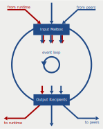
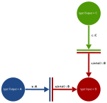

# Thin-edge actor-based components

The aim of thin-edge is to empower IoT software developers,
with a large set of pre-built components
that can be enabled, configured, extended and combined
into IoT specific agents.

For that purpose, thin-edge leverages the actor model
and provides the tools to combine these actors into independent extensions
and then into full-fledged executables the users can adapt to their use-cases.

This document outlines the main decisions toward this design.

## Why actors?

The core idea of the [actor model](https://en.wikipedia.org/wiki/Actor_model) is
to implement a system with independent processing units, the actors, that
* behave accordingly to some internal state to which they have an exclusive access,
* send asynchronous messages to each others,
* process, one after the other, the messages received in their inbox,
* react to messages by updating their state, by sending messages to other actors, and possibly by spawning new actors.

All the interactions between actors are materialized by messages.
* Synchronous method invocations are replaced by asynchronous message exchanges.
* All the interactions one wants to observe are materialized by messages:
  commands, events, requests and responses as well as errors, runtime requests, timeouts or cancellations.
* Typical examples of thin-edge messages are telemetry data, operation requests and outcomes,
  but also low level messages as MQTT messages, HTTP requests and responses,
  and even system specific messages as file-system events and update requests.

An actor can be:
* a source of messages,
* a mapper that consumes messages and produces translated messages,
* a transducer that consumes and produces messages but also maintains a state ruling its behavior,
* a server that delivers responses on requests,
* a message sink that forwards the messages to some external service.

In a running system, actors are connected with peers along various patterns:

* An actor can gather messages from several sources and dispatch messages to several recipients.
* Messages can be addressed to specific actors, or be broadcast to any interested recipients.
* An actor can be oblivious to the source and the destination of the messages flowing through it,
  processing input messages independently of their source,
  and publishing output messages to any interested recipients.
* By contrast, an actor can distinguish its peers,
  processing the messages accordingly to their sources
  and sending specific messages to each of them.
  Notably, a server sends response messages specifically to the requester.

The main benefits of this model in the context of thin-edge are:
* __Modularity__
  * An actor can be understood in isolation.
  * The behavior of an actor is entirely determined by its reaction to a message in a given state.
  * Actors can be implemented, tested, and packaged independently.
* __Flexibility__
  * Actors can be connected in various way,
    as long as the recipients can interpret the messages received from others.
  * An actor can be substituted by another that implements the same service,
    i.e. that sends and receives the same message types.
* __Observability__
  * The behavior of an actor can be fully observed, by listening the stream of messages received and sent.
  * In a pure actor model setting, any state change can be traced to a message,
    being either triggered by a message or notified by a message.
  * The messages being serializable, they can be logged, persisted, audited, forwarded to the cloud.
* __Testability__
  * An actor can be tested in isolation as well as in combination.
  * An actor can be exercised with arbitrary sequences of input messages,
    while its output is observed and verified,
    and some of its peers being possibly simulated.
  * An actor's peer simulator can be as simple as a pre-registered stream of messages,
    or as sophisticated as an error injector.
  * In a pure actor model setting, all interactions with the system are done via actors,
    and can be simulated, including the clock and the file system.

Thin-edge leverages Rust, adding robustness to the actor model.

* __Robustness__
  * No message can be sent if not understood by the recipient.
    The compatibility, between the messages sent to an actor
    and the messages this actor can actually process,
    is verified at compile-time.

However, using Rust also introduce specific challenges, as we will see below.
To name just a few:

* As all the message types have to be known at compile time,
  we need to be cautious not to make all the actor *implementations* depending on each others,
  due to dependencies at the *message* level.
  * The implementation of an actor that consumes telemetry data
    must not depend on the implementations of actors producing telemetry data - and vice versa.
* As no message can be sent without being understood by the recipient,
  we need a shared definition of IoT messages.
  * Consumers and producers of telemetry data must agree on what is telemetry data.
    For that purpose, thin-edge provides an extension which defines core IoT data:
    measurements, events, alarms ...
* However, we also expect the system to be extended by independent vendors,
  and thin-edge should not pre-defined all the messages that can be exchanged by actors.
  * A contributor should be able to define its own set of messages usable by others.  

## Why yet another framework?

[There are a *lot* of actor frameworks for Rust](https://www.reddit.com/r/rust/comments/n2cmvd/there_are_a_lot_of_actor_framework_projects_on/),
so why thin-edge should come with its own implementation?

As [well described by Alice Ryhl](https://ryhl.io/blog/actors-with-tokio/),
actors can be implemented with Tokio directly, without using any actor libraries.
Indeed, [tokio](https://docs.rs/tokio/latest/tokio/index.html) provides the key building blocks for actors:
[asynchronous tasks](https://docs.rs/tokio/latest/tokio/task/index.html)
and [in-memory channels](https://docs.rs/tokio/latest/tokio/sync/index.html).
Alice highlights that the issues are
*not* on the implementation of the actor processing loop,
*but* on how the actors are built, interconnected and spawn.

But among the existing Rust actor frameworks,
[actix](https://docs.rs/actix/latest/actix/) being the most notable one,
the focus is on abstracting the [actor life cycle](https://docs.rs/actix/latest/actix/trait.Actor.html#actor-lifecycle),
with specific methods to tell what to do at each stage
and [how to handle each specific message type](https://docs.rs/actix/latest/actix/trait.Handler.html).
Beyond the fact that this gives little help compared to pattern-matching on the received messages,
this adds strong constraints on how message reception and emission are interleaved,
this life cycle being controlled by the framework.
The `Handler` trait is perfect to define how to react to some input,
but how to send spontaneous messages or to arbitrarily defer a reaction?

To address the main issue - i.e. to build a mesh of connected actors,
Actix distinguishes the [`Actor`](https://docs.rs/actix/latest/actix/prelude/trait.Actor.html) from its
[`Context`](https://docs.rs/actix/latest/actix/struct.Context.html) but tightly couples one with the other.
An actix actor is unusable without an actix context and runtime.
And even assuming such a dependency, one has to define an approach on top of actix
on how to create the actor contexts, the actor instances and their interconnections.

Furthermore, Actix has a bias towards a request / response model of communication.
- [A response type is attached to any message](https://docs.rs/actix/latest/actix/prelude/trait.Message.html).
- [Responses are not regular messages and are sent over specific channels](https://docs.rs/actix/latest/actix/dev/trait.MessageResponse.html).
- A message handler is given a context to send arbitrary messages,
  but [this must be done before returning a response](https://docs.rs/actix/latest/actix/prelude/trait.Handler.html#tymethod.handle).

To conclude, we decided to design thin-edge actors on top of tokio without using actix.
- Tokio provides the key building blocks: asynchronous tasks and in-memory channels.
- By comparison with actor life-cycles defined and controlled by a framework,
  we prefer the simplicity and generality of actors which behaviors are freely defined as `async fn run(&mut self)` methods.
- We need the flexibility to connect actors along various communication patterns,
  with no restrictions on the type nor the number of messages sent as a reaction to a former message,
  not even on the targets and the reaction time window.
- Our effort is to be focussed on providing a flexible but systematic approach to instantiate and connect actors.

## Key design ideas

With really few constraints on the actor state and lifecycle,
the design focus is set on how to build and connect actors. 

1. Require nothing more than being `Display + Send + Sync + 'static` for a value to be a `Message`,
  i.e. ready to be:
    * displayed to the user for logging purposes,
    * and freely exchanged between actors with no constraints on ownership, thread and lifetime.
    * In contexts where messages are broadcast, these messages will need to `Message + Clone`.
    * For testing purpose, messages might also be `Eq + PartialEq`.
1. Use multi-producer, single-consumer [`tokio::sync::mpsc`](https://docs.rs/tokio/latest/tokio/sync/mpsc/) channels
  to asynchronously exchange messages between actors.
    * The channel receivers are owned by the actor instances that consume and process the messages.
    * The channel senders are freely cloned and given by the recipients to the actors that produce the messages.
1. Enforce no constraint on the actor behaviors.
   * An actor behavior is simply defined by an `async fn run(&mut self)` method, with no extra context or runtime.
    * Therefore, an actor instance has to be given, along its state, any channel required to send and receive messages.
    But, the actor implementation is free to organize its event loop.
       * Messages can be processed in turn or concurrently.
       * Outputs can be sent as reaction to inputs, or, vice versa requests can be sent to get responses.
       * Messages can be sent spontaneously, independently of any input.
1. Enforce no constraints on the number and types of channels used by an actor to send and receive messages.
    * A typical actor has two or three input receivers and a bunch of output senders.
    * Using several receivers helps to implement message priority among peers or to specifically await a message from a given peer.
        * By concurrently listening to a main input receiver and a runtime message receiver,
          an actor can handle any message sent by the runtime with a higher priority, if needed.
        * By listening exclusively on a peer-specific receiver an actor can block till it receives a response from that peer.
    * Using a single receiver is by far simpler (not need for `tokio::select!`),
      but might require the use of envelopes to identify message provenance.
    * An actor can have a single output sender, multiplexing all its output messages into one channel.
      However, most actors will use a set of senders to specifically address each message to the appropriate peer.
    * To avoid boilerplate code an actor implementation can provide specific handles and helpers,
      to abstract its channels, builds the appropriate messages and hides synchronization subtleties.
    * To enforce a systematic way to handle timeouts, cancellations, errors and logging,
      thin-edge provides enhanced receivers and senders, ready to be used by the actors.
        * For instance, a `LoggingReceiver` listens to two source of messages,
          a main input channel and a channel connected to the runtime,
          gives priority to runtime messages,
          and logs all the messages just before yielding them to the actor.
1. Establish all the actor connections using message senders given by the consumers to the producers.
    * This is the corner stone of the design!
    * For a consumer actor being able to receive messages sent by some producer actor,
      the consumer needs to give to the producer a channel `Sender` associated to one of its own receivers;
      and the producer has to register this `Sender` to its own set of senders.
    * In practice, the messages sent by a producer actor are *not* of the exact type expected by the consumer actor.
      Most of the time because the consumer expect messages from several sources, but not only,
      as the producer might also send messages that need some adaptation before being consumed.
      For that purpose, the actors exchange a dynamic sender (a `Box<dyn Sender>`)
      which `send()` method casts the message of the sender into the type expected by the receiver.
    * Using specific `Sender` implementations is also useful to implement various ways to dispatch messages:
      e.g. broadcasting, sending a response to the requester, sending messages to subscribers.
1. Use actor builders to organize the connections among actors.
    * Builders help to tie the knot when two actors need to establish a bidirectional connection
      (say to exchange responses for requests). Each actor needs a sender associated to the receiver of the other.
      This can be done with senders that are updated in a second step (starting from senders acting as `/dev/null`).
      However, using builder also helps to address ownership issues: to receive messages on its own receiver, an actor,
      or more specifically the actor builder, has to keep a copy of the sender attached to this receiver.
      This sender (to self) is then cloned and given to any actor that aims to send messages to the actor under construction.
      When the actor instance is created these senders to self can be dropped.
    * The capabilities of an actor are made available to the others through connection-related traits implemented by the builders.
      These traits define the exchange of message senders at build-time.
      E.g a source of messages expects to be given a message sender where to produce its messages.
      Similar traits are defined for sinks (they can provide a sender from which messages will be consumed by the sink),
      for service providers (for which two senders have to be exchanged, one for the requests, the other for the responses),
      and service consumers (that need to exchange senders with the service provider).
    * The actors are connected to each other before any actor's `run()` event loop is launched.
      The first version of thin-edge actor crate doesn't specifically address the ability to connect running actors.
      However, the design doesn't preclude it. To make this happen, an actor will have to
      keep a copy of the `Sender` associated to its receiver and forward a clone of this sender to any producer requesting it
      (these registration request and response being regular messages with a payload that contains a sender).

The following diagram highlights some of these points.



* The actor instance owns a set of receivers, forming its input message box.
* The actor also owns a set of senders connected to the receivers of its peers.
* These connections between peers have been established by exchanging senders.
  This actor gave, to input-source peers, senders that are associated to its message box,
  and kept sender copies given by output-recipient peers.
* Even the communication with the runtime is established using senders,
  so this actor can listen to runtime signals and trigger runtime actions
  using the same mechanisms as for any other peer interaction.
* Sophisticated synchronization mechanisms can be implemented under the hood
  by the message senders and receivers. Here the runtime message sender is multiplexed
  into all the actor receivers. So a runtime signal - for instance a shutdown request,
  is broadcast on all the channels and is processed with a high priority.

## Requirements

One should be able to build a thin-edge executable from extensions that have been implemented independently.

* The thin-edge API must define how to create, connect and run actor instances.
* Actors should be loosely coupled, only depending on message types defined by peer actors
  and not strongly dependent on specific peer actor implementations.
* The compatibility between two actors, one sending messages the other consuming them,
  must be checked at compile time leveraging rust types for messages and channels.
* If an actor expect to be connected to specific peers, this must be enforced at compile time,
  these peers being solely defined by the types of the exchanged messages. 
* Two actors must not need a direct dependency relationship to be able to exchange messages, requests or responses.
  In practice, one might have crates with sole purpose to define message types.
  So a consumer of messages, don't need to know any sources of such messages.
  And vice-versa, the producers don't have to depend (at the code level) on any consumers.
  Both consumers and producers only need a dependency on the message definitions.
* The thin-edge API should give a large flexibility to connect actors:
  * exchanging stream of messages as for measurements,
  * sending requests which responses are awaited by the requester,
  * sending asynchronous requests for which responses will be processed concurrently with the other messages,
  * broadcasting messages,
  * gathering messages from various sources,
  * sending messages to one specific instance of an actor.
* Actors should support being synchronous, with the ability to pause awaiting the response of another actor.
* The final executable is built as an assemblage of extensions, defining actor instances and their connections.
* Using Rust actors must not be the *only* way to create MQTT-based thin-edge executables - aka *plugins*.
  An agent developer must be free to choose his preferred programming language
  to implement a feature that interacts with other thin-edge executables using JSON over MQTT.

One should be able to build executables with IIoT specific features.

* The `tedge_actors` crate defines only messages related to the runtime such as `Spawn` or `Shutdown`.
* IIoT related messages are defined in specific extensions as `tedge_telemetry` or `tedge_software_management`.
* An extension must be provided so an actor can pub/sub messages over MQTT.
* Similarly, an extension must be provided to let actors interact with HTTP end-points.
* An extension must be provided to encapsulate the thin-edge MQTT API,
  with the definition of all the MQTT topics and message payloads.

Robustness is key.
* One actor panicking should not impact other actors or the runtime.
* All errors must be handled in a non-crashing way.
* Unrecoverable errors may cause the binary to shut down eventually, but not unexpectedly.
* The framework must handle SIGTERM and signal a shutdown to all active actors.
* Shutdown is signalled to all the actors, giving them a possibility to handle such case gracefully.
  Each actor handles shutdown requests its own way, ignoring pending messages or not, stopping to send messages or not.
  After some delay, the runtime aborts any actor that failed to terminate on time.
  However, the robustness of the solution should not always rely on graceful shutdowns
  and should be designed to cope with unexpected crashes or SIGKILLs.

Observability and testability:
* An actor should be testable in isolation, with
  - a configurable initial state,
  - simulated inputs,
  - checked outputs,
  - possibly simulated peers.
* Every actor must have a unique id built after the actor type as known by the users.
* A user must be able to configure logging per-component as well as globally,
  tracing the messages processed by each actor
  as well as those forwarded to peers.

The runtime itself should behave as an actor, with messages that can be traced.
* Runtime messages should be used for all runtime actions:
  - to activate and deactivate actors at runtime
  - to start and stop actors,
  - to set and trigger timeout,
  - to shut down the system,
  - to check the health of a spawned actor.
* Runtime messages sent to an actor must be processed with a higher priority,
  although this is up to the actor developer, and something that the framework can not enforce.
* An actor should be able to send messages to the runtime:
  - to trigger an action as spawning a task
  - to notify errors.
* Runtime messages must be traceable as regular messages,
  so a user should be able to observe all runtime actions.

Nice to have ideas that are out-of-scope of the first implementation of the actor model for thin-edge:
* It would be a plus, to have actors storing data using the framework:
  - to persist data between restarts of the deployment
  - to cache data during network outages
  - to provide operation checkpoints during sensitive operations.
* It would be handy to build batteries-included executables
  that contains numerous extensions and alternative implementations for a large diversity of use-cases.
  - An extension can be included in an executable without being enabled, but only registered and ready to be used.
  - Registered extensions can be enabled and configured at runtime. 
  - Having extensions included but not instantiated should not impact other extensions nor consume runtime resources.
  - Such an executable with enabled and disabled extensions must provide a command line option, say `--list-extensions`,
    to provide the whole list of available extensions and their purpose;
    as well as command line options for detailed help on how to enable and configure those.

## Detailed design aspects

The point here is not to detail all the design aspects, but to address the points that are important and challenging.

### Actor sketch

The design key ideas exposed above aim to let the actor implementations be as unconstrained as possible.

Message types can be freely defined. They only need to be free of concurrency and ownership constraints.

```rust
/// A message has simply to be Debug + Send + Sync + 'static
#[derive(Debug)]
pub struct MyInput {
  /// message fields must be Send + Sync + 'static
}
```

All the interactions of an actor with peers are done via `mpsc` channels.
An actor implementation has to own a set of `Receiver` and `Sender` along its state.

```rust
/// A typical actor owns a single receiver and a bunch of senders.
/// 
/// But this is not a rule.
/// An actor can have single sender for all its output.
/// Or have a bunch of receivers from which it can `tokio::select!` an input
pub struct MyActor {
    /// The state that rules the actor behavior
    state: MyActorSate,
    
    /// The queue of input messages for this actor
    input_box: Receiver<MyInput>,
    
    /// Different output channels targeting specific peers
    peer_a: Sender<PeerAInput>,
    peer_b: Sender<PeerBInput>,
    peer_c: Sender<PeerCInput>,
}
```

The behavior of an actor is simply defined by an `async fn run(&mut self)` method.
Note that no extra context, runtime or peer information are passed to the actor event loop.

```rust
impl MyActor {
  /// The actor event loop
  pub async fn run(&mut self) -> Result<(), RuntimeError> {
    // - consume messages received on `self.input_box`
    // - update `self.state`
    // - send messages/errors to peers over `self.peer_x` senders
    // - give up with a `RuntimeError` on fatal errors
  }
}
```

### No need for a `Handle` trait

Note that there is little need for specific `Handle` implementations as proposed by most Rust actor crates.

```rust
/// Given an actor that has to handle several kind of input messages
#[derive(Clone, Debug)]
enum AMessage {
    DoThis(ThisArg),
    DoThat(ThatArg),
}

struct ActorA {
  /// The actor can use a single receiver for all these messages whatever their kind
  message_box: Receiver<AMessage>,
  
  // ...
}

impl ActorA {
  /// The actor processes then all the messages in turn accordingly to their kind
  pub async fn run(&mut self) -> Result<(), RuntimeError> {
    while let Some(message) = self.messages.recv().await {
      match message {
        DoThis(arg) => self.do_this(arg),
        DoThat(arg) => self.do_that(arg),
      }
    }
  }

  /// Using a method for each specific kind of input.
  async fn do_this(&mut self, arg: ThisArg) {
    todo!()
  }

  async fn do_that(&mut self, arg: ThatArg) {
    todo!()
  }
}
```

### Removing boilerplate code

In practice, constructing and deconstructing messages leads to boilerplate code.
To avoid that, an actor implementation can wrap its message-based interface behind regular method invocations.

```rust
struct ActorAHandle {
  sender: Sender<AMessage>
}

impl ActorAHandle {
  pub async fn do_this(&mut self, arg: ThisArg) -> Result<(), ChannelError> {
    self.sender.send(arg).await
  }

  pub async fn do_that(&mut self, arg: ThatArg) -> Result<(), ChannelError> {
    self.sender.send(arg).await
  }
}
```

Such an actor can then be accessed using a more idiomatic way.

```rust
struct MyActor {
  // Access the peer using a handle rather than a sender
  peer_a: ActorAHandle,
  
  // ..
}

impl ActorA {
  pub async fn run(&mut self) -> Result<(), RuntimeError> {
    // interact with the peer through its handle
    self.peer_a.do_this(this_arg).await?;
    self.peer_a.do_that(that_arg).await?;
    
    // ..
  }
}
```

### Message type compatibility

The messages received by an actor on given channel `Receiver` must have the same rust type.

```rust
pub struct MyActor {
    /// The queue of input messages for this actor
    input_box: Receiver<MyMessage>,
    
    // ...
}
```

However, in practice, an actor has to handle different message kinds.
For instance, a `c8y_mapper` actor handle concurrently:
* telemetry data received from sensors and child devices,
* operation requests coming from the cloud,
* operation outcomes returned by the operating system and child devices.

These different kinds of message have to be encapsulated into a single type, an `enum`.
However, an actor sending messages *must not* depend on this global enum. 
* In the `c8y_mapper` example case:
  It's critical for an actor that just sends telemetry data
  to not depend on the other kinds of messages, as those related to operations.
  Otherwise, we would lose the ability to implement these two actors independently.
* For an actor to send messages to another one,
  one must only ensure that the messages sent
  can be converted *into* those expected by the recipient.

The `fan_in_message_type!` macro helps to define such an `enum` type
grouping subtypes of message that can be sent by independent actors.
The expression `fan_in_message_type!(Msg[Msg1,Msg2]);` expends to:

```rust
#[derive(Clone, Debug)]
enum Msg { 
    Msg1(Msg1),
    Msg2(Msg2),
}

impl From<Msg1> for Msg {
    fn from(m: Msg1) -> Msg {
        Msg::Msg1(m)
    }
}

impl From<Msg2> for Msg {
    fn from(m: Msg2) -> Msg {
        Msg::Msg2(m)
    }
}
```

However, this is not enough.
In practice the actors can not directly use the concrete `Sender` of their peers.
To make things more concrete, let an actor sending messages of type `A` to an actor that processes messages of type `B: From<A>`.
We do not want the source actor to be dependent on the `B` message type
or worse on some unrelated message type also consumed by the target as `C: Into<B>`.
Indeed, that `B` message type encompasses all the message kinds supported by the target,
and these types, as the `C` type, can be completely unrelated to the business domain of the `A` type.

Instead of a concrete `mpsc::Sender<B>`, the source must be provided a `Box<dyn Sender<A>>`,
i.e. some implementation of `Sender` trait,
that wraps the actual  `mpsc::Sender<B>` and casts the `A` messages into `B` values under the hood.
With such an adapter, the source actor has no more dependency on the actual type of the recipient, i.e. `B`. 



This adaptation of addresses into recipients is done using an intermediate trait: `Sender<M>`.
The `DynSender<M>` is just a convenient way to manipulate boxes of `dyn` values.

```rust
/// A recipient for messages of type `M`
pub type DynSender<M> = Box<dyn Sender<M>>;

#[async_trait]
pub trait Sender<M>: 'static + Send + Sync {
    /// Send a message to the recipient,
    /// returning an error if the recipient is no more expecting messages
    async fn send(&mut self, message: M) -> Result<(), ChannelError>;

    /// Clone this sender in order to send messages to the same recipient from another actor
    fn recipient_clone(&self) -> Recipient<M>;
}

/// An `Address<M>` is a `Recipient<N>` provided `N` implements `Into<M>`
impl<M: Message> Address<M> {
  pub fn as_recipient<N: Message + Into<M>>(&self) -> Recipient<N> {
    self.clone().into()
  }
}

impl<M: Message, N: Message + Into<M>> Into<Recipient<N>> for Address<M> {
  fn into(self) -> Recipient<N> {
    Box::new(self)
  }
}

#[async_trait]
impl<M: Message, N: Message + Into<M>> Sender<N> for Address<M> {
  async fn send(&mut self, message: N) -> Result<(), ChannelError> {
    Ok(self.sender.send(message.into()).await?)
  }

  fn recipient_clone(&self) -> Recipient<N> {
    Box::new(self.clone())
  }
}
```

#### Abstracting message senders

In practice, an actor might have several peers, of the same type or not, known at compile time or added at runtime.
Depending on the use-case, it will be more convenient to store the peers of an actor into:

* a structure, as for the Cumulocity mapper that needs to send specific messages to specific peers,
  ```
    struct C8yMapperPeers {
      sw_manager: DynSender<SoftwareRequest>,
      op_schedule: DynSender<OperationRequest>,
    }
  ```
* a vector, as for a measurement source that broadcasts messages to any interested recipients,
  ```
    type CollectdPeers = Vec<DynSender<Measurement>>
  ```
* a map, as for a software-package manager that dispatches requests to actors each specialized on specific software type. 
  ```
    type SWManagerPeers = HashMap<String, DynSender<SoftwareRequest>>
  ```