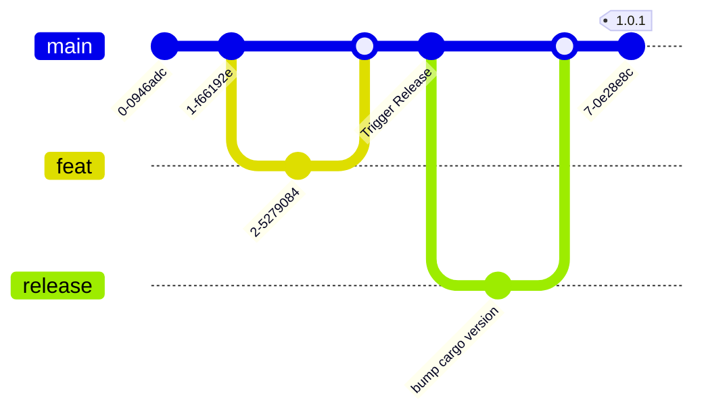

# Release Flow

The following steps describes the thin-edge.io release process:

1. Trigger Workflow in thin-edge.io repo
2. Review PR and approve

   **Notes**

   When this PR is merged, it the [autotag](.github/workflows/autotag.yml) workflow will detect the change in official version in the Cargo.toml, and then tag the commit with the new version number. This in turn triggers the [build-workflow](build-workflow) yet again to build the artifacts with the official version number.

   * A draft Release will be created
   * Linux packages will be published to cloudsmith to the `tedge-main*` channel
   * Linux packages will be promoted from `tedge-main*` to `tedge-release*`
   * Container image will be built and published to `tedge-release`
   * A new PR will be created in the [tedge-docs](https://github.com/thin-edge/tedge-docs/pulls) project to create a snapshot related to the new release

3. Review the [tedge-docs snapshot PR](https://github.com/thin-edge/tedge-docs/pulls), and merge (this will trigger the docs to be updated)
   **Notes**

   You may need to edit the PR if necessary if you also want to remove an existing version in the same PR.

4. Review [Github draft release](https://github.com/thin-edge/thin-edge.io/releases) and update the changelog
5. Publish the [Github release](https://github.com/thin-edge/thin-edge.io/releases) from step 3.
6. Trigger the Algolia crawler to update the search index (once the new version of the website is published and available)


The above process can be visualized by the following git process:




## Changelog generation

Changelog generation is provided by [git-cliff](https://github.com/orhun/git-cliff) combining both commit history and Github PR title and labels.

The following details which information is used to build the changelog:

* The PR title is used as the changelog entry. This allows the title to be modified without having to amend commits.

* Github labels which start with "theme:" are used to set the scope of the PR (e.g. which component the PR is related to), e.g. `theme:software`, `theme:mqtt` etc.

* A PR can be excluded from the changelog by adding the label "skip-release-notes"


### PR Checklist

The following items should be included in PRs to ensure they are ready for changelog generation:

* PR titles are human readable and follow the format:

   ```
   <type>: <description>
   ```

   See [Types](./RELEASE.md#types) for a list of recommended values.

* At least one "theme:*" label should be added to the PR to indicate which components are affected by the PR

#### Types

One of the following types (prefixes) MUST be used:

* feat:
* fix:
* build:
* chore:
* ci:
* docs:
* style:
* refactor:
* perf:
* test:
