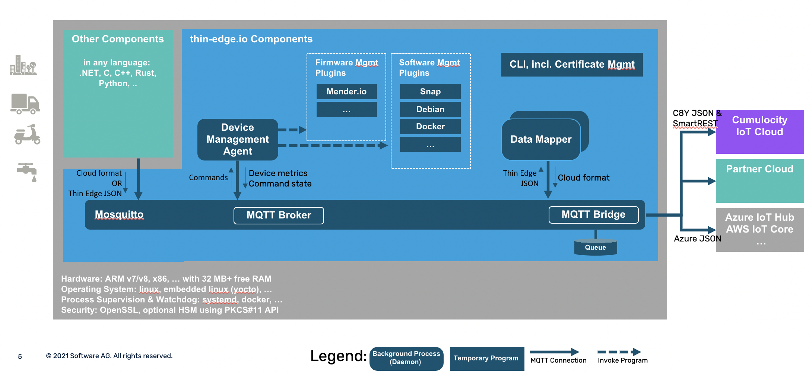

# Architecture

Thin-edge.io is an open-source framework to develop lightweight, smart and secure connected devices.

Cloud agnostic, thin-edge.io provides the foundations for cloud connectivity and device management,
a set of pre-packaged  modules, plug & play connectors to cloud platforms,
device certificate management, monitoring as well as built-in software and firmware management.

On top of these foundations, telemetry applications can be built using a combination of components provided by various IoT actors.
The features provided by these components can be as diverse as low-level connectivity to IoT protocols,
event-stream analytics, machine-learning-powered systems, or application specific processors.

Built around an extensible architecture,
thin-edge.io can be extended in various programming languages.
Here are the key aspects of the thin-edge.io architecture:

1. The components are processes exchanging messages over an MQTT bus.

2. The MQTT bus is connected to the cloud, forwarding the messages published on cloud specific topics. 

2. A [canonical data format](thin-edge-json.md) let the components exchange telemetry data independently of the connected cloud.
This is an optional feature, and the components are free to also use cloud specific data formats.

3. The mapper processes are responsible for translating the canonical data format into cloud specific messages and vice versa.

