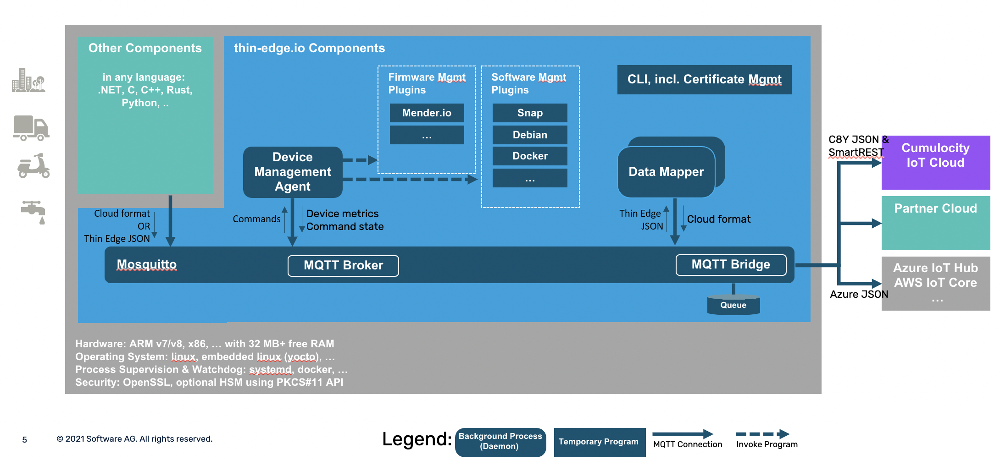

# Architecture

Thin-edge.io is an open-source framework to develop lightweight, smart and secure connected devices.

Cloud agnostic, thin-edge.io provides the foundations for cloud connectivity and device management,
a set of pre-packaged  modules, plug & play connectors to cloud platforms,
device certificate management, monitoring as well as built-in software and firmware management.

On top of these foundations, telemetry applications are built using a combination of components provided by various IoT actors
The features provided by these components can be as diverse as low-level connectivity to IoT protocols,
event-stream analytics, machine-learning-powered systems, or application specific processors.

Built around an extensible architecture,
thin-edge.io can be extended in various programming languages.

1. The components are processes exchanging messages over an [MQTT bus](./mqtt-bus.md) connected to the cloud.

2. A [canonical data](thin-edge-json.md) format is proposed as a pivot for telemetry data,
so the components can share a common dialect independent of their own representation of these data.

3. A combination of pre-defined MQTT topics and [mapper processes](./mapper.md) is responsible
for performing cloud-specific messages translation and dispatching.

