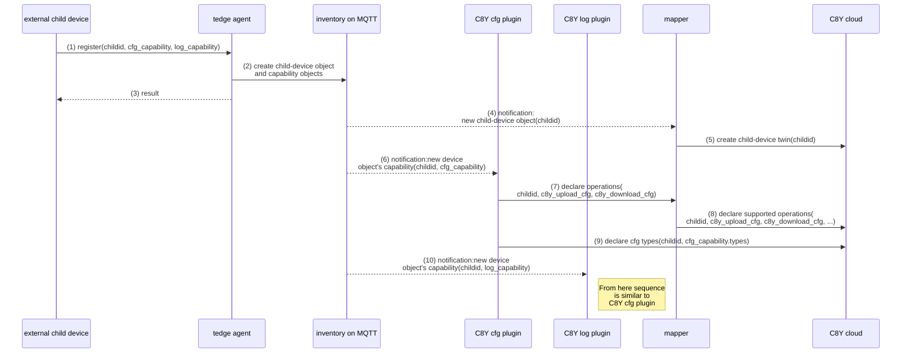

# thin-edge Data Model

The **thin-edge data model** is used to represent all device-related information.

TODO: add more information what the data model is about, and mention/link to the domain model

## Inventory

**thin-edge** holds and manages an **inventory**, that stores and provides information about the **thin-edge** device itself, as well as about other _external devices_ connected to thin-edge.

The **inventory** is the communication backbone for **plugins**, **external child-devices**, the **domain application**[^1] and **thin-edge** it-self.

The **inventory** accepts _information_ from **child-devices** or processes on the **main-device**, e.g.:
   * list of configuration files the **device** provides
   * description of measurements the **device** provides

Next **thin-edge**, **plugins**, the **domain application**[^1] or other processes can retrive those _information_ to discover data and functionality the **child-devices** and **main-device**  provide. As example:
   * the configuration plugin can retrieve a list of configuration files per **device** to provide those files to the cloud
   * the **domain application** or some 3rd party (e.g. APAMA analytics) can retrieve the description of measurements to discover measurement data provided by the **child-devices** and **main-device** that might be relevant for processing logic or analytics calculation

[^1]: more details see TODO: add link to "Appendix 'Device Overview' of Device Domain", that is in "./domain-model.md#device-domain"

### Format and content

The **inventory** stores for each device a _data object_ with certain _fields_.

The figure below illustrats the **inventory** and its _device objects_.


* The **thin-edge Device** object represents the **main device**, that runs **thin-edge** and manages that **inventory**.
  * The fields `name` and `type` contain the _device-name_ and _device-type_ visible in the cloud.
  * The field `telemetry_descriptor` contains descriptions of all **measurements**, **setpoints**, **events** and **alarms** the device provides.
    Details about the `telemetry_descriptor` are explained in section [Telemtry Descriptor](#telemtry-descriptor) below.
  * The field `plugin_descriptor` contains descriptions of all **plugins** the **device** intends to make use of
    (e.g. _Software Management_, _Configuration Management_, _Log file Management_, or any custom specific **plugin**).
    Details about the `plugin_descriptor` are explained in section [Plugin Descriptor](#plugin-descriptor) below.
* A **Child-Device** object could be exist more than once in the inventory. 
  Each **Child-Device** object represents an _external device_ (e.g. sensor, actuator, PLC, any other kind of device) that is connected to the thin-edge device.
  * Each **child-device** object is assocoiated with a separate individual device in the cloud. 
  * Similar to the **thin-edge Device** object, each **child-device** object has the fields `name`, `type`, `telemetry_descriptor` and `plugin_descriptor`.
    In addition, each **child-device** object has a field `childid`, that contains a unique ID to address that child-device.
  * NOTE: Not just _external devices_, but also processes running on the thin-edge device itself, can be represented with a **child-device** object in the **inventory** - to treat them as __logical child-devices__.

### Telemtry Descriptor

The `telemetry_descriptor` is part of an **inventory's** _device object_ and contains descriptions for all **measurements**, **setpoints**, **events** and **alarms** the device provides.
For each kind of telemtry data the `telemetry_descriptor` holds an individual `struct`:

<!-- using below 'javascript' syntax-highlighter instead of 'json', since with JSON comments look really terrible -->
```javascript
   "telemetry_descriptor": {
      "measurements": [ /* ... specific structs for measurements ...   */ ],
      "setpoints":    [ /* ... specific structs for setpoints ...      */ ],
      "events":       [ /* ... specific structs for events ...         */ ],
      "alarms":       [ /* ... specific structs for alarms ...         */ ],
   }
```

Each struct `measurements`, `setpoints`, `events`, `alarms` has it's individual set of fields, just as needed to describe the coresponding kind of telemetry data.
Next sections describe those structures.

#### Struct `measurements`
```javascript
   "measurements": {
        /* 1st mesasurement */
        "<type_name>": {
            "num_values": /* <number of values> */,
            "units": ["<unit of 1st value>", "<unit of 2nd value>", ...]
        },

        /* next mesasurement */
        "<type_name2>": {
            /* ... */
        }
    }
 ```
  * Where
    * `type_name`, is a reference string, unique in scope of the given device object
    * `num-values`, number of values the measurement's **samples** carry
    * `units`, optional, list of units strings per values of the measurement's **samples**;
      that list is an ordered list of `units`, where the order must match the order of each **sample's** _value list_
    * TODO: field that describes values missing (that what is as comment in example above)
    * TODO: add a brief introduction about **samples**


Example:
```javascript
   /* Example, contains two measurements */
   "measurements": {
        "weather_station": {
            "num_values": 2,
            "units": ["%", "celsius"] // humidity and temperature
        },
        "power_meter": {
            "num_values": 3,
            "units": ["V", "V", "V"] // voltage of phase 1, 2, 3
        }
    }
 ```

#### Struct `setpoints`
```javascript
   "setpoints": {
        /* 1st setpoint */
        "<type_name>": {
            "num_values": /* <number of values> */
        },

        /* next setpoint */
        "<type_name2>": {
            /* ... */
        }

    }
````
  * Where
    * `type_name`, is a reference string, unique in scope of the given device object
    * `num-values`, number of values the setpoints carries
    * TODO: field that describes values missing (that what is as comment in example above)

Example:
```javascript
   /* Example, contains two setpoints */
   "setpoints": {
        "temperature_limits": {
            "num_values": 2 // set-points for a lower limit and a higher limit
        },
        "relay_array": {
            "num_values": 8 // 8 relays in series
        }
    }
 ```

#### Struct `events`
```javascript
   "events": {
        /* 1st event */
        "<type_name>": {
            /* beyond the type-name no more information available for events */
        },

        /* next event */
        "<type_name2>": {
            /* ... */
        }

    }
```

Example:
```javascript
   /* Example, contains two events */
   "events": {
        "door_opened": {
            /* no more information for events available */
        },
        "service_completed": {
            /* no more information for events available */
        }
    }
 ```
  * Where
    * `type_name`, is a reference string, unique in scope of the given device object

#### Struct `alarms`
```javascript
   "alarms": {
        /* 1st alarm */
        "<type_name>": {
            /* beyond the type-name no more information available for alarms */
        },

        /* next alarm */
        "<type_name2>": {
            /* ... */
        }
    }
````

Example:
```javascript
   /* Example, contains two alarms */
   "alarms": {
        "temperature_high": { // when higher temperature limit exceeded
            /* no more information for alarms available */
        },
        "temperature_low": { // when low temperature limit underrun
            /* no more information for alarms available */
        }
    }
 ```
  * Where
    * `type_name`, is a reference string, unique in scope of the given device object

### Plugin Descriptor

The `plugin_descriptor` is part of an **inventory's** _device object_.

The `plugin_descriptor` lists all **plugins** the **device** intends to connect. For each **plugin**, the `plugin_descriptor` contains the **plugin's** `plugin_identifier` and a **plugin's** specific `struct`.

<!-- using below 'javascript' syntax-highlighter instead of 'json', since with JSON comments look really terrible -->
```javascript
   "plugin_descriptor": {
      "<plugin_identifier 1>": { /* ... struct for plugin 1 ...   */ },
      "<plugin_identifier 2>": { /* ... struct for plugin 2 ...   */ },
      /* ... */
   }
```
  * Where
    * `plugin_identifier`, is a unique string referencing the plugin (e.g. `tedge_config` for the _c8y_configuration_plugin_)
    * the assigned `struct` is specific to the plugin referenced with the `plugin_identifier`

Example:
```javascript
   "plugin_descriptor": {
      "tedge_software":    { /* ... struct for thin-edge software management ... */ },
      "tedge_config":      { /* ... struct for thin-edge config management ...   */ },
      "tedge_log":         { /* ... struct for thin-edge log management ...      */ },
      "custom_plugin_foo": { /* ... struct for some custom specific plugin ...   */ },
      "custom_plugin_bar": { /* ... struct for another custom specific plugin .. */ },
   }
```

Each **plugin** defines it's own `struct` with individual set of fields, to contain all information the **plugin** needs to operate.

Each custom specific **plugin** has a unique `plugin_identifier` and `struct`, defined by the **plugin's** developer. For all **plugins** shipped with **thin-edge** `plugin_identifiers` and `structs` are defined as below.

#### Software Management
Plugin-Identifier: `tedge_software`
```javascript
TODO
```

#### Configuration Management
Plugin-Identifier: `tedge_config`
```javascript
   "tedge_config": {
      "files": [
         /* 1st configuration file */
         { "path": "<path to file>", "type": "<type_name>" },

         /* 2nd configuration file */
         { "path": "<path to file 2>", "type": "<type_name2>" },

         /* next configuration file */
         { /* ... */ },
      ]
   }
```
  * Where
    * `path`, is a file path; or a key path in some registry of the **device** or any name that makes sense for the corresponding **device**
    * `type_name`, is a reference string, used to name the configuration file on the cloud;
    * TODO: add fields user, group and mode (`user = "mosquitto", group = "mosquitto", mode = 0o644`)

Example:
```javascript
   "tedge_config": {
      "files": [
         { "path": "/etc/tedge/tedge.toml", "type": "tedge.toml" },
         { "path": "/etc/tedge/mosquitto-conf/c8y-bridge.conf" },
         { "path": "/etc/tedge/mosquitto-conf/tedge-mosquitto.conf" },
         { "path": "/etc/mosquitto/mosquitto.conf", type = "mosquitto", user = "mosquitto", group = "mosquitto", mode = 0o644 }
      ]
   }
```

#### Log Management
Plugin-Identifier: `tedge_log`
```javascript
TODO
```

## Inventory API

The inventory is reflected on the MQTT bus under the topic `tedge/inventory`.

* Each device object has it own topic: `/tedge/inventory/<device id>`
* The `device id` is the `childid` of the **child-device** object, or `main` for the **thin-edge device** object.
* The payload contains all fields of the device object in JSON format.
* Example:
   * topic: `/tedge/inventory/main`
   * payload:
```javascript
     {
        "name": "thin-edge device",
        "type": "thin-edge.io"   
     }
```
* The next level of the topic structure containes the **capability** objects per device:<br/>
  `/tedge/inventory/<device id>/<capability type>`
* Example:
   * topic: `/tedge/inventory/main/tedge_config`
   * payload:
```javascript
     {
        "files": [
           { "path": "/etc/tedge/tedge.toml", "type": "tedge.toml" },
           { "path": "/etc/tedge/mosquitto-conf/c8y-bridge.conf" },
           { "path": "/etc/tedge/mosquitto-conf/tedge-mosquitto.conf" },
           { "path": "/etc/mosquitto/mosquitto.conf", "type": "mosquitto", "user": "mosquitto", "group": "mosquitto", "mode": "0o644" }
        ]
     }
```
* All messages to `tedge/inventory` and below are published as retain messages.
  So one who is interested in any object of the inventory can just subscribe to the object's topic and gets directly the object, if it is available in the inventory.


## Registration of a new device

The sequence diagram below illustrates the data/message flow and all components involved, when a new external child-device registers it-self to thin-edge.



* Step 1: the external child-device registers to the tedge_agent
     * Topic:   `tedge/<childid>/commands/req/inventory/register-device`<br/>
       Payload: **child-device** object with **capability** objects
     * Example: 
     
       Topic: `tedge/child1/commands/req/inventory/register-device`<br/>
       Payload: 
       ```javascript
       {
          "name": "child-device 1",
          "type": "thin-edge.io-child",
          "capabilities": {
              "tedge_config": {
                  "files": [ "foo.conf", "bar.conf" ]
              },
              "tedge_logging": {
                  "files": [ "foo.log", "bar.log" ]
              }
          }
       }
       ```
 
 * Step 2: the tedge_agent creates the **child-device** object and **capability** objects in the inventory on the MQTT bus
     * Creating **child-device** object
       * Topic: `tedge/inventory/<childid>`
       * Payload: `<child-device object>`
     * Example:  
       * Topic: `tedge/inventory/child1`
       * Payload: 
       ```javascript
       {
          "name": "child-device 1",
          "type": "thin-edge.io-child"
       }
       ```
     * Creating **capability** objects
       * Topic: `tedge/inventory/<childid>/<capability type>`
       * Payload: `<capability object>`
     * Example 1:  
       * Topic: `tedge/inventory/child1/tedge_config`
       * Payload: 
       ```javascript
       {
          "files": [ "foo.conf", "bar.conf" ]
       }
       ```
     * Example 2:  
       * Topic: `tedge/inventory/child1/tedge_logging`
       * Payload: 
       ```javascript
       {
          "files": [ "foo.log", "bar.log" ]
       }
       ```
 
 * Step 3: the tedge_agent reports to the external child-device the result of creating inventory-objects
     * Topic:   `tedge/<childid>/commands/res/inventory/register-device`<br/>
       Payload: `{ "status": <"failed" or "success">, "reason": <human readable fail reason> }`

     * If status is "success", then field "reason" does not appear.

     * Example:

       Topic: `tedge/child1/commands/res/inventory/register-device`<br/>
       Payload:
       ```javascript
       {
          "status": "success"
       }
       ```
       or

       Payload:
       ```javascript
       {
          "status": "failed",
          "reason": "invalid message format"
       }
       ```

 * Step 4: the mapper has subscribed to `tedge/inventory/+`, and receives the new **child-device** object

 * Step 5: the mapper creates the child-device twin in the cloud

 * Step 6: the CY8 cfg plugin has subscribed to `tedge/inventory/+/tedge_config` and receives the new **capability** object for type `tedge_config`

 * Step 7: the CY8 cfg plugin requests the mapper to declare _supported operations_ `c8y_upload_cfg`, `c8y_download_cfg` to the child-device twin

 * Step 8: the mapper declares the requested _supported operations_ to the child-device twin in the cloud

 * Step 9: the CY8 cfg plugin declares those configuration types to the cloud child-device twin, that were reported in the `register()` message by the external child-device

 * Step 10: the C8Y log plugin has subscribed to `tedge/inventory/+/tedge_logging` and receives the new **capability** object for type `tedge_logging`

 * Next steps: From here the sequence for the C8Y log plugin is similar to the C8Y cfg plugin's flow.


