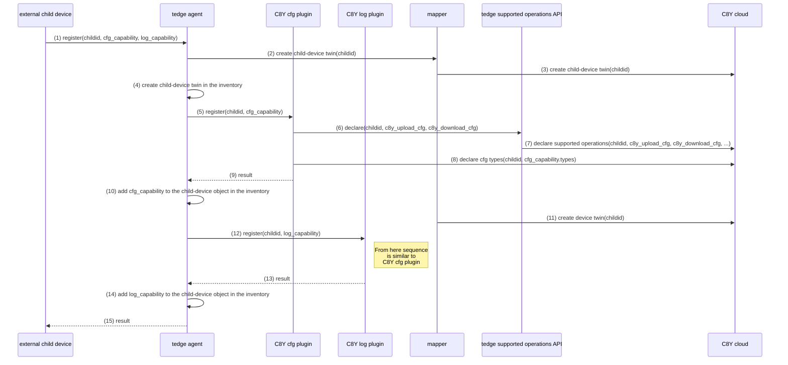

# thin-edge data-model

The **thin-edge data-model** is used to represent all device-related information.
It covers the thin-edge device itself, as well as other _external devices_ connected to thin-edge.
Each device is represented with a data **object**. 
Each data **object** can have different **fields**. 
The following JSON code shows a small example of a device data **object**:
         
          {
              "name": "thin-edge device",
              "type": "thin-edge.io"
          }

**thin-edge** manages an **inventory** to store and provide all those objects. 

The figure below illustrats the **data-model** objects and the **inventory**:


* The **thin-edge Device** object represents the device it-self, that runs **thin-edge** and manages that **inventory**.
  That objects has the fields `name` and `type` that contains the device-name and device-type visible in the cloud.

* A **Child-Device** object could be exist more than once in the inventory. 
  Each **Child-Device** object represents an _external device_ (e.g. sensor, actuator, PLC, any other kind of device) that is connected to the thin-edge device.
  * Each **child-device** object is assocoiated with a separate individual device in the cloud. 
  * Similar to the **thin-edge Device** object, each **child-device** object has the fields `name` and `type`.
    In addition, each **child-device** object has a field `childid`, that contains a unique ID to address that child-device. 
  * NOTE: Not just _external devices_, but also processes running on the thin-edge device itself, can be represented with a **child-device** object in the **inventory** - to treat them as __logical child-devices__.

* Each **Capability** object represents a functionality a device is capable.
  * A capability could be by example _Configuration Management_, _Log file Management_ or _Software Management_, or any custom specific capability provided by a custom specific plugin.
  * The **Capability Object** contains all information that the software component implementing the given capability needs to know, to process and provide that given capability to the corresponding device.
    * Each capability has a very specific set of information to be known. Thus the content and structure of each **capability object** is specific to the capability it represents.
    * A scheme that defines the content and structure per capability is namely the **Capability Type**. 
    * The **Capability Type** is nothing implemented in code, but the way to document and standardize the content and structure of **Capability Objects** for a certain capability.
    * There are **Capability Types** defined for _Configuration Management_, _Log file Management_ or _Software Management_. More details see section below [Capability Types](#capability-types).
  * A device object can contain several **capability** objects.

## Capability Types

**Capability Types** are schemas that describe the content and structure all **capability objects** in the inventory. 
  * The **Capability Type** is nothing implemented in code, but the way to document and standardize the content and structure of **capability objects** for a certain capability.

  * For each capability the needed content and structure of it's **capability object** is very specific. So each capability (e.g. _Configuration Management_, _Log file Management_ or _Software Management_, or any custom specific capability provided by a custom specific plugin) has it's own **capability type** 

  * The structure of **Capability Types** is as below:
    * A **capability type** has a unique name, e.g. `tedge_config`, `tedge_log` or `tedge_software`.
    * A **capability type** defines a set of fields that are expected to be contained in the inventorie's **capability** object.
  * **thin-edge** has a set of defined **capability types**.
  * Each plugin can define plugin-specific capability types, or can use one of the defined capability type.
  * For details about all capabilities defined by thin-edge see [Defined Capability Types](#defined-capability-types) see section below.

### Defined Capability Types

That section lists the defined **capabilities types**.

* Capability Type: **Configration Management**

  |                      |                     | 
  |:---------------------|:--------------------|
  | **Unique name**      | `tedge_config` |
  | **Field:**`files`    | List of config-files the device provides. Per config file there are the fields as below:<br/><br/>-  `path`, full path to the file in the filesystem. If that field is not set, tedge_agent's HTTP-filetransfer is used to read/write the file.<br/>- `type`, an optional configuration type. If not provided, the path is used as type. If path is not set then `type` is mandatory.<br/>- optional unix file ownership: `user`, `group` and octal `mode`. These are only used when `path` is set, and a configuration file pushed from the cloud doesn't exist on the device|
  | **Behavoiur**        | On cloud request<br/>-  provided configuration files are requested from the device and sent to the cloud<br/>- or downloaded from the cloud and sent to the device.<br/><br/> For details see [Configuration Managenement documentation](../references/c8y-configuration-management.md#configuration-files-for-child-devices)

Examples:
```json
"tedge_config": {
    "files": [
        { "path": "/etc/tedge/tedge.toml", "type": "tedge.toml" },
        { "path": "/etc/tedge/mosquitto-conf/c8y-bridge.conf" },
        { "path": "/etc/tedge/mosquitto-conf/tedge-mosquitto.conf" },
        { "path": "/etc/mosquitto/mosquitto.conf", "type": "mosquitto", "user": "mosquitto", "group": "mosquitto", "mode": "0o644" }
    ]
}
```
```json
"tedge_config": {
    "files": [
        { "type": "foo.conf" },
        { "type": "bar.conf" },
    ]
}
```

* Capability Type: **Logging Management**

  |                      |              | 
  |:---------------------|:-------------|
  | **Unique name**      | `tedge_log`  |
  | **Field:** `files`   | TODO |
  | **Behavoiur**        | TODO |

The following JSON code shows a small example of an **capability** objects in a device object:
         
          {
              "name": "child-device 1",
              "type": "thin-edge.io-child",
              "capabilities": {
                  "tedge_config": {
                      "files": [ "foo.conf", "bar.conf" ]
                  },
                  "tedge_log": {
                      // ...
                  },
              }
          }

## Registration of a new device

The sequence diagram below illustrates the data/message flow and all components involved, when a new external child-device registers it-self to thin-edge.



* Step 1: The external child-device registers to the tedge_agent
     * Topic:   `tedge/<childid>/commands/req/inventory/register-device`<br/>
       Payload: `<child-device object>`
     * Example: 
     
       Topic: `tedge/child1/commands/req/inventory/register-device`<br/>
       Payload: 
       ```json
       {
          "name": "child-device 1",
          "type": "thin-edge.io-child",
          "capabilities": {
              "tedge_config": {
                  "files": [ "foo.conf", "bar.conf" ]
              },
              "tedge_logging": {
                  "files": [ "foo.log", "bar.log" ]
              }
          }
       }
       ```

 * Step 5: the tedge_agent notifies the plugin that provides the `tedge_config` capability (i.E. C8Y Config Plugin) about the new child-device
     * Topic:   `tedge/<childid>/commands/req/plugin/<capability type>/new-device`<br/>
       Payload: `<capability object>`
       
     * Example: 
     
       Topic: `tedge/child1/commands/req/plugin/tedge_config/new-device`<br/>
       Payload: 
       ```json
       {
          "files": [ "foo.conf", "bar.conf" ]
       }
       ```
       
 * Step 9: config plugin reports result the tedge_agent
       
     * Topic: `tedge/child1/commands/res/plugin/tedge_config/new-device`<br/>
       Payload: `<"success" or "failed">`
       
 * Step 12: the tedge_agent notifies the plugin that provides the `tedge_logging` capability (i.E. C8Y Log Plugin) about the new child-device
     * Example: 
     
       Topic: `tedge/child1/commands/req/plugin/tedge_logging/new-device`<br/>
       Payload: 
       ```json
       {
          "files": [ "foo.log", "bar.log" ]
       }
       ```
       
 * Step 13: log plugin reports result the tedge_agent
       
     * Topic: `tedge/child1/commands/res/plugin/tedge_logging/new-device`<br/>
       Payload: `<"success" or "failed">`

 * Step 15: tedge_agent reports result to External Child-Device
     * Topic:   `tedge/<childid>/commands/res/inventory/register-device`<br/>
       Payload: 
       ```json
       {
          "device-status": "<success> or <failed>", 
             "capabilities": {
                "name of 1st capability": "<success> or <failed>",
                "name of 2nd capability": "<success> or <failed>",
                "name of ... capability": "<success> or <failed>"
             }
       }
       ```
     * Example: 
     
       Topic: `tedge/child1/commands/res/inventory/register-device`<br/>
       Payload: 
       ```json
       {
          "device-status": "success",
          "capabilities": {
              "tedge_config": "success",
              "tedge_logging": "success"
          }
       }
       ```
       
### Summary of MQTT topics and payload

From external child-device to tedge_agent:
```
tedge/<childid>/commands/req/inventory/register-device  <= <device object>
tedge/<childid>/commands/req/inventory/register-device  <= { "device-status": <"success" or "failed">, 
                                                             "capabilities": {
                                                                <for each capability:
                                                                   <capability name>: <"success" or "failed">,
                                                             }
                                                           }
```

From tedge_agent to plugins:
```
tedge/<childid>/commands/req/plugin/<capability name>/new-device  <= <capability object>  
tedge/<childid>/commands/res/plugin/<capability name>/new-device  <= { "status": <"executing" or "success" or "failed"> } 
```         

