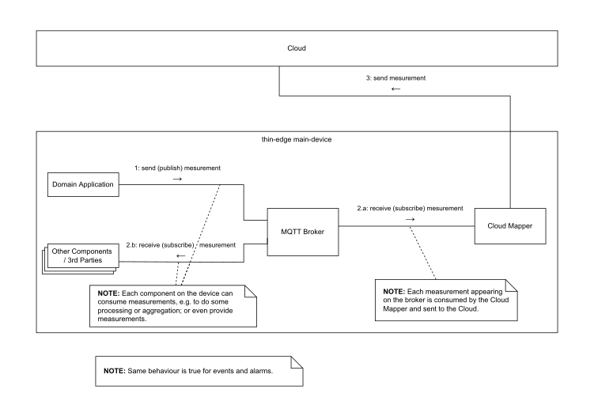

# thin-edge Data Model

The **data model** identifies all data send or received from/to **thin-edge** and its components, to interact with those.
For all data it defines format and explains behaviour.

## Telemetry Data

**Telemetry Data** consists of **measurements**, **events** and **alarms**. Each is defined by a set of data-elements, each with specific behaviour.

### Measurements
  * **measurements** carry values from physical **Sensors**[^1] or a device's **Domain Application**[^1];
    e.g. voltage and current of an electricity meter, or current state of the manufacturing control process
  * **elements of a measurement:**
    - `type name`, a string that identifies the measurement uniquely in context of a device
    - `samples`, carry a single value or set of values, all taken at a single point in time
      - `values` can be a mix of numbers, strings or booleans
        - optionally each value can have a `type name`
      - `timestamp` (conform to ISO 8601), that indicates when values were sampled;
         when not provided, thin-edge.io uses the current system time as the time of the sample
  * **behaviour of a measurement:**
    - thin-edge does not store any historical sampled values for measurements
    - there is no initialization value for measurements; i.e. a measurement is not visible on thin-edge before the 1st sample was sent to thin-edge

### Events
  * **events** are notifications that something happened on a device's environment or software system;
    e.g. a sensor[^1] detected something like a door has been closed,
    or a system notification that e.g. a user has started an ssh session
  * **elements of an event:**
    - `type name`, a string that identifies the event uniquely in context of a device
    - `event text`, that carries a human readable event-message
      - must be UTF-8 encoded
    - `timestamp` (conform to ISO 8601), that indicates when the event has occured;
      when not provided, thin-edge.io uses the current system time as the time of the event
    - an event can optionally contain any custom-specific extra-information
  * **behaviour of an event:**
    - thin-edge does not store any historical occurrences for events

### Alarms
  * **alarms** are notifications about some critical behaviour of the device's environment or software system;
    e.g. when a temperature sensor detects a temperature went out of its valid range
  * **elements of an alarm:**
    - `type name`, a string that identifies the alarm uniquely in context of a device
    - alarm text, that carries an alarm message
      - must be UTF-8 encoded
    - severity, that is one of  `critical`, `major`, `minor` or `warning`
    - `timestamp` (conform to ISO 8601), that indicates when the alarm has occured;
      when not provided, thin-edge.io uses the current system time as the time of the alarm
    - an alarm can optionally contain additional custom information
  * **behaviour of an alarm:**
    - thin-edge does not store any historical occurrences for alarms
    - **alarms** are stateful; i.e. once raised, an **alarm** is active until it was explicitly cleared by the device's software or the cloud

[^1]: details see "Domain Model" appendix [Device Domain](./domain-model.md#device-overview) -->

## Use of MQTT

**thin-edge** expects the MQTT broker [mosquitto](https://mosquitto.org/) to be available on the device.
**thin-edge** uses **mosquitto** to consume and provide telemetry data. All telemetry data are reflected with specific MQTT topics and payload in JSON format.

**thin-edge** assumes **mosquitto** is configured in a secure manner, to avoid any inappropriate access to **thin-edge** topics and payload.
Any malicious access to the broker can hazard **thin-edge** and all connected devices. Mosquitto provides a wide range of authentication and access control options. For more details see _Authentication_ and _ACL_ (Access Control List) in [mosquitto documentation](https://mosquitto.org/man/mosquitto-conf-5.html).

### Telemetry Data

All telemetry data (**Measurments**, **Events**, **Alarms**) are reflected with MQTT topics, where each has it's specific subtopic (e.g. `tedge/measurements` or `tedge/events`).

  * each provider of a **measurement**, **event** or **alarm** sends the occuring data to **thin-edge's** MQTT broker
    * a provider can be the domain application[^1], other SW components / 3rd parties
  * all processes (e.g. the domain application[^1], other SW components / 3rd parties) on the main-device and all child-devices can consume those telemetry data from the MQTT broker
  * the cloud mapper on the **main-device** picks-up _all_ telemetry data from the MQTT broker and transfers those to the cloud

The communication diagram below illustrates that behaviour.




#### Measurements
  * topic `tedge/measurements/<type_name>`
    - NOTE: "type_name" not (yet) accepted in payload with current implementation
  * payload format:
```javascript
   {
     /* that JSON object represents a sample */
     "<value1_name>": /* <value1> */,
     "<value2_name>": /* <value2> */,
     /* ... */
     
     "time": /* timestamp in ISO 8601 format */
   }
```
  * payload example:
```javascript
   {
     "temperature": 25,
     "pressure": 98,
     "time": "2020-10-15T05:30:47+00:00",
   }
```
  * MQTT retain flag: A measurement should never be published as retain message.
                      That is as a single retained measurement might be consumed
                      and processed more than once by a consuming software
                      component (e.g. when that software component restarts and
                      subscribes again).

#### Events
  * topic `tedge/events/<type_name>`
  * payload:
```javascript
   {
     "text": /* <event text> */,
     "time": /* timestamp in ISO 8601 format */
   }
```
  * payload example:
```javascript
{
    "text": "A user just logged in",
    "time": "2021-01-01T05:30:45+00:00"
}
```
  * MQTT retain flag: An event should never be published as retain message.
                      That is as a single retained event might be consumed
                      and processed more than once by a consuming software
                      component (e.g. when that software component restarts
                      and subscribes again).


#### Alarms
  * topic `tedge/alarms/<type_name>`
  * payload:
```javascript
   {
     "text": /* <alarm text> */,
     "time": /* timestamp in ISO 8601 format */
   }
```
  * payload example:
```javascript
{
    "text": "Temperature is very high",
    "time": "2021-01-01T05:30:45+00:00"
}
```
  * MQTT retain flag: All alarms shall be published as retain message to
                      reflect the alarm's stateful behaviour in the broker.
                      The retain messages is kept in the MQTT broker as long
                      as the alarm is raised.
                      When a raised alarm is gone again, an empty retain message
                      shall be published to clear the alarm message in the broker.

