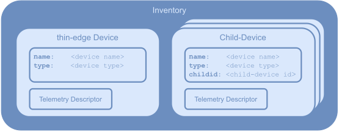
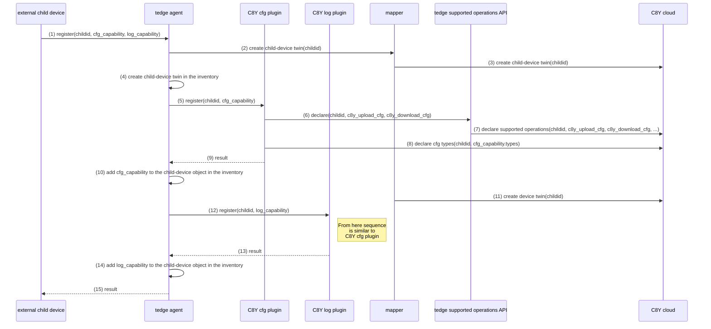

# thin-edge data-model

The **thin-edge data-model** is used to represent all device-related information.
It covers the thin-edge device itself, as well as other _external devices_ connected to thin-edge.
Each device is represented with a data **object**. 
Each data **object** can have different **fields**. 
The following JSON code shows a small example of a device data **object**:
         
          {
              "name": "thin-edge device",
              "type": "thin-edge.io"
          }

**thin-edge** manages an **inventory** to store and provide all those objects. 

The figure below illustrats the **data-model** objects and the **inventory**:



* The **thin-edge Device** object represents the device it-self, that runs **thin-edge** and manages that **inventory**.
  That objects has the fields `name` and `type` that contains the device-name and device-type visible in the cloud.

* A **Child-Device** object could be exist more than once in the inventory. 
  Each **Child-Device** object represents an _external device_ (e.g. sensor, actuator, PLC, any other kind of device) that is connected to the thin-edge device.
  * Each **child-device** object is assocoiated with a separate individual device in the cloud. 
  * Similar to the **thin-edge Device** object, each **child-device** object has the fields `name` and `type`.
    In addition, each **child-device** object has a field `childid`, that contains a unique ID to address that child-device. 
  * NOTE: Not just _external devices_, but also processes running on the thin-edge device itself, can be represented with a **child-device** object in the **inventory** - to treat them as __logical child-devices__.

* Each **Capability** object represents a functionality a device is capable.
  * Each **Capability** object is of one the of supported **Capanbilities Types** (e.g. `tedge_config`, `tedge_logging`, `tedge_software`). More details see section below [Capability Types](#capability-types).

  * A device **object** can contain several **capability** objects.

## Capability Types

**Capability types** define the contract between a device and a plugin. That contract must be implemented by both parties (device and plugin). **thin-edge** does not interpret the content of any **capability** object, but forwards it to the coresponding plugin, and stores it in the device object in the inventory.<br/>
NOTE: Some **Capabilities Types** are implemented by built-in thin-edge components (e.g. Software Management). In that case there is no plugin, but the built-in thin-edge component gets the **capability** object fordwarded, and implements that contract.

The structure of **Capability Types** is as below:
* A **capability type** has a unique name and a set of fields that are expected in the coresponding capability object.
* Each **capability** object in the inventory is of one of a supported **capability type**.

The following JSON code shows a small example of an object of **capability type** `tedge_config` in a device object:
         
          {
              "name": "child-device 1",
              "type": "thin-edge.io-child",
              "capabilities": {
                  // find below a capability object of type 'tedge_config'
                  "tedge_config": {
                      "files": [ "foo.conf", "bar.conf" ]
                  }
              }
          }

**thin-edge** as well as installed plugins use those **capability** objects to provide the right **capabilities** to the right devices.
Furthermore all needed information for the certain **capability** are contained in the **capability** object.

Example:

* The configuration management plugin provides the capability `tedge_config`. 
* The configuration management plugin recognizes (or gets a request for) a **capability** object for the corresponding device, and processes configuration management for that devices.
  
  **Open Topic:** To be decided how the **capability** object comes to the plugin. 
  * Shall the plugin listen (subscribe) to the inventory, and by itself process any incoming/changed **capability** object?
  * Better to have an explicit request/response from some inventory owner (e.g. the tegde_agent) to the plugin, 
    to register a new **capability** object for a certain device?
* Each capability object `tedge_config` contains the field `files`, that tells the plugin the list of config-file the corresponding device provides.

**thin-edge** has a set of pre-defined **capability types**. 
Each plugin can define plugin-specific capability types, or use one of the pre-defined capability type.
For details about all [Pre-defined Capability Types](#pre-defined-capability-types) see section below.

### Pre-defined Capability Types

That section lists the pre-defined **capabilities types**.

* Capability Type: **Configration Management**

  |                      |                     | 
  |:---------------------|:--------------------|
  | **Unique name**      | `tedge_config` |
  | **Field:**`files`    | List of config-files the device provides. Per config file there are the fields as below:<br/>-  `path`, full path to the file in the filesystem. If that field is not set, tedge_agent's HTTP-filetransfer is used to read/write the file.<br/>- `type`, an optional configuration type. If not provided, the path is used as type.<br/>- optional unix file ownership: `user`, `group` and octal `mode`. These are only used when `path` is set, and a configuration file pushed from the cloud doesn't exist on the device|
  | **Behavoiur**        | On cloud request provided configuration files are requested from the device and sent to cloud; or downloaded from cloud and sent to the device. For details see [Configuration Managenement documentation](../references/c8y-configuration-management.md#configuration-files-for-child-devices)

* Capability Type: **Logging Management**

  |                      |              | 
  |:---------------------|:-------------|
  | **Unique name**      | `tedge_log`  |
  | **Field:** `files`   | List of log-files the device provides |
  | **Behavoiur**        | One cloud request provided log-files are requested from the device and sent to cloud. Details see TODO: add link to log plugin documentation, section for child-devices.

The following JSON code shows a small example of an **capability** objects in a device object:
         
          {
              "name": "child-device 1",
              "type": "thin-edge.io-child",
              "capabilities": {
                  "tedge_config": {
                      "files": [ "foo.conf", "bar.conf" ]
                  },
                  "tedge_log": {
                      // ...
                  },
              }
          }

## Registration of a new device

The sequence diagram below illustrates the data/message flow and all components involved, when a new external child-device registers it-self to thin-edge.



* Step 1: The external child-device registers to the tedge_agent
     * Topic:   `tedge/<childid>/commands/req/inventory/register-device`<br/>
       Payload: `<child-device object>`
     * Example: 
     
       Topic: `tedge/child1/commands/req/inventory/register-device`<br/>
       Payload: 
       ```json
       {
          "name": "child-device 1",
          "type": "thin-edge.io-child",
          "capabilities": {
              "tedge_config": {
                  "files": [ "foo.conf", "bar.conf" ]
              },
              "tedge_logging": {
                  "files": [ "foo.log", "bar.log" ]
              }
          }
       }
       ```

 * Step 5: the tedge_agent notifies the plugin that provides the `tedge_config` capability (i.E. C8Y Config Plugin) about the new child-device
     * Topic:   `tedge/<childid>/commands/req/plugin/<capability type>/new-device`<br/>
       Payload: `<capability object>`
       
     * Example: 
     
       Topic: `tedge/child1/commands/req/plugin/tedge_config/new-device`<br/>
       Payload: 
       ```json
       {
          "files": [ "foo.conf", "bar.conf" ]
       }
       ```
       
 * Step 9: config plugin reports result the tedge_agent
       
     * Topic: `tedge/child1/commands/res/plugin/tedge_config/new-device`<br/>
       Payload: `<"success" or "failed">`
       
 * Step 12: the tedge_agent notifies the plugin that provides the `tedge_logging` capability (i.E. C8Y Log Plugin) about the new child-device
     * Example: 
     
       Topic: `tedge/child1/commands/req/plugin/tedge_logging/new-device`<br/>
       Payload: 
       ```json
       {
          "files": [ "foo.log", "bar.log" ]
       }
       ```
       
 * Step 13: log plugin reports result the tedge_agent
       
     * Topic: `tedge/child1/commands/res/plugin/tedge_logging/new-device`<br/>
       Payload: `<"success" or "failed">`

 * Step 15: tedge_agent reports result to External Child-Device
     * Topic:   `tedge/<childid>/commands/res/inventory/register-device`<br/>
       Payload: 
       ```json
       {
          "device-status": "<success> or <failed>", 
             "capabilities": {
                "name of 1st capability": "<success> or <failed>",
                "name of 2nd capability": "<success> or <failed>",
                "name of ... capability": "<success> or <failed>"
             }
       }
       ```
     * Example: 
     
       Topic: `tedge/child1/commands/res/inventory/register-device`<br/>
       Payload: 
       ```json
       {
          "device-status": "success",
          "capabilities": {
              "tedge_config": "success",
              "tedge_logging": "success"
          }
       }
       ```
       
### Summary of MQTT topics and payload

From external child-device to tedge_agent:
```
tedge/<childid>/commands/req/inventory/register-device  <= <device object>
tedge/<childid>/commands/req/inventory/register-device  <= { "device-status": <"success" or "failed">, 
                                                             "capabilities": {
                                                                <for each capability:
                                                                   <capability name>: <"success" or "failed">,
                                                             }
                                                           }
```

From tedge_agent to plugins:
```
tedge/<childid>/commands/req/plugin/<capability name>/new-device  <= <capability object>  
tedge/<childid>/commands/res/plugin/<capability name>/new-device  <= { "status": <"executing" or "success" or "failed"> } 
```         

