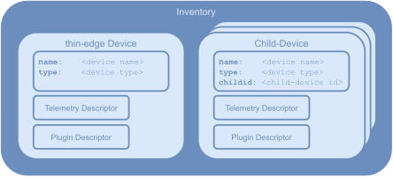

# thin-edge data-model

The **thin-edge data-model** is used to represent all device-related information.
It covers the thin-edge device itself, as well as other _external devices_ connected to thin-edge.
Each device is represented with a data **object**. 
Each data **object** can have different **fields**. 
The following JSON code shows a small example of a device data **object**:
       
```json
          {
              "name": "thin-edge device",
              "type": "thin-edge.io"
          }
```

**thin-edge** manages an **inventory** to store and provide all those objects. 

The figure below illustrats the **data-model** objects and the **inventory**:



* The **thin-edge Device** object represents the device it-self, that runs **thin-edge** and manages that **inventory**.
  That objects has the fields `name` and `type` that contains the device-name and device-type visible in the cloud.

* A **Child-Device** object could be exist more than once in the inventory. 
  Each **Child-Device** object represents an _external device_ (e.g. sensor, actuator, PLC, any other kind of device) that is connected to the thin-edge device.
  * Each **child-device** object is assocoiated with a separate individual device in the cloud. 
  * Similar to the **thin-edge Device** object, each **child-device** object has the fields `name` and `type`.
    In addition, each **child-device** object has a field `childid`, that contains a unique ID to address that child-device.
  * NOTE: Not just _external devices_, but also processes running on the thin-edge device itself, can be represented with a **child-device** object in the **inventory** - to treat them as __logical child-devices__.

* Each **Capability** object represents a functionality a device is capable.
  * A capability could be by example _Configuration Management_, _Log file Management_ or _Software Management_, or any custom specific capability provided by a custom specific plugin.
  * The **Capability Object** contains all information that the software component implementing the given capability needs to know, to process and provide that given capability to the corresponding device.
    * Each capability has a very specific set of information to be known. Thus the content and structure of each **capability object** is specific to the capability it represents.
    * A scheme that defines the content and structure per capability is namely the **Capability Type**. 
    * The **Capability Type** is nothing implemented in code, but the way to document and standardize the content and structure of **Capability Objects** for a certain capability.
    * There are **Capability Types** defined for _Configuration Management_, _Log file Management_ or _Software Management_. More details see section below [Capability Types](#capability-types).
  * A device object can contain several **capability** objects.

## Capability Types

**Capability Types** are schemas that describe the content and structure all **capability objects** in the inventory. 
  * The **Capability Type** is nothing implemented in code, but the way to document and standardize the content and structure of **capability objects** for a certain capability.

  * For each capability the needed content and structure of it's **capability object** is very specific. So each capability (e.g. _Configuration Management_, _Log file Management_ or _Software Management_, or any custom specific capability provided by a custom specific plugin) has it's own **capability type** 

  * The structure of **Capability Types** is as below:
    * A **capability type** has a unique name, e.g. `tedge_config`, `tedge_log` or `tedge_software`.
    * A **capability type** defines a set of fields that are expected to be contained in the inventorie's **capability** object.
  * **thin-edge** has a set of defined **capability types**.
  * Each plugin can define plugin-specific capability types, or can use one of the defined capability type.
  * For details about all capabilities defined by thin-edge see [Defined Capability Types](#defined-capability-types) see section below.

### Defined Capability Types

That section lists the defined **capabilities types**.

* Capability Type: **Configration Management**

  |                      |                     | 
  |:---------------------|:--------------------|
  | **Unique name**      | `tedge_config` |
  | **Field:**`files`    | List of config-files the device provides. Per config file there are the fields as below:<br/><br/>-  `path`, full path to the file in the filesystem. If that field is not set, tedge_agent's HTTP-filetransfer is used to read/write the file.<br/>- `type`, an optional configuration type. If not provided, the path is used as type. If path is not set then `type` is mandatory.<br/>- optional unix file ownership: `user`, `group` and octal `mode`. These are only used when `path` is set, and a configuration file pushed from the cloud doesn't exist on the device|
  | **Behavoiur**        | On cloud request<br/>-  provided configuration files are requested from the device and sent to the cloud<br/>- or downloaded from the cloud and sent to the device.<br/><br/> For details see [Configuration Managenement documentation](../references/c8y-configuration-management.md#configuration-files-for-child-devices)

Examples:
```json
"tedge_config": {
    "files": [
        { "path": "/etc/tedge/tedge.toml", "type": "tedge.toml" },
        { "path": "/etc/tedge/mosquitto-conf/c8y-bridge.conf" },
        { "path": "/etc/tedge/mosquitto-conf/tedge-mosquitto.conf" },
        { "path": "/etc/mosquitto/mosquitto.conf", "type": "mosquitto", "user": "mosquitto", "group": "mosquitto", "mode": "0o644" }
    ]
}
```
```json
"tedge_config": {
    "files": [
        { "type": "foo.conf" },
        { "type": "bar.conf" },
    ]
}
```

* Capability Type: **Logging Management**

  |                      |              | 
  |:---------------------|:-------------|
  | **Unique name**      | `tedge_log`  |
  | **Field:** `files`   | TODO |
  | **Behavoiur**        | TODO |


## Inventory API

The inventory is reflected on the MQTT bus under the topic `tedge/inventory`.

* Each device object has it own topic: `/tedge/inventory/<device id>`
* The `device id` is the `childid` of the **child-device** object, or `main` for the **thin-edge device** object.
* The payload contains all fields of the device object in JSON format.
* Example:
   * topic: `/tedge/inventory/main`
   * payload:
```json
     {
        "name": "thin-edge device",
        "type": "thin-edge.io"   
     }
```
* The next level of the topic structure containes the **capability** objects per device:<br/>
  `/tedge/inventory/<device id>/<capability type>`
* Example:
   * topic: `/tedge/inventory/main/tedge_config`
   * payload:
```json
     {
        "files": [
           { "path": "/etc/tedge/tedge.toml", "type": "tedge.toml" },
           { "path": "/etc/tedge/mosquitto-conf/c8y-bridge.conf" },
           { "path": "/etc/tedge/mosquitto-conf/tedge-mosquitto.conf" },
           { "path": "/etc/mosquitto/mosquitto.conf", "type": "mosquitto", "user": "mosquitto", "group": "mosquitto", "mode": "0o644" }
        ]
     }
```
* All messages to `tedge/inventory` and below are published as retain messages.
  So one who is interested in any object of the inventory can just subscribe to the object's topic and gets directly the object, if it is available in the inventory.


## Registration of a new device

The sequence diagram below illustrates the data/message flow and all components involved, when a new external child-device registers it-self to thin-edge.


* Step 1: The external child-device registers to the tedge_agent
     * Topic:   `tedge/<childid>/commands/req/inventory/register-device`<br/>
       Payload: **child-device** object with **capability** objects
     * Example: 
     
       Topic: `tedge/child1/commands/req/inventory/register-device`<br/>
       Payload: 
       ```json
       {
          "name": "child-device 1",
          "type": "thin-edge.io-child",
          "capabilities": {
              "tedge_config": {
                  "files": [ "foo.conf", "bar.conf" ]
              },
              "tedge_logging": {
                  "files": [ "foo.log", "bar.log" ]
              }
          }
       }
       ```
 
 * Step 2: the tedge_agent creates the **child-device** object and **capability** objects in the inventory on the MQTT bus.
     * Creating **child-device** object
       * Topic: `tedge/inventory/<childid>`
       * Payload: `<child-device object>`
     * Example:  
       * Topic: `tedge/inventory/child1`
       * Payload: 
       ```json
       {
          "name": "child-device 1",
          "type": "thin-edge.io-child"
       }
       ```
     * Creating **capability** objects
       * Topic: `tedge/inventory/<childid>/<capability type>`
       * Payload: `<capability object>`
     * Example 1:  
       * Topic: `tedge/inventory/child1/tedge_config`
       * Payload: 
       ```json
       {
          "files": [ "foo.conf", "bar.conf" ]
       }
       ```
     * Example 2:  
       * Topic: `tedge/inventory/child1/tedge_logging`
       * Payload: 
       ```json
       {
          "files": [ "foo.log", "bar.log" ]
       }
       ```
 
 * Step 4: mapper has subscribed to `tedge/inventory/+`, and receives the new **child-device** object.

 * Step 6: CY8 cfg plugin has subscribed to `tedge/inventory/+/tedge_config` and receives the new **capability** object for type `tedge_config`.

 * Step 10: CY8 log plugin has subscribed to `tedge/inventory/+/tedge_logging` and receives the new **capability** object for type `tedge_logging`.
