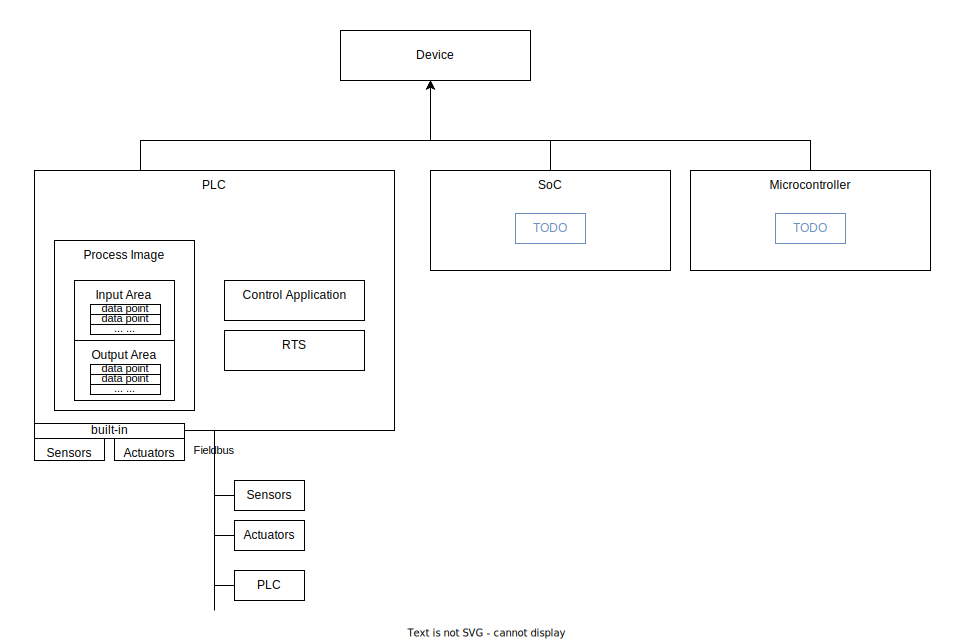
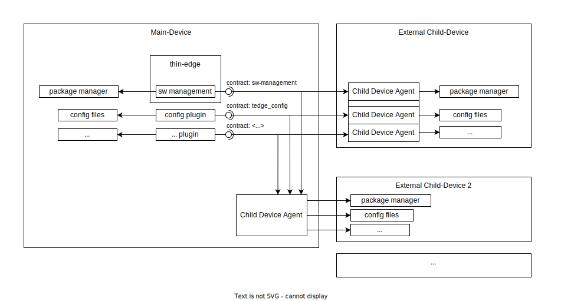

# thin-edge Domain Model

The following section describes the relevant aspects and entities of the **thin-edge** domain.

**thin-edge** is designed to facilitate IoT functionality to resource constrained **devices**.
The focus is on industrial OT **devices** or any other kind of embedded **device**.
It is not reduced to **devices** that are capable to install and run thin-edge, but includes also **devices** that need another _(gateway) device_ aside, that executes thin-edge.

As the figure below illustrates, those **devices** can by **PLCs**, or any kind of **SoC-based** or **Microcontroller-based** Embedded Systems.

* **PLC** (**P**rogrammable **L**ogic **C**ontroller):
  A PLC is specialized hardware that has been designed to control manufacturing processes.
  Its hardware has been ruggedized to operate in harsh electrical, thermic and mechanical industrial environments. 
  * The **Control Application** is a program, usually written by an **Automation Engineer** in a domain specific graphical programming language (e.g. "Ladder Diagram" or "Function block diagram"). 
    * It is developed with a specific Development Software on a PC (e.g. __STEP 7__ or __CODESYS__), and downloaded to the PLC.
  * The **RTS** (**R**un **T**ime **S**ystem) is the basic software component on a PLC, that
    * receives and accepts the **Control Application** from the Development Software on a PC
    * manages and observes the cyclic execution of the **Control Application**
  * **Sensors** and **Actuators** enable the PLC to observe and control physical behaviours on the shopfloor.
    * can built-in in the PLC device, 
      or connected to the PLC via some **Fieldbus** (e.g. Modbus, CANopen, PROFINET, EtherCAT, ...)
    * can be simple inputs/outputs (as digital signals from a light barrier, or analouge values like temperature or pressure);
      or complex equipments as robotic arms or other PLCs
  * The **Process Image** is a block in the memory, that reflects inputs and outputs of all connected **Sensors** and **Actuators**
    * it contains an _input area_ and an _output area_, where both areas are arrays of **data points**
    * each **data point** carries a value of an input or output
    * it is managed by the RTS during the cyclic execution of the **Control Application**, as steps below:
      * Step 1: RTS reads all inputs from Sensor's and Actuator's, and stores all read input values to the **Process Image's** _input area_ 
      * Step 2: RTS executes once the control application, that operates on the **Process Image's** _input_ and _output area_
      * Step 3: RTS reads all output values from the **Process Image's** _output area_, and writes all read values to Sensor's and Actuator's
      * then, next cycle starts with Step 1

* **SoC**-based (**S**ystem **o**n **C**hip) Embedded System:
  * TODO

* **Microcontroller**-based Embedded System:
  * TODO

## thin-edge device concept

**thin-edge** facilitates IoT functionality to the device it is running on, as well as to devices that are connected to that device.
All devices are categorized as below:
  * the **main-device** is the device thin-edge is running on
  * all devices connected to the **main-device** are referred as **external child-devices**
  * each device has a unique **device-id**

## thin-edge data concepts

**thin-edge** provides different devices in a standardized representation to the cloud. Therefore **thin-edge** provides different kinds of data concepts.

  * **Measurements**:
    * contain numeric data produced by sensors (like temperature readings) or calculated data based on information from the **control application**.
    * a **measurements** consists of one or more numeric **data points** and optionally meta information as names or units
  * **Variables**:
    * contain numeric data provided and used by the device, and can be sent to the device (as e.g. "set points")
    * a **variable** consists of one or more numeric **data points** and optionally meta information as names or units
  * **Events**:
    * contain other real-time information from the sensor network, such as the triggering of a door sensor
    * an **event** is triggered by a **data point** (e.g. when it changes to a specific value as `0` or `1`), and contains an optional message text.
  * **Alarms**:
    * similar to Events, but the user or operator of the system has to take action to resolve the alarm
    * an **alarm** is triggered by a **data point** (e.g. when it changes to a specific value as `0` or `1`), and contains an optional alarm text.

## thin-edge plugins and capabilities

**thin-edge** realizes high level cloud functionality (e.g. _configuration management_ or _log management_) with **plugins**.
  * a **plugin** accesses _ressources_ and _services_ of the device, as e.g.
      * the _package manager_ is accessed by _software managemennt_
      * _configuration files_ are accessed by _configuration management_
  * a **plugin** can be an (external) executable (e.g. as the `c8y_configuration_plugin` for _configuration management_)
    or a thin-edge built-in software component (e.g. as for _software management_)
  * usually a **plugin** runs on the **main-device**; thus it can access the _resources_ of the **main-device** directly
  * to access _ressources_ of an **external child-device** a **plugin** needs another component, referred as **child-device agent**
    * a **child-device agent** is the counterpart of a **plugin**, that takes the responsibility to access to the **external child-device's** _resources_
    * a **child-device agent** can be installed and executed on the **external child-device**, or on the **main-device**
      * if it runs in the **external child-device** it can access the _resources_ directly
      * if it runs on the **main-device** it can use any (low-level) interfaces the **external child-device** provides to access those resources
        * One main reason to install the **child-device agent** on the **main-device** is, when the **external child-device** cannot or shall not be altered.
    * a **child-device agent** must interact with the **plugin**, based on the **protocol** defined by the **plugin**;
      that could be e.g.:
      * to listen and react to requests of the **plugin**, e.g. on MQTT
      * to provide/consume files to/from the **plugin** on purpose, e.g. via HTTP

A **plugin** can be described with a **capability**.
   * a **capability** has a unique name, that references the **plugin** it describes (e.g. `tedge_config`)
   * a **capability** implicitely claims the **protocol** the **plugin** defines
   * whenever a **plugin** provides the same **capability** as a **child-device agent** supports, both are compatible and can interact with each other
   * whenever one **plugin** provides the same **capability** as another one, it can replace the latter
     * e.g. when a `c8y_configuration_plugin` and an `azure_configuration_plugin` provide the same **capability**, each can be replaced with the other one
   * **capabilities** are especially used for provisioning of **external child-devices**, to align and connect all **child-device agent(s)** and the coresponding **plugins**
   * there is a set of _pre-defined_ **capabilities** by thin-edge (e.g. for _configuration management_ or _log management_),
     as well as each custom plugin can define its own custom-specific capabilities

Figure below illustrates the concept of **plugins**, **external child-devices** and **child-device agents**, as described above.

TODO: Capabilities shall also enable to describe a device's supported **measurements**, **variables**, **events** and  **alarms**

TODO: add the inventory to the domain model?

## Main Challenges

* Industrial automation area is very heterogen.
  * Even there are standards like IEC 61131-3 (that standardizes programming lanuages and behaviour) and common Fieldbus protocols, interoperability to industrial controllers and the diversity of peripheral devices from different manufucaters is hard to manage.
* Ressources constraint device hardware
* _Knowledge-Gap_ between OT and IT. Industrial application engineers (the PLC guys) are most often no software developers but experts for the manufacturing process. Instead software developers (e.g. the cloud guys) have less awareness for needs of industrial application engineers and the shopfloor.
* Many PLC sites have restrictected network access (especially in a manufaturing hall).

---------------------------------------------
No yet covered:
* "fragments"
* to be align with vision.md

