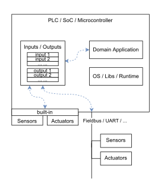

# thin-edge Domain Model

The following section introduces the **thin-edge** domain model.

**thin-edge** is the glue between the **cloud** and **devices**. I.e. it interfaces on the one hand **devices** (especially resource constrained industrial **devices**), and connects on the other hand the **cloud**.
The **cloud** could be some IoT Cloud Platform, as e.g. [Cumulocity](https://www.softwareag.cloud/site/product/cumulocity-iot.html), [Azure](https://azure.microsoft.com) or [AWS](https://aws.amazon.com); or an on-premise "IoT system".

**thin-edge** has been designed with the assumption that the **device** is represented in the **IoT cloud** as **device twin**.
The **device twin** in the IoT cloud is a logical representation of the **device**. As such, it stores the _state_ of the **device**.
Here _state_ refers to e.g. **Telemetry Data** or **Device Management** details as _installed software versions_ or _configurations_.

## Telemetry Data

**Telemetry data** are _measurements_, _events_ and _alarms_ collected or raised by sensors[^1], actuators[^1] or domain applications[^1].

 * **Measurement**:
    * is a single value or set of values, all taken at a single point in time
      * could be a mix of values coming from physical **Sensors**[^1] and the device's **Domain Application**[^1]
      * could be a mix of numbers, strings or booleans
    * has one timestamp
    * releates to one **metric**
    * **thin-edge** puts the measurement into the context of the corresponding **metric** and sends it to the cloud
  * **Metric**, is a time-series of measurements
    * relates to a _source device_ 
      TODO: could the source also be a _process_? (See [comment](https://github.com/thin-edge/thin-edge.io/pull/1195#discussion_r992207078))
    * has a _type name_
    * optionally holds _units_ for the **measurements**
  * **Command**, is a single value or set of values
    * is send from the cloud to one device, e.g. to
      - stimulate an actuator[^1] (e.g. switching a relay)
      - send a signal to the domain application[^1]
      - set one or more set-points[^1] (e.g. upper/lower limits or threshold of a climate control)
    * values could be a mix of numbers, strings or booleans
    * **thin-edge** provides those values to the **domain application**[^1] and **protocol drivers**[^1]
  * **Event**, is a notification that something happened on the device's environment or software system
    * it's source could be
      - a _sensor's[^1] value_ that detected a door has beed closed
      - a signal from the device's domain application[^1]
      - a device's system notification that a user has started an ssh session
    * has one timestamp
    * the meaning of an event related _sensor[^1] value_ or _domain application's[^1] signal_ is very customer specific (could be a change from 0 to 1, a bit in a flag word, ...)
    * a _custom specific sw component_ must know the meaning, and sends an event notification to the **thin-edge** whenever the value signals a raised event
* **Alarm**, similar to **events**; but in addition: 
    * the _End User_ (an operator of the system) has to take action to resolve the **alarm**
    * also the _custom specific sw component_ can send a notification to **thin-edge** to clear an **alarm**  

## Device Management

**Device Management** provides to manage and monitor devices in the field from the cloud.
That includes:
  * **Software Management**:
    * provides to manage the installed software packages on the device, as
      * retrieve list and versions of installed packages
      * install new or update existing software packages
      * remove installed software packages
    * software packages are installable units on the device, as e.g.
      * packages for a Linux Packages Managers (e.g. for Debian, ...)
      * container images (e.g. for Docker)
      * simple ZIP files
      * custom specific files/packages
    * software packages can carry:
      * the **domain application**[^1]
      * parts from **OS / Libs / Runtime**[^1], or the whole thing as one
      * **thin-edge** it-self
* **Configuration Management**:
    * provides to view and change configurations on the device, as
      * list available configurations
      * transfer individual configurations from device to cloud, and vice versa
    * a configuration is a text file or a binary file, as e.g.
      * configuration file(s) of the **domain application**[^1]
      * configuration file(s) of **OS / Libs / Runtime**[^1]
      * configuration file(s) of **thin-edge** it-self
* **Log Management**:
    * provides to view logs from the device
      * lists available logs
      * transfer individual logs from device to cloud
    * a log is a text file, as e.g.
      * log file(s) of the **domain application**[^1]
      * log file(s) of **OS / Libs / Runtime**[^1]
      * log file(s) of **thin-edge** it-self
* **Device Monitoring**:
    * collects metrics (e.g. cpu, memory and disk metrics) from the device and forward these to the IoT cloud
    * allows monitors the health of devices
    * helps to troubleshoot when problems with the device are reported

[^1]: more details see appendix [Device Domain](#device-domain)

## Child-Devices

**thin-edge** facilitates IoT functionality to the device it is running on, as well as to devices that are connected to that device.
  * the device **thin-edge** is running on is referred as the **main-device**
    * **thin-edge** on the **main-device** establishes and manages all communication to the cloud
  * all devices connected to the **main-device** are referred as **external child-devices** 
  * each **external child-device** can be represented in the cloud with it's individual **device twin**
    * a unique **child-id** makes the association between each **external child-device** and it's **device twin**
  * all **telemetry data** and **device managament** functionality can appear in the context of the 
    **external child-device's** individual **device twin**, or the **main-device's** **device twin**
  * also _containers_ or _processes_ running on the **main-devices** can be handled like **external child-device**;
    those are referered then as **logical child-devices**

The figure below illustrates the child-device concept.

## thin-edge device management concept (old)

**thin-edge** realizes cloud's **Device Management** based on **plugins**.
  * a **plugin** encapsulates and manages access to _ressources_ and _services_ of the device, as e.g.
      * _software management_ accesses the device's _package manager_
      * _configuration management_ accesses device's _configuration files_
  * a **plugin** can be
      * an (external) executable (e.g. as the `c8y_configuration_plugin` for _configuration management_)
      * or a thin-edge built-in software component (e.g. as for _software management_)
  * usually a **plugin** runs on the **main-device**; thus it can access the _resources_ of the **main-device** directly
  * to access _ressources_ of an **external child-device** a **plugin** needs another component, referred as **child-device agent**

The figure below illustrates the concept of **plugins** and **child-devices agents**.

### Child-Device Agent
  * a **child-device agent** is the counterpart of a **plugin**, that takes the responsibility to access to the **external child-device's** _resources_
  * a **child-device agent** can also be used on the **main-device**, without appearing in the cloud as child-device, e.g. in order to
    * provide container resources (e.g. config files) to a **plugin** running in another container; by running the **child-device agent** inside the resource's container
    * allow to access _resources_ of the **main-device** somehow differently as the plugin's implementation does
  * a **child-device agent** can serve one or more **plugins**
  * a **child-device agent** can be installed and executed on the **external child-device**, or on the **main-device**
    * if it runs in the **external child-device** it can access the _resources_ directly
    * if it runs on the **main-device** it can use any (low-level) interfaces the **external child-device** provides to access those resources
      * One main reason to install the **child-device agent** on the **main-device** is, when the **external child-device** cannot or shall not be altered.

### Plugin-Contract

A **plugin** defines and implements a specific **contract** for all interactions with a **child-device agent**
  * part of the **contract** could be e.g.:
      * the **child-device agent** must listen and react to certain requests of the **plugin**, e.g. on MQTT
      * the **child-device agent** must provide/consume files to/from the **plugin** on purpose, e.g. via HTTP
      * ...and more...
  * a **plugin's** **contract** can be denoted with a unique name (e.g. `tedge_config`)
    * based on that unique name a **child-device agent** can report and find **plugins** the child-device intends to contact (e.g. during providioning phase)
    * those information can be also provided to the cloud and other applications on the device site, on purpose

TODO: consider containers here?

# Appendix

## Device Domain

TODO: **thin-edge** is designed to facilitate IoT functionality to resource constrained **devices**.     ... that section is to ...

The focus is on industrial OT **devices** or any other kind of embedded **devices**. It is not reduced to **devices** that are capable to install and run thin-edge, but includes also **devices** that need another _(gateway) device_ aside, that executes **thin-edge**.

Usual **devices** are **PLCs** (**P**rogrammable **L**ogic **C**ontrollers), **IPCs** (**I**ndustrial **PC**s) or any kind of **SoC-based** or **Microcontroller-based** Embedded System. The figure below shows a simplified conceptual model of such a device.

<!--
* TODO: add somehow "Such a **device** is most often a specialized hardware that has been ruggedized to operate in harsh electrical, thermic and mechanical industrial environments."
-->
* The **Domain Application** is a program, that contains the domain specific process logic.
  * On a **PLC** it's a _control application_, created by an _automation engineer_ in a domain specific graphical programming language (like "Ladder Diagram" or "Function block diagram")
  * Or on a **SoC-based** or **Microcontroller-based** system it's an _application program_, created by an _embedded software engineer_ usually in C/C++
* The **OS / Libs / Runtime** provide basic functionality to the **Domain Application**
  <!-- TODO: add somehow "used to abtracts the hardware. But: on a microcontroler usually less abtraction, more hw dep on the domain app, and even no OS" -->
* **Sensors** and **Actuators** enable the **device** to observe and control physical behaviour on the shopfloor or device's environment.
  * can be integrated in the **device's** hardware,
    or connected to the **device** via some **Fieldbus** (e.g. Modbus, CANopen, PROFINET, EtherCAT, ...) or
    some **Local Interface** as USB, UART, SPI, I2C, ...
  * can be simple peripherals as a light barrier, or a sensor for temperature or pressure;
    or complex equipments as robotic arms or even other **devices**
* **Inputs / Outputs** are the communication channels between the **Domain Application** and **Sensors** and **Actuators**
  * drivers (as part of the **OS / Libs / Runtime** and/or the **Domain Application**) do expose all data from
    **Sensors** and **Actuators** to the **device** as inputs or outputs
  * also the **Domain Application** can expose data as input or output (e.g. own _signals_ or _states_)

TODO: add description of term "set points" to "device" section

TODO: add description of term "protocol drivers" to "device" section

TODO: following old snippet from form section 'thin-edge data concept' to be incorporated into device section, or somewhere else?

      ----- SNIP -----
      **thin-edge** never accesses device's **data points** directly.
      In any case there is one or more _custom specific sw component_ that interface **data points** and **thin-edge** APIs (e.g. the **domain application** and some kinds of **protocol drivers**).
      Those _custom specific sw components_ provide **data point** values to the **thin-edge** APIs as **measurements**, **commands**, **events** or **alarms**.
      ----- SNIP -----

---------------------------------------------
Open Topics:
* "fragments"
* better word for plugin
* better word for child-device agent (maybe child-device proxy)
