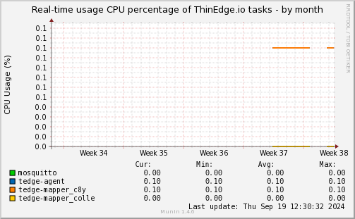
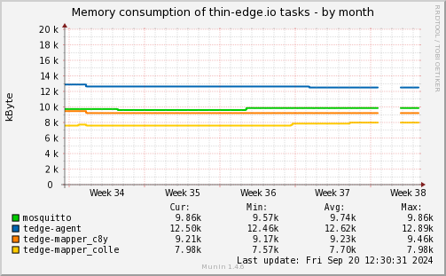

# Benchmarks

This section contains performance benchmarks for ThinEdge.io, including detailed CPU and memory usage for key processes, measured on a device running in the OSADL QA Farm.

## Hardware Information

The following hardware and software specifications describe the environment in which these benchmarks are measured. The device runs ThinEdge.io and its associated plugins for data collection.

| Component      | Specification                                                 |
|----------------|---------------------------------------------------------------|
| **Processor**  | Quad-core ARM Cortex-A72 (ARM v8)                             |
| **Memory**     | 1.8 GB RAM                                                    |
| **Operating System** | Debian GNU/Linux 12 (bookworm)                          |
| **MQTT Broker**| Mosquitto (v2.0.18)                                           |
| **Firmware**   | ThinEdge.io (v1.1.2)                                          |
| **Plugins Used** | `tedgecpuprocent`, `memory`, `tedge-agent`, `tedge-mapper`  |

> The device is a Raspberry Pi 4 Model B Rev 1.5, a member of the OSADL QA Farm, which continuously collects data on performance and resource consumption.

## CPU Run-time Consumption of Key ThinEdge.io Tasks

In this section, we monitor the CPU usage of the most critical ThinEdge.io tasks: `mosquitto`, `tedge-agent`, and `tedge-mapper`. These tasks are essential for device-to-cloud communication, and their performance is crucial for the overall efficiency of the system.

### Graph of CPU Usage

Below is a visual representation of the CPU consumption by the main ThinEdge.io processes over the past month.

For each process, the graph shows:
- **Command Name (comm)**: The name of the task running on the device.
- **CPU Usage (cuc)**: The percentage of CPU time utilized by each process.

The graph allows you to visually track CPU performance trends and identify potential bottlenecks in the system.

### Detailed Metrics

The following table provides a detailed description of the CPU consumption of measured tasks:

| Task                 | Description                                                    |
|----------------------|----------------------------------------------------------------|
| `mosquitto`          | Handles MQTT communications between devices and cloud          |
| `tedge-agent`        | Coordinates device management, software updates, and telemetry |
| `tedge-mapper_c8y`   | Converts telemetry data into the format required by cloud      |
| `tedge-mapper-colle` | Converts telemetry data into the format required               |

> Note: The values in this table are updated dynamically once per month.

## Memory Usage

In this section, we monitor the memory consumption of key ThinEdge.io components to ensure efficient performance and to view how the system memory is being utilized.

### Graph of Memory Usage

Below is a visual representation of the memory consumption of ThinEdge.io tasks over the past month.

### Monitored Metrics:
- **Mosquitto Memory Usage**: Tracks the memory consumed by the mosquitto process, which manages MQTT messages and connections.
- **Tedge-Agent Memory Usage**: Tracks the memory consumed by the tedge-agent process, which handles software updates, configurations, and telemetry operations.
- **Tedge-Mapper Memory Usage**: Tracks the memory consumed by the tedge-mapper process, which converts telemetry data between MQTT and other protocols (e.g., Cumulocity, AWS). For multi-instance tedge-mapper, each instance is tracked individually.

For each metric, the graph shows the current and historical values, allowing you to monitor how memory is utilized by the system.

### Detailed Metrics

The following table provides a description of memory usage metrics:

| Metric                   | Description                                                                 |
|--------------------------|-----------------------------------------------------------------------------|
| **Mosquitto Memory**     | Memory used by the mosquitto process, which manages MQTT messages and connections. |
| **Tedge-Agent Memory**   | Memory used by the tedge-agent process, responsible for software updates, configurations, and telemetry operations |
| **Tedge-Mapper Memory**  | Memory used by the tedge-mapper process, which converts telemetry data between MQTT and other protocols (e.g., Cumulocity, AWS). Each instance of tedge-mapper is monitored individually if multiple instances exist |

> The values in this table are updated dynamically once per month.

By monitoring these metrics, we can ensure that the system is using memory efficiently, and we can detect potential memory leaks or bottlenecks in the system's operation.

---

This section now contains all relevant memory metrics for ThinEdge tasks, helping you track and analyze how resources are allocated and used by mosquitto, tedge-agent, and tedge-mapper over time. These benchmarks are crucial for maintaining optimal performance of ThinEdge.io components and ensuring efficient memory usage across the system.
