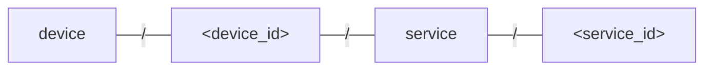
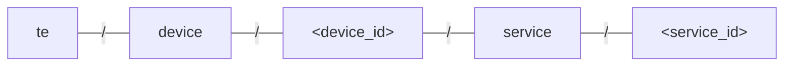
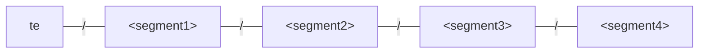
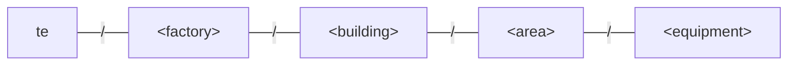

# MQTT Topic Design

A detailed look into the MQTT topic design giving additional context which the reference page does not provide. It is assumed that you are familiar with the [MQTT Topic Schema](../../references/mqtt-api.md) page, if not, then please read it first before continuing.

## Main concepts

### Identifier - fixed 4 segment group

The identifier is used to group command and telemetry data to a given entity: a device, a service or any source or target of MQTT messages.

Having a fixed **identifier** group in the topic structure makes it easier for other clients to subscribe to the messages being published on the MQTT broker, as well as making parsing the topics simple (e.g. splitting the string by slash (`/`) and taking the first 5 items (including the root segment)).

A client can subscribe to all measurements for the main device by subscribing to a single topic.

```sh te2mqtt
tedge mqtt sub 'te/device/main///m/+'
```

Alternatively, if a client wants to subscribe to all measurements regardless of the **identifier** then it can also can be done using a single subscription, as demonstrated by the following example:

```sh te2mqtt
tedge mqtt sub 'te/+/+/+/+/m/+'
```

If a variable number of segments were used for the **identifier**, it would result in each client having to subscribe to multiple MQTT topics, which makes it both cumbersome and error prone.

```sh title="Invalid example"
mosquitto_sub \
  -t 'te/+/m/+' \
  -t 'te/+/+/m/+' \
  -t 'te/+/+/+/m/+' \
  -t 'te/+/+/+/+/m/+'
```

### Support auto registration via inference

Automatic registration was a commonly used feature in the legacy MQTT topic (e.g. topics under `tedge/#`), so in order to keep supporting such as feature, a simple convention is applied to the 4-segment **identifier** to provide all of the information required for auto registration to work. For instance the **identifier** should contains whether it represents the main device, a child device, or a service hosted either on a main or child device.

It must be noted that even though the `tedge/#` does support auto registration, there are limitations which the new `te/#` topic schema remove.

The main limitation of the `tedge/#` auto registration was the assumption that publishing telemetry data was always associated to either the main or child device. For example, if measurements for a service were published to the `tedge/measurements/<child_id>` topic before the service had published to the `tedge/health/<service_id>[/<child_id>]` topic, then the service would be represented as a child device instead of a service.

#### Solution

As mentioned in the MQTT referenced guide, the **identifier** group of the topic schema is used to define the target device/service, and it is illustrated by the following diagram.

<p align="center">



</p>

The above topic schema uses fixed positions to indicate the entity type, e.g. to represent if the entity is a device or a service on a device.

:::note
A service represents an entity that has dependence on a device. For example a service is running on device, and therefore can not exist on its own. The lifecycle of the service is linked to the device it is running on, so when the device is removed, then the service is also removed.
:::

The `<device_id>` can be either set to `main`, which represents the thin-edge device, or to a id/name used to represent a child device. Telemetry data targeted to the main or child devices, require the `service` and `<service_id>` segments to be set to an empty string.

The following table shows some examples showing the relationship between the topic and the entity/component.

|Topic identifier (with root prefix)|Entity/Component|
|--|--|
|`te/device/main///`|Main device|
|`te/device/main/service/nodered`|Service called "nodered" running on the main device|
|`te/device/fooBar///`|Child device called "fooBar". The device is an immediate child of the main device|
|`te/device/fooBar/service/nodered`|Service called "nodered" running on a child device called "fooBar"|


### Support decoupling topic and device hierarchy

Another key design choice was to support decoupling the topic hierarchy to the device/service hierarchy. Decoupling the topic structure and hierarchy allows you to change the local MQTT topic structure independently from the digital twin representation in the cloud, as the two environments (cloud and edge) can have very different requirements when it comes to data filtering and visualization.

Decoupling via the registration interface which allows different entities to declare their own entity type (e.g. device, child-device or service) and an optional parent entity. Check out the [Using custom identifier schemas](#using-custom-identifier-schemas) section for an example showing the decoupling of topic and device hierarchy.

## Using custom identifier schemas

:::note Preface
Custom **identifier** schemas are only intended to be used for complex scenarios where the typical (default) MQTT topic schema is not suitable. Having too much freedom in the topic structure can cause confusion amongst users, so it was decided to use the typical use-case to a single simplistic view on the topic structure which is suitable for the majority of use-cases.
:::

This section highlights the flexible nature of the MQTT topic schema which allows you to provide your own semantic meaning to each of the **identifier** segments within the topic schema.

Let's start off by taking a closer look at the typical topic structure. The typical use-case defines the **identifier** (including root prefix) as follows:



But what was not mentioned is that the two static segments, "device" and "service" are actually only used to provide the auto registration functionality, as the cloud mappers need to know how to map the topic to the specific digital twin entity (e.g. as a device, child device or service). The typical topic schema allows the mapper to infer this relationship purely form the topic (which is ok for the majority of use-cases). However, when you take away the auto registration functionality (e.g. disable it), it allows you to apply your own semantics to each of the 4-segment **identifier** providing more powerful modelling mechanisms.

The **identifier** topic schema can be rewritten in its most generic form.



With the generic form, the structure of the topics is still the same as before, 4 segments, however you can apply your own meaning to each of the segment by registering the entities (devices/services) at each of the specific segments. The mapper then matches the **identifier** used when publishing telemetry data or receiving commands, to the registered entity.

This allows you to also encode specific information about the entity in the MQTT topic enabling powerful (local) filtering possibilities for other MQTT clients also running on the edge.

Below is a simple example showing how the **identifier** can be modelled to represent the location of equipment in a factory. The custom **identifier** schema is utilized as follows:



The equipment, which is a conveyor belt called "belt01", is located in factory "factory01", in the "hallA" building, in the "packaging" area. The conveyor belt can be registered as a child-device by publishing the following message.

```sh te2mqtt
tedge mqtt pub -r 'te/factory01/hallA/packaging/belt001' '{
  "@type": "child-device",
  "displayName": "belt001",
  "type": "ConveyorBelt",
  "factory": "factory01",
  "building": "hallA",
  "area": "packaging",
  "equipment": "belt001"
}'
```

:::info
The registration message can include additional static information about the entity to give more information about the entity to other clients who subscribe to the registration messages.
:::

The registration message will associate the telemetry data or commands published or received from the `te/factory01/hallA/packaging/belt001` topic prefix with the `belt001` child-device from the registration message.

For example, an event can be published to the `belt01` equipment using the following message.

```sh te2mqtt
tedge mqtt pub 'te/factory01/hallA/packaging/belt001/e/running_status' '{
  "text": "Belt started"
}'
```

Since the topic schema encodes additional location information about the equipment, other MQTT clients can subscribe to telemetry data coming from all equipment located in the same area using a single MQTT subscription.

```sh te2mqtt
tedge mqtt pub 'te/factory01/hallA/packaging/+/e/+'
```

:::tip
When applying your own semantics to the **identifier**, you can leave any segment blank if you don't want to apply a meaning to it.

For example, if it does not make sense to have the factory and building in the **identifier**, then they can be removed and the equipment can be registered using:

```sh te2mqtt
tedge mqtt pub -r 'te/packaging/belt001' '{
  "@type": "child-device"
}'
```

Publishing an event requires just leaving the last two segments of the **identifier** blank (whilst keeping the slashes `/` in place).

```sh te2mqtt
tedge mqtt pub 'te/packaging/belt001///e/running_status' '{
  "text": "Belt started"
}'
```
:::
