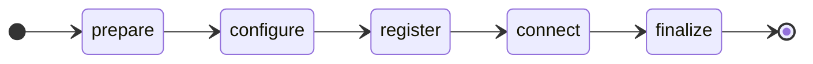

This document describes how to extend the bootstrapping process which involves getting your device connected to one or more clouds.

## Overview

%%te%% supports an extensible bootstrap system which allows you to:

* run custom logic at different steps of the bootstrap process (e.g. pre-checks, validation logic, start/stop services etc.)
* customize the user-guided prompts
* integrate custom mappers with their own onboarding procedures
* ship the bootstrap logic of a product as part of its package,
  so that installing the package is all it takes for `tedge bootstrap`
  to offer and onboard that product alongside the built-in clouds
* automate the bootstrapping process for unattended provisioning

## How Bootstrap Works

The bootstrap process is triggered by the user running `tedge bootstrap`.

The user will be prompted to answer a set of questions about which cloud they wish to connect to and additional cloud specific configuration options that relate to both the configuration and provisioning of the device.

Once all of the questions have been answered, the bootstrap command will go through the following process. If an error occurs at any stage of the process, then the process is ended and the reason for termination is presented to the user. The diagram below shows the process:



:::tip
The same process is run every time,
so `tedge bootstrap` can be re-run on a device that is already bootstrapped:
each step keeps the state that is already in place.
Use `--re-register` to register the device again,
or `--clean` to unwind the instance first and start over:
the registration artifacts (and, with `--clean`, the instance's configuration)
are removed before the prepare hooks run.
Both flags are passed on to the hooks,
which are expected to do the same with the state they own -
see the [`tedge bootstrap`](../references/cli/tedge-bootstrap.md) reference.
:::

Every step except *connect* has a matching hook directory, `<step>.d`,
whose executables are run at that point of the process.

| Step | Hook directory | When it runs |
| ---- | -------------- | ------------ |
| prepare | `prepare.d` | Before anything is resolved or written |
| configure | `configure.d` | After the configuration has been written |
| register | `register.d` | Only when the selected registration method is fulfilled by hooks |
| connect | *not customizable* | Always, running the equivalent of `tedge reconnect <cloud>` |
| finalize | `finalize.d` | After the device is connected; deferred on an `--offline` run |

The [hook contract](#hook-contract) describes how hooks are installed and called,
and [Hooks by step](#hooks-by-step) shows what each step is useful for, with examples.

## Hook contract

A bootstrap hook is an executable file - a shell script, or any other program -
placed in the `<step>.d` directory of a bootstrap plugin path.
The smallest useful hook is three lines:

```sh title="file: /etc/tedge/bootstrap.d/finalize.d/50_hello"
#!/bin/sh
shift # the step name is always first; the flags that follow can come in any order
while [ $# -gt 0 ]; do
    case "$1" in
        --cloud) CLOUD="$2"; shift ;;
    esac
    shift
done
echo "Bootstrapped to $CLOUD"
```

Make it executable, and it runs at the end of every successful `tedge bootstrap`,
printing the name of the cloud the device was connected to.
The rest of this section describes where hooks are found and how they are called.

### Installing hooks

Hooks are looked up in the directories listed by `bootstrap.plugin_paths`:

```sh
tedge config get bootstrap.plugin_paths
```

```text title="Output"
["/etc/tedge/bootstrap.d", "/usr/share/tedge/bootstrap.d"]
```

By convention, packages install their hooks under `/usr/share/tedge/bootstrap.d/<step>.d/`,
and site specific customization goes into `/etc/tedge/bootstrap.d/<step>.d/`.
Within a step, hooks run in **lexical file name order**, hence the numeric prefixes.

* A hook **must be executable**, otherwise it is ignored with a warning.
* A site hook overrides a packaged hook of the same file name.
* A site file `<hook>.ignore` disables the packaged hook `<hook>`.
* Missing or empty `<step>.d` directories are not an error.

:::info
The rules above apply to any number of directories in `bootstrap.plugin_paths`.
Earlier directories take precedence per file name,
a `<hook>.ignore` marker disables that name in its own directory and in all the directories after it,
and the run order is computed over the merged view of all the directories,
so an overriding hook keeps the position its name gives it.

```text
/etc/tedge/bootstrap.d/prepare.d/
├── 20_example         # runs, instead of the packaged 20_example
└── 30_other.ignore    # disables the packaged 30_other
/usr/share/tedge/bootstrap.d/prepare.d/
├── 20_example         # overridden
├── 30_other           # disabled
└── 40_more            # runs
```
:::

### Arguments

Each hook is called with the step name as its first argument, followed by flags:

```sh
<step> --cloud <name> [--url <url>] [--re-register] [--clean] [--offline] [--cloud-type <type>] [--register-method <name>]
```

| Argument | Passed | Description |
| -------- | ------ | ----------- |
| `<step>` | always | The step being run: `prepare`, `configure`, `register` or `finalize` |
| `--cloud <name>` | always | The cloud being bootstrapped, e.g. `c8y` or `thingsboard` |
| `--url <url>` | when known | The target cloud url, as given by a flag, the wizard, or the cloud descriptor |
| `--cloud-type <type>` | custom instances | The built-in cloud that a custom named instance derives from, e.g. `c8y` |
| `--register-method <name>` | register step, when a method is named | The registration method selected by the user, as declared by the cloud descriptor |
| `--re-register` | with `--re-register` or `--clean` | The device is being registered again: the hook should drop its idempotency guard and register once more |
| `--clean` | with `--clean` | The instance is being unwound: the hook should also remove the state that it owns |
| `--offline` | with `--offline` | There is no network: the hook should skip itself, or fulfil its job locally (e.g. a local PKI) |

`--url` is only passed when the url is given for this run, by a flag, the wizard, or the descriptor.
On a re-run of an already configured device it is absent; read it with `tedge config get` instead.

For example, if you had multiple prepare hooks, then at the prepare step, they would be called as follows for the Cumulocity (c8y) cloud.

```sh
/usr/share/tedge/bootstrap.d/prepare.d/20_example prepare --cloud c8y --url example.cumulocity.com
/usr/share/tedge/bootstrap.d/prepare.d/30_other prepare --cloud c8y --url example.cumulocity.com
```

Only the step name is positional.
The flags are passed in no guaranteed order and new flags may be added in future releases,
so a hook must parse the flags by name, use the ones it needs and ignore the rest,
as the examples below do.
Do not reject unknown flags: new ones may be added to the contract.

### Environment

Hooks inherit the environment of the `tedge bootstrap` process, with these additions.
What the %%te%% CLI itself needs is exported under the names the CLI already reads,
so a hook never forwards them:
it runs the CLI as the operator would, and reads the variable
when it needs the value itself, e.g. to build a path.

| Variable | Set when | Description |
| -------- | -------- | ----------- |
| `TEDGE_CONFIG_DIR` | always | The %%te%% configuration directory, e.g. `/etc/tedge` |
| `TEDGE_CLOUD_PROFILE` | with `--profile` | The cloud profile, when the device connects to several instances of a cloud |
| `TEDGE_DEVICE_ID` | the run has a device id | The device identity. It is the configuration override for `device.id`, so `tedge config get device.id` inside a hook resolves to the identity being bootstrapped, even before it is persisted. Setting it before running `tedge bootstrap` is equivalent to `--device-id`, except that `--save` captures it by name rather than by value |
| `C8Y_REGISTRATION_URL` | a Cumulocity `c8y-ca` registration is pending, and the one-time password was generated by %%te%% | The registration url, pre-filled with the one-time password. It is available from the configure step onwards, and is not exported when the user supplied their own one-time password, which is kept secret |
| the inputs of the selected registration method | the method has inputs | Each input is exported under the variable named by its `env`, e.g. `TB_ACCESS_TOKEN`, holding the value entered by the user, taken from the environment, or the input's declared `default`. See [Customizing the bootstrapping prompts](#customizing-the-bootstrapping-prompts) |

```sh
URL=$(tedge config get c8y.url)
CREDENTIALS="${TEDGE_CONFIG_DIR:-/etc/tedge}/mappers/thingsboard/credentials.toml"
```

`TEDGE_CONFIG_DIR` and `TEDGE_CLOUD_PROFILE` only provide the *default* of the CLI's `--config-dir`
and `--profile` flags,
so a hook that has a reason to pass one explicitly still overrides them.
They are exported after the inputs collected for the run,
so an input can never shadow them.
Secrets are passed through the environment, never on the command line.

### Exit codes

| Exit code | Meaning |
| --------- | ------- |
| `0` | The hook did its job |
| `2` | The hook is not applicable, and skipped itself |
| any other | The hook failed, and the bootstrap process is stopped |

Every hook of a step is called for every cloud,
so a hook that only serves one cloud, or one registration method, exits `2` for the others.
Skipped hooks are silent on the console, and noted in the bootstrap log file.

Any other non-zero exit code aborts the bootstrap:
the remaining hooks of the step are not called, and the hook's diagnostics are printed.
A hook doing best-effort work, such as sending a notification,
should catch its own errors and exit `0`.

### Output

* Anything a hook writes to **stdout** is shown to the user, indented under the current step.
* Anything written to **stderr** is treated as diagnostics:
  it goes to the bootstrap log file,
  and is replayed on the console when the hook fails.

### Writing a robust hook

* **Self-select.** Exit `2` when the hook is not meant for this cloud, or this registration method.
* **Be idempotent.** `tedge bootstrap` is designed to be re-run;
  keep the existing state unless `--re-register` is passed.
* **Clean up after yourself.** On `--clean`, remove the state that your hook owns.
* **Expect no network.** On `--offline`, either skip, or do the part that works locally.
* **Don't reject unknown flags**, so that your hook keeps working
  when new flags are added to the contract.

## Hooks by step

The following sections describe what each step's hooks are useful for, with examples.

### prepare

The **prepare** hook runs before anything is configured.
Use it for sanity checks (internet connectivity, system time),
or to get the device into the state the configuration expects.

The following hook fails the bootstrap early when the cloud host cannot be resolved,
instead of after a long connection timeout.

```sh title="file: /usr/share/tedge/bootstrap.d/prepare.d/05_preflight"
#!/bin/sh
set -e
shift # the step name

URL=""
OFFLINE=""
while [ $# -gt 0 ]; do
    case "$1" in
        --url) URL="$2"; shift ;;
        --offline) OFFLINE=1 ;;
    esac
    shift
done

# an --offline run defers everything that needs the network
if [ -n "$OFFLINE" ]; then
    echo "offline provisioning: skipping the preflight" >&2
    exit 2
fi

# on a re-run the url is not passed as a flag, but it is already configured
# (TEDGE_CONFIG_DIR points tedge at the right directory)
if [ -z "$URL" ]; then
    URL=$(tedge config get c8y.url 2>/dev/null || true)
fi
[ -n "$URL" ] || exit 2

HOST=$(echo "$URL" | sed 's|^[a-z]*://||; s|/.*||; s|:.*||')
# getent is not available on busybox based systems, so fall back to nslookup
resolves() { getent hosts "$1" >/dev/null 2>&1 || nslookup "$1" >/dev/null 2>&1; }
if ! resolves "$HOST"; then
    echo "Preflight failed: cannot resolve $HOST - check the network and DNS settings" >&2
    exit 1
fi
echo "Preflight: $HOST resolved"
```

### configure

The **configure** hook is run after the initial configuration has been set (as defined in the cloud descriptor or as provided by the user via command line flags).

The hooks could be added to:

* Validate the configuration and reject incompatible settings
* Display additional information about the device (like a QR Code with a registration URL that users can scan)
* Set additional configuration which may be dependent on the user entered values (e.g. changing the bind address for all three mqtt, http and c8y proxy services at once).

When a Cumulocity `c8y-ca` registration is pending,
the registration URL is exported as `C8Y_REGISTRATION_URL`.
The following hook shows it as a QR code, for an operator to scan with a phone.

```sh title="file: /usr/share/tedge/bootstrap.d/configure.d/90_qr_code"
#!/bin/sh
# The variable is only set when a registration is actually pending,
# so this hook skips itself on re-runs of an already registered device
[ -n "$C8Y_REGISTRATION_URL" ] || exit 2
command -v qrencode >/dev/null 2>&1 || exit 2

echo ""
echo "Scan to register the device:"
qrencode -t ANSIUTF8 --margin=2 "$C8Y_REGISTRATION_URL"
```

### register

The **register** hooks run only when the selected registration method is not a built-in one.
Connecting to Cumulocity with the `c8y-ca` method does not call them;
a method declared by a custom cloud descriptor does, as the hooks are what implement it.
A hook checks `--cloud` and `--register-method` to decide whether the method is one of its own.

A register hook, paired with the descriptor that declares its method,
is shown in [Example: Custom cloud](#example-custom-cloud).

The bootstrap fails if the method needs hooks and none is installed,
or if the hooks exit `0` without producing the expected credentials or certificate.

### connect (not customizable)

This step is not customizable.
For a built-in cloud, it runs the equivalent of `tedge reconnect <cloud>`.
For a custom cloud, it restarts and enables the `tedge-mapper-<cloud>` service,
and waits for the mapper to report a healthy cloud connection,
retrying until `--timeout` (5 minutes by default).
See [Integrating a custom mapper](#integrating-a-custom-mapper).

### finalize

The **finalize** hook runs once the device is connected.
It does not run on an `--offline` run, where the connection is only staged;
the online re-run performs it.

This hook can be used to:

* Start additional services
* Send telemetry when the bootstrapping was successfully completed

The following hook publishes an event to the cloud indicating that the bootstrapping was successful.

```sh title="file: /usr/share/tedge/bootstrap.d/finalize.d/50_bootstrap_event"
#!/bin/sh
set -e
shift # the step name

CLOUD=""
while [ $# -gt 0 ]; do
    case "$1" in
        --cloud) CLOUD="$2"; shift ;;
    esac
    shift
done

TOPIC="te/device/main///e/device_bootstrap"
PAYLOAD=$(printf '{"text": "Device successfully bootstrapped to %s"}' "$CLOUD")

# best-effort: a failed notification must not fail the bootstrap itself
if tedge mqtt pub "$TOPIC" "$PAYLOAD" 2>/dev/null; then
    echo "Published the bootstrap event for $CLOUD" >&2
else
    echo "Warning: could not publish the bootstrap event" >&2
fi
```

## Customizing the bootstrapping prompts

Most clouds have their own configuration, and their own way of provisioning a device.
Cumulocity alone offers username/password credentials,
a certificate issued by its certificate authority, or a self-signed certificate.
A *cloud descriptor* declares this for a cloud:
the questions the wizard asks, the registration methods on offer,
the inputs each one needs, and the configuration that follows from the answers.

Descriptors are TOML files in the `clouds.d` directory of each bootstrap plugin path,
the same layered directories as the hooks:
`/etc/tedge/bootstrap.d/clouds.d/<cloud>.toml` for site customization,
and `/usr/share/tedge/bootstrap.d/clouds.d/<cloud>.toml` for the ones shipped by packages.
The built-in clouds - c8y, az and aws - have a descriptor compiled into `tedge` itself.

:::note
A descriptor is metadata only.
It declares what the bootstrap command asks and validates;
the registration itself is done by the built-in methods, or by the `register.d` hooks.
:::

### Example: Custom cloud

Say you want to connect devices to ThingsBoard,
letting the user pick one of several regions,
and registering the device with an access token created in the ThingsBoard UI.
The descriptor for that is:

```toml title="file: /usr/share/tedge/bootstrap.d/clouds.d/thingsboard.toml"
cloud = "thingsboard"
description = "ThingsBoard IoT platform"

[url]
description = "ThingsBoard region"
default = "mqtt.thingsboard.cloud"
choices = ["mqtt.thingsboard.cloud", "eu.thingsboard.cloud", "us.thingsboard.cloud"]

[[register]]
name = "token"
default = true
description = "Use a device access token created in the ThingsBoard UI (Devices -> Add device)"

[[register.inputs]]
name = "access token"
env = "TB_ACCESS_TOKEN"
secret = true
```

It has three parts:

* `cloud` and `description` name the cloud.
  Both are shown when `tedge bootstrap` is run without a cloud.
* `[url]` describes how the url is asked for.
  Here the user picks from a list instead of typing one;
  the same works for limiting a built-in cloud to development, test and production tenants.
* `[[register]]` declares a registration method, and `[[register.inputs]]` the values it needs.
  A `secret` input is prompted for without echo, and never displayed.
  Its `env` is the environment variable the register hook reads it from.

The bootstrap command asks these questions, validates the answers,
and only then calls the register hook.
The hook itself only has to store the token:

```sh title="file: /usr/share/tedge/bootstrap.d/register.d/10_thingsboard"
#!/bin/sh
set -e
shift # the step name

CLOUD=""
CONFIG_DIR="${TEDGE_CONFIG_DIR:-/etc/tedge}"
RE_REGISTER=""
while [ $# -gt 0 ]; do
    case "$1" in
        --cloud) CLOUD="$2"; shift ;;
        --re-register) RE_REGISTER=1 ;;
    esac
    shift
done

# only handle our own cloud
[ "$CLOUD" = "thingsboard" ] || exit 2

CREDENTIALS="$CONFIG_DIR/mappers/thingsboard/credentials.toml"

# keep an existing registration, unless asked to register again
if [ -f "$CREDENTIALS" ] && [ -z "$RE_REGISTER" ]; then
    echo "Keeping the existing credentials at $CREDENTIALS" >&2
    exit 0
fi

mkdir -p "$(dirname "$CREDENTIALS")"
umask 077
printf '[credentials]\ntoken = "%s"\n' "$TB_ACCESS_TOKEN" > "$CREDENTIALS"
echo "Stored the device access token"
```

Inputs are only asked for when the run is going to register the device,
so re-running `tedge bootstrap` on a registered device does not ask for the token again.

### Descriptor reference

The example above covers the common case.
The remaining fields are listed here.
The full format is described by a JSON schema,
[`tedge-cloud-descriptor.schema.json`](https://github.com/thin-edge/thin-edge.io/blob/main/configuration/schema/tedge-cloud-descriptor.schema.json),
which editors can use to validate and auto-complete a descriptor.

#### Several registration methods

A cloud can declare several `[[register]]` methods, one of them `default = true`.
The wizard asks which one to use,
and the register hook receives the answer as `--register-method <name>`.
For instance, adding a provisioning method to the ThingsBoard descriptor:

```toml
[[register]]
name = "provision"
description = "Provision automatically via the Device Provisioning API (needs a provisioning profile)"

[[register.inputs]]
name = "provision key"
env = "TB_PROVISION_KEY"
secret = true

[[register.inputs]]
name = "provision secret"
env = "TB_PROVISION_SECRET"
secret = true
```

The hook then branches on the method,
with `METHOD` and `URL` parsed from `--register-method` and `--url`:

```sh
case "$METHOD" in
    token)
        printf '[credentials]\ntoken = "%s"\n' "$TB_ACCESS_TOKEN" > "$CREDENTIALS"
        ;;
    provision)
        # the provisioning API is served by the platform host, not the MQTT endpoint
        API_HOST=$(echo "$URL" | sed 's/^mqtt\.//')
        TOKEN=$(curl -fsS "https://$API_HOST/api/v1/provision" \
            -H 'Content-Type: application/json' \
            -d "{\"provisionDeviceKey\": \"$TB_PROVISION_KEY\", \"provisionDeviceSecret\": \"$TB_PROVISION_SECRET\"}" \
            | sed -n 's/.*"credentialsValue":"\([^"]*\)".*/\1/p')
        [ -n "$TOKEN" ] || { echo "Provisioning was refused by $API_HOST" >&2; exit 1; }
        printf '[credentials]\ntoken = "%s"\n' "$TOKEN" > "$CREDENTIALS"
        ;;
    *)
        echo "Unsupported registration method: $METHOD" >&2
        exit 1
        ;;
esac
```

#### Optional inputs

An input declared `required = false`, or given a `default`,
does not stop the run when it is missing.
A `description` is shown by the wizard and `--describe`,
and `choices` turn the question into a pick-list:

```toml
[[register.inputs]]
name = "bootstrap user"
env = "TB_BOOTSTRAP_USER"
description = "The tenant's device bootstrap user"
default = "management/devicebootstrap"   # used when the variable is not set
```

#### Configuration implied by a choice

A method can carry a `set` table:
configuration applied during the configure step when that method is chosen,
with keys relative to the cloud.
The user picks "certificate" without having to know that this also sets `auth_method`:

```toml
[[register]]
name = "certificate"
description = "X.509 device certificate registered in ThingsBoard by an operator"

[register.set]
auth_method = "certificate"
```

To pin a value for the cloud as a whole, whatever method is chosen,
declare a [setting that is not asked for](#a-setting-that-is-not-asked-for).

#### Additional settings

`[[settings]]` are the questions the cloud needs answered beyond the url.
Each one is a configuration key relative to the cloud,
so `transport.port` below is stored as `thingsboard.transport.port`.
A setting declared `required = true` must be answered:

```toml
[[settings]]
key = "transport.port"
description = "MQTT transport port"
default = "8883"
choices = ["1883", "8883"]
```

A choice can have a `label` and a `description`,
to ask the question in the vocabulary of the product rather than in configuration values.
The built-in Cumulocity descriptor uses this for the MQTT endpoint:

```toml
[[settings]]
key = "mqtt_service.enabled"
name = "Select the Cumulocity MQTT connection type"
default = "false"

[[settings.choices]]
value = "false"
label = "Core MQTT"
description = "The standard device endpoint (port 8883)"

[[settings.choices]]
value = "true"
label = "MQTT Service"
description = "Next-gen endpoint with free-form topics (port 9883)"
```

A choice can also carry a `set` table of its own.

A setting declared `global = true` is a device wide %%te%% configuration key,
applied without the cloud prefix:

```toml
[[settings]]
key = "proxy.address"
global = true
name = "HTTP proxy for cloud connections (scheme://host:port; leave empty for none)"
```

#### A setting that is not asked for

A setting declared `prompt = false` with a `default` is never asked for:
the default is applied on every run, interactive or not,
the way a cloud pins a configuration value.
An explicit `--set` for the same key still wins,
as does a `set` value of the chosen method or choice.

```toml
[[settings]]
key = "mqtt_service.enabled"
default = "true"
prompt = false
```

#### A url that is not asked for

Likewise, a `[url]` declared `prompt = false` with a `default` is never asked for,
and non-interactive runs do not need `--url`.
An explicit `--url` still wins.

```toml
[url]
description = "Acme Cloud region"
default = "acme.eu-latest.cumulocity.com"
prompt = false
```

### Overriding the descriptor of a built-in cloud

A descriptor in a directory that takes precedence replaces the descriptor of that cloud.
This is how a site adapts the questions asked for a built-in cloud:
offering a fixed list of tenants, adding a question, or hiding a registration method.

The following override limits Cumulocity to two tenants and the `c8y-ca` method,
and adds a proxy question:

```toml title="file: /etc/tedge/bootstrap.d/clouds.d/c8y.toml"
cloud = "c8y"
description = "Cumulocity"

[url]
description = "Cumulocity URL"
choices = ["acme.eu-latest.cumulocity.com", "acme-test.eu-latest.cumulocity.com"]

[[register]]
name = "c8y-ca"
default = true
description = "Request a device certificate from the Cumulocity certificate authority"

# The site's addition: an optional, device global proxy question
[[settings]]
key = "proxy.address"
global = true
name = "HTTP proxy for cloud connections (scheme://host:port; leave empty for none)"
```

An override replaces the *whole* descriptor, so anything it does not redeclare is no longer offered.
Here, only `c8y-ca` appears in the wizard.

An override can also add methods to a built-in cloud.
A method whose name is not a built-in one is fulfilled by the `register.d` hooks,
like a method of a custom cloud:

```toml
[[register]]
name = "vendor-pki"
default = true
description = "Request the device certificate from the Acme factory PKI"
```

:::info
Omitting a built-in method only hides it from the wizard:
`tedge bootstrap c8y --register self-signed` still works.
A restated built-in method that declares no `inputs` keeps the ones compiled into %%te%%,
so an override cannot drop the prompts of a method whose implementation needs them.
:::

### Hiding a cloud from the wizard

An empty marker file `<cloud>.ignore` (or `<cloud>.toml.ignore`), next to where a descriptor would be,
removes that cloud from the wizard and from the `--describe` listing:

```sh
# only offer Cumulocity to the users of this device
sudo touch /etc/tedge/bootstrap.d/clouds.d/az.ignore
sudo touch /etc/tedge/bootstrap.d/clouds.d/aws.ignore
```

`tedge bootstrap az` still works if a user asks for it explicitly.

:::info
Markers follow the same layering as descriptors:
the first directory providing either a descriptor or a marker for a cloud decides.
A site descriptor therefore re-offers a cloud that a package's marker hides.
:::

### Custom named instances of a built-in cloud

A descriptor can present one of the built-in clouds under a different name, using `type`:

```toml title="file: /usr/share/tedge/bootstrap.d/clouds.d/acme-cloud.toml"
cloud = "acme-cloud"
type = "c8y"
description = "Acme Cloud"

[url]
description = "Acme Cloud region"
default = "acme.eu-latest.cumulocity.com"
prompt = false

[[settings]]
key = "mqtt_service.enabled"
default = "true"
prompt = false
```

The instance inherits the base cloud's registration methods and url specification
unless it declares its own, and is registered with the base cloud's methods.
This is how a platform built on Cumulocity is offered under its own name.

An instance with a name of its own is run by the generic mapper,
as a [custom mapper](#integrating-a-custom-mapper):
its settings live in `mappers/<name>/mapper.toml`,
the connect step needs a `tedge-mapper-<name>` service,
and the `self-signed` method is not available for it.

## Integrating a custom mapper

A cloud that %%te%% does not know about is bootstrapped as a *custom mapper*:
`tedge bootstrap <name>` treats any name that is not a built-in cloud as the name of a mapper.
Everything the bootstrap needs is shipped by the mapper's own package.

| Step | What happens for a custom mapper |
| ---- | -------------------------------- |
| configure | The url, the device id and the `--set <name>.<key>=<value>` settings are written to `<config-dir>/mappers/<name>/mapper.toml`, leaving the rest of the file untouched |
| register | There is no built-in method, so the `register.d` hooks do the registration. The step then checks that the credentials file (`credentials_path` in `mapper.toml`, by default `credentials.toml` next to it), the instance's own certificate (`mappers/<name>/device-certs/tedge-certificate.pem`), or the certificate named by `device.cert_path` in `mapper.toml` exists |
| connect | The `tedge-mapper-<name>` service is restarted and enabled, and the step runs the same check as `tedge connect <name> --test`, waiting for the mapper's [health status](../references/mqtt-api.md#health-check) and, when the mapper uses the built-in bridge, for the bridge's health status |

A mapper package therefore ships, alongside its mapper configuration and service definition:

* a cloud descriptor, `/usr/share/tedge/bootstrap.d/clouds.d/<name>.toml`,
  declaring the registration methods and settings of the cloud
* a register hook, `/usr/share/tedge/bootstrap.d/register.d/<nn>_<name>`,
  implementing those methods and self-selecting on `--cloud`

The [ThingsBoard example](#example-custom-cloud) is such a pair.
With the package installed, the operator's command is the same as for a built-in cloud:

```sh
sudo tedge bootstrap thingsboard
```

The connect step waits for the mapper to report `up` on its service health topic,
`te/device/main/service/tedge-mapper-<name>/status/health`.
When the mapper directory has a `bridge/` sub-directory,
the mapper connects to the cloud with the built-in bridge,
and the step also waits for the bridge sub-service,
`te/device/main/service/tedge-mapper-bridge-<name>/status/health`,
which reports `up` only once the cloud connection is established.

A mapper that is its own bridge has no `bridge/` directory,
so its own health status is the only signal the connect step gets.
Such a mapper must therefore report `up` only once its cloud connection is established,
and `down` when the connection is lost:
a mapper that reports `up` as soon as it is running
passes the check while still disconnected from the cloud.

## Unattended provisioning

Everything the wizard asks for can also be supplied up front,
for a script, a first-boot service or a fleet tool.

When stdin is not a terminal, `tedge bootstrap` never prompts:
the cloud, the url and the registration method come from the command line,
and the registration inputs from the environment variables named by the descriptor.
A missing value fails the run with a message naming what to provide.
An interactive run prints the equivalent non-interactive command before it starts,
naming the environment variables it was given:

```text
Running: tedge bootstrap thingsboard --url mqtt.thingsboard.cloud --register token
(with the environment variables: TB_ACCESS_TOKEN)
```

A descriptor reduces what has to be given on the command line:
a url declared [`prompt = false`](#a-url-that-is-not-asked-for) does not need `--url`,
the method declared `default = true` is used when `--register` is omitted,
and an input with a `default` is used when its variable is not set.

To capture a wizard session for replay, or to bootstrap a device to several clouds in one go,
save the invocation to a file and replay it:

```sh
# walk the wizard once, save the answers, apply nothing
sudo tedge bootstrap --dry-run --save bootstrap.json

# apply them, here or on another device
sudo TB_ACCESS_TOKEN="$TOKEN" tedge bootstrap --from bootstrap.json
```

The file is a JSON array of invocations, run in order.
Registration inputs are captured by variable name only, never their values,
so the variables must be set when replaying;
every invocation of the file is checked before the first one runs.

```json title="file: bootstrap.json"
[
  {
    "cloud": "thingsboard",
    "url": "mqtt.thingsboard.cloud",
    "register": "token",
    "env": ["TB_ACCESS_TOKEN"]
  }
]
```

| Field | Flag | Description |
| ----- | ---- | ----------- |
| `cloud` | positional | The cloud or mapper name |
| `profile` | `--profile` | The cloud profile |
| `type` | `--type` | The cloud type of a custom named instance |
| `url` | `--url` | The cloud url |
| `register` | `--register` | The registration method |
| `device_id` | `--device-id` | The device id; omitted when it is supplied by `TEDGE_DEVICE_ID`, which is then listed in `env` |
| `set` | `--set` | An object of configuration keys and values |
| `env` | | The names of the environment variables the run needs |
| `re_register`, `clean` | `--re-register`, `--clean` | The backward transitions to perform first |

Devices provisioned before they have network access use `--offline`:
the configuration is applied, the hooks run with `--offline`,
and the services are staged so that the device connects by itself once online.
Registration is deferred, except for the `basic-preregistered` method,
which stores its issued credentials without any exchange.
Re-run the same command on the connected device to perform the remaining steps.

## Testing your hooks and descriptors

The bootstrap command can render and dry-run everything described here,
so a hook or a descriptor can be developed without registering a device.

Use `--plugin-dir` to point at a working directory,
instead of installing files under `/etc/tedge` or `/usr/share/tedge`:

```sh
tedge bootstrap thingsboard --plugin-dir ./bootstrap.d --describe
```

```text title="Output"
ThingsBoard IoT platform (thingsboard)
  url: ThingsBoard region (default: mqtt.thingsboard.cloud) (choices: mqtt.thingsboard.cloud, eu.thingsboard.cloud, us.thingsboard.cloud)

  registration methods:
    token (default): Use a device access token created in the ThingsBoard UI (Devices -> Add device)
      - access token  $TB_ACCESS_TOKEN  (secret)
```

`--describe` is rendered from the same descriptors that drive the wizard, overrides included.
Called without a cloud, it lists every cloud on offer.

`--dry-run` walks the whole process without changing anything,
printing the configuration that would be applied and the command line of each hook.
Each hook line is shown as it would be run, exported context included,
so it can be replayed as is;
the inputs collected for the run are not shown, as they may be secret.
A run that would register still needs the method's inputs,
here the access token (`--ascii` selects the plain output profile shown below):

```sh
TB_ACCESS_TOKEN=... tedge bootstrap thingsboard --url mqtt.thingsboard.cloud --plugin-dir ./bootstrap.d --dry-run --ascii
```

```text title="Output"
+  Bootstrapping the device to thingsboard
|  (dry-run: no changes will be made)
|
o  prepared 0.0s
|
|  updating /etc/tedge/mappers/thingsboard/mapper.toml
|  would set thingsboard.url=mqtt.thingsboard.cloud
o  configured 0.0s
|
|  using the thingsboard "token" method
|  would run hook: TEDGE_CONFIG_DIR=/etc/tedge ./bootstrap.d/register.d/10_thingsboard register --cloud thingsboard --url mqtt.thingsboard.cloud --register-method token
o  registered 0.0s
|
|  would restart and enable the tedge-mapper-thingsboard service and wait for it to connect
o  connected 0.0s
|
o  finalized 0.0s
|
+  Bootstrap completed successfully in 0.0s
   --------------------------------------------
   cloud     thingsboard
   register  token
   url       mqtt.thingsboard.cloud
   log       /var/log/tedge/tedge-bootstrap-2118.log
```

When a hook does not behave as expected,
the log file named in the summary holds the full output of the run,
including the hooks that skipped themselves
and everything the hooks wrote to stderr.
A failing hook's diagnostics are also replayed on the console.

All the flags of the command are listed in the [`tedge bootstrap`](../references/cli/tedge-bootstrap.md) reference.
