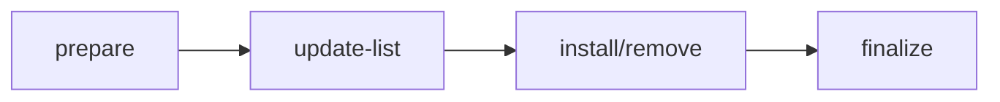

# Write my software management plugin

**thin-edge.io** Software Management natively supports APT (Debian) packages.
However, there are many package management systems in the world,
and you may want to have a plugin that is suitable for your device.
For such a demand, we provide the [**Package Manager Plugin API**](./../references/plugin-api.md)
to write a custom Software Management plugin in your preferred programming language.

In this tutorial, we will look into the **Package Manager Plugin API**,
and learn how to write your own plugin with a docker plugin shell script example.

## Create a plugin

Create a file called `docker` in the directory `/etc/tedge/sm-plugins/`. 
A plugin must be an executable file located in that directory.

```sh title="file: /etc/tedge/sm-plugins/docker"
#!/bin/sh

COMMAND="$1"
IMAGE_NAME="$2"

case "$COMMAND" in
    list)
        docker image list --format '{{.Repository}}\t{{.Tag}}' || exit 2
        ;;
    install)
        docker pull $IMAGE_NAME || exit 2
        ;;
    remove)
        docker rmi $IMAGE_NAME || exit 2
        ;;
    prepare)
        ;;
    finalize)
        ;;
    update-list)
        exit 1
        ;;
esac
exit 0
```

:::info
The plugin filename will be used as a plugin type to report the software list to a cloud.
If you name it `docker.sh`, you will see `docker.sh` as a plugin type in cloud.
:::

If you execute `./docker list`, you will see this kind of output.

```csv
alpine  3.14
eclipse-mosquitto   2.0-openssl
...
```

The Software Management Agent runs executable plugins with a special argument, like `list`.
Let's call the pre-defined argument such as `list`, `install`, and `remove` a **command** here. 
As you can see from this example, a plugin should be an executable file 
that accepts the commands and outputs to stdout and stderr.
Hence, you can implement a plugin in your preferred language.

Here is the table of the commands that you can use in a plugin.

|Command|Input arguments|Expected output|Description|
|---|---|---|---|
|list| - | lines with tab separated values |Returns the list of software modules that have been installed with this plugin.|
|prepare| - | - |Executes the provided actions before a sequence of install and remove commands.|
|finalize| - | - |Executes the provided actions after a sequence of install and remove commands.|
|install| `NAME [--module-version VERSION] [--file FILE]` | - |Executes the action of installation.|
|remove| `NAME [--module-version VERSION]` | - |Executes the action of uninstallation.|
|update-list| `COMMAND NAME [--module-version VERSION] [--file FILE]` | - |Executes the list of `install` and `remove` commands.|

The order of the commands invoked by the Software Management Agent is:



:::info
There is no guarantee of the order between `install` and `remove`.
If you need a specific order, use the `update-list` command instead.
:::

In the following sections, we will dive into each command and other rules deeply.

## Input, Output, and Errors

Before we dive into each command, we should clarify the basic rules of plugins.

### Input

The command themselves and further required arguments must be given as command-line arguments.
The only exception is `update-list`, which requires **stdin** input.

### Output

The **stdout** and **stderr** of the process running a plugin command are captured by the Software Management Agent.

### Exit status

The exit status of plugins are interpreted by sm-agent as follows:

|Exit Code|Summary|Description|
|---------|-------|-----------|
|0|Success|The command executed successfully without errors|
|1|Invalid usage|The command arguments cannot be interpreted, and the command has not been launched|
|2|Failure|The command failed and there is no point to retry|
|3|Retry|The command failed but might be successful later (for instance, when the network will be back)|

## List

The `list` command is responsible to return the list of the installed software modules.

Rules:

- This command takes no arguments.
- The list is returned using [CSV with tabulations as separators](https://en.wikipedia.org/wiki/Tab-separated_values),
  including:
  - **name**: the name of the software module, e.g. `mosquitto`.
  This name is the name that has been used to install it and that needs to be used to remove it.
  - **version**: the version currently installed. This is a string that can only be interpreted in the context of the plugin.

    :::info
    If the version is not present for a module, then list can return only the module name without trailing tabulation.
        Given that your plugin is named `docker`, then the Software Management Agent calls
    :::

```sh
sudo /etc/tedge/sm-plugins/docker list
```

to report the list of software modules installed.

:::caution
The Software Management Agent executes the plugin commands using `sudo` using the `tedge` user.
:::

`docker` should output in the CSV with tabulations as separators like

```csv
alpine  3.14
eclipse-mosquitto   2.0-openssl
rust    1.51-alpine
```

with exit code `0` (successful).

In most cases, the output of the `list` command is multi-lines.
The line separator should be `\n`.

A plugin must return a CSV line per software module, using a tabulation `\t` as separator.
If there is no version field then only the module name will be returned.
In the _docker_ file example, the following command outputs CSV structures with tabulations as separator.

```sh
docker image list --format '{{.Repository}}\t{{.Tag}}'
```

## Prepare

The `prepare` command is invoked by the sm-agent before a sequence of install and remove commands.

Rules:

- It takes no argument and no output is expected.
- If the `prepare` command fails,
  then the whole Software Management operation is cancelled.
  
For many plugins, this command has nothing specific to do, and can simply return with a `0` exit status.

In some plugin types, this `prepare` command can help you.
For example, assume that you want to implement a plugin for APT,
and want to run `apt-get update` always before calling the `install` command. 
In this example, the `prepare` command is the right place to invoke `apt-get update`.


## Finalize

The `finalize` command closes a sequence of install and removes commands started by a prepare command.

Rules:

- It takes no argument and no output is expected.
- If the `finalize` command fails, then the whole Software Management operation is reported as failed,
  even if all the atomic actions have been successfully completed.

Similar to the `prepare` plugin, you must define the command even if you want nothing in the `finalize` command.

The command can be used in several situations. For example, 
- remove any unnecessary software module after a sequence of actions.
- commit or roll back the sequence of actions.
- restart any processes using the modules,
  e.g. restart the analytics engines if the modules have changed.

  
## Install

The `install` command installs a software module, possibly of some expected version.
A plugin must be executable in the below format.

```sh
myplugin install NAME [--module-version VERSION] [--file FILE]
```

This command takes 1 mandatory argument and has 2 optional flags.
- **NAME**: the name of the software module to be installed, e.g. `mosquitto`. (Mandatory)
- **VERSION**: the version to be installed. e.g. `1.5.7-1+deb10u1`.
  The version can be blank, so it's recommended to define the behaviour if a version is not provided. 
  For example, always installs the "latest" version if a version is not provided. (Optional)
- **FILE**: the path to the software to be installed. (Optional)

The installation phase may fail due to the following reasons.
An error must be reported if:
- The module name is unknown.
- There is no version for the module that matches the constraint provided by the `--module-version` option.
- The file content provided by `--file` option:
  - is not in the expected format,
  - doesn't correspond to the software module name,
  - has a version that doesn't match the constraint provided by the `--module-version` option (if any).
- The module cannot be downloaded.
- The module cannot be installed.

At the API level, there is no command to distinguish install or upgrade.

Back to the first _docker_ example, it doesn't address the case with version. 
Let's expand the example file as below.

```sh title="file: /etc/tedge/sm-plugins/docker"
#!/bin/sh

COMMAND="$1"
IMAGE_NAME="$2"
VERSION_FLAG="$3"
IMAGE_TAG="$4"

case "$COMMAND" in
    list)
        docker image list --format '{{.Repository}}\t{{.Tag}}' || exit 2
        ;;
    install)
        if [ $# -eq 2 ]; then
            docker pull $IMAGE_NAME || exit 2
        elif [ $# -eq 4 ] && [ $VERSION_FLAG = "--module-version" ]; then
            docker pull $IMAGE_NAME:$IMAGE_TAG || exit 2
        else
            echo "Invalid arguments"
            exit 1
        fi
        ;;
    remove)
        if [ $# -eq 2 ]; then
            docker rmi $IMAGE_NAME || exit 2
        elif [ $# -eq 4 ] && [ $VERSION_FLAG = "--module-version" ]; then
            docker rmi $IMAGE_NAME:$IMAGE_TAG || exit 2
        else
            echo "Invalid arguments"
            exit 1
        fi
        ;;
    prepare)
        ;;
    finalize)
        ;;
    update-list)
        exit 1
        ;;
esac
exit 0
```

Pay attention to the exit statuses.
In case of invalid arguments, the plugin returns `1`.
If a command is executed but fails, the plugin returns `2`.
Each exit status is defined [here](#exit-status).

If the given NAME is `mosquitto`, and the given VERSION is `1.5.7-1+deb10u1`,
the Software Management Agent calls

```sh
sudo /etc/tedge/sm-plugins/docker install mosquitto --module-version 1.5.7-1+deb10u1
```

Then, the plugin executes

```sh
docker pull mosquitto:1.5.7-1+deb10u1
```

## Remove

The `remove` command uninstalls a software module,
and possibly its dependencies if no other modules are dependent on those.
A plugin must be executable in the below format.

```sh
myplugin remove NAME [--module-version VERSION]
```

This command takes 1 mandatory argument and 1 optional argument with a flag.

- **NAME**: the name of the software module to be removed, e.g. `mosquitto`. (Mandatory)
- **VERSION**: the version to be installed. e.g. `1.5.7-1+deb10u1`.
  The version can be blank, so it's recommended to define the behaviour if a version is not provided.
  For example, uninstall a software module regardless of its version if a version is not provided. (Optional)

The uninstallation phase can be failed due to several reasons. An error must be reported if:
- The module name is unknown.
- The module cannot be uninstalled.

Back to the first _docker_ plugin example,
if the NAME is `mosquitto`, and the VERSION is `1.5.7-1+deb10u1`,
the Software Management Agent calls

```sh
sudo /etc/tedge/sm-plugins/docker remove mosquitto --module-version 1.5.7-1+deb10u1
```

Then, the plugin executes

```sh
docker rmi mosquitto:1.5.7-1+deb10u1
```

## Update-list 

The `update-list` command accepts a list of software modules and associated operations as `install` or `remove`.
This basically achieves the same purpose as original commands install and remove,
but gets passed all software modules to be processed in one command.
This can be needed when an order of processing software modules is relevant.

In other words, you can choose a combination of the `install` or `remove` commands or this `update-list` command up to your requirement.
If you don't want to use `update-list`, the plugin must return `1` like the first _docker_ plugin example.

```sh
case "$COMMAND" in
    ...
    update-list)
        exit 1
        ;;
esac
```

Let's expand the first _docker_ plugin example to use `update-list`.
First, learn what is the input of `update-list`.

The Software Management Agent calls a plugin as below. Note that each argument is tab separated:

```sh
sudo /etc/tedge/sm-plugins/docker update-list <<EOF
  install	name1	version1
  install	name2		path2
  remove	name3	version3
  remove	name4
EOF
```

The point is that it doesn't take any command-line argument, 
but the software action list is sent through **stdin**.

The behaviour of operations `install` and `remove` is the same as for original commands `install` and `remove`. 
The above input is equivalent to the use of original commands (`install` and `remove`):

```sh
/etc/tedge/sm-plugins/docker install name1 --module-version version1
/etc/tedge/sm-plugins/docker install name2 --file path2
/etc/tedge/sm-plugins/docker remove "name 3" --module-version version3
/etc/tedge/sm-plugins/docker remove name4
```

To make the _docker_ plugin accept a list of install and remove actions,
let's change the file as below.
Note that this example works only in bash.

```sh title="file: /etc/tedge/sm-plugins/docker"
#!/bin/bash

COMMAND="$1"

case "$COMMAND" in
    list)
        docker image list --format '{{.Repository}}\t{{.Tag}}' || exit 2
        ;;
    install)
        echo docker pull "$2:$3"
        ;;
    remove)
        echo docker rmi "$2:$3"
        ;;
    prepare)
        ;;
    finalize)
        ;;
    update-list)
        while IFS=$'\t' read -r ACTION MODULE VERSION FILE
        do
            bash -c "$0 $ACTION $MODULE $VERSION"
        done
        ;;
esac
exit 0
```

You can find that `install` and `remove` are replaced by `update-list`.
`update-list` should define the behaviour to read line by line for the case `install` and `remove`.

Also, `update-list` must be **fail-fast**.
That example exists immediately if one of the commands fails.

## Additional references

Additional information and examples can be found from the following references:

- [Package Manager Plugin API Specification](https://github.com/thin-edge/thin-edge.io/blob/main/docs/src/references/plugin-api.md).
- [tedge-apt-plugin (Debian APT Plugin)](https://github.com/thin-edge/thin-edge.io/tree/main/plugins/tedge_apt_plugin) written in Rust.
