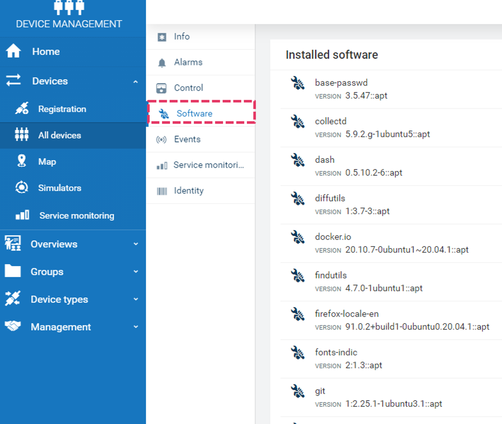

# Install and enable the software management feature
Below steps show how to download, install and enable thin-edge software management feature.

## Download and install software management packages on the device

As a prerequisite, install [tedge and tedge_mapper](../howto-guides/002_installation.md) if not installed already. 

The thin-edge software management packages are in repository on GitHub: [thin-edge.io](https://github.com/thin-edge/thin-edge.io/releases).

To download the package from github repository use the following command (use desired version):

```shell
curl -LJO https://github.com/thin-edge/thin-edge.io/releases/download/<package>_<version>_<arch>.deb
```

where:
> `version` -> thin-edge.io software management components version in x.x.x format
>
> `arch` -> architecture type (amd64, armhf)

Download `tedge_apt_plugin` and `tedge_agent`

```shell
curl -LJO https://github.com/thin-edge/thin-edge.io/releases/download/0.3.0/tedge_apt_plugin_0.3.0_amd64.deb
curl -LJO https://github.com/thin-edge/thin-edge.io/releases/download/0.3.0/tedge_agent_0.3.0_amd64.deb
```

Once the packages are downloaded, proceed to installation.

To install `tedge_apt_plugin` and `tedge_agent` on thin-edge device do:

```shell
sudo dpkg -i tedge_apt_plugin_<version>_<arch>.deb
sudo dpkg -i tedge_agent<version>_<arch>.deb
```


## Start and enable the software management feature

### Using `tedge connect c8y`

The `tedge connect c8y` will automatically start and enable the software management feature.
Find more about [how to connect thin-edge device to cloud](../howto-guides/004_connect.md)

Once the thin-edge device is successfully connected to Cumulocity cloud, the **Software** option will be enabled and
the list of softwares that are installed on the device will be visible as shown in the figure below.



> Note: Disconnecting thin-edge device from cloud with `tedge disconnect c8y` command will stop and disable the software management feature.


### Manually starting and stopping services

For debugging purpose or to disable/enable the software management services, one can start/stop manually as shown below.

### Starting the services

```shell
sudo systemctl start tedge-agent.service
sudo systemctl start tedge-mapper-sm-c8y.service
```

### Stopping the services

```shell
sudo systemctl stop tedge-agent.service
sudo systemctl stop tedge-mapper-sm-c8y.service
```

