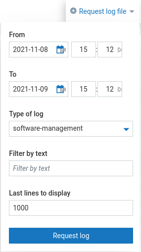
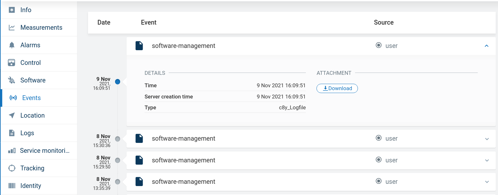

# The thin-edge logs
The logs that are useful for debugging thin-edge.io break down into logs that are created by thin-edge itself and by third party components.

## Thin-edge logs
On a thin-edge device different components like mappers, agent, and plugins run. The log messages of these components can be accessed as below.
The logs here capture INFO, WARNING, and ERROR messages.

### Cloud mapper logs
The thin-edge cloud mapper component that sends the measurement data to the cloud can be accessed as below.

#### Tedge Cumulocity mapper
The log messages of the Cumulocity mapper component that sends the measurement data from the thin-edge device to the Cumulocity
cloud can be accessed as below

`journalctl -u tedge-mapper-c8y.service`

> Note: Run `tedge_mapper --debug c8y` to log more debug messages

#### Tedge Azure mapper
The log messages of the Azure mapper component that sends the measurement data from the thin-edge device to the Azure
cloud can be accessed as below.

`journalctl -u tedge-mapper-az.service`

> Note: Run `tedge_mapper --debug az` to log more debug messages

### Device monitoring logs
The thin-edge device monitoring component logs can be found as below

#### Collectd mapper logs
The log messages of the collectd mapper that sends the monitoring data to the cloud can be accessed as below

`journalctl -u tedge-mapper-collectd.service`

> Note: Run `tedge_mapper --debug collectd` to log more debug messages

### Software Management logs
This section describes how to access the software management component logs

#### Software update operation log
For every new software operation (list/update), a new log file will be created at `/var/log/tedge/agent`.
For each `plugin command` like prepare, update-list (install, remove), finalize, and list,
the log file captures `exit status, stdout, and stderr` messages.

#### Tedge Agent logs
The agent service logs can be accessed as below

`journalctl -u tedge-agent.service`

For example: tedge-agent logs plugin calls finalize and list.

tedge-agent : TTY=unknown ; PWD=/tmp ; USER=root ; COMMAND=/etc/tedge/sm-plugins/apt finalize

tedge-agent : TTY=unknown ; PWD=/tmp ; USER=root ; COMMAND=/etc/tedge/sm-plugins/apt list

> Note: Run `tedge_agent --debug` to log more debug messages

#### Tedge cumulocity sm mapper logs
The software management mapper service logs can be accessed as below

`journalctl -u tedge-mapper-sm-c8y.service`

For example: tedge_mapper[6696]: 2021-09-29T03:38:53.853+00:00 ERROR tedge_mapper::mapper: MQTT connection error: I/O: Connection refused

> Note: Run `tedge_mapper --debug sm-c8y` to log more debug messages

## Thirdparty component logs
Thin-edge uses the third-party components `Mosquitto` as the mqtt broker and `Collectd` for monitoring purpose.
The logs that are created by these components can be accessed on a thin-edge device as below.

### Mosquitto logs
Thin-edge uses `Mosquitto` as the `mqtt broker` for local communication as well as to communicate with the cloud.
The `Mosquitto` logs can be found in `/var/log/mosquitto/mosquitto.log`.
`Mosquitto` captures error, warning, notice, information, subscribe, and unsubscribe messages.

> Note: Set `log_type debug` or `log_type all` on /etc/mosquitto/mosquitto.conf, to capture more debug information.

### Collectd logs
`Collectd` is used for monitoring the resource status of a thin-edge device.
Collectd logs all the messages at `/var/log/syslog`.
So, the collectd specific logs can be accessed using the `journalctl` as below

`journalctl -u collectd.service`

## Accessing logs remotely
You can access logs from Cumulocity's "Logs" tab in Device Management. Do to this, go to the device you want to the logs for
and click on the "Logs" button on the left-hand side. Next, click on the "Request log file" button located in the top right corner. 
This will bring a dropdown into view where you can select the date and time range, the type of log required as well as filter 
for any particular words in the logs (such as ERROR) and select the total number of lines to upload.

Logs are uploaded in the "Events" tab, where you can download them. 

