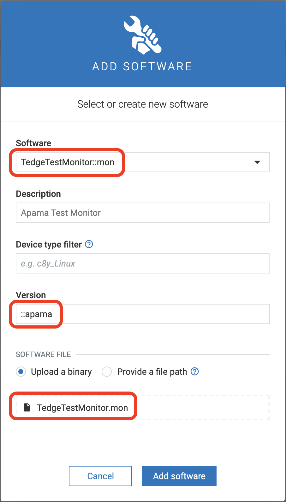

# Apama Software Management Plugin

The apama plugin can be used to install and manage apama artefacts.
This plugin can be used to install an apama project on a device as well as inject monitor files into an already installed project.


## Download and Install Apama Plugin

> Note: This plugin expects an apama installation on the device which is managed as a System V service. If Apama is not installed or if the System V init script is not installed, follow the Apama installation instructions [here](https://github.com/thin-edge/thin-edge.io_examples/tree/main/StreamingAnalytics#setup-and-configuration) before installing/using the apama plugin.

Apama plugin is delivered as a debian package which can be downloaded from the releases section of thin-edge.io repository on [GitHub](https://github.com/thin-edge/thin-edge.io/releases).

Example command for downloading the `0.5.0` version of the plugin for `armhf` architecture (Adjust the version and architecture values as per your requirements):

```shell
curl -LJO https://github.com/thin-edge/thin-edge.io/releases/download/0.5.0/tedge_apama_plugin_0.5.0_armhf.deb
```

Once the debian package is downloaded, install it with the `dpkg` command:

```shell
sudo dpkg -i tedge_apama_plugin_0.5.0_armhf.deb
```

Once the plugin is installed on the device, you can install apama projects and mon files using Cumulocity software management feature.

## Install Apama artefacts from Cumulocity

Before an apama project or a mon files can be installed on the device using the software management feature in Cumulocity, these project files or monitor files need to be added to the Cumulocity software repository first.

There's some naming convention that you need to follow while creating software entries for apama artefacts in the software repository.

For apama projects:

1. Name must be suffixed with `::project` as in `my-demo-project::project`
2. Version must be suffixed with `::apama` as in `1.0::apama` or just `::apama` if you don't need a version number.
3. The uploaded binary must be a `zip` file that contains the `project` directory. If a directory named `project` is not found at the root level in the zip, it's considered invalid.


For apama monitor file:

1. Name must be suffixed with `::mon` as in `MyDemoMonitor::mon`
2. Version must be suffixed with `::apama` as in `2.0::apama` or just `::apama` if you don't need a version number.
3. The uploaded binary must be a `mon` file with `.mon` extension



Once the software modules are added in the software repository, these can be installed on the device just like any other software from the `Software` tab of the device in Cumulocity device UI.

### Testing Apama Plugin

Here are some test apama artefacts that you can use to test this plugin:

1. Demo apama [project zip](https://github.com/thin-edge/thin-edge.io/raw/main/tests/PySys/plugin_apama/Input/quickstart.zip)
2. Demo apama [monitor file](https://github.com/thin-edge/thin-edge.io/raw/main/tests/PySys/plugin_apama/Input/TedgeTestMonitor.mon)

Add these binaries as software packages in Cumulocity software repository by following the instructions in the previous section.
Once added, this apama project can be installed on any target device.
You can test if the project got successfully installed by running the following Apama command:

```shell
/opt/softwareag/Apama/bin/apama_env engine_inspect -m
```

And you can expect an output like this:

```console
Monitors
========
Name                                               Num Sub Monitors
----                                               ----------------
TedgeDemoMonitor                                             1
```

You can find more information on this apama project [here](https://github.com/thin-edge/thin-edge.io_examples/tree/main/StreamingAnalytics#testing-a-project)

Once the project installation is validated successfully, you can install the demo monitor file as well just like you installed the project from Cumulocity.
Once the installation succeeds, you can validate if this monitor file got injected successfully by running the same `engine_inspect` command and you should get an output like this with a second monitor in the list named `TedgeTestMonitor`:

```console
Monitors
========
Name                                               Num Sub Monitors
----                                               ----------------
TedgeDemoMonitor                                             1
TedgeTestMonitor                                             1
```
