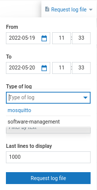

# How to retrieve logs with the log plugin

You can now access any type of logs directly from your Cumulocity UI, using the
`c8y_log_plugin` daemon. To get started install the `c8y_log_plugin`. After
install you should have the following:

- a `c8y-log-plugin.service` file in `/lib/systemd/system/c8y-log-plugin.service`
- a `c8y_log_plugin` binary in `/usr/bin/c8y_log_plugin`

The first thing you need to do is run `c8y_log_plugin` with the `--init` flag. This
will create all the directories/files required.

```shell
sudo c8y_log_plugin --init
```

You can now start the service file:

```shell
sudo systemctl start c8y_log_plugin
```

To always enable this on boot:

```shell
sudo systemctl enable c8y_log_plugin
```

If you go to Cumulocity, you should see that you are able to see the logs tab
and you can request "software-management" logs. However, you are not limited
to only thin-edge logs. To add a new log type, you need to edit the
`c8y-log-plugin.toml` in `/etc/tedge/c8y/c8y-log-plugin.toml`

```shell
sudo nano /etc/tedge/c8y/c8y-log-plugin.toml
```

In this toml file you specify the log type and log path of the logs wished to
be retrieved from Cumulocity UI. For example, if you wish to request thin-edge
software logs and mosquitto logs an example toml file would be:

```toml
files = [
  { type = "software-management", path = "/var/log/tedge/agent/software-*" },
  { type = "mosquitto", path = "/var/log/mosquitto/mosquitto.log" }
]
```

Note that `path` need not be a complete path. In this case the "software-management"
type groups two types of thin-edge files: software-list and software-update.

Once you save this file, you should now see the new log types appear in the
Cumulocity UI.



