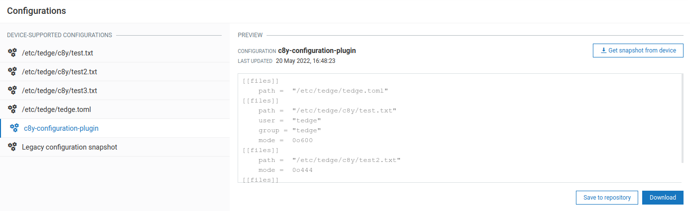

# How to manage configuration files with Cumulocity

With `thin-edge.io`, you can manage config files on a device by using the [Cumulocity configuration management feature](https://cumulocity.com/guides/users-guide/device-management/#managing-configurations) as a part of Device Management.

If you are new to the Cumulocity **Configuration Management** feature,
we recommend you to read [the Cumulocity user guide](https://cumulocity.com/guides/users-guide/device-management/#managing-configurations) along with this how-to guide.

## Installation of `c8y_configuration_plugin`

To enable the feature, first you need to install the `c8y_configuration_plugin` binary on your device.

### Using the `get-thin-edge_io.sh` script on Debian based distributions (Recommended)

If your device supports `apt` as a package manager,
you can install all `thin-edge.io` packages including the `c8y_configuration_plugin` by the `get-thin-edge_io.sh` script.
If you have already used the `get-thin-edge_io.sh` script,
this package is installed, by default.

```shell
curl -fsSL https://raw.githubusercontent.com/thin-edge/thin-edge.io/main/get-thin-edge_io.sh | sudo sh -s
```

### Using the `c8y_configuration_plugin` Debian package on Debian based distributions

For Debian based distributions, we provide the `c8y_configuration_plugin_<version>_<arch>.deb` package as a release asset [here](https://github.com/thin-edge/thin-edge.io/releases).

In case that you didn't use the `get-thin-edge_io.sh` script, you can download the `c8y_configuration_plugin_<version>_<arch>.deb`  package on our [Releases](https://github.com/thin-edge/thin-edge.io/releases) and install it.

```shell
sudo apt install ./path/to/package/c8y_configuration_plugin_<version>_<arch>.deb
```

### Extracting from debian package on non-Debian based distributions

Get the `c8y_configuration_plugin_<version>_<arch>.deb` from our [Releases](https://github.com/thin-edge/thin-edge.io/releases).
Then, run this command in the directory where the package is stored.

```shell
ar -x ./c8y_configuration_plugin_<version>_<arch>.deb | tar -xf ./data.tar.xz
```

The binary is extracted in `<current directory>/usr/bin`.
For more details, refer to our guide [Extracting from debian package](./015_installation_without_deb_support.md#extracting-binaries-from-deb-packages).

### Building from sources

Follow our guide [Buiding thin-edge.io](./../BUILDING.md) and [Building from source](./015_installation_without_deb_support.md#if-building-from-source).

```shell
cargo build --release -p c8y_configuration_plugin
```

A `systemd` unit file for `c8y_configuration_plugin` can be found in the repository at `configuration/init/systemd/c8y-configuration-plugin.service`
and should be installed on the target in: `/lib/systemd/system/c8y-configuration-plugin.service`.

```shell
sudo cp <repository_root>/configuration/init/systemd/c8y-configuration-plugin.service /lib/systemd/system/c8y-configuration-plugin.service
```

## Get started

Before starting anything, make sure [your device is connected to Cumulocity](./../tutorials/connect-c8y.md).

**Step 0**
Unless you installed `c8y_configuration_plugin` using the debian package,
you need one additional step to initialize the plugin. Run this command.

```shell
sudo c8y_configuration_plugin --init
```

**Step 1**
Open the file `/etc/tedge/c8y/c8y-configuration-plugin.toml` and add entries for the configuration files that you'd like to manage from Cumulocity cloud in the following format:

```toml
files = [
    { path = '/etc/tedge/tedge.toml', type = 'tedge.toml'},
    { path = '/etc/tedge/mosquitto-conf/c8y-bridge.conf', type = 'c8y-bridge.conf' },
    { path = '/etc/tedge/mosquitto-conf/tedge-mosquitto.conf', type = 'tedge-mosquitto.conf' },
    { path = '/etc/mosquitto/mosquitto.conf', type = 'mosquitto.conf' },
    { path = '/etc/tedge/c8y/example.txt', type = 'example', user = 'tedge', group = 'tedge', mode = 0o444 }
]
```

* `path` is the full path to the configuration file.
* `type` is a unique alias for each file entry which will be used to represent that file in Cumulocity UI.
* `user`, `group` and `mode` are UNIX file permission settings to be used to create a configuration file. If not provided, the files will be created with `root` user. If the file exists already, its ownership will be retained.

For more details on this configuration file format, refer to the [reference guide](./../references/c8y-configuration-management.md#configuration).

> Note: You can also configure the `c8y-configuration-plugin.toml` from the cloud later.

**Step 2**
Start the configuration plugin process and enable it on boot by `systemctl` (recommended).

```shell
sudo systemctl start c8y-configuration-plugin.service
sudo systemctl enable c8y-configuration-plugin.service
```

Alternatively, you can run the process directly.

```
sudo c8y_configuration_plugin
```

**Step 3**
Navigate to your Cumulocity Device Management and the desired device. Open its **Configuration** tab.
You can find `c8y-configuration-plugin` and more are listed as supported configuration types, as declared in the plugin configuration file in step 1.



This is the configuration file of `c8y_configuration_plugin`, where you can add file entries that you want to manage with Cumulocity.

## Update `c8y-configuration-plugin` from Cumulocity

To update any configuration file, create a local copy of that config file and then upload that file to the [Cumulocity configuration repository](https://cumulocity.com/guides/users-guide/device-management/#to-add-a-configuration-snapshot) with the appropriate configuration type.

The `c8y-configuration-plugin.toml` file can also be updated from the cloud in a similar manner to add/remove further configuration file entries. The updated TOML file has to be uploaded with the configuration type:  **c8y-configuration-plugin**.

Then, go back to the **Configuration** tab of your desired device in Cumulocity.


Click on the config file entry from the **DEVICE SUPPORTED CONFIGURATIONS** files list.
You can choose the file that you uploaded from the **AVAILABLE SUPPORTED CONFIGURATIONS** section, and then apply that file to your device by clicking on the **Send configuration to device** button.

After the operation created gets marked SUCCESSFUL, reload the page.
Then you can find new supported configuration types as you defined.

> Note: All configuration updates are notified over `tedge/configuration_change/<config-type>` MQTT topic, giving the opportunity to software components installed on the device or a child device to react to these updates.
> For more details, refer to the [Notifications section of the specification](./../references/c8y-configuration-management.md#notifications).

To get to know more about the `c8y_configuration_plugin`, refer to [Specifications of Device Configuration Management using Cumulocity](./../references/c8y-configuration-management.md).


