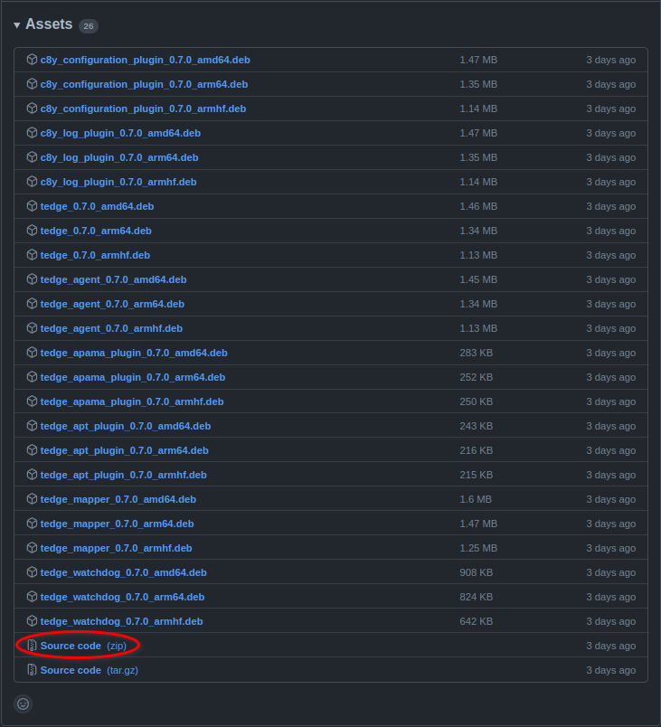
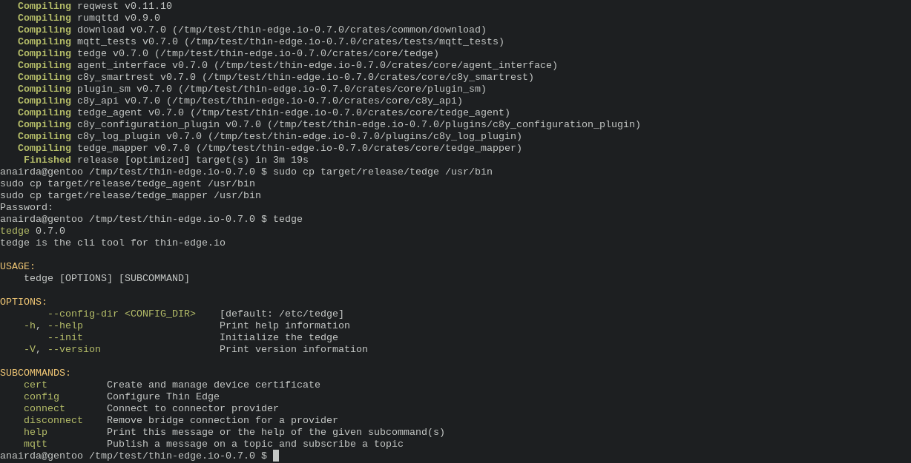
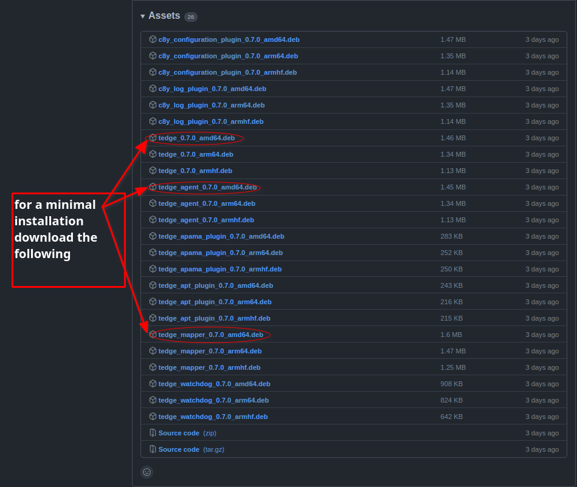
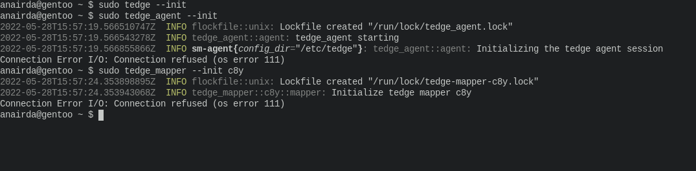
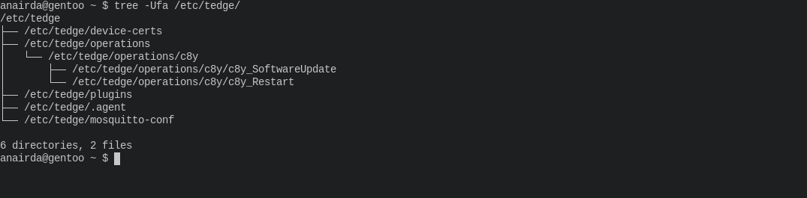

# How to install thin-edge.io manually with OpenRC

This tutorial will demo how to install thin-edge.io manually for a non-debian linux distribution that uses OpenRC as its init system.
The aim of this tutorial is to show how to get started with Cumulocity IoT even if your current system is not supported by the default installation of thin-edge.io.
For reference, this tutorial is done with the following system specs:

- Operating System: Linux gentoo
- Linux kernel version: 5.15.41-gentoo-x86\_64
- Architecture: x86\_64
- Init system: OpenRC

## Prerequisites

If you wish to [build binaries from source](#building-from-source), you will to install rust from https://www.rust-lang.org/tools/install.

You will also need to have mosquitto installed. Check your package manager for an available version, or you can [building from source](https://github.com/eclipse/mosquitto). (If you build from source, add `WITH_TLS=yes` flag to make).


## Building from source

To build from source, download the **Source code (zip)** from the [latest releases page](https://github.com/thin-edge/thin-edge.io/releases/latest).

<p align="center">
  
</p>

Once downloaded, unzip it and enter the thin-edge.io directory and build the project with the `--release` flag:


```shell
unzip thin-edge*.zip
cd thin-edge*/
cargo build --release
```

This will build the thin-edge.io binaries in the target/release directory. You will then need to move each binary to `/usr/bin` or an equivalent location in $PATH.
A minimal thin-edge.io installation requires three components:

- tedge CLI
- tedge agent
- tedge mapper

```shell
sudo mv target/release/tedge /usr/bin
sudo mv target/release/tedge_agent /usr/bin
sudo mv target/release/tedge_mapper /usr/bin
```

You should now have access to the `tedge`, `tedge_agent` and `tedge_mapper` binaries.

<p align="center">
  
</p>


## Extracting binaries from debian files

Download the debian files from the [latest releases page](https://github.com/thin-edge/thin-edge.io/releases/latest).
For a minimal configuration of thin-edge.io with Cumulocity IoT, you will need to download:

- tedge\_{VERSION}\_amd64.deb
- tedge\_agent\_{VERSION}\_amd64.deb
- tedge\_mapper\_{VERSION}\_amd64.deb

<p align="center">
  
</p>

Next, unpack each deb file and copy the binary to `/usr/bin`.
For `tedge` debian package do:

```shell
ar -x tedge_*_amd64.deb | tar -xf data.tar.xz
```
This unpacks two directories `usr/bin/`, move its contents to `/usr/bin`

```shell
sudo mv usr/bin/tedge /usr/bin
```

> Note: Do the same for tedge\_agent and tedge\_mapper debian packages.


## Step 1: Creating the tedge user

The next step is to create the tedge user. This is normally taken care by the debian package for the `tedge` CLI tool.

To do this in Gentoo, for example, you can:

```shell
sudo groupadd --system tedge

sudo useradd --system --no-create-home -c "" -s /sbin/nologin -g tedge tedge
```

Now that we have created the tedge user, we need to allow the tedge user to call commands with `sudo` without requiring a password:

```shell
sudo echo "tedge  ALL = (ALL) NOPASSWD: /usr/bin/tedge, /etc/tedge/sm-plugins/[a-zA-Z0-9]*, /bin/sync, /sbin/init" >/etc/sudoers.d/tedge
```

Next, create the files and directories required by thin-edge.io and restart mosquitto too.

```shell
sudo rc-service mosquitto stop
sudo tedge --init
sudo rc-service mosquitto start
sudo tedge_agent --init
sudo tedge_mapper --init c8y
```

This should show the following output:

<p align="center">
  
</p>

> Note: if you do not restart mosquitto you will see a Connection refused error. Do not worry, this error can be ignored.

Ensure that running the init has created the following files and directories in `/etc/tedge`:

<p align="center">
  
</p>

## Step 3: Creating mosquitto bridge

To create the mosquitto bridge simply run:

```shell
sudo echo "include_dir /etc/tedge/mosquitto-conf" >> /etc/mosquitto/mosquitto.conf
```
You can test that `mosquitto` works by running: 

```shell
sudo mosquitto --config-file /etc/mosquitto/mosquitto.conf
```

## Step 4: Creating OpenRC service files

You will need service files for tedge\_agent and tedge\_mapper. For example:

> Note that, for Cumulocity IoT, the `tedge connect` command expects three service files called: mosquitto, tedge-agent and tedge-mapper-c8y

For the `tedge-agent` service an example file is the following:
> FILE: /etc/init.d/tedge-agent
```sh
#!/sbin/runscript

start() {
   ebegin "Starting tedge-agent"
   start-stop-daemon --user tedge --start --background --exec tedge_agent
   eend $?
}

stop() {
    ebegin "Stopping tedge-agent"
    start-stop-daemon --stop --exec tedge_agent
    eend $?
}
```

For the `tedge-mapper-c8y` service an example file is the following:
> FILE: /etc/init.d/tedge-mapper-c8y
```sh
#!/sbin/runscript

start() {
   ebegin "Starting tedge-mapper-c8y"
   start-stop-daemon --user tedge --start --background --exec tedge_mapper c8y
   eend $?
}

stop() {
   ebegin "Stopping tedge-mapper-c8y"
   start-stop-daemon --stop --exec tedge_mapper
   eend $?
}
```


```sh
sudo chmod +x /etc/init.d/tedge-agent
sudo chmod +x /etc/init.d/tedge-mapper-c8y
```

Next, we need to add a `system.toml` to `/etc/tedge/`, telling it to use OpenRC. To do this create the following file:


> FILE: /etc/tedge/system.toml
```sh
[init]
name = "OpenRC"
is_available = ["/sbin/rc-service", "-l"]
restart = ["/sbin/rc-service", "{}", "restart"]
stop =  ["/sbin/rc-service", "{}", "stop"]
enable =  ["/sbin/rc-update", "add", "{}"]
disable =  ["/sbin/rc-update", "delete", "{}"]
is_active = ["/sbin/rc-service", "{}", "status"]
```

Limit the file's permission to read only:

```sh
sudo chmod 444 /etc/tedge/system.toml
```

Finally, add the thin-edge.io services to start after boot: 

```
sudo rc-update add tedge-agent default
sudo rc-update add tedge-mapper-c8y default
```

We are finally ready to [connect to Cumulocity](../tutorials/connect-c8y.md)!

