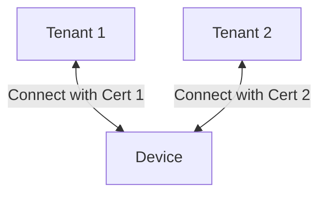

import UserContext from '@site/src/components/UserContext';
import UserContextForm from '@site/src/components/UserContextForm';

Starting with version 1.4.0, **%%te%%** supports multiple Cumulocity connections
using cloud profiles. This can be useful for migrating from one Cumulocity
tenant to another, where Cloud profiles allow you to configure and run multiple
`tedge-mapper c8y` instances from a single `tedge.toml` configuration file.

:::tip
#### User Context {#user-context}

You can customize the documentation and commands shown on this page by providing
relevant settings which will be reflected in the instructions. It makes it even
easier to explore and use %%te%%.

<UserContextForm settings="C8Y_PROFILE_NAME,C8Y_PROFILE_URL,C8Y_URL,DEVICE_ID" />

The user context will be persisted in your web browser's local storage.
:::

## Configuration
There are a few values that need to be configured before we are able to connect
to a second Cumulocity tenant.

### URL
To connect to a second tenant, start by configuring the URL of the new tenant:

<UserContext>
```sh
sudo tedge config set c8y.url $C8Y_PROFILE_URL --profile $C8Y_PROFILE_NAME
```
</UserContext>

The profile name can be any combination of letters and numbers, and is used only
to identify the cloud profile within thin-edge. The names are case insensitive,
so `--profile second` and `--profile SECOND` are equivalent.

You can now see the configuration has been applied to `tedge.toml`:

```sh
tedge config list url
```

<UserContext language="sh" title="Output">

```sh
c8y.url=$C8Y_URL
c8y.profiles.$C8Y_PROFILE_NAME.url=$C8Y_PROFILE_URL
```

</UserContext>

In addition to the URL there are a couple of other configurations that need to
be set for the second mapper:
- the MQTT bridge topic prefix
- the Cumulocity proxy bind port

### MQTT bridge topic prefix
<UserContext>
```sh
sudo tedge config set c8y.bridge.topic_prefix c8y-$C8Y_PROFILE_NAME --profile $C8Y_PROFILE_NAME
```
</UserContext>

Setting `c8y.bridge.topic_prefix` will change the MQTT topics that the
Cumulocity bridge publishes to/listens to in mosquitto. The default value is
`c8y`, so the mapper publishes measurements to `c8y/s/us`, and this is
forwarded to Cumulocity on the `s/us` topic. In the example above, we set the
topic prefix to `c8y-second`, so the equivalent local topic would
`c8y-second/s/us`. It is recommended, but not required, to include `c8y` in the
topic prefix, to make it clear that the relevant topics are bridge topics that
will forward to and from Cumulocity.

### Cumulocity proxy bind port
<UserContext>
```
sudo tedge config set c8y.proxy.bind.port 8002 --profile $C8Y_PROFILE_NAME
```
</UserContext>

Since the Cumulocity mapper hosts a [proxy server for
Cumulocity](../../references/cumulocity-proxy.md) and there will be a second
mapper instance running, this configuration also needs to be unique per profile.

### Optional per-profile configurations
All the Cumulocity-specific configurations (those listed by `tedge config list
--doc c8y`) can be specified per-profile to match tenant-specific constraints.

## Connecting
Once the second cloud profile has been configured, you can finally connect the
second mapper using:

<UserContext>
```
sudo tedge connect c8y --profile $C8Y_PROFILE_NAME
```
</UserContext>

<UserContext language="" title="Output">
```
Connecting to Cumulocity with config:
        device id: $DEVICE_ID
        cloud profile: $C8Y_PROFILE_NAME
        cloud host: $C8Y_PROFILE_URL:8883
        certificate file: /etc/tedge/device-certs/tedge-certificate.pem
        bridge: mosquitto
        service manager: systemd
        mosquitto version: 2.0.11
Creating device in Cumulocity cloud... ✓
Restarting mosquitto... ✓
Waiting for mosquitto to be listening for connections... ✓
Verifying device is connected to cloud... ✓
Enabling tedge-mapper-c8y@$C8Y_PROFILE_NAME... ✓
Checking Cumulocity is connected to intended tenant... ✓
Enabling tedge-agent... ✓
```
</UserContext>

Once the mapper is running, you can restart it by running:

<UserContext>
```
sudo systemctl restart tedge-mapper-c8y@$C8Y_PROFILE_NAME
```
</UserContext>

This uses a systemd service template to create the `tedge-mapper-c8y@second`
service. If you are not using systemd, you will need to create a service
definition for `tedge-mapper-c8y@second` before attempting to connect your
device to a second Cumulocity instance.

## Environment variables
For easy configuration of profiles in shell scripts, you can set the profile
name using the environment variable `TEDGE_CLOUD_PROFILE`.

<UserContext language="sh" title="With arguments">
```
sudo tedge config set c8y.url $C8Y_URL
sudo tedge connect c8y

sudo tedge config set c8y.url $C8Y_PROFILE_URL --profile $C8Y_PROFILE_NAME
sudo tedge config set c8y.bridge.topic_prefix c8y-$C8Y_PROFILE_NAME --profile $C8Y_PROFILE_NAME
sudo tedge config set c8y.proxy.bind.port 8002 --profile $C8Y_PROFILE_NAME
sudo tedge connect c8y --profile $C8Y_PROFILE_NAME
```
</UserContext>

<UserContext language="sh" title="With environment variable">
```sh title="With environment variable"
# You can set the profile name to an empty string to use the default profile
export TEDGE_CLOUD_PROFILE=
sudo tedge config set c8y.url $C8Y_URL
sudo tedge connect c8y

export TEDGE_CLOUD_PROFILE=$C8Y_PROFILE_NAME
sudo tedge config set c8y.url $C8Y_PROFILE_URL
sudo tedge config set c8y.bridge.topic_prefix c8y-$C8Y_PROFILE_NAME
sudo tedge config set c8y.proxy.bind.port 8002
sudo tedge connect c8y

export TEDGE_CLOUD_PROFILE=
sudo tedge config get c8y.url #=> $C8Y_URL

export TEDGE_CLOUD_PROFILE=$C8Y_PROFILE_NAME
sudo tedge config get c8y.url #=> $C8Y_PROFILE_URL
```
</UserContext>

If you need to temporarily override a profiled configuration, you can use
environment variables of the form `TEDGE_C8Y_PROFILES_<NAME>_<CONFIGURATION>`.
For example:

<UserContext>
```
$ TEDGE_C8Y_PROFILES_$C8Y_PROFILE_NAME_URL=different.example.com tedge config get c8y.url --profile $C8Y_PROFILE_NAME
different.example.com
$ TEDGE_C8Y_PROFILES_$C8Y_PROFILE_NAME_PROXY_BIND_PORT=1234 tedge config get c8y.proxy.bind.port --profile $C8Y_PROFILE_NAME
1234
```
</UserContext>

If you are configuring %%te%% entirely with environment variables, e.g. in a
containerised deployment, you probably don't need to make use of cloud profiles
as you can set the relevant configurations directly on each mapper instance.

## Examples

### Example: Connect to a second Cumulocity Tenant

Assuming you have %%te%% device that is already connected to one Cumulocity tenant, and you now want to connect the device to a second Cumulocity tenant so that you can expose the second tenant to customer of yours. In this scenario, you don't want to expose all of the device management aspects like firmware/software installation, but you want the customer to be able to view telemetry data being sent by the device. This setup is enabled by using cloud profiles, which setups up two instances of the tedge-mapper-c8y service, one per Cumulocity tenant connection.

The following diagram illustrates the target setup where the same device is connected to two different Cumulocity tenants, where each connection is using a different device certificate (however the same the private key is used for both connections).



The above setup can be achieved with the following steps:

1. Set the Cumulocity URL of the second tenant you wish connect the device to

    <UserContext>

    ```sh
    sudo tedge config set c8y.url $C8Y_PROFILE_URL --profile $C8Y_PROFILE_NAME
    ```

    </UserContext>

    :::note
    The `--profile <name>` argument is used to indicate that you wish to change the settings for the cloud profile of the given name.
    :::

1. Change the public certificate path which will be used by the second connection (though it doesn't exist just yet)

    <UserContext>

    ```sh
    sudo tedge config set c8y.device.cert_path /etc/tedge/device-certs/tedge-certificate-$C8Y_PROFILE_NAME.pem --profile $C8Y_PROFILE_NAME
    ```

    </UserContext>

1. Change the bridge related settings to avoid conflicts with the default Cumulocity connection

    <UserContext>

    ```sh
    sudo tedge config set c8y.bridge.topic_prefix c8y-$C8Y_PROFILE_NAME --profile $C8Y_PROFILE_NAME
    sudo tedge config set c8y.proxy.bind.port 8002 --profile $C8Y_PROFILE_NAME
    ```

    </UserContext>

1. Optional: Set which telemetry data is pushed to the second connection by changing which %%te%% topics the mapper instance subscribes to

    <UserContext>

    ```sh
    # default connection: send all data
    tedge config set c8y.topics "te/+/+/+/+,te/+/+/+/+/twin/+,te/+/+/+/+/m/+,te/+/+/+/+/m/+/meta,te/+/+/+/+/e/+,te/+/+/+/+/a/+,te/+/+/+/+/status/health" --profile $C8Y_PROFILE_NAME

    # second connection: only send measurements and twin information but not alarms and events
    tedge config set c8y.topics "te/+/+/+/+,te/+/+/+/+/twin/+,te/+/+/+/+/m/+,te/+/+/+/+/m/+/meta,te/+/+/+/+/status/health" --profile $C8Y_PROFILE_NAME
    ```

    </UserContext>

    :::note
    If you modify these settings after %%te%% is already connected, then you will have to restart the mapper afterwards.
    :::

    You can also control which operation should be enabled for the connection by setting the following settings to `false`.

    <UserContext>

    ```sh
    # enable fetch style operations
    tedge config set c8y.enable.log_upload false --profile $C8Y_PROFILE_NAME
    tedge config set c8y.enable.config_snapshot false  --profile $C8Y_PROFILE_NAME

    # disable operations which change things
    tedge config set c8y.enable.config_update false --profile $C8Y_PROFILE_NAME
    tedge config set c8y.enable.firmware_update false --profile $C8Y_PROFILE_NAME
    tedge config set c8y.enable.device_profile false --profile $C8Y_PROFILE_NAME
    ```

    </UserContext>

1. Navigate to the Cumulocity Device Registration application, and register a single device using the Cumulocity CA feature where you can set the one-time password that the device will use to download it.

1. Download the device certificate from the Cumulocity CA

    <UserContext>

    ```sh
    sudo tedge cert download c8y --profile $C8Y_PROFILE_NAME --one-time-password "<one_time_password>" --device-id "$(tedge config get device.id)"
    ```

    </UserContext>

    :::note
    You can use your own Certificate Authority to issue a certificate, but then you will have to retrieve the certificate yourself and place in the configured path.
    :::

1. Connect the device to the second Cumulocity tenant

    <UserContext>

    ```sh
    sudo tedge connect c8y --profile $C8Y_PROFILE_NAME
    ```

    </UserContext>

    If you are using systemd on your device, then a certificate renewal service which will automatically renew the certificate for you. You can inspect the timer which triggers the `tedge-cert-renewer-c8y@` service periodically using the following command:

    <UserContext>
    
    ```sh
    # check the timer
    sudo systemctl status tedge-cert-renewer-c8y@$C8Y_PROFILE_NAME.timer

    # check the service called by the timer
    sudo systemctl status tedge-cert-renewer-c8y@$C8Y_PROFILE_NAME.service
    ```

    </UserContext>
