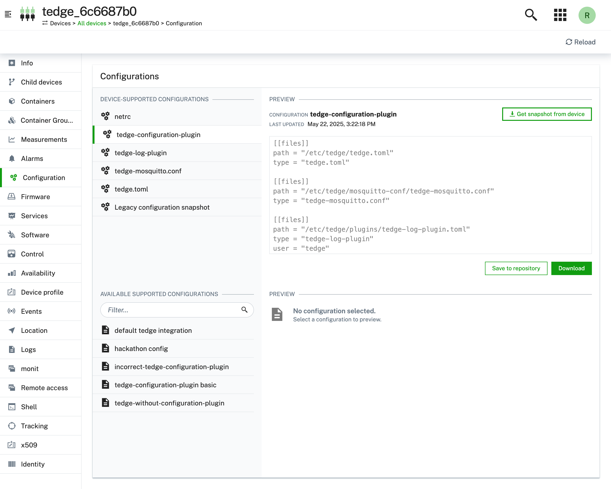
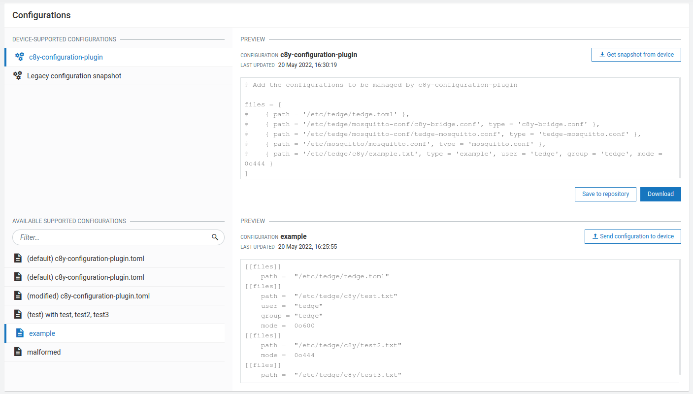

import BrowserWindow from '@site/src/components/BrowserWindow';

With %%te%%, you can manage config files on a device by using the [Cumulocity configuration management feature](https://cumulocity.com/docs/device-management-application/managing-device-data/#managing-configurations) as a part of Device Management.

If you are new to the Cumulocity **Configuration Management** feature,
we recommend you to read [the Cumulocity user guide](https://cumulocity.com/docs/device-management-application/managing-device-data/#managing-configurations) along with this how-to guide.

The configuration management functionality is provided by the **tedge-agent** service which is installed by default.

## Getting started

Before starting anything, make sure [your device is connected to Cumulocity](../../start/connect-c8y.md).

**Step 1**
Open the file `/etc/tedge/plugins/tedge-configuration-plugin.toml` and add entries for the configuration files that you'd like to manage from Cumulocity cloud in the following format:

```toml title="file: /etc/tedge/plugins/tedge-configuration-plugin.toml"
files = [
  { path = '/etc/tedge/tedge.toml', type = 'tedge.toml'},
  { path = '/etc/tedge/mosquitto-conf/c8y-bridge.conf', type = 'c8y-bridge.conf' },
  { path = '/etc/tedge/mosquitto-conf/tedge-mosquitto.conf', type = 'tedge-mosquitto.conf' },
  { path = '/etc/mosquitto/mosquitto.conf', type = 'mosquitto.conf' },
  { path = '/etc/tedge/c8y/example.txt', type = 'example', user = 'tedge', group = 'tedge', mode = 0o644 },
  { path = '/etc/containers/certs.d/example/ca.crt', type = 'harbor-certificate', user = 'tedge', group = 'tedge', mode = 0o640, parent_user = 'root', parent_group = 'root', parent_mode = 0o755 },
]
```

* `path` is the full path to the configuration file.
* `type` is a unique alias for each file entry which will be used to represent that file in Cumulocity UI.
* `user`, `group` and `mode` are UNIX file permission settings to be used to create a configuration file. 
  If not provided, the files will be created with the current user and group, and, if not feasible, using `root`.
  If the file exists already, its ownership will be retained.
* `parent_user`, `parent_group` and `parent_mode` are UNIX file permission settings to be used to create the immediate
  parent directory of the configuration file. It is recommended to set these values if the parent directories are
  expected to be missing initially.
    * If these values are not explicitly provided,
        * the values from `user` and `group` will be used as a fallback.
        * if `user` and `group` are also not specified,
            * the directories will be created with the `root` user if `tedge-write` is enabled.
            * otherwise, the current system user and group will be used.
    * If the directories already exist, its existing ownership and permissions will be preserved.

:::note
The Cumulocity legacy configuration operations (e.g. non file-type operations) will be automatically given the "default" type. This will enable you to configure the file location as you would with any other configuration file.
:::

For more details on this configuration file format, refer to the [reference guide](../../references/agent/tedge-configuration-management.md#configuration).

:::note
You can also configure the `tedge-configuration-plugin.toml` from the cloud later.
:::

**Step 2**
Navigate to your Cumulocity Device Management and the desired device. Open its **Configuration** tab.
You can find `tedge-configuration-plugin` and more are listed as supported configuration types, as declared in the plugin configuration file in step 1.

<BrowserWindow url="https://example.cumulocity.com/apps/devicemanagement/index.html#/device-configuration">



</BrowserWindow>

This is the configuration file of `tedge-configuration-plugin`, where you can add file entries that you want to manage with Cumulocity.

## Update tedge-configuration-plugin configuration from Cumulocity

To update any configuration file, create a local copy of that config file and then upload that file to the [Cumulocity configuration repository](https://cumulocity.com/docs/device-management-application/managing-device-data/#to-add-a-configuration-snapshot) with the appropriate configuration type.

The `tedge-configuration-plugin.toml` file can also be updated from the cloud in a similar manner to add/remove further configuration file entries. The updated TOML file has to be uploaded with the configuration type:  **tedge-configuration-plugin**.

Then, go back to the **Configuration** tab of your desired device in Cumulocity.

<BrowserWindow url="https://example.cumulocity.com/apps/devicemanagement/index.html#/device-configuration">



</BrowserWindow>

Click on the config file entry from the **DEVICE SUPPORTED CONFIGURATIONS** files list.
You can choose the file that you uploaded from the **AVAILABLE SUPPORTED CONFIGURATIONS** section, and then apply that file to your device by clicking on the **Send configuration to device** button.

After the operation created gets marked SUCCESSFUL, reload the page.
Then you can find new supported configuration types as you defined.

To get to know more about the `tedge-configuration-plugin`, refer to [Specifications of Device Configuration Management using Cumulocity](../../references/agent/tedge-configuration-management.md).
