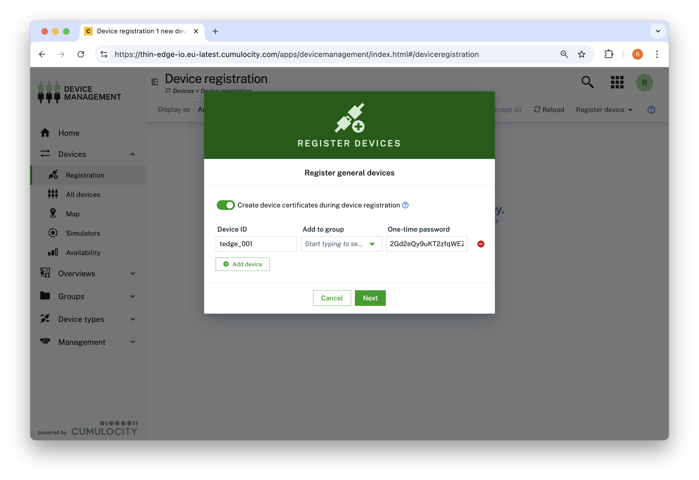
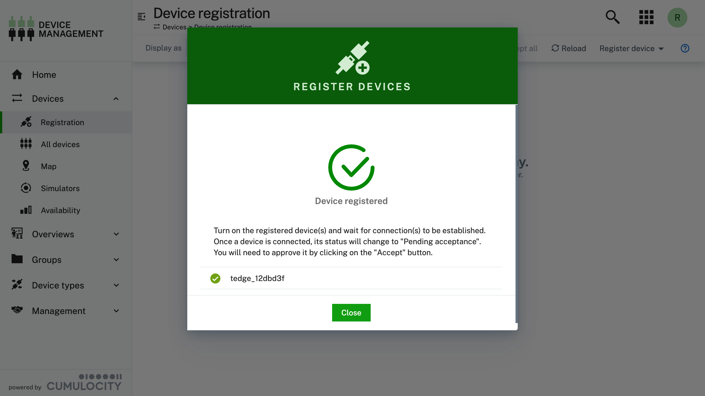

import UserContext from '@site/src/components/UserContext';
import UserContextForm from '@site/src/components/UserContextForm';
import BrowserWindow from '@site/src/components/BrowserWindow';

:::tip
#### User Context {#user-context}

You can customize the documentation and commands shown on this page by providing relevant settings which will be reflected in the instructions. It makes it even easier to explore and use %%te%%.

<UserContextForm settings="DEVICE_ID,C8Y_URL,C8Y_USER" />

The user context will be persisted in your web browser's local storage.
:::

To create northbound connection, a local bridge shall be established and this can be achieved with `tedge` cli. The sections below explain the steps required to establish a connection to Cumulocity.

:::note
`tedge connect` requires root privileges, so you need to run it using `sudo` or run the command as root.
:::

## Setting the cloud endpoint

Configure required parameters for %%te%% with [`tedge config set`](../../references/cli/tedge-config.md):

<UserContext>

```sh
sudo tedge config set c8y.url $C8Y_URL
```

</UserContext>

:::info
If you are unsure which parameters required by the command, simply run the command and it will tell you which parameters are missing.

For example, if we issue [`tedge connect c8y`](../../references/cli/tedge-connect.md) without any configuration following advice will be given:

```sh
sudo tedge connect c8y
```

```sh title="Output"
...
Error: failed to execute `tedge connect`.

Caused by:
    Required configuration item is not provided 'c8y.url', run 'tedge config set c8y.url <value>' to add it to config.
```

This message explains which configuration parameter is missing and how to add it to configuration,
in this case we are told to run `tedge config set c8y.url <value>`.
:::

## Making the cloud trust the device

%%te%% primarily uses a x509 certificate to connect to Cumulocity, therefore the certificate must be trusted by Cumulocity in order for the connection to be established.

There are a few different ways to get the device certificate to be trusted by Cumulocity, below lists a few common options.

### Option 1: Using Cumulocity Certificate Authority (Preview) {#cumulocity-certificate-authority}

The [Cumulocity Certificate Authority](https://cumulocity.com/docs/device-certificate-authentication/certificate-authority/) feature is currently in the Public Preview phase and hence needs to be enabled for a specific tenant before it can be used. Please read the [Certificate Management Reference Guide](../../../references/certificate-management#enable-cumulocity-certificate-authority) on how to enable this feature in Cumulocity.

Devices can be registered by using the Cumulocity Device Management UI or by using Cumulocity's REST API which is demonstrated via the usage of the command line tool, [go-c8y-cli](https://goc8ycli.netlify.app/). The following sections detail the steps on how to register a device using both of these methods, however both are functionally the same as they all utilize the same Cumulocity API.

#### Registering a device using the Device Management UI {#cumulocity-ca-register-ui}

The following steps detail how to register a device using the Cumulocity [Device Management UI Application](https://cumulocity.com/docs/device-management-application/device-management-introduction/).

1. Open the Cumulocity *Device Management* UI Application

1. Navigate to *Devices* &rarr; *Registration*

1. Click *Register device* and select *General*

    <BrowserWindow url="https://example.cumulocity.com/apps/devicemanagement/index.html#/deviceregistration">

    

    </BrowserWindow>

1. In the *Register general devices* dialog box, select the "Create device certificates during device registration" option

1. Fill in the following required fields and click *Next*

    <BrowserWindow url="https://example.cumulocity.com/apps/devicemanagement/index.html#/deviceregistration">

    

    </BrowserWindow>

    |Field|Description|
    |----|-----------|
    |Device ID|Device's which will be used as the Common Name in the device's certificate|
    |One-time password|One-time password that the device can use to download its device certificate. Maximum length of 32 characters|

    :::tip
    Make sure you copy the one-time password as this will be required on the device.
    :::

1. Close the form

    <BrowserWindow url="https://example.cumulocity.com/apps/devicemanagement/index.html#/deviceregistration">

    

    </BrowserWindow>

1. On the device, run the following command to download the device's certificate (you will be prompted for the one-time password)

    <UserContext>

    ```sh
    sudo tedge cert download c8y --device-id "$DEVICE_ID"

    # Or provide the one-time password via the flag
    sudo tedge cert download c8y \
        --device-id "$DEVICE_ID" \
        --one-time-password "$DEVICE_ONE_TIME_PASSWORD"
    ```

    </UserContext>

#### Register a device using go-c8y-cli command {#cumulocity-ca-register-cli}

Below describes the steps to register a new device using a combination of [go-c8y-cli](https://goc8ycli.netlify.app/) commands and %%te%%.

:::note
go-c8y-cli simply uses the Cumulocity REST API to perform the actions, this means that you can also do the same steps by using the API directly.
:::

1. Register the device using [go-c8y-cli](https://goc8ycli.netlify.app/)

    <UserContext>

    ```sh title="on the operator laptop"
    c8y deviceregistration register-ca --id "$DEVICE_ID"
    ```

    </UserContext>

    If you want don't want to use an auto generated one-time password then you can provide your own value via the `--one-time-password` flag.

    <UserContext>

    ```sh title="on the operator laptop"
    c8y deviceregistration register-ca \
        --id "$DEVICE_ID" \
        --one-time-password "$DEVICE_ONE_TIME_PASSWORD"
    ```

    </UserContext>

1. On the device, run the following command to download the device's certificate (you will be prompted for the one-time password)

    <UserContext>

    ```sh title="on the device"
    sudo tedge cert download c8y --device-id "$DEVICE_ID"

    # Or provide the one-time password via the flag
    sudo tedge cert download c8y \
        --device-id "$DEVICE_ID" \
        --one-time-password "$DEVICE_ONE_TIME_PASSWORD"
    ```

    </UserContext>

    :::note
    The operator has to give the *same* device id and one-time password *twice*, to the tenant and to the device.
    This is the proof that the device can be trusted by the tenant and the tenant by the device,
    *provided* the operator is trusted by the tenant and the device (i.e. has been granted the appropriate access privileges).
    :::

### Option 2: Using self-signed certificates

For development purposes, you can use self-signed certificates which can be created on device and then uploaded to Cumulocity using %%te%% or using the [Cumulocity UI](https://cumulocity.com/docs/device-management-application/managing-device-data/#managing-trusted-certificates).

The usage of the [`tedge cert upload`](../../references/cli/tedge-cert.md) command is described below.

<UserContext>

```sh
sudo tedge cert upload c8y --user "$C8Y_USER"
```

</UserContext>

:::note
The `tedge cert upload` command requires the credentials of a Cumulocity user
having the permissions to upload trusted certificates on the Cumulocity tenant of the device.

The user name is provided as `--user <username>` parameter,
and the command will prompt you for this user's password.
These credentials are used only for this upload and will in no case be stored on the device.
:::

## Creating an MQTT bridge between the device and the cloud

The connection from the device to the cloud is established using a so-called MQTT bridge:
a permanent secured bidirectional MQTT connection that forward messages back and forth
between the two end-points.

To create the bridge use the [`tedge connect`](../../references/cli/tedge-connect.md) command.

```sh
sudo tedge connect c8y
```

<UserContext language="text" title="Output">

```
connect to Cumulocity cloud.:
	device id: $DEVICE_ID
	cloud profile: <none>
	cloud host: $C8Y_URL:8883
	auth type: Certificate
	certificate file: /etc/tedge/device-certs/tedge-certificate.pem
	cryptoki: false
	bridge: mosquitto
	service manager: systemd
	mosquitto version: 2.0.11
	proxy: Not configured
Creating device in Cumulocity cloud... ✓
Restarting mosquitto... ✓
Waiting for mosquitto to be listening for connections... ✓
Verifying device is connected to cloud... ✓
Enabling tedge-mapper-c8y... ✓
Checking Cumulocity is connected to intended tenant... ✓
Enabling tedge-agent... ✓
```

</UserContext>

## Errors

### Connection already established

If connection has already been established following error may appear:

```sh
sudo tedge connect c8y
```

<UserContext language="text" title="Output">

```text title="Output"
connect to Cumulocity cloud.:
	device id: $DEVICE_ID
	cloud profile: <none>
	cloud host: $C8Y_URL:8883
	auth type: Certificate
	certificate file: /etc/tedge/device-certs/tedge-certificate.pem
	cryptoki: false
	bridge: mosquitto
	service manager: systemd
	mosquitto version: 2.0.11
	proxy: Not configured
Error: failed to connect to Cumulocity cloud.

Caused by:
    Connection is already established. To remove the existing connection, run `tedge disconnect c8y` and try again.
```

</UserContext>

To remove existing connection and create new one follow the advice and issue [`tedge disconnect c8y`](../../references/cli/tedge-disconnect.md):

```sh
sudo tedge disconnect c8y
```

```text title="Output"
Removing bridge config file... ✓
Restarting mosquitto to apply configuration... ✓
Disabling tedge-mapper-c8y... ✓
```

:::note
`tedge disconnect c8y` also stops and disables the **tedge-mapper** service if it is installed on the device.
:::

And now you can issue [`tedge connect c8y`](../../references/cli/tedge-connect.md) to create new bridge.

### Connection check warning

Sample output of tedge connect when this warning occurs:

```sh
sudo tedge connect c8y
```

```text title="Output"
ERROR: Local MQTT publish has timed out.
Warning: Bridge has been configured, but Cumulocity connection check failed.
```

This warning may be caused by some of the following reasons:

- No access to Internet connection

Local bridge has been configured and is running but the connection check has failed due to no access to the northbound endpoint.

- Cumulocity tenant not available

Tenant couldn't be reached and therefore connection check has failed.

- Check bridge

Bridge configuration is correct but the connection couldn't be established to unknown reason.

You an retry the connect to the cloud by using:

```sh
sudo tedge reconnect c8y
```

### File permissions

Connecting without sudo will result in the following error:

```sh
tedge connect c8y
```

<UserContext language="text" title="Output">

```text title="Output"
connect to Cumulocity cloud.:
	device id: $DEVICE_ID
	cloud profile: <none>
	cloud host: $C8Y_URL:8883
	auth type: Certificate
	certificate file: /etc/tedge/device-certs/tedge-certificate.pem
	cryptoki: false
	bridge: mosquitto
	service manager: systemd
	mosquitto version: 2.0.11
	proxy: Not configured
Creating device in Cumulocity cloud... ✗
error: Failed to create TLS client config: Could not access /etc/tedge/device-certs/tedge-private-key.pem: Permission denied (os error 13)
```

</UserContext>

tedge connect cannot access directory to create the bridge configuration (`/etc/tedge/mosquitto-conf`), check permissions for the directory and adjust it to allow the tedge connect to access it.

Example of incorrect permissions:

```sh
ls -l /etc/tedge
```

```text title="Output"
dr--r--r-- 2 tedge     tedge     4096 Mar 30 15:40 mosquitto-conf
```

You should give it the permission 755.

```sh
ls -l /etc/tedge
```

```text title="Output"
drwxr-xr-x 2 tedge     tedge     4096 Mar 30 15:40 mosquitto-conf
```

### Mosquitto and systemd check fails

Sample output:

```sh
sudo tedge connect c8y
```

<UserContext language="text" title="Output">

```text title="Output"
Failed to detect mosquitto version: assuming mosquitto version < 2.0.0
connect to Cumulocity cloud.:
	device id: $DEVICE_ID
	cloud profile: <none>
	cloud host: $C8Y_URL:8883
	auth type: Certificate
	certificate file: /etc/tedge/device-certs/tedge-certificate.pem
	cryptoki: false
	bridge: mosquitto
	service manager: systemd
	proxy: Not configured
Creating device in Cumulocity cloud... ✓
Restarting mosquitto... ✗
error: Service command <"/bin/systemctl stop mosquitto"> failed with code: 5.
Cleaning up /etc/tedge/mosquitto-conf/c8y-bridge.conf due to failure... ✓
```

</UserContext>

mosquitto server has not been installed on the system and it is required to run this command, refer to the [install guide](../../install/index.md) to install mosquitto and try again.
