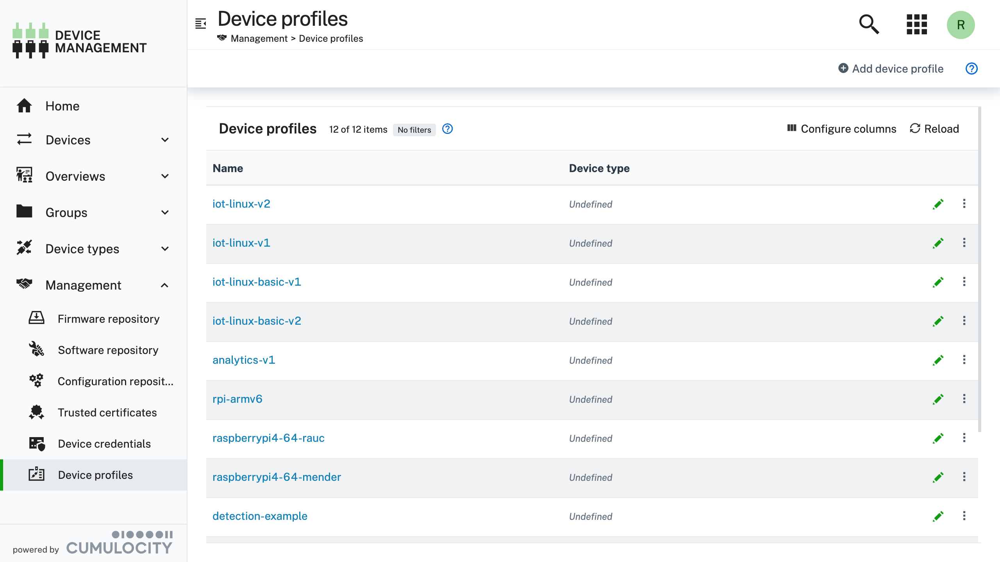
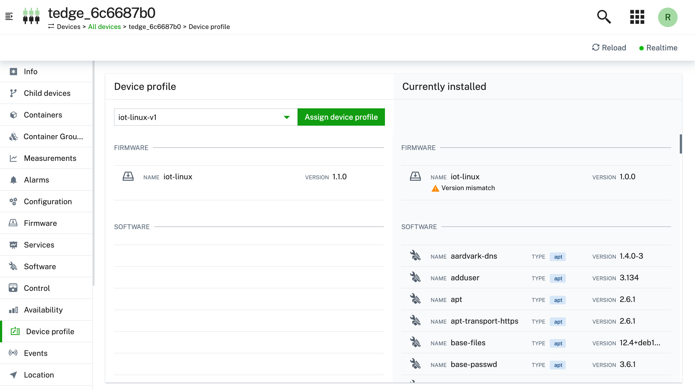
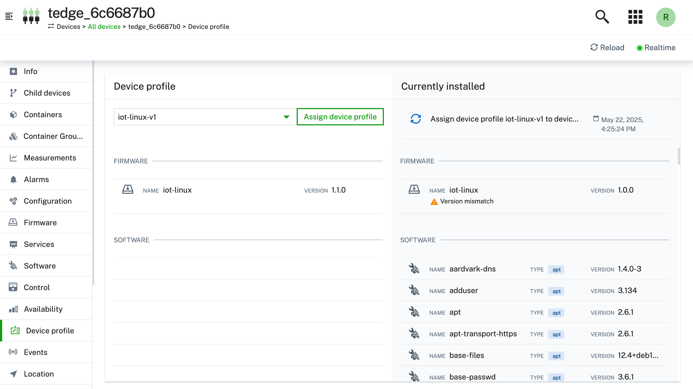

## Management

%%te%% enables you to manage the firmware, software and configuration for a device in a single operation which makes it suitable for managing a large fleet of devices. The following sections detail how to create and assign a device profile to a device. Using Cumulocity, you can either assign a device profile using a single operation (described on this page), or by using a [bulk operation](https://cumulocity.com/docs/device-management-application/monitoring-and-controlling-devices/#to-add-a-bulk-operation) to assign it to a fleet of devices.

:::info
For more detailed information on the Cumulocity **Device Management** features, please check out the [official documentation](https://cumulocity.com/docs/device-management-application/managing-device-data/#managing-device-profiles).
:::

### To add a new device profile {#add-to-repo}

A device profile can be created by using the following steps. Afterwards, the device profile can be assigned to a specific device by following the [instructions](#install) in the next section.

1. Navigate to the *Management* &rarr; *Device profiles* page

    

    The page will display the existing device profiles (if any) that will be available for selection to the user whilst managing a device.

2. Select *Add device profile* and fill in the details

    

        
    

    :::tip
    If you leave the *Device type* field blank, then the device profile can be applied to every kind of device.
    :::

3. Configure the device profile by adding any combination of *Firmware*, *Software* and *Configuration*

    

        
    

    :::note
    Currently device profiles don't support/show the software type field in the UI. If you are using more than 1 software type on a device, then you will need to encode the software type into the software version, e.g. `1.2.3::apt`.
    :::

### To install a device profile on a device {#install}

The following procedure describes the steps involved to assign a device profile to a device.

:::tip
Only previously created device profiles can be selected. If you don't see any device profiles in the dropdown menu, then make sure you add a device profile using [these instructions](#add-to-repo).
:::

1. Select the device profile you want to assign to the device

    

2. Review the device profile changes

3. Select *Assign device profile* and wait for the operation to complete

    
