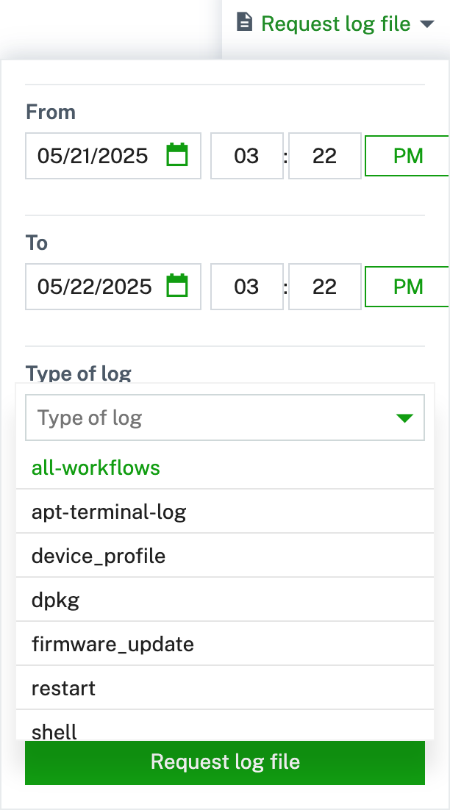

The **tedge-agent** service provides out of the box support for requesting log files from a device directly from your Cumulocity UI.

If you go to Cumulocity, you should see that you are able to see the logs tab.
However, no log type is yet available.
To add a new log type, you need to edit the `tedge-log-plugin.toml` in `/etc/tedge/plugins/tedge-log-plugin.toml`.

In this toml file you specify the log type and log path of the logs wished to
be retrieved from Cumulocity UI.
For example, if you wish to request %%te%% software logs and mosquitto logs
an example toml file would be:

```toml title="file: /etc/tedge/plugins/tedge-log-plugin.toml"
files = [
  { type = "software-management", path = "/var/log/tedge/agent/software-*" },
  { type = "mosquitto", path = "/var/log/mosquitto/mosquitto.log" }
]
```

Note that `path` need not be a complete path. It can be a full path to a log
file or a [glob pattern](https://en.wikipedia.org/wiki/Glob_(programming)).
For example the "software-management" type is a glob pattern that groups
any file inside "/var/log/tedge/agent/" that starts with "software-".

The `type` key in the toml is the name of the log with you will see in the
Cumulocity UI:



