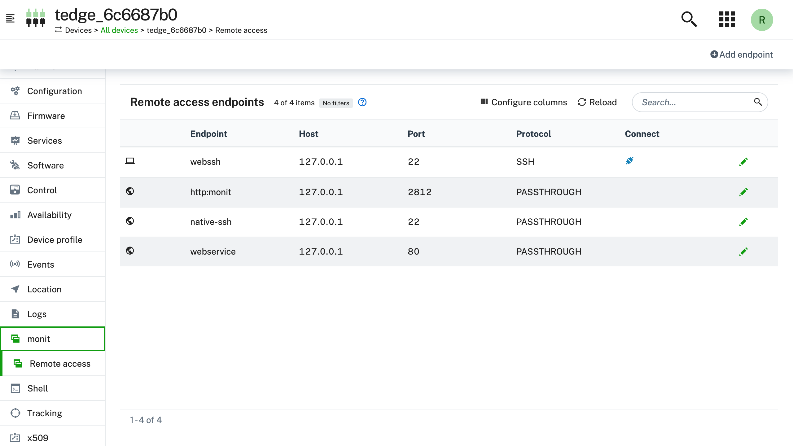
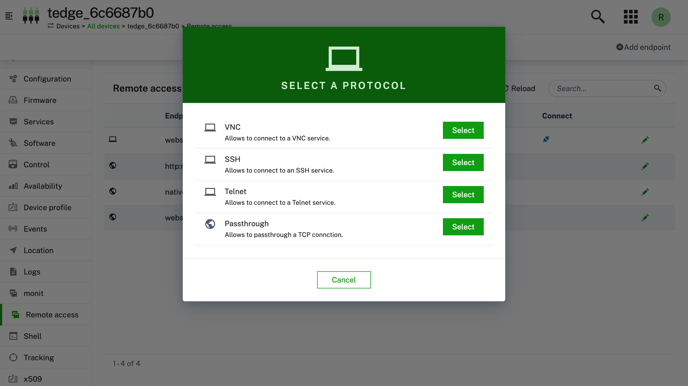
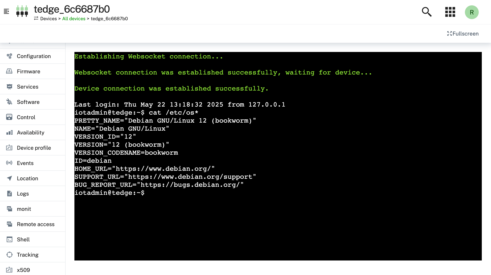

import BrowserWindow from '@site/src/components/BrowserWindow';

# Remote Access

To access a device remotely that runs %%te%%, a plugin of the operation plugin concept is used. The tedge-mapper is checking for cloud remote access operation and is triggering the particular plugin. You can use the remote access tab in device management to access the device via SSH or VNC.

Background information on the remote access feature provided by Cumulocity can be found in their [official documentation](https://cumulocity.com/docs/cloud-remote-access/using-cloud-remote-access/).

## Requirements

- Working %%te%% installation

- The **Cloud Remote Access Feature** is assigned to your Tenant. If not ask your Administrator to get it assigned to your Tenant. Please note that the Version must be at least 1007.2.0+

- The *Cloud Remote Access Role* must be assigned to the user who wants to use that Feature: <em>Administration &rarr; Role &rarr; &lt;any Role&gt; &rarr; check "Remote Access"</em>. Assign the role to the user used for the next steps.

- A VNC or SSH server running on the device you wish to connect to.

## Usage

Make sure %%te%% is connected to Cumulocity.

You device within Cumulocity should look similar to this (the "Remote access" tab should be visible in the menu on the left):

<BrowserWindow url="https://example.cumulocity.com/apps/devicemanagement/index.html#/device/12345/remote_access">

</BrowserWindow>

You can configure now within the Remote access tab to which e.g. VNC or SSH server you want to jump to. Please keep in mind that the Host is from the %%te%% point of view.

<BrowserWindow url="https://example.cumulocity.com/apps/devicemanagement/index.html#/device/12345/remote_access">

</BrowserWindow>

If you click on connect after the proper configuration an websocket window opens and %%te%% triggers the **c8y-remote-access-connect-plugin** to reach that websocket.

<BrowserWindow url="https://example.cumulocity.com/apps/devicemanagement/index.html#/device/12345/ssh/1">

</BrowserWindow>
