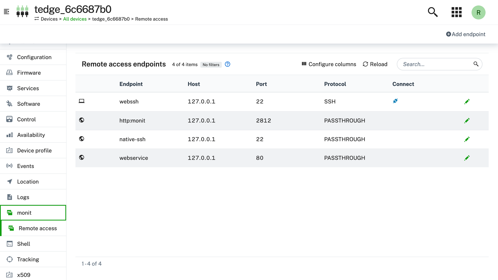
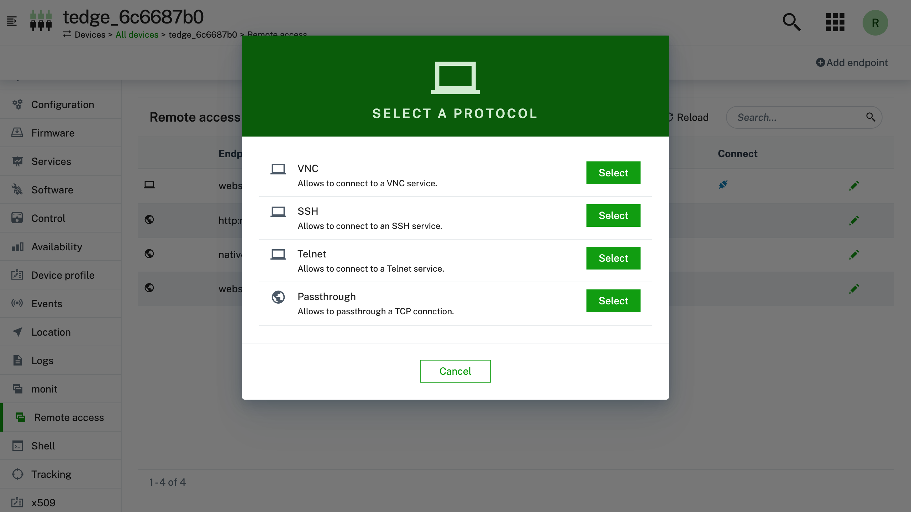
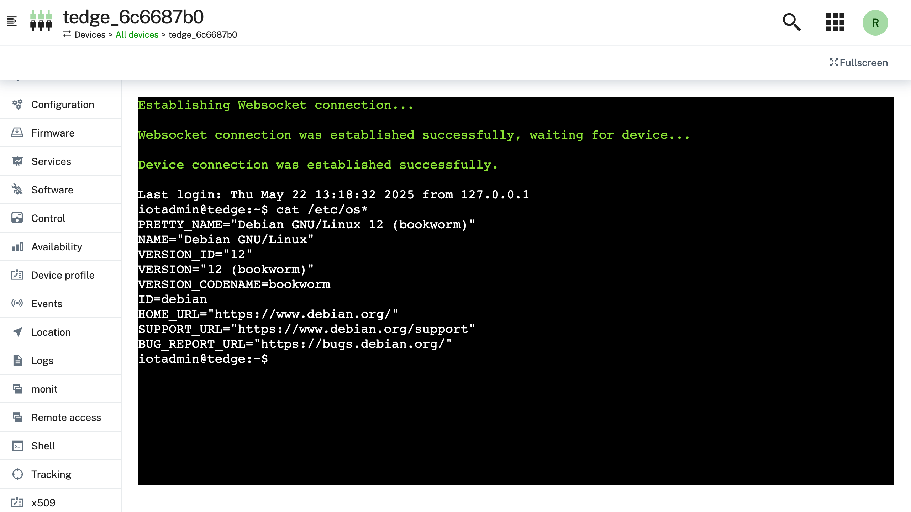
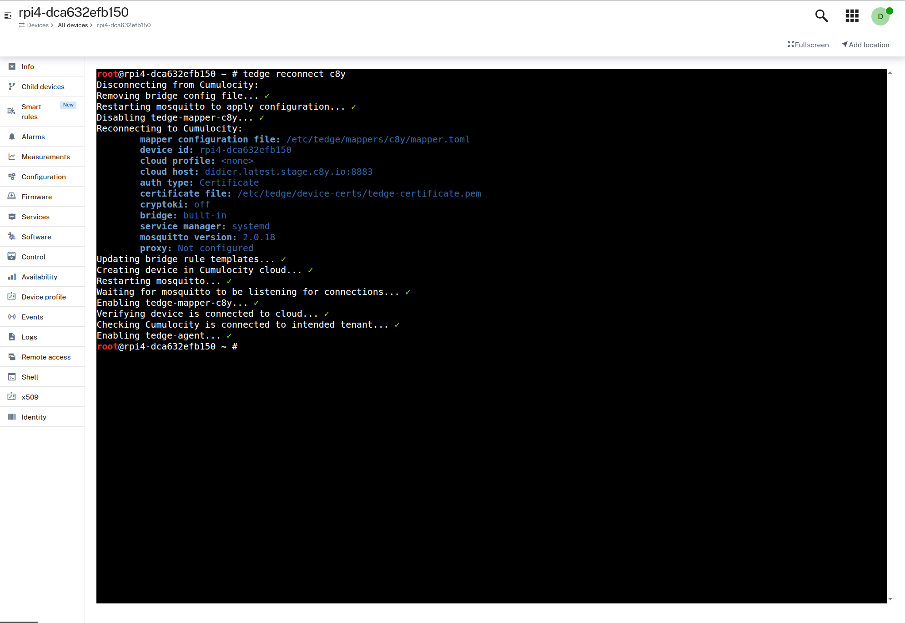
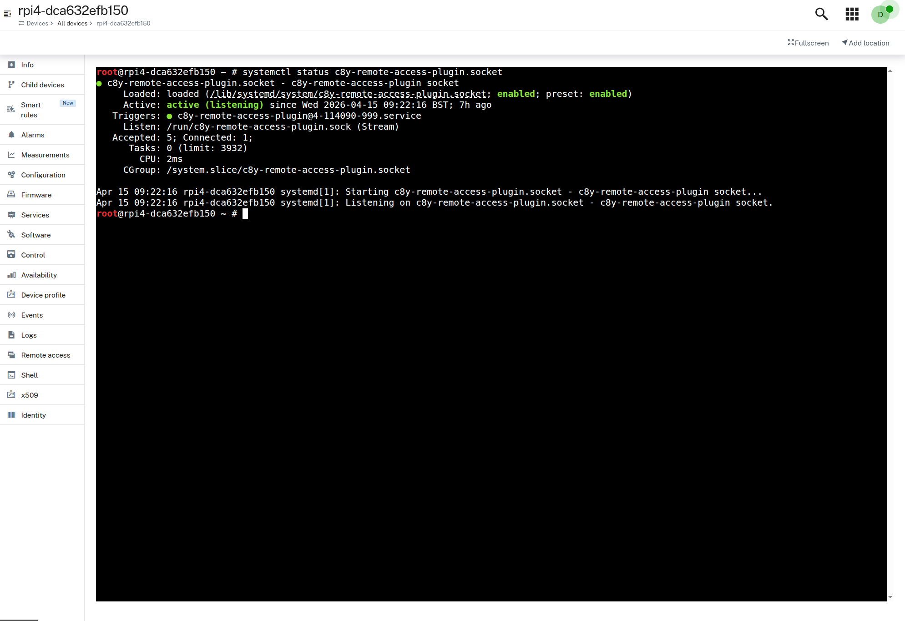

import BrowserWindow from '@site/src/components/BrowserWindow';

# Remote Access

You can use the remote access feature of Cumulocity to access via SSH or VNC a device that runs %%te%%,
without having to expose the SSH or VNC service over a public IP address.

In its simplest form, the Cumulocity Remote Access feature allows you to open a shell session on the device from you tenant.
However, combined with the `PASSTHROUGH` option, this feature is extremely versatile
and allows arbitrary TCP connections between a client on your local machine and a service on the device
(such as the SSH daemon/service, or a local HTTP server).

When a cloud remote access operation is received by the `tedge-mapper-c8y`,
a process is spawned to establish a direct communication to Cumulocity.
That connection being independent of any local services,
it can be used for administrative actions like restarting the mapper, agent, etc.

Background information on the remote access feature provided by Cumulocity can be found in their [official documentation](https://cumulocity.com/docs/cloud-remote-access/).

## Requirements

- A working %%te%% installation, notably, on devices running `systemd`, the socket activated service `c8y-remote-access-plugin.socket` should be running.

- The **Cloud Remote Access Feature** is assigned to your Tenant. If not ask your Administrator to get it assigned to your Tenant. Please note that the Version must be at least 1007.2.0+

- The *Cloud Remote Access Role* must be assigned to the user who wants to use that Feature: <em>Administration &rarr; Role &rarr; &lt;any Role&gt; &rarr; check "Remote Access"</em>. Assign the role to the user used for the next steps.

- A VNC or SSH server running on the device you wish to connect to.

## Usage

Make sure %%te%% is connected to Cumulocity.

You device within Cumulocity should look similar to this (the "Remote access" tab should be visible in the menu on the left):

<BrowserWindow url="https://example.cumulocity.com/apps/devicemanagement/index.html#/device/12345/remote_access">

</BrowserWindow>

You can configure now within the Remote access tab to which e.g. VNC or SSH server you want to jump to. Please keep in mind that the Host is from the %%te%% point of view.

<BrowserWindow url="https://example.cumulocity.com/apps/devicemanagement/index.html#/device/12345/remote_access">

</BrowserWindow>

If you click on connect after the proper configuration a websocket window opens and %%te%% triggers the **c8y-remote-access-plugin** to reach that websocket.

<BrowserWindow url="https://example.cumulocity.com/apps/devicemanagement/index.html#/device/12345/ssh/1">

</BrowserWindow>

You can then operate your device from that console. The connection to the device is independent of any %%te%% services,
meaning you can safely restart %%te%% processes and even run `tedge reconnect c8y`, a command that reconnects the device
without disconnecting the remote access:

<BrowserWindow url="https://example.cumulocity.com/apps/devicemanagement/index.html#/device/12345/ssh/1">

</BrowserWindow>

:::warning

For remote access connections to be fully independent of the %%te%% services,
the `c8y-remote-access-plugin` must be running as a socket activated service:

<BrowserWindow url="https://example.cumulocity.com/apps/devicemanagement/index.html#/device/12345/ssh/1">

</BrowserWindow>

:::

## PASSTHROUGH

To enable the `PASSTHROUGH` option of Cumulocity Remote Access, nothing specific has to be done on the %%te%% device,
beyond enabling the `c8y-remote-access-plugin`. This option has only to be enabled on your tenant when configuring remote access.

However, you will have to configure your local machine to fully leverage the `PASSTHROUGH` option.
For that, the recommendation is to use the [`go-c8y-cli remoteaccess`](https://c8y.app/docs/examples/remoteaccess/) command.
