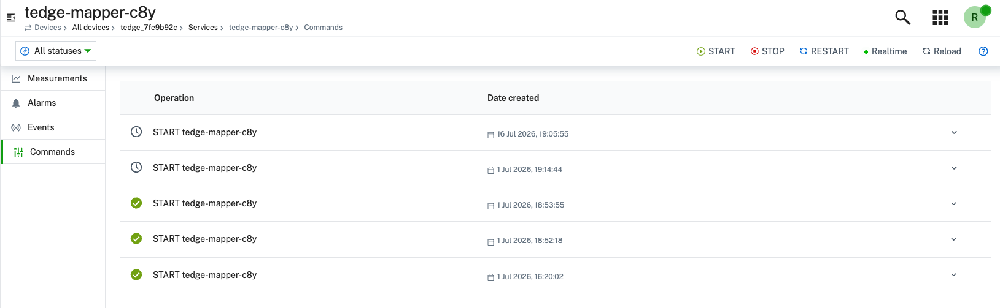

import BrowserWindow from '@site/src/components/BrowserWindow';

A Cumulocity operator can perform operations on a service of a device:
start it, stop it, restart it, or run any other action that service supports.
This is the Cumulocity feature documented under
[service commands](https://cumulocity.com/docs/device-management-application/managing-device-services/#service-commands).

The Cumulocity mapper supports the `c8y_ServiceCommand` operation
and registers `c8y_SupportedServiceCommands`.
For the mapping details, please refer to
[service command interface](../../references/agent/service-commands.md).

## Declaring the supported service commands list

To create a list for `c8y_SupportedServiceCommands`,
a service has to declare each action that it supports
by publishing a retained message to its `cmd/<action>` topic, one per action.

```sh te2mqtt formats=v1
tedge mqtt pub --retain 'te/device/main/service/collectd/cmd/start' '{}'
```

```sh te2mqtt formats=v1
tedge mqtt pub --retain 'te/device/main/service/collectd/cmd/stop' '{}'
```

```sh te2mqtt formats=v1
tedge mqtt pub --retain 'te/device/main/service/collectd/cmd/restart' '{}'
```

On each of these, the mapper:

1. registers `c8y_ServiceCommand` as a [supported operation](./supported-operations.md) of that **service**.
2. sets the whole list of actions on the service managed object, uppercased.

```json title="managed object of the collectd service"
{
  "c8y_SupportedServiceCommands": ["RESTART", "START", "STOP"]
}
```

The list is republished in full on every change, so the fragment always holds the current list of actions.

A custom action is declared the same way.
A service declaring `cmd/collect_measurements` gets `COLLECT_MEASUREMENTS` in the list.

:::note
On a **service** entity, every `cmd/<action>` capability is considered a service action.
It is not mapped to an operation of its own:
a service declaring `cmd/restart` gets `RESTART` in `c8y_SupportedServiceCommands`,
and is not mapped to the `c8y_Restart` operation.
Nothing changes for a device: a device declaring `cmd/restart` still gets `c8y_Restart`.
:::

An action whose name breaks the
[action name rule](../../references/agent/service-commands.md#actions)
is not declared to Cumulocity at all, and the mapper logs why.
Cumulocity would otherwise show a command whose name, once lowercased,
names no capability topic to route it back to.

## Creating a service command

Create a service command operation from **Services** > *service name* > **Commands**.

<BrowserWindow url="https://example.cumulocity.com/apps/devicemanagement/index.html#/service/12345/commands">



</BrowserWindow>

Cumulocity sends one operation for every action, naming the action in the `command` field.

```json title="c8y_ServiceCommand operation"
{
  "c8y_ServiceCommand": {
    "command": "RESTART",
    "serviceName": "collectd",
    "serviceType": "service"
  }
}
```

The mapper converts it into a %%te%% command on the topic of that action.

```sh te2mqtt formats=v1
tedge mqtt pub --retain 'te/device/main/service/collectd/cmd/restart/c8y-mapper-1234' '{
    "status": "init",
    "serviceName": "collectd",
    "serviceType": "service"
}'
```

- The **action** comes from the lowercased `command` value, and it names the topic.
- The **service name** comes from the operation.
  It is the service name %%te%% published when registering it:
  the `name` of the [service registration message](../../references/mqtt-api.md#entity-registration),
  or the service segment of the topic identifier when the registration carries no `name`.
- The **service type** is the one the service registered itself with,
  in the `type` field of the [service registration message](../../references/mqtt-api.md#entity-registration).
  The default type `service` is used when that field is absent.

The [Operation Workflow](../../references/agent/operation-workflow.md) then executes the command,
and the mapper reports its progress to Cumulocity with SmartREST on the topic of the service.
Every command of a service is reported as `c8y_ServiceCommand`,
whatever the action, since that is the operation Cumulocity created.

### Rejected operations

An operation is failed straight away, with no %%te%% command published, when:

- the target service cannot be resolved.
- the action is not one the service has declared —
  compared case-insensitively, so `RESTART` matches a declared `restart`.
- the operation's `serviceName` or `serviceType` breaks the
  [rule for that argument](../../references/service-plugin-api.md#validating-the-arguments).

## Removing an action

An action can be removed by publishing a retained empty message to its capability topic.

```sh te2mqtt formats=v1
tedge mqtt pub --retain 'te/device/main/service/collectd/cmd/stop' ''
```

The mapper drops the action from the list and republishes the new `c8y_SupportedServiceCommands`.
If no action is left, an empty array is sent.

:::note
`c8y_ServiceCommand` stays a registered supported operation of the service,
even when the list becomes empty,
so Cumulocity keeps offering the operation with no action to pick.
:::

## Commands on the %%te%% services themselves

`tedge-agent` and the mappers declare their own actions when they start,
so their managed objects carry a command list from the start —
see [actions of the shipped services](../../references/agent/service-commands.md#actions-of-the-shipped-services).

Under `tedge run all`, `tedge-agent` offers RESTART alone and the mappers offer nothing:
the init system manages the shared process, not the components inside it.
Restarting the agent there restarts the mappers with it.
