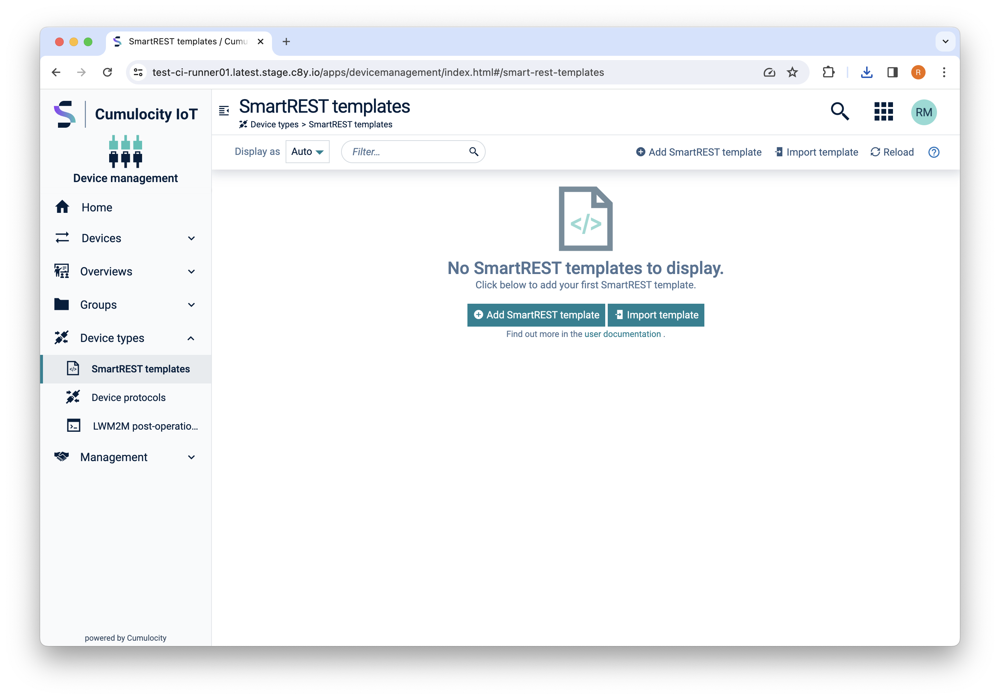
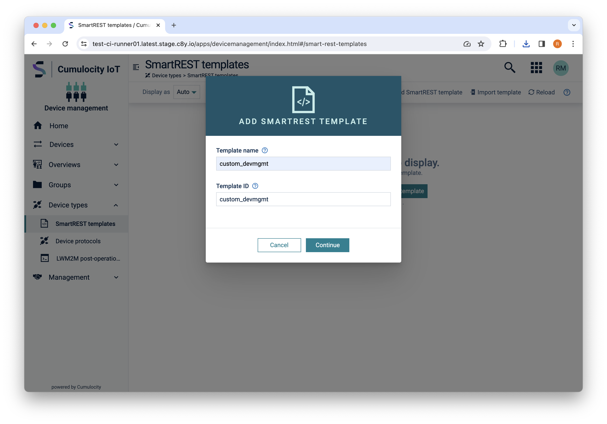
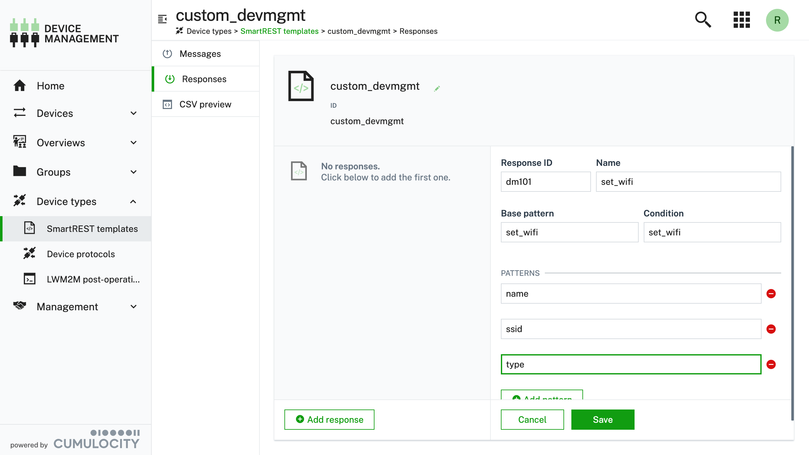
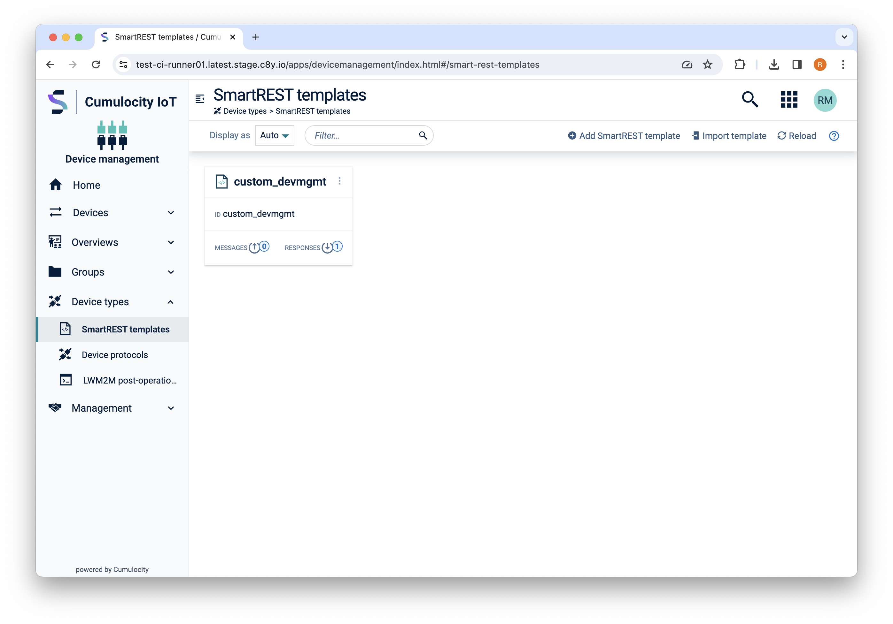
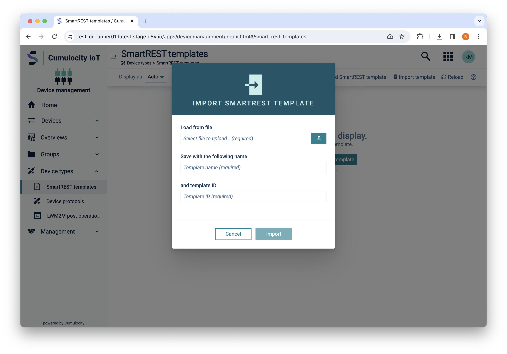
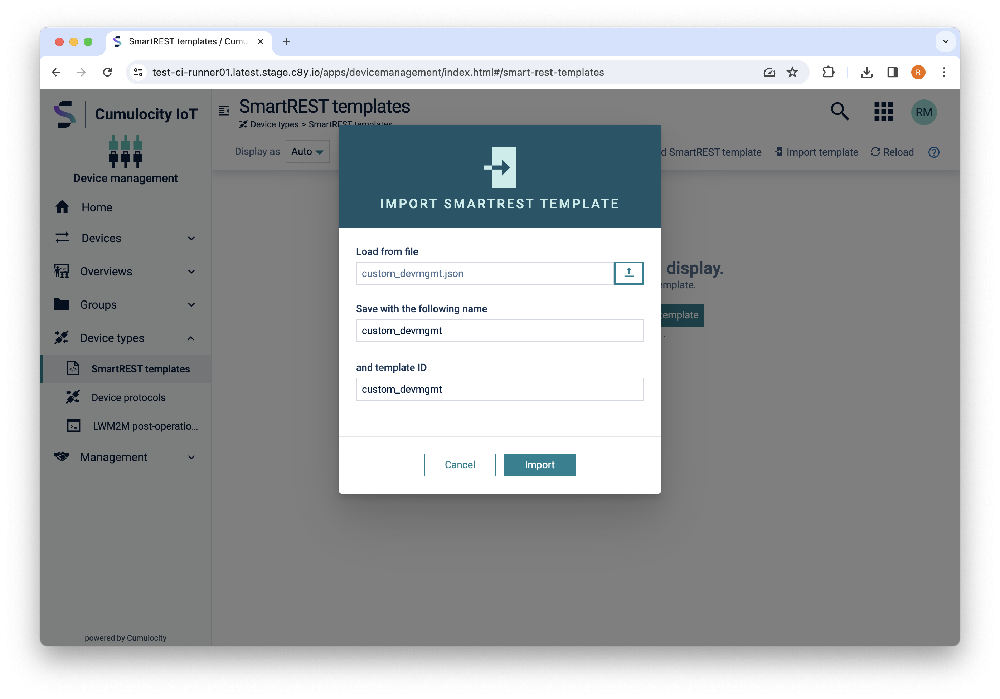
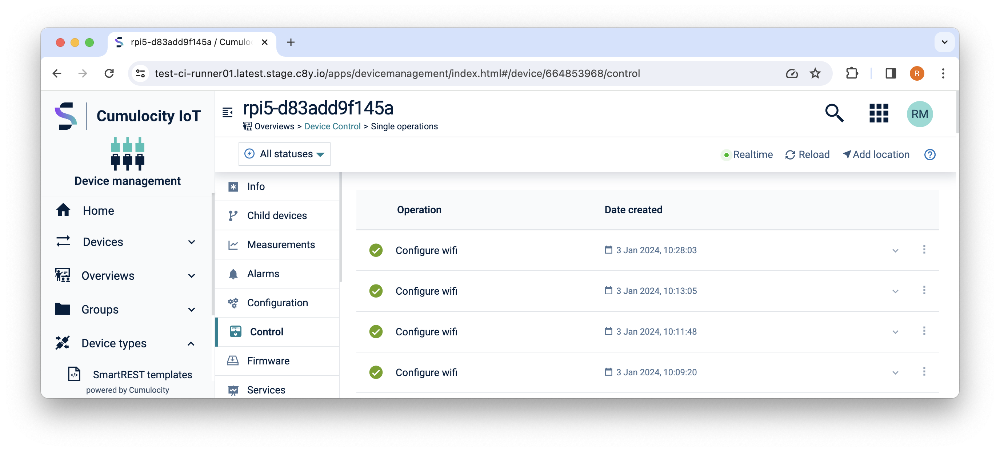

import BrowserWindow from '@site/src/components/BrowserWindow';

[Custom SmartREST 2.0 Templates](https://cumulocity.com/docs/smartrest/smartrest-introduction/) can be used to extend the functionality of a device to support more operations than what the [static SmartREST templates](https://cumulocity.com/docs/smartrest/mqtt-static-templates/) offer.

%%te%% supports subscription to custom templates as documented [here](https://cumulocity.com/docs/smartrest/smartrest-two/#template-collections).

For every template that the device uses, it must publish all data to the `s/uc/<template-external-id>` topic and subscribe to the `s/dc/<template-external-id>` topic to receive data from the cloud, based on that template's external id.
When these templates are configured with %%te%%, subscriptions to all these relevant topics on Cumulocity cloud will be done by %%te%% internally.
Local processes on the device can access these templates on the local MQTT broker by simply publishing to the `c8y/s/uc/<template-external-id>` topic and subscribing to the `c8y/s/dc/<template-external-id>` topic (note the `c8y/` prefix in topics).

A template with the external id `$TEMPLATE_XID` requires the following subscriptions to be added when connecting to Cumulocity:

```text
s/dc/$TEMPLATE_XID
s/uc/$TEMPLATE_XID
```

**This is not done automatically and the custom templates have to be declared using the `tedge` command.**

## Checking existing templates

```sh
tedge config get c8y.smartrest.templates
```

## Add new template to thin-edge configuration

:::tip
The thin-edge.io `c8y.smartrest.templates` configuration values refer to the SmartREST templates' External ID (also known as "X-ID").
:::

To add new template to %%te%% the `tedge config` cli tool can be used as following:

```sh
sudo tedge config set c8y.smartrest.templates template-1,template-2
```

After adding or removing a template, you will need to run the following command before %%te%% will use the new settings:

```sh
sudo tedge reconnect c8y
```

:::note
To add/append a new template to a device that's already configured with some, you can use the `tedge config add` command that will preserve current templates. For example, if `template-1` is already configured on the device:

```sh
tedge config get c8y.smartrest.templates
["template-1"]
```

The `tedge config` cli tool can be used as following to add another template:

```sh
tedge config add c8y.smartrest.templates template-2
```

Now when we get the configuration the both templates will be there:

```sh
tedge config get c8y.smartrest.templates
["template-1", "template-2"]
```

If you want to use the `tedge config set` command, it is required to include current templates:

```sh
tedge config set c8y.smartrest.templates template-1,template-2
```

Otherwise, your configuration will be overwritten.

:::

## Removing templates from configuration

To remove all the templates, the `unset` subcommand can used as follows:

```sh
sudo tedge config unset c8y.smartrest.templates
```

To remove one of existing templates you can use the `tedge config remove` command:

```sh
tedge config get c8y.smartrest.templates
```

```toml title="Output"
["template-1", "template-2"]
```

```sh
sudo tedge config remove c8y.smartrest.templates template-2
```

or overwrite the existing `c8y.smartrest.templates` with the new set which doesn't contain the unwanted template:

```sh
sudo tedge config set c8y.smartrest.templates template-1
```

You can verify that the template has changed by reading the value again.

```sh
tedge config get c8y.smartrest.templates
```

```toml title="Output"
["template-1"]
```

After adding or removing a template, you will need to run the following command before %%te%% will use the new settings:

```sh
sudo tedge reconnect c8y
```

## Example: Creating a custom operation

The following example shows how to create a new SmartREST template with a single custom operation which will be activated when an operation is created with the `set_wifi` fragment. The operation includes 3 parameters where the wifi `name`, `ssid` and `type` are included in the message which is sent to the device via MQTT.

In this example, the operation handler on the %%te%% side only prints out the received message on the console, but it can be extended to execute any command that is required for your task.

The operation response defined in the SmartREST template will convert the Cumulocity Operation from json to an MQTT message in a Comma Separated Variables (CSV) format. The MQTT message is then received by %%te%% and a script is called passing the message as the message to it. The script is used to perform the desired actions using the parameters provided in the message.

The snippets below are used to illustrate the message translation of the Cumulocity operation to the message received by the device.

**Cumulocity Operation**

```json
{
    "description": "Configure wifi",
    "deviceId": "664853968",
    "set_wifi": {
        "name": "Factory Wifi",
        "ssid": "factory-onboarding-wifi",
        "type": "WPA3-Personal"
    }
}
```

**SmartREST (CSV) format received by %%te%%**

The above Cumulocity operation is transformed into CSV (using the formatting/rules defined in the SmartREST template) and sent to the device via MQTT. The example below shows the format of the message as received by the device:

```csv title="topic: c8y/s/dc/custom_devmgmt"
dm101,<device_external_id>,<set_wifi.name>,<set_wifi.ssid>,<set_wifi.type>
```

The following procedure details the step-by-step instructions on how to implement the above example.

### Step 1: Creating a SmartREST template

1. Open the Cumulocity *Device Management* Application in your web browser

2. Navigate to *Device Types &rarr; SmartREST Templates*

    <BrowserWindow url="https://example.cumulocity.com/apps/devicemanagement/index.html#/smart-rest-templates">

    

    </BrowserWindow>

3. Click *Add SmartREST template*

    <BrowserWindow url="https://example.cumulocity.com/apps/devicemanagement/index.html#/smart-rest-templates">

    

    </BrowserWindow>

4. Add a new *Response* message, and enter the details as detailed in the screenshot.

    <BrowserWindow url="https://example.cumulocity.com/apps/devicemanagement/index.html#/smart-rest-templates/12345/responses">

    

    </BrowserWindow>

    The properties used in the example can be also described as follows:

    |Property|Value|Description|
    |----|---|---|
    |Response ID|dm101|Unique id of the message|
    |Name|set_wifi|Human readable name of the message|
    |Base pattern|set_wifi|The common prefix added to each pattern (see Pattern.x rows)|
    |Condition|set_wifi|The fragment which will "activate" the SmartREST message translation|
    |Patterns.0|name|Wifi Connection Name (Custom parameter to be included in the body)|
    |Patterns.1|ssid|Wifi SSID (Custom parameter to be included in the body)|
    |Patterns.2|type|Wifi Type (Custom parameter to be included in the body)|

5. Click *Save*

    <BrowserWindow url="https://example.cumulocity.com/apps/devicemanagement/index.html#/smart-rest-templates">

    

    </BrowserWindow>

#### Alternative: Import SmartREST template from file

Alternatively, you can import a SmartREST template from an existing file. This approach is less error prone as you don't need to enter any of the values manually, but it obviously requires you to have already exported an existing SmartREST template.

1. Save the following SmartREST template to a local file (on your machine) called **custom_devmgmt.json**

    ```json title="file: custom_devmgmt.json"
    {
        "name": "custom_devmgmt",
        "type": "c8y_SmartRest2Template",
        "com_cumulocity_model_smartrest_csv_CsvSmartRestTemplate": {
            "requestTemplates": [],
            "responseTemplates": [
                {
                    "msgId": "dm101",
                    "condition": "set_wifi",
                    "base": "set_wifi",
                    "name": "set_wifi",
                    "pattern": [
                        "name",
                        "ssid",
                        "type"
                    ]
                }
            ]
        },
        "__externalId": "custom_devmgmt"
    }
    ```

2. Open the Cumulocity *Device Management* Application

3. Navigate to *Device Types &rarr; SmartREST templates*

    <BrowserWindow url="https://example.cumulocity.com/apps/devicemanagement/index.html#/smart-rest-templates">

    

    </BrowserWindow>

4. Click *Import template*

    <BrowserWindow url="https://example.cumulocity.com/apps/devicemanagement/index.html#/smart-rest-templates">

    

    </BrowserWindow>

5. Select the *Load from file* and select the json file you saved in the first step and click *Open*

6. Double check the information and select *Import*

    <BrowserWindow url="https://example.cumulocity.com/apps/devicemanagement/index.html#/smart-rest-templates">

    

    </BrowserWindow>

    If the import was successful, then you should see the SmartREST template, **custom_devmgmt**, in the list:

    <BrowserWindow url="https://example.cumulocity.com/apps/devicemanagement/index.html#/smart-rest-templates">

    

    </BrowserWindow>
    

### Step 2: Configure thin-edge.io

On the device, perform the following steps:

1. Set the custom SmartREST template to be used by %%te%%
 
    ```sh
    tedge config set c8y.smartrest.templates "custom_devmgmt"
    ```

    The `custom_devmgmt` is the id of the SmartREST template that was created in the previous step.

2. Reconnect to Cumulocity (assuming you have already connected to Cumulocity once)

    ```sh
    tedge reconnect c8y
    ```

    :::info
    This step ensures that the new SmartREST template id is also added in the list of MQTT topics to subscribe to. Without this step, %%te%% will not be able to receive the custom operation.
    :::

:::tip
You don't need to re-run this step when you add a new message definition to an existing template id.
:::

### Step 3: Creating the operation handler

On your %%te%% device, run the following steps:

1. Create the following custom operation handler file

    ```toml title="file: /etc/tedge/operations/c8y/set_wifi"
    [exec]
    command = "/usr/bin/set_wifi"
    topic = "c8y/s/dc/custom_devmgmt"
    on_message = "dm101"
    ```

    The operation definition tells %%te%% what to do when receiving a specific message (with the message id) on the given topic. Specifically, the definition will execute the `/usr/bin/set_wifi` script when a `dm101` message is received on the `c8y/s/dc/custom_devmgmt` topic.

2. Create the script which is called when receiving the `dm101` message

    ```sh title="file: /usr/bin/set_wifi"
    #!/bin/sh
    set -e

    # Constants
    OK=0

    # Input arguments
    MESSAGE="$1"
    NAME=$(echo "$MESSAGE" | cut -d, -f 3)
    SSID=$(echo "$MESSAGE" | cut -d, -f 4)
    TYPE=$(echo "$MESSAGE" | cut -d, -f 5)

    echo "Processing message: $MESSAGE"
    echo "NAME: $NAME"
    echo "SSID: $SSID"
    echo "TYPE: $TYPE"
    exit "$OK"
    ```

    :::note
    You can change the path where this file is located, but it **MUST** match the path given in the custom operation definition file under the `exec.command` property.
    :::

3. Make the script executable

    ```sh
    sudo chmod 755 /usr/bin/set_wifi
    ```

### Step 4: Sending a custom operation

1. On your local machine, create a custom operation instance in Cumulocity

    Below shows an example of creating the operation using the [go-c8y-cli)](https://goc8ycli.netlify.app/) cli tool. It assumes you have already activated your go-c8y-cli session which points to your intended Cumulocity tenant.

    ```sh
    c8y operations create \
        --device 12345 \
        --template "{set_wifi:{name:'Factory Wifi',ssid:'factory-onboarding-wifi',type:'WPA3-Personal'}}" \
        --description "Configure wifi"
    ```

    Where `12345` should be replaced with the Cumulocity device id of your device.

    If you're not familiar with go-c8y-cli, then you can send the Cumulocity REST API request using other tools such as Postman, curl etc., though you will have use the appropriate Authorization Header as defined by the official [Cumulocity API Guide](https://cumulocity.com/api/core/).

    **Cumulocity REST Request**

    The custom operation can be created via the Cumulocity REST API using the following details:
    
    ```
    POST /devicecontrol/operations
    ```

    **Body**

    ```json
    {
        "description": "Configure wifi",
        "deviceId": "664853968",
        "set_wifi": {
            "name": "Factory Wifi",
            "ssid": "factory-onboarding-wifi",
            "type": "WPA3-Personal"
        }
    }
    ```

2. In the Cumulocity *Device Management* application, check the *Control* page where you should see the "Configure Wifi" operation.

    <BrowserWindow url="https://example.cumulocity.com/apps/devicemanagement/index.html#/device/12345/control">

    

    </BrowserWindow>

3. On the %%te%% device, open a console, and check the log file which when processing the custom operation

    The following command uses a simple bash one-liner to print the contents of the most recent file created matching the `set_wifi*` pattern under the `/var/log/tedge/agent/` folder.

    ```sh
    cat "$(ls -t /var/log/tedge/agent/set_wifi* | head -1)"
    ```

    ```text title="Output"
    ----- $ /usr/bin/set-wifi "dm101,rpi5-d83add9f145a,Factory Wifi,factory-onboarding-wifi,WPA3-Personal"
    exit status: 0

    stdout <<EOF
    Processing message: dm101,rpi5-d83add9f145a,Factory Wifi,factory-onboarding-wifi,WPA3-Personal
    NAME: Factory Wifi"
    SSID: factory-onboarding-wifi"
    TYPE: WPA3-Personal"
    EOF

    stderr <<EOF
    EOF
    ```

## Debugging

If you encounter any problems whilst trying to create or use a custom operation then please check some of the following debugging tips. This will help you locate more precisely what is going wrong.

### Check the incoming MQTT message

You can observe the MQTT message which is received by the local MQTT broker by subscribing to the following topic on your %%te%% device:

```sh
tedge mqtt sub 'c8y/#'
```

When a new operation is received, the above mqtt sub command should print the following message (though the `rpi5-d83add9f145a` will be replaced with the external id of your device):

```text title="Output"
[c8y/s/dc/custom_devmgmt] dm101,rpi5-d83add9f145a,Factory Wifi,factory-onboarding-wifi,WPA3-Personal
```

If you don't receive a message, then check the following:
* Check your SmartREST definition in Cumulocity. The definition must be defined per Cumulocity Tenant!
* Check that the %%te%% config has been updated to subscribe to the related SmartREST topic. Maybe you forgot to run:

    ```
    sudo tedge reconnect c8y
    ```

### Debugging your script

If you know the expected format of the SmartREST message, then you can debug any potential scripting problems by manually calling your script with a simulated message.

For instance, if the operation definition has `exec.command` set to call the `/usr/bin/set_wifi` script, then you can simulate how %%te%% would call the script by using the following command:

```sh
sudo -u tedge /usr/bin/set_wifi "dm101,$(tedge config get device.id),Factory Wifi,factory-onboarding-wifi,WPA3-Personal"
```

The script is called with the MQTT message passed as the first argument (hence the double quotes). If the message payload has double quotes in it, then you will have to make sure you escape them using a backslash, e.g. `\"`. Below shows an example with escaped double quotes:

```sh
sudo -u tedge /usr/bin/set_wifi "dm101,$(tedge config get device.id),Factory using \"quotes\",factory-onboarding-wifi,WPA3-Personal"
```

:::note
The `exec.command` is called as the `tedge` user, so if you need root permissions (e.g. you want to use sudo within your script), then you need to make sure that you add whatever command you want to call to the **sudoers** definition. For example if you want to allow the `tedge` user to call the Network Manager cli tool, `/usr/bin/nmcli`, then you need to create a new sudoers definition:

```text title="file: /etc/sudoers.d/tedge-wifi"
tedge  ALL = (ALL) NOPASSWD: /usr/bin/nmcli
```
:::
