## Management

%%te%% enables you to manage the software installed on your device. The following sections details how to install and remove software packages.

:::info
For more detailed information on the Cumulocity IoT **Device Management** features, please check out the [official documentation](https://cumulocity.com/docs/device-management-application/managing-device-data/#managing-software).
:::

### To add a new software or software version {#add-to-repo}

1. Navigate to the *Management* &rarr; *Software repository* page

    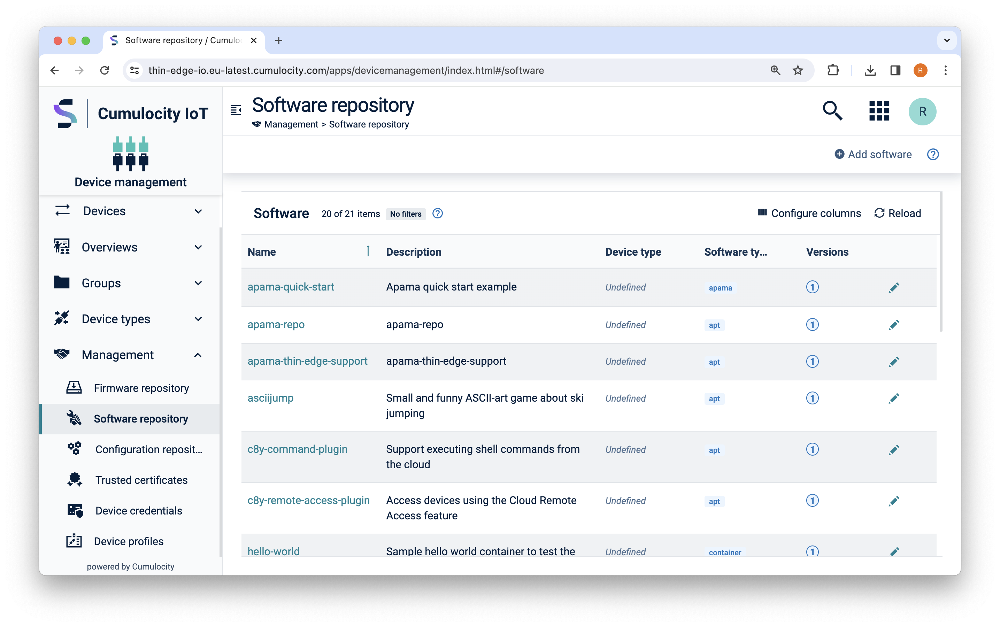

    The page will display all of the software packages which are are available for to be installed on a device.

2. Select *Add software* and fill in the details

    <p align="center">
        
    </p>

    :::tip
    * If you are using the `apt` software type and hosting the package in an external repository, then just use an a single space in the *Provide a file path* option.
    :::

3. Select *Add software* to create the item

### To install software on a device {#install}

1. Select the software you want to install on the device

    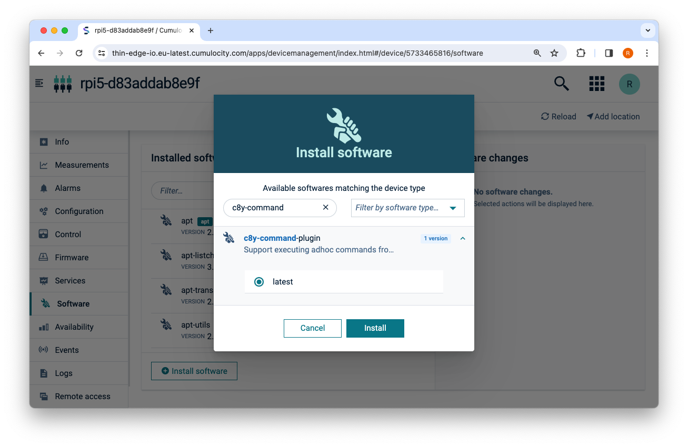

2. Review the software changes

    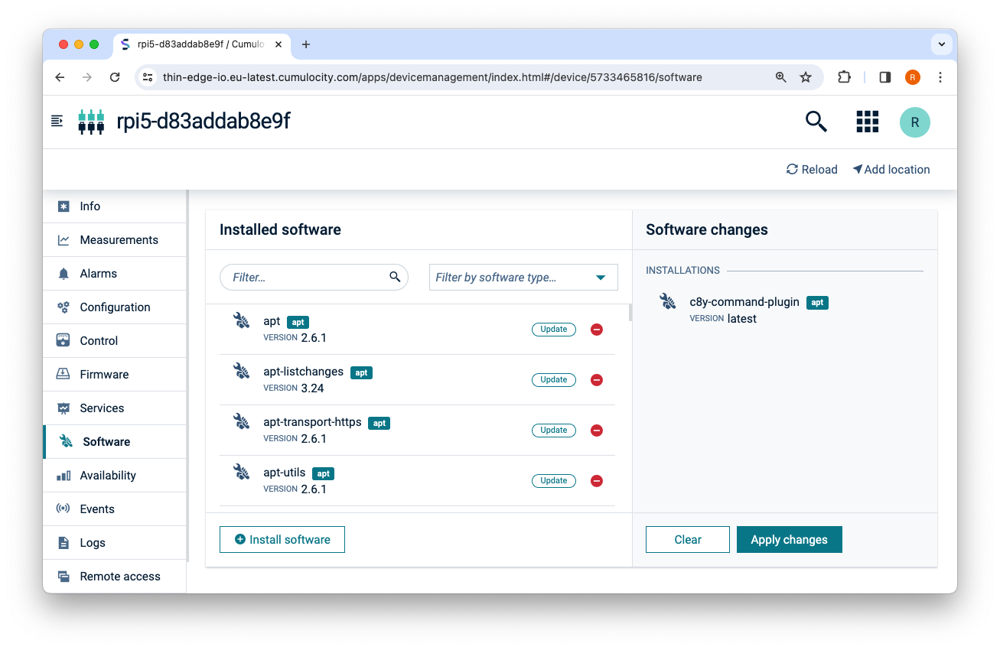

    :::info
    You can combine installing and removing software in the same operation
    :::

3. Select *Apply Changes* and wait for the operation to complete

    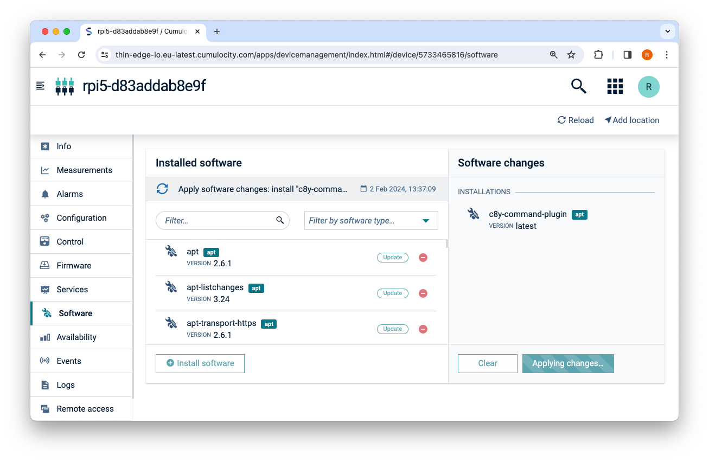

4. Use the installed package

    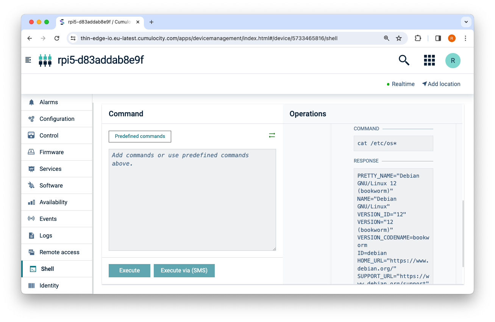


### To delete software from a device {#delete}

1. Select the software you want to remove from the device

    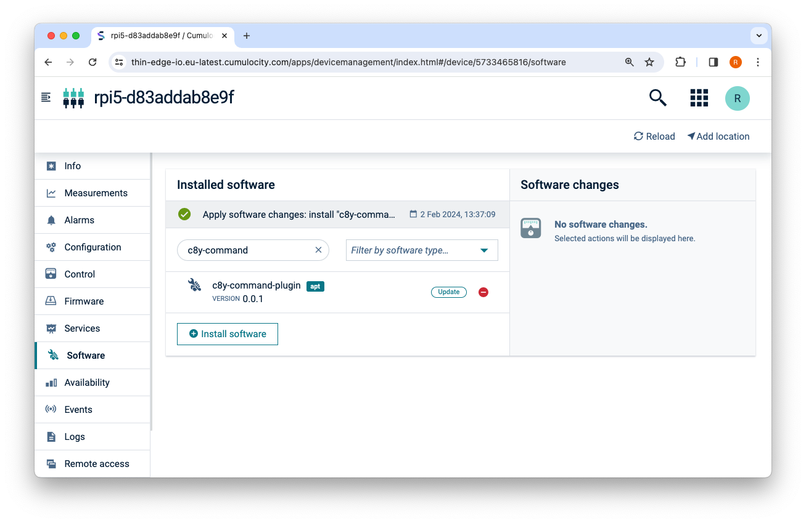

2. Review the software changes

    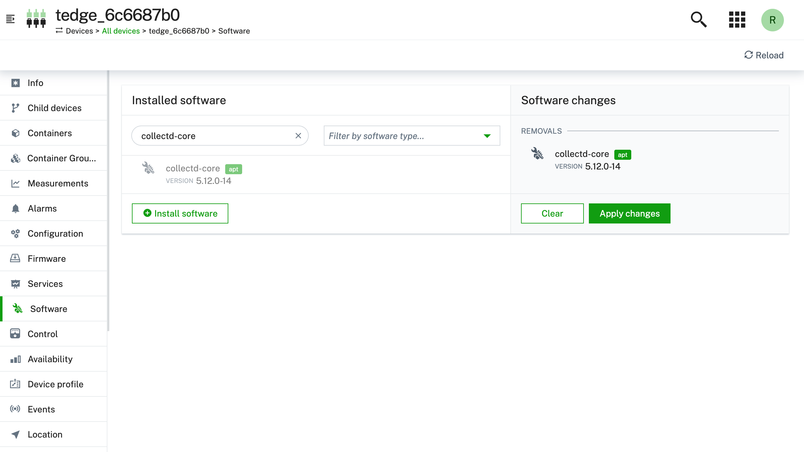

    :::note
    You can combine installing and removing software in the same operation
    :::

3. Select *Apply Changes* and wait for the operation to complete

    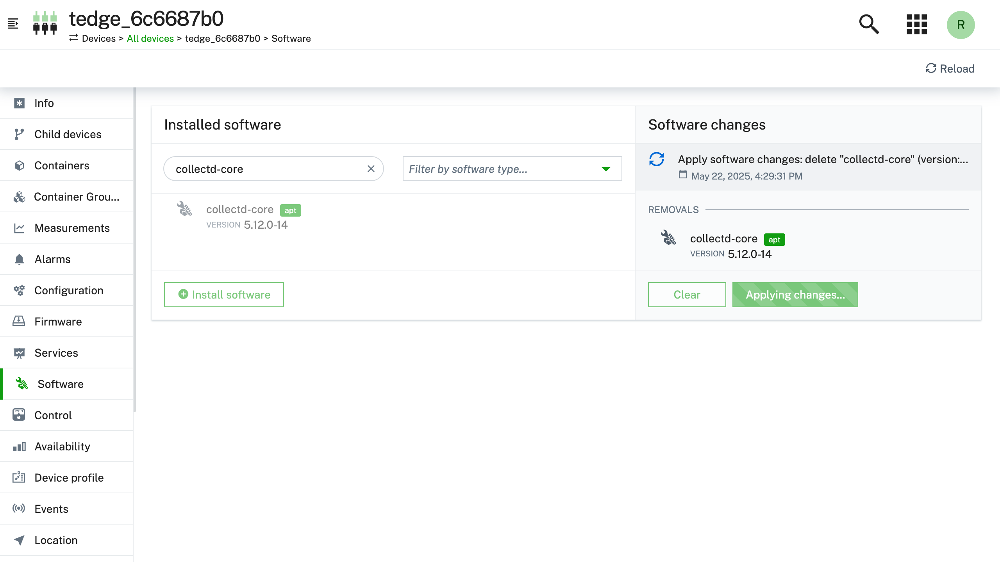

    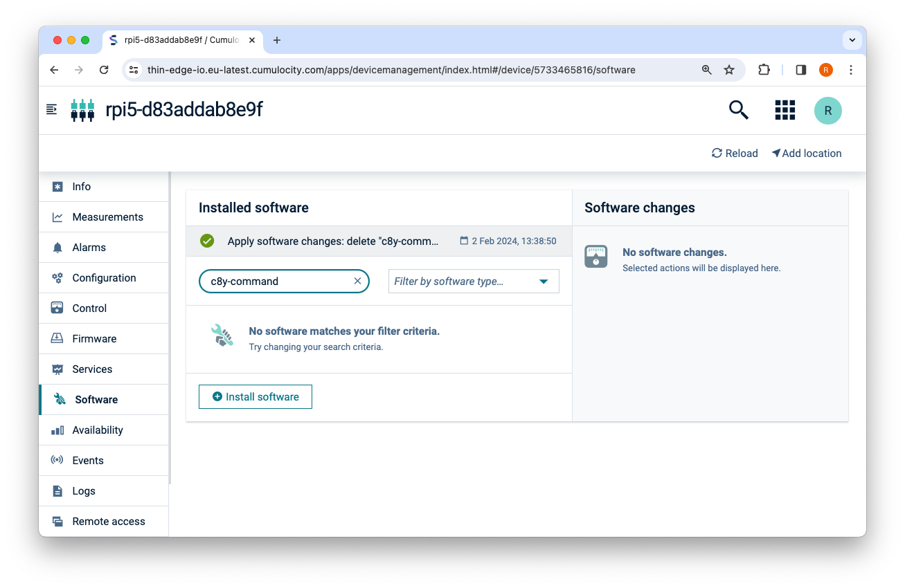

### Updating to the latest %%te%% version {#self-update}

Updating %%te%% from Cumulocity IoT is the same process as installing any other software. You can update all of the %%te%% packages by installing a single package called `tedge-full`.

Below shows instructions on how to update %%te%% to the latest version:

1. Create a software package using the instructions in the [add a new software package section](#add-to-repo) and use the following package properties

    |Property|Value|
    |----|-----|
    |Name|tedge-full|
    |Version|latest|
    |Software type|apt|
    |Software File|Select *Provide a file path*, and use a single space character|

    :::tip
    The **Software type** value depends on which Software Management Plugin you're using. 

    On Debian systems the software type will be `apt`, but you can also install other Software management Plugin's to support installing other types of packages such as Alpine Linux (`apk`) or RPM packages (`rpm`).
    :::

2. Select the `tedge-full` software you want to install on the device

    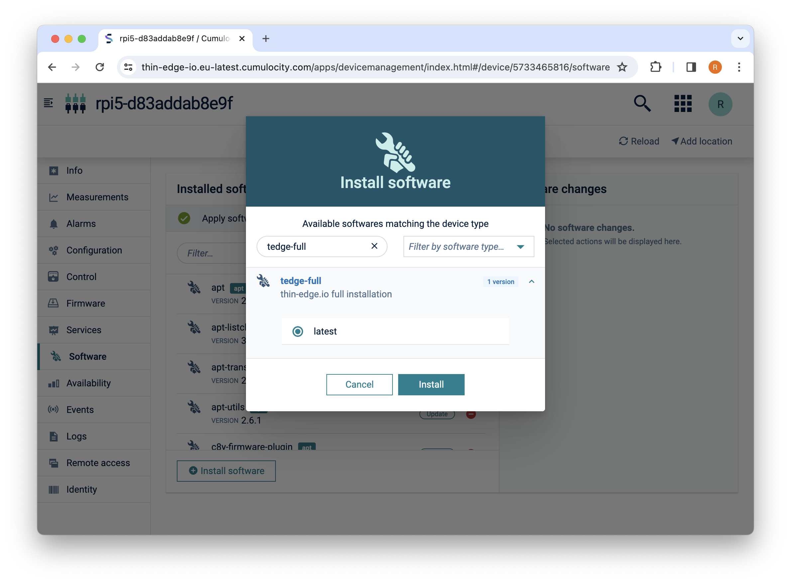

3. Review the software changes and select *Apply changes*

    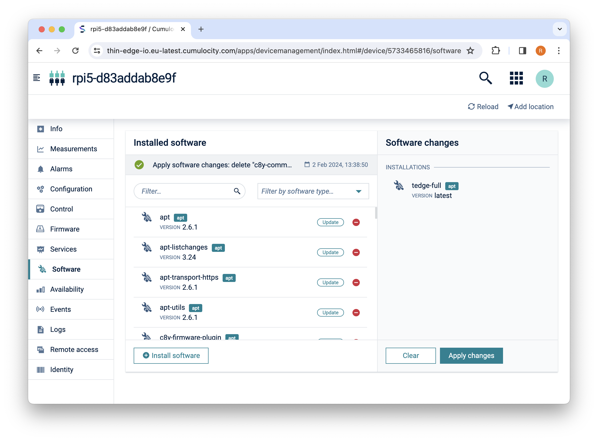

4. Wait for the operation to complete

:::warning
If you are upgrading %%te%% from any version prior to `1.0.0` (including `1.0.0-rc.1`), then you will have to restart the device after the update before the new version of the `tedge-agent` will be activated. Until the device is restarted (or the `tedge-agent` service is restarted), the previous version of the `tedge-agent` will still be running.
:::

## Configuration {#configuration}

### tedge-apt-plugin: Filter packages by name and maintainer

By default the `tedge-apt-plugin` lists all of the installed Debian (*.deb) packages. On typical Debian installations, the list of packages could easily be more than 500 packages. In order to focus on the Debian packages which are important for your device, the `tedge-apt-plugin` supports filtering by either name or maintainer.

The package list filter criteria can be configured via the %%te%% configuration (e.g. `tedge.toml`). Create the `apt` table in `tedge.toml` and fill it with the `name` and `maintainer` keys. The value of each filter key should be a **valid regex pattern**. Your filters should look like this:

```toml
[apt]
name = "(tedge|c8y|python|wget|vim|curl|apt|mosquitto|ssh|sudo).*"
maintainer = ".*(thin-edge.io|other).*"
```  

You can also test the filters by running the `tedge-apt-plugin` locally on the command line. Running the commands locally help you tune the filters to be sure they work as expected. Below shows some examples of using various filters:

```sh
# Match by name
tedge-apt-plugin list --name '^lib.*' --maintainer ''

# Match by maintainer
tedge-apt-plugin list --name '' --maintainer '.*thin-edge.io.*'

# Match by name or maintainer
tedge-apt-plugin list --name 'python3.*' --maintainer '.*thin-edge.io.*'
```

Once you have the filter criteria that you're happy with, you can make the setting permanent by updating the %%te%% configuration.

```sh
sudo tedge config set apt.name '(tedge|c8y|python|wget|vim|curl|apt|mosquitto|ssh|sudo).*'
sudo tedge config set apt.maintainer '.*(thin-edge.io|other).*'
```

## FAQ

The following contains frequently asked questions regarding the software management feature.

### Hosting linux packages in Cumulocity IoT

The recommended way to install linux packages such as deb, apk and rpm is to install packages directly from a configure package repository such as public repositories for your Operating System, or using a package service such as Cloudsmith, JFrog, Gemfury, Packagecloud etc. Using a package repository supports the full dependency resolution that users are familiar with when install packages manually, e.g. using `apt-get install mypackage`, and the correct architecture will be automatically selected for your device (e.g arm64/aarch or amd64/x86_64 etc.).

If you choose to host the software packages in Cumulocity IoT or via some other blob store, then the automatic dependency installation and architecture will not function so you have to manage all of this yourself. It might be manageable if you have simple packages with no dependencies and have an architecture agnostic package (e.g. the architecture is set to `all` or `noarch`).

When hosting the linux packages within Cumulocity IoT then ensure that:

* the package does not have any dependencies
* the name and version used in the Cumulocity IoT *Software repository* matches the exact information contained in the package's meta data

    For example, below shows the `apt-cache show jq` information for the `jq` package where the **Package** and **Version** fields should match the **name** and **version** properties in Cumulocity IoT.

    ```
    Package: jq
    Version: 1.6-2.1
    Architecture: arm64
    ```

    If the package name and version does not match, then the package might fail to be installed due to a validation error.
* the *Device type filter* property is set in the Cumulocity IoT Software repository if the packages is only valid for a specific CPU architecture. The *Device type filter* is used to filter which packages are available for different devices types to ensure you can only install compatible packages on a given device.

    <p align="center">
        
    </p>
