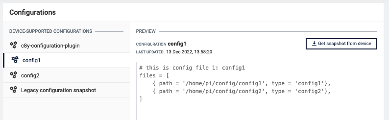
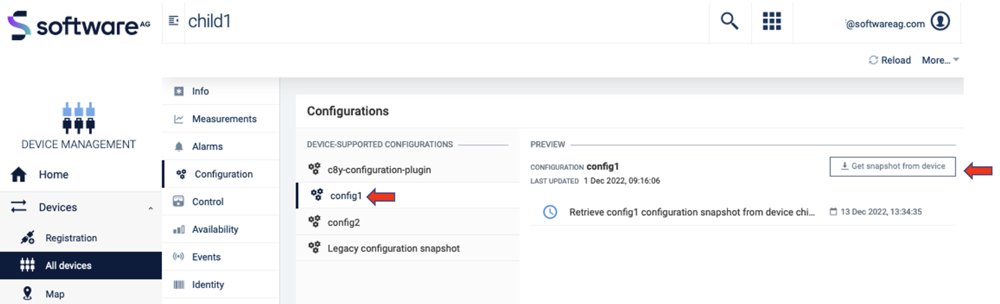

# Configuration management on child-devices

After following this tutorial, you will know how to manage various configuration files on child-devices connected to a thin-edge device.
You will learn how to perform the following configuration management operations on child devices:

* Fetch and view the snapshot of a configuration on a child-device from Cumulocity IoT cloud
* Update a configuration on the child-device from Cumulocity IoT cloud

# Introduction

Let's first start with the definition of child-devices.

Thin-edge.io facilitates remote management of the device it is running on, as well as to devices that are connected to that device.

  * the device where thin-edge.io is running on, is referred to as the **main device** or **thin-edge device**.
    * thin-edge.io on the main-device establishes and manages all communication to the cloud.
  * all devices connected to the main-device are referred to as **external child-devices**.
  * each external child-device can be represented in the cloud with its individual device twin.
    * a unique `child-id` makes the association between each external child-device and its **device twin**.
  * all telemetry data and device management functionality can appear in the context of the
    external child-device's device twin.
  * containers or processes running on the main-device can also act like child-devices and
    they are referred to as **logical child-devices**.

The figure below illustrates the child-device concept.


Configuration management can be enabled for child-devices using the same `c8y-configuration-plugin`,
used for configuration management of the thin-edge device itself.
You can read more about this plugin and its usage [here](../c8y/config_management_plugin.md).

Another piece of software referred to as a **child-device connector** is also required to coordinate configuration management
on the child device from the thin-edge device over the protocol that is used to communicate with it.

The child-device connector would handle the following responsibilities:

* Declare the supported configuration list to thin-edge.io.
* Handle configuration snapshot requests from thin-edge.io.
* Handle configuration update requests from thin-edge.io.

The **supported configuration list** is the list of configuration files on the child-device that needs to be managed from the cloud. Configuration management by thin-edge.io is enabled only for the files provided in this list.
These declared configuration files can be fetched from the child device with configuration snapshot requests and
can be updated with configuration update requests.

Handling the above-mentioned responsibilities involves multiple interactions with thin-edge.io:

* via MQTT to receive and respond to configuration management requests.
* via HTTP to upload/download files while handling those requests.

For example, during the bootstrapping/startup of the child-device, the child-device connector needs to upload the supported configuration list of the child-device to thin-edge.io by uploading a file using the HTTP file-transfer API of thin-edge.io,
followed by an MQTT message informing thin-edge.io that the upload is complete.
Similarly, handling a configuration snapshot or update request involves sending MQTT messages before and after the configuration file is uploaded/downloaded via HTTP to/from thin-edge.io.

:::note
The child-device connector is not part of the thin-edge.io installation and must be developed by the device developer.
It can be written in any language that the device developer chooses.
To ease this development, we have written a [reference implementation](https://github.com/thin-edge/thin-edge.io_examples/blob/main/child-device-agent/child_device_agent.py) in Python which can easily be adapted directly or replicated in the language of your choice,
for your device type.
The key thing to focus on in the implementation is the interaction with the external device to fetch/update the configuration files over the protocol that the device supports.
The rest of the MQTT and HTTP interactions would remain the same.
:::

Since child-device connectors typically run on thin-edge.io device itself, these APIs can be accessed via a local IP or even 127.0.0.1.
In cases where the child-device connector is deployed on the external child-device itself,
the MQTT and HTTP APIs of thin-edge.io need to be accessed over the network using its IP address, 
which is configured using the thin-edge.io configuration settings `mqtt.external.bind.address` or `mqtt.bind.address`.
The MQTT APIs are exposed via port 1883 and the HTTP APIs are exposed via port 8000.

In this tutorial 127.0.0.1. is used.

# Prerequisites

To follow this tutorial, you only need the following:

- A [Cumulocity IoT](https://www.softwareag.cloud/site/product/cumulocity-iot.html) tenant.
- A device where thin-edge.io is installed.
  Any device with a Debian-based OS (Raspbian, Ubuntu etc) can be used.
  For example, a Raspberry Pi, your development machine or even a virtual machine can be used.
- A child-device connector implementation.
  You can either use the [reference implementation](https://github.com/thin-edge/thin-edge.io_examples/blob/main/child-device-agent/child_device_agent.py) adapted for your child device or develop one on your own.
  If you just want to understand the child device connector contract,
  you may even manually execute the `curl` and `mosquitto` commands shown in the following sections.
  To use the `mosquitto` commands, it must be installed with `sudo apt-get install mosquitto-clients`.
- A device to run the child-device connector on.
  It can be run either on the main device itself or on the external child-device.
  If you're just running the `curl` and `mosquitto` commands directly, they even be run directly from the main device itself.
 
# Steps

This tutorial is divided into 3 main steps:

[Step 1: Bootstrap the child device](child-device-config-management.md#step-1-bootstrap-the-child-device)

In this step, a child-device with its supported configuration list will be created in Cumulocity IoT, with the help of thin-edge.io,
during the startup/bootstrap phase of the child-device connector.

[Step 2: Get configuration snapshot from the child device](child-device-config-management.md#step-2-get-configuration-snapshot-from-the-child-device)

In this step, configuration files from a child-device will be requested to make them visible in Cumulocity IoT.

[Step 3: Update configuration on the child device](child-device-config-management.md#step-3-update-configuration-on-the-child-device)

In this step, configuration files from a child-device will be updated with the updated configuration file pushed from Cumulocity IoT to the child-device via thin-edge.

:::note
The examples in this document uses `curl` and `mosquitto` commands just for representational purposes.
In a realistic deployment, the child device connector will be running as a daemon,
performing configuration management operations with thin-edge over its MQTT and HTTP APIs.
:::

## Step 1: Bootstrap the child device

In this step, a child-device with its supported configuration list will be created in Cumulocity using thin-edge.io.

Follow these steps to bootstrap the child device:

1. Create a `c8y-configuration-plugin.toml` file that contains the supported configuration list of the child-device 

    For example a list of configuration files in the same format as specified in the [configuration management documentation](https://thin-edge.github.io/thin-edge.io/html/howto-guides/025_config_management_plugin.html) as follows:

    ```toml title="file: c8y-configuration-plugin.toml"
    files = [
      {path = '/path/to/some/config', type = 'config1'},
    ]
    ```

    * `path` is the full path to the configuration file on the child-device file system.
    * `type` is a unique alias for each file entry which will be used to represent that file in Cumulocity IoT.

    **Example**

    ```toml title="file: c8y-configuration-plugin.toml"
    files = [
      {path = '/home/pi/config/config1', type = 'config1'},
      {path = '/home/pi/config/config2', type = 'config2'},
    ]
    ```

    *Update these paths with some realistic paths on your device, or create these files with some dummy content.*

    :::note
    This is not the `c8y-configuration-plugin.toml` file which is used for configuration management of the thin-edge.io main device.
    This is a separate file, in the same format, required for each child-device, with its supported configuration list.
    :::

2. Upload this file to thin-edge.io via HTTP

    The child-device connector needs to upload this file to thin-edge.io with an HTTP PUT request to the URL:

    ```text
    http://{tedge-ip}:8000/tedge/file-transfer/{child-id}/c8y-configuration-plugin
    ```

    * `{tedge-ip}` is the IP of the thin-edge.io device which is configured as `mqtt.external.bind.address` or `mqtt.bind.address` or
     `127.0.0.1` if neither is configured.
    * `{child-id}` is the child-device-id.

    **Example**

    ```sh
    curl -X PUT \
        --data-binary @/home/pi/config/c8y-configuration-plugin.toml \
        http://127.0.0.1:8000/tedge/file-transfer/child1/c8y-configuration-plugin
    ```

3. Notify thin-edge.io about the upload via MQTT.

    Once the upload is complete, the connector should notify thin-edge.io about the upload by sending the following MQTT message:

    **Topic**

    ```text
    tedge/{child-id}/commands/res/config_snapshot
    ```

    **Payload** 

    ```json
    {"type": "c8y-configuration-plugin", "path": "/child/local/fs/path"}
    ```

    **Example**

    ```sh te2mqtt
    tedge mqtt pub "tedge/child1/commands/res/config_snapshot" '{"path": "", "type":"c8y-configuration-plugin"}'
    ```

4. Verify that the configuration list appears in Cumulocity under the child device's `Configuration` tab under `DEVICE-SUPPORTED CONFIGURATIONS` as follows: 

    

## Step 2: Get configuration snapshot from the child device 

Following these steps, a configuration file from the child-device will be requested to make them visible in Cumulocity IoT:

1. Subscribe to config snapshot requests via MQTT

    ```sh te2mqtt
    tedge mqtt sub "tedge/{child-id}/commands/req/config_snapshot"
    ```

    The `config_snapshot` requests will be received by this subscriber.
2. In Cumulocity IoT, navigate to `Device Management` &rarr; `Devices` &rarr; `All Devices` &rarr; `select the thin-edge device` &rarr; `Child devices` &rarr; select the child-device (`child1`) &rarr; `Configuration`
3. Select the config file type (`config1`) from the list of configuration files under the `DEVICE-SUPPORTED CONFIGURATIONS` and then click on the `Get snapshot from device` button.

    

    This will trigger a `config_snapshot` request to the child-device via MQTT which will be received by the subscriber spawned in step. 1 as follows:

    **Example**

    ```json
    {
      "url":"http://127.0.0.1:8000/tedge/file-transfer/child1/config_snapshot/config1",
      "path":"/home/pi/config/config1",
      "type":"config1"
    }
    ```

    :::note
    After receiving this request, the responses in the next three steps must be sent within 60 seconds,
    else the operation will fail with a timeout.
    :::

4. After receiving the request, the child-device connector may **optionally** acknowledge the receipt of the request by sending an "executing" MQTT status message, as follows:

    **Topic**

    ```text
    tedge/{child-id}/commands/res/config_snapshot
    ```

    **Payload**

    ```json
    {
      "status": "executing",
      "type": "{config-type}",
      "path": "/child/local/fs/path"
    }
    ```

    **Example**

    ```sh te2mqtt
    tedge mqtt pub "tedge/child1/commands/res/config_snapshot" '{"status": "executing", "path": "/home/pi/config/config1", "type": "config1"}'
    ```

    :::note
    Sending the `executing` status will reset the operation timeout window.
    The timer can be reset any number of times by sending this response.
    :::

5. Upload the requested config file to the URL received in the request via HTTP.

    After sending the 'executing' status message, the connector must upload the requested configuration file content
    to the URL received in the request with an HTTP PUT request.

    ```sh
    curl -X PUT \
        --data-binary @/home/pi/config/config2 \
        http://127.0.0.1:8000/tedge/file-transfer/child1/config_snapshot/config1
    ```

6. Once the upload is complete, send a "successful" status message via MQTT as follows:

    **Topic**
    
    ```text
    tedge/{child-id}/commands/res/config_snapshot
    ```

    **Payload**

    ```json
    {
      "status": "successful",
      "type": "{config-type}",
      "path": "/child/local/fs/path"
    }
    ```

    **Example**

    ```sh te2mqtt
    tedge mqtt pub "tedge/child1/commands/res/config_snapshot" '{"status": "successful", "path": "/home/pi/config/config1", "type": "config1"}'
    ```

## Step 3: Update configuration on the child device

Performing config update is an 8-step process:

1. Subscribe to, and receive config update requests via MQTT.

    **Example**

    ```sh te2mqtt
    tedge mqtt sub "tedge/child1/commands/req/config_update"
    ```

2. In Cumulocity IoT, go to `device management` &rarr; `Management` &rarr; `Configuration repository` &rarr; `Add configuration snapshot` and fill in the fields in the pop-up. Uploading a simple text file will be sufficient as an example. Give it the `name` and `type` as **config1**.

    

3. Click on `Devices` &rarr; `All Devices`, then click on your device. Then click on  `child-devices` then click on the child-device (child1) defined in *Step 1 Bootstrap the child-device* and then click on `Configuration` and on your config file (config1).

    

4. In the column **DEVICE SUPPORTED CONFIGURATIONS** click on the previously added/uploaded configuration snapshot (config1) and click on *Send configuration to device*. This will trigger a config snapshot request to the child-device via MQTT.

    

    The subscriber spawned in step 1 will receive the following request on `tedge/child1/commands/req/config_update` topic.

    ```json title="Topic: tedge/child1/commands/req/config_update"
    {
      "url": "http://127.0.0.1:8000/tedge/file-transfer/child1/config_update/config1",
      "path": "/home/pi/config/config1",
      "type": "config1"
    }
    ```

    :::note
    After receiving this request, the responses in the next three steps must be sent within 60 seconds,
    else the operation will fail with a timeout.
    :::

5. Optionally send an "executing" operation status update to acknowledge the receipt of the request via MQTT as follows:

    **Topic**

    ```text
    tedge/{child-id}/commands/res/config_update
    ```

    **Payload**

    ```json
    {
      "status": "executing",
      "type": "{config-type}",
      "path": "/child/local/fs/path"
    }
    ```

    **Example**

    ```sh te2mqtt
    tedge mqtt pub "tedge/child1/commands/res/config_update" '{"status": "executing", "path": "/home/pi/config/config1", "type": "config1"}'
    ```

    :::note
    Sending the `executing` status will reset the operation timeout window.
    The timer can be reset any number of times by sending this response.
    :::

6. Download the config file update from the URL received in the request via HTTP.

    After sending the "executing" status message, the connector must download the configuration file update
    from the `URL` received in the request with an `HTTP GET` request.
    The connector can then apply the downloaded configuration file update on the device.

    ```sh
    curl http://127.0.0.1:8000/tedge/file-transfer/child1/config_update/config1 \
        --output config1
    ```

7. Apply the config file update on the child-device

    The connector can then apply the downloaded configuration file update on the device.

8. Send a "successful" operation status update via MQTT

    Once the update is applied, send a "successful" MQTT status message as follows:

    **Topic**

    ```text
    tedge/{child-id}/commands/res/config_update
    ```

    **Payload**

    ```json
    {
      "status": "successful",
      "type": "{config-type}",
      "path": "/child/local/fs/path"
    }
    ```

    **Example**

    ```sh te2mqtt
    tedge mqtt pub "tedge/child1/commands/res/config_update" '{"status": "successful", "path": "/home/pi/config/config1", "type": "config1"}'
    ```

    If there are any failures while downloading and applying the update, fail the operation in Cumulocity IoT by sending a "failed" status update with the `reason` to the same topic as follows:

    ```json
    {
      "status": "failed",
      "type": "{config-type}",
      "path": "/child/local/fs/path",
      "reason": "Download failed"
    }
    ```

    **Example**

    ```sh te2mqtt
    tedge mqtt pub "tedge/child1/commands/res/config_update" '{"status": "failed", "reason": "Download failed", "path": "/home/pi/config/config1", "type": "config1"}'
    ```

## References

* Configuration Management [documentation](https://thin-edge.github.io/thin-edge.io/html/howto-guides/child_device_config_management_agent.html)
* Reference implementation of a [child-device connector](https://github.com/thin-edge/thin-edge.io_examples/tree/main/child-device-agent) written in Python to demonstrate the contract described in this document.
* How to enable configuration [management on child-devices](https://github.com/thin-edge/thin-edge.io/blob/main/docs/src/howto-guides/child_device_config_management_agent.md)
