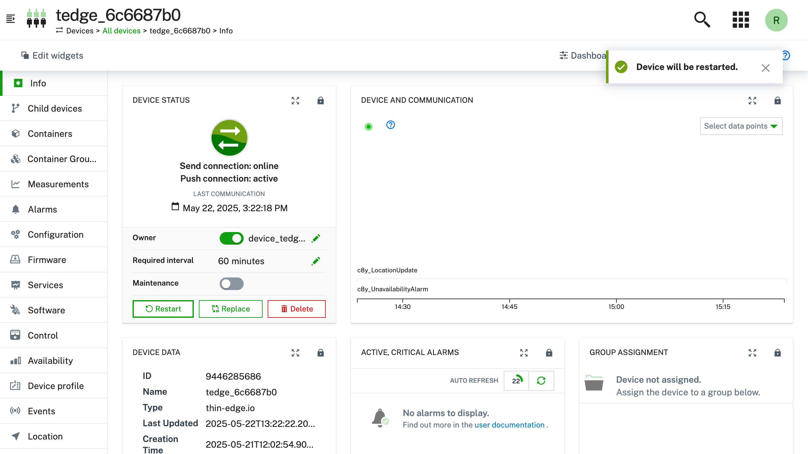

# How to restart your thin-edge.io device

If your device is running thin-edge.io, you can restart it from the cloud. This guide shows how to trigger a restart operation from different cloud providers.

### Cumulocity

Go to your device's homepage on c8y, and find the "Control" button. 

 In the top right corner, you will find the "More" button, click it and select, "Restart device".

