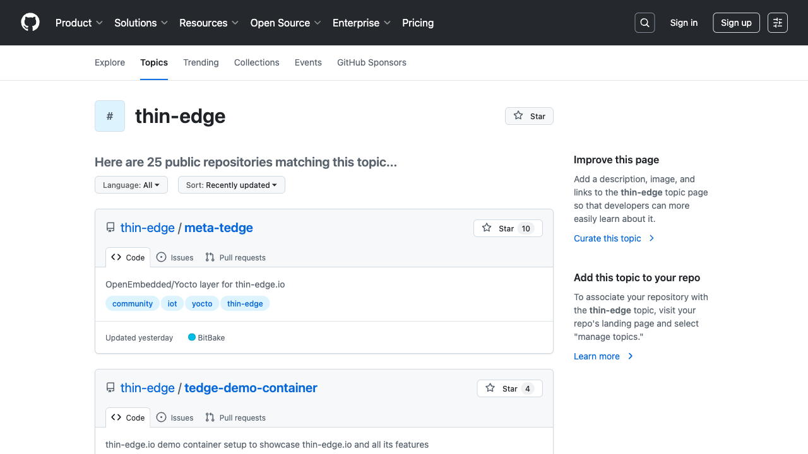

import { PluginCardsList } from '@site/src/components/PluginCardsList';

The following pages contain a list of available community plugins. You can use these plugins directly or as a reference for creating your own plugins.

## Plugins List

The list can be filtered by keywords and/or text to find plugins which are useful to you.

<PluginCardsList />

### Submitting a new plugin

The list of plugins included in the documentation is maintained in the [documentation repository](https://github.com/thin-edge/tedge-docs?tab=readme-ov-file#community-plugin-documentation).

New plugins can be added by following these [instructions](https://github.com/thin-edge/tedge-docs?tab=readme-ov-file#community-plugin-documentation).

## Github hosted plugins

In addition, a list of [Github plugins](https://github.com/topics/thin-edge) are visible directly from Github. If your plugin is hosted on Github as a public repository, then you can make your plugin discoverable by adding the `thin-edge` tag to the repository, afterwards the plugin will appear in the list.

<figure>
    
    <figcaption style={{textAlign:'center'}}>
        <a href="https://github.com/topics/thin-edge" target="_blank">Github plugins</a>
    </figcaption>
</figure>
