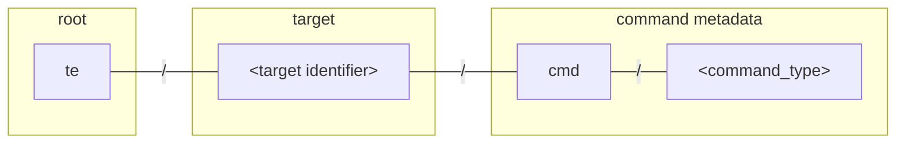
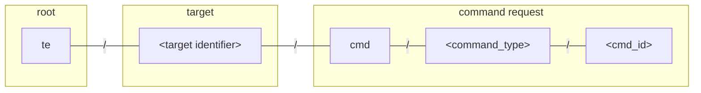
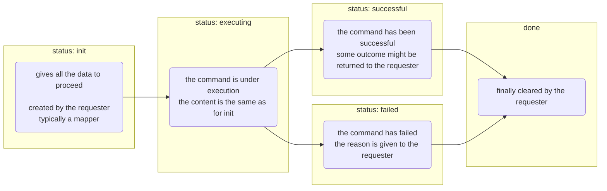

# Device Management API

The agent and the operation plugins enable device management on thin-edge,
giving the cloud operators a uniform interface to install software packages,
update configuration files, inspect log files, restart devices ...

Each of these device management operation requires a different set of interactions between the participants,
with specific steps, message payloads and expectations.

Hence, each operation type comes with its own API, and, possibly, with different implementations:
the `tedge-agent` service and operation plugins such as the `tedge-log-plugin` or user-specific plugins.

However, despite their diversity, all these APIs are designed along the same lines with normalized ways to
- associate MQTT topics with devices and commands
- tell which types of command is supported by a device
- create new command requests of a specific type for some target device
- monitor the progression of a specific command request upto completion.

## Topics

Following [thin-edge MQTT topic conventions](../mqtt-api.md#commands),
each device is assigned a specific topic prefix,
with a metadata sub-topic per command type
and specific sub-topics for the requests. 

### Command metadata topics

The __command metadata topics__ are used to declare which commands are available for a device,
and, if so, to which extent.



Where the groups are described as follows:

| Group        | Description                                                                                                                                                                           |
|--------------|---------------------------------------------------------------------------------------------------------------------------------------------------------------------------------------|
| root         | The [topic root prefix](../mqtt-api.md/#group-root) for this installation of thin-edge.                                                                                               |
| target       | The [topic identifier](../mqtt-api.md/#group-identifier) of the target device, possibly a [custom identifier](/contribute/design/mqtt-topic-design.md/#using-custom-identifier-schemas). |
| `cmd`        | The [command channel](../mqtt-api.md/#channel-identifier) grouping all of the commands for this target.                                                                               |
| command_type | The type name of the operation.                                                                                                                                                       |

A service that implements an operation for a device publishes on start a message notifying on the MQTT Bus
that this device can be sent commands of this type.

These messages are published with the retained flag set. So, a client process, such a mapper, can discover on start
what are __all the capabilities of all the devices__:

```sh te2mqtt formats=v1
tedge mqtt sub 'te/+/+/+/+/cmd/+'
```

### Command status topics

The actual command requests are published on the __command status topics__.
For each request, a specific command topic is created to monitor the progress of the command from its initial state to its completion.
These topics are named using a unique command identifier forged by the requester.



| Group        | Description                               |
|--------------|-------------------------------------------|
| command_id   | The identifier of the operation instance. |

:::note
The `command_id` is an arbitrary string however it should be unique.
It is recommended to either use a unique id generator, or add a unix timestamp as a suffix, e.g. date +%s
:::

The messages published on these topics represent each the current status of a running command.
So, one can list __all the in-progress commands of any type across all the devices__:

```sh te2mqtt formats=v1
tedge mqtt sub 'te/+/+/+/+/cmd/+/+'
```

## Message payloads

The message payloads are all specific to each operation type.
However, there are some common rules:

- JSON is used for all messages.
  - The schemas are flexible.
  - Extra fragments can be added by participants and ignored by others if not relevant.
- Device capabilities are published as retained messages.
  - If a capability has no specific metadata, then the capability is published as an empty JSON object `{}`.
  - A capability is removed by publishing a retained empty string `""`.
- Command status messages are published as retained messages on their dedicated topic.
  - These messages represent the current state of the command.
  - Initialized with all the required information to execute the command,
    they are updated during the command execution with outcome data.
  - A command request is cleared by publishing a retained empty string `""`.
- The command status messages contain a mandatory `"status"` field.
  - This status tells at which step the command execution is along its workflow. 
  - A new command is created with a `"status"` set to `"init"`.
  - When execution starts, the `"status"` is set to `"executing"`.
  - When execution is successful, the `"status"` is set to `"successful"`.
  - If execution fails for some reason, the `"status"` is set to `"failed"` and the reason given as `"reason"` field.
  - Each operation might define other specific `"status"` values for extra steps, actions or checks.

:::info
Health checks is a notable exception to the rule "command status are published as retained messages".
A health check is sent to the channel `cmd/health/check` of a service (or a device) as a non-retained request `{}`,
triggering a health message response published on the `status/health` channel of the same service
(or respectively the channels of all the service running on that device).
:::

## Operation workflow

A specific workflow rules each operation type, with specific:
- states
- message payloads
- states transitions.

However, there are some common rules:
- There at least four states: `"init"`, `"executing"`, `"successful"` and `"failed"`.
- A new command has to be created in the `"init"` state.
- Some checks can be done before the `"executing"` state, but this one should be the first triggering updates on the system.
- There only two terminal states: `"successful"` and `"failed"`.
- The retained messages are finally cleared by the requester.




### Capability declaration

On start, a service that implements an operation for a device must:

- know the MQTT root prefix (per default: `te`),
- know the entity topic identifier of the target device (e.g. `device/child001//`),
- know the well-known name of the operation (e.g. `software_update`),
- forge a capability message describing the operation support (e.g. `{ "types": ["apt", "docker"] }`)
- publish this capability message, with a retained flag, on the target command metadata topic (e.g. `te/device/child001///cmd/software_update`)

### Command execution

To request the execution of a command, a client must:
- know the MQTT root prefix (per default: `te`),
- know the entity topic identifier of the target device (e.g. `device/child001//`),
- know the well-known name of the operation (e.g. `software_update`),
- assign a unique id to its command (say `c8y-1234`)
- use these target and command identifiers to forge the topic name for its request
  (e.g. `te/device/child001///cmd/software_update/c8y-1234`)
- describe the request in a JSON message as defined by the operation API
- publish, as a retained message, the request on its specific topic with a `"status"` set to `"init"`
- await on the same topic for a response message with a `"status"` set to `"executing"`, `"successful"` or `"failed"`
- ignore any message with an unknown status as the agent is free to use intermediate states
- finally, clear the command topic by sending an empty retained message

To implement an operation on behalf of a device, a service must:
- know the MQTT root prefix (per default: `te`),
- know the entity topic identifier of the target device (e.g. `device/child001//`),
- know the well-known name of the operation (e.g. `software_update`),
- subscribe to any command requests of this type and the target device (i.e. `te/device/child001///cmd/software_update/+`)
- react to a well-formed requests by publishing the updated status when the step is done.

### Example

As an example, let's take software updates on a child device.

When launched on the child device `device/child001//`,
`tedge-agent` notifies that software packages of types: `apt` and `docker` can be updated on this device:

```sh te2mqtt formats=v1
tedge mqtt pub --retain 'te/device/child001///cmd/software_update' '{
    "description": "Install, update and remove software packages",
    "types": [
      "apt",
      "docker",
    ]
}'
```

On reception of this message, the Cumulocity mapper notifies Cumulocity of this capability.
On request from a cloud operator, the Cumulocity mapper creates a new command instance, say to update `nodered`:

```sh te2mqtt formats=v1
tedge mqtt pub --retain 'te/device/child001///cmd/software_update/c8y-123' '{
    "status": "init",
    "updateList": [
        {
            "type": "debian",
            "modules": [
                {
                    "name": "nodered",
                    "version": "1.0.0",
                    "action": "install"
                }
            ]
        }
    ]
}'
```

The agent, running on `device/child001//`, notifies that it will execute the command:

```sh te2mqtt formats=v1
tedge mqtt pub --retain 'te/device/child001///cmd/software_update/c8y-123' '{
    "status": "executing",
    "updateList": [
        {
            "type": "debian",
            "modules": [
                {
                    "name": "nodered",
                    "version": "1.0.0",
                    "action": "install"
                }
            ]
        }
    ]
}'
```

Then the agent proceeds, here installing a specific version of `nodered`, and notifies the mapper when done:

```sh te2mqtt formats=v1
tedge mqtt pub --retain 'te/device/child001///cmd/software_update/c8y-123' '{
    "status": "successful",
    "updateList": [
        {
            "type": "debian",
            "modules": [
                {
                    "name": "nodered",
                    "version": "1.0.0",
                    "action": "install"
                }
            ]
        }
    ]
}'
```

The Cumulocity mapper, having subscribed to all software_update commands,
monitors this command instance and notifies Cumulocity of its progress upto completion.  
Finally, the Cumulocity mapper clear the command topic:

```sh te2mqtt formats=v1
tedge mqtt pub --retain 'te/device/child001///cmd/software_update/c8y-123' ''
```
