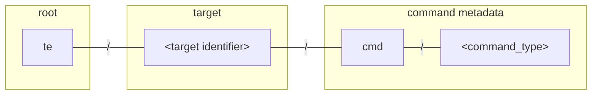
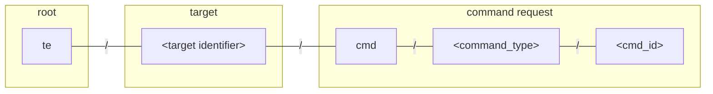
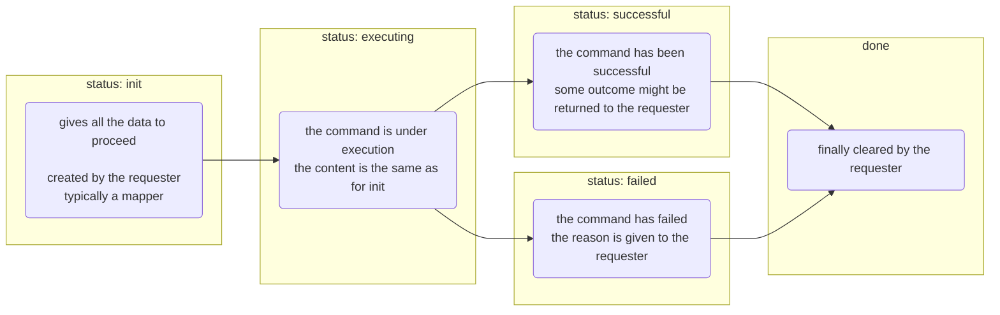

# Device Management API

The agent and the operation plugins enable device management on %%te%%,
giving the cloud operators a uniform interface to install software packages,
update configuration files, inspect log files, restart devices ...

Each of these device management operation requires a different set of interactions between the participants,
with specific steps, message payloads and expectations.

Hence, each operation type comes with its own API, and, possibly, with different implementations:
the `tedge-agent` service or user-specific plugins.

However, despite their diversity, all these APIs are designed along the same lines with normalized ways to
- associate MQTT topics with devices and commands
- tell which types of command is supported by a device
- create new command requests of a specific type for some target device
- monitor the progression of a specific command request up to completion.

## Concepts

### Operations, Capabilities, and Commands

From a user perspective an *operation* is a predefined sequence of actions
that an operator can trigger on a device to reach some desirable state.
It can be to restart the device or to install some new software.
From an implementation perspective, an operation is an API identified by a well-known name such as `restart` or `software_update`.
This API rules the coordination among the software components that need to interact to advance the operation.

Not all entities and components of a %%te%% device support all the operations,
and, even if they do, the implementations might be specific.
Installing a software package on top of service makes no sense.
Restarting the device is not the same as restarting one of its services.
Each entity or component has to declare its *capabilities* i.e. the operations made available on this target.

Strictly speaking, capabilities are not implemented nor declared by the devices and the services themselves.
They are implemented by %%te%% services and plugins.
These are the components which actually implement the operations interacting with the operating system and other software.
For instance, device restart and software updates are implemented by the `tedge-agent`.

Once an operation has been registered as a capability of some target entity or component,
an operator can trigger operation requests a.k.a *commands*,
for this kind of operation on this target,
say to request a software update, then a restart of the device.

### MQTT-Driven Workflows

The core idea is to expose over MQTT the different states a specific operation request might go through;
so independent sub-systems can observe the progress of the request
and participate as per their role, when it is their turn.

- A specific topic is attached to each command under-execution.
  - This topic is specific to the target of the command, the requested operation and the request instance.
  - e.g. `te/device/child-xyz///cmd/configuration-update/req-123`
- The messages published over this topic represent the current state of the command.
  - Each message indicates at which step of its progression the command is and gives all the required information to proceed.
  - e.g. `{ "status": "init", "target": "mosquitto", "url": "https://..." }`
- The state messages are published as retained.
  - They capture the latest state of the operation request.
  - Till some change occurs, this latest state is dispatched to any participant on reconnect.
- Several participants act in concert to move the command execution forward.
  - The participants observe the progress of all the operations they are interested in.
  - They watch for the specific states they are responsible in moving forward.
  - When a step is performed, successfully or not, the new state is published accordingly by the performer.

## Topics

Following [%%te%% MQTT topic conventions](../mqtt-api.md#commands),
each device is assigned a specific topic prefix,
with a metadata sub-topic per command type
and specific sub-topics for the requests. 

### Command metadata topics

The command metadata topics are used to declare the *capabilities* of a device.

The ability for an entity *a*/*b*/*c*/*d* to handle a given *operation*, is published as a retained message
on the topic __te__/*a*/*b*/*c*/*d*/__cmd__/*operation*.



Where the groups are described as follows:

| Group        | Description                                                                                                                                                                           |
|--------------|---------------------------------------------------------------------------------------------------------------------------------------------------------------------------------------|
| root         | The [topic root prefix](../mqtt-api.md#group-root) for this installation of %%te%%.                                                                                               |
| target       | The [topic identifier](../mqtt-api.md#group-identifier) of the target device, possibly a [custom identifier](/contribute/design/mqtt-topic-design.md#using-custom-identifier-schemas). |
| `cmd`        | The [command channel](../mqtt-api.md#group-channel) grouping all of the commands for this target.                                                                               |
| command_type | The type name of the operation.                                                                                                                                                       |

A service that implements an operation for a device publishes on start, a capability message notifying
that this device can be sent commands of this type.
As an example, the `tedge-agent` which implements the `restart` operation emits on start a capability message for that operation:

```sh te2mqtt
tedge mqtt pub -r 'te/device/main///cmd/restart' '{}' 
```

These messages are published with the retained flag set. So, a client process, such a mapper, can discover on start
what are __all the capabilities of all the devices__:

```sh te2mqtt formats=v1
tedge mqtt sub 'te/+/+/+/+/cmd/+'
```

### Command status topics

The actual command requests are published on the command status topics.

Each request is given a unique *command identifier*
and the topic __te__/*a*/*b*/*c*/*d*/__cmd__/*operation*/*command-identifier*
is used to trigger and monitor this request for a given *operation* on a target entity *a*/*b*/*c*/*d*.



| Group        | Description                               |
|--------------|-------------------------------------------|
| command_id   | The identifier of the operation instance. |

:::note
The `command_id` is an arbitrary string however it should be unique.
It is recommended to either use a unique id generator, or add a unix timestamp as a suffix, e.g. `date +%s`.
This unique id assigned by the requester, who is also responsible for creating the topic
with an initial state and for finally removing it.
:::

The messages published on these topics represent each the current status of a running command.
So, one can list __all the in-progress commands of any type across all the devices__:

```sh te2mqtt formats=v1
tedge mqtt sub 'te/+/+/+/+/cmd/+/+'
```

As an example, software update is an operation that requires coordination between a mapper and `tedge-agent`.
On reception of a software update request from the cloud operator,
the `tedge-mapper` creates a fresh new topic for this command,
say `te/device/main///cmd/software_update/c8y-mapper-123` with a unique command id: `c8y-mapper-123`.
On this topic, a first retained messages is published to describe the operator expectations for the software updates.

```sh te2mqtt
tedge mqtt pub -r 'te/device/main///cmd/software_update/c8y-mapper-123' '{
    "status": "init",
    "modules": [
        {
            "type": "apt",
            "name": "collectd",
            "version": "5.7",
            "action": "install"
        }
    ]
}' 
```

Then, the `tedge-agent` and possibly other software components take charge of the command,
making it advance to some final state,
publishing all the successive states as retained messages on the command topic.

Eventually, the `tedge-mapper` will have to clean the command topic with an empty retained message:

```sh te2mqtt
tedge mqtt pub -r 'te/device/main///cmd/software_update/c8y-mapper-123' ''
```

## Message payloads

The message payloads are all specific to each operation type.
However, there are some common rules:

- JSON is used for all messages.
  - The schemas are flexible.
  - Extra fragments can be added by participants and ignored by others if not relevant.
- Device capabilities are published as retained messages.
  - If a capability has no specific metadata, then the capability is published as an empty JSON object `{}`.
  - A capability is removed by publishing a retained empty string `""`.
- Command status messages are published as retained messages on their dedicated topic.
  - These messages represent the current state of the command.
  - Initialized with all the required information to execute the command,
    they are updated during the command execution with outcome data.
  - A command request is cleared by publishing a retained empty string `""`.
- The command status messages contain a mandatory `"status"` field.
  - This status tells at which step the command execution is along its workflow. 
  - A new command is created with a `"status"` set to `"init"`.
  - When execution starts, the `"status"` is set to `"executing"`.
  - When execution is successful, the `"status"` is set to `"successful"`.
  - If execution fails for some reason, the `"status"` is set to `"failed"` and the reason given as `"reason"` field.
  - Each operation might define other specific `"status"` values for extra steps, actions or checks.

:::info
Health checks is a notable exception to the rule "command status are published as retained messages".
A health check is sent to the channel `cmd/health/check` of a service (or a device) as a non-retained request `{}`,
triggering a health message response published on the `status/health` channel of the same service
(or respectively the channels of all the service running on that device).
:::

## Operation workflow

An operation workflow defines the possible sequences of actions for an operation request
from its initialization up to its success or failure. It specifies the actions to perform
as well as any prerequisite checks, outcome validations and possible rollbacks.
However, a workflow doesn't define how to perform these actions.
These are delegated to %%te%% services, scripts, application-specific services or other devices.
More precisely, an operation workflow defines:
- the *observable states* of an ongoing operation instance
  from initialization up to a final success or failure
- the *participants* and their interactions, passing the baton to the software component
  whose responsibility is to advance the operation in a given state
  and to notify the other participants what is the new resulting state
- the *possible state sequences* so that the system can detect any stale or misbehaving operation request.

A specific workflow rules each operation type, with specific:
- states
- message payloads
- states transitions.

However, there are some common rules:
- There at least four states: `"init"`, `"executing"`, `"successful"` and `"failed"`.
- A new command has to be created in the `"init"` state.
- Some checks can be done before the `"executing"` state, but this one should be the first triggering updates on the system.
- There only two terminal states: `"successful"` and `"failed"`.
- The retained messages are finally cleared by the requester.




### Capability declaration

On start, a service that implements an operation for a device must:

- know the MQTT root prefix (per default: `te`),
- know the entity topic identifier of the target device (e.g. `device/child001//`),
- know the well-known name of the operation (e.g. `software_update`),
- forge a capability message describing the operation support (e.g. `{ "types": ["apt", "docker"] }`)
- publish this capability message, with a retained flag, on the target command metadata topic (e.g. `te/device/child001///cmd/software_update`)

### Command execution

To request the execution of a command, a client must:
- know the MQTT root prefix (per default: `te`),
- know the entity topic identifier of the target device (e.g. `device/child001//`),
- know the well-known name of the operation (e.g. `software_update`),
- assign a unique id to its command (say `c8y-1234`)
- use these target and command identifiers to forge the topic name for its request
  (e.g. `te/device/child001///cmd/software_update/c8y-1234`)
- describe the request in a JSON message as defined by the operation API
- publish, as a retained message, the request on its specific topic with a `"status"` set to `"init"`
- await on the same topic for a response message with a `"status"` set to `"executing"`, `"successful"` or `"failed"`
- ignore any message with an unknown status as the agent is free to use intermediate states
- finally, clear the command topic by sending an empty retained message

To implement an operation on behalf of a device, a service must:
- know the MQTT root prefix (per default: `te`),
- know the entity topic identifier of the target device (e.g. `device/child001//`),
- know the well-known name of the operation (e.g. `software_update`),
- subscribe to any command requests of this type and the target device (i.e. `te/device/child001///cmd/software_update/+`)
- react to a well-formed requests by publishing the updated status when the step is done.

### Example

As an example, let's take software updates on a child device.

When launched on the child device `device/child001//`,
`tedge-agent` notifies that software packages of types: `apt` and `docker` can be updated on this device:

```sh te2mqtt formats=v1
tedge mqtt pub --retain 'te/device/child001///cmd/software_update' '{
    "description": "Install, update and remove software packages",
    "types": [
      "apt",
      "docker",
    ]
}'
```

On reception of this message, the Cumulocity mapper notifies Cumulocity of this capability.
On request from a cloud operator, the Cumulocity mapper creates a new command instance, say to update `nodered`:

```sh te2mqtt formats=v1
tedge mqtt pub --retain 'te/device/child001///cmd/software_update/c8y-123' '{
    "status": "init",
    "updateList": [
        {
            "type": "debian",
            "modules": [
                {
                    "name": "nodered",
                    "version": "1.0.0",
                    "action": "install"
                }
            ]
        }
    ]
}'
```

The agent, running on `device/child001//`, notifies that it will execute the command:

```sh te2mqtt formats=v1
tedge mqtt pub --retain 'te/device/child001///cmd/software_update/c8y-123' '{
    "status": "executing",
    "updateList": [
        {
            "type": "debian",
            "modules": [
                {
                    "name": "nodered",
                    "version": "1.0.0",
                    "action": "install"
                }
            ]
        }
    ]
}'
```

Then the agent proceeds, here installing a specific version of `nodered`, and notifies the mapper when done:

```sh te2mqtt formats=v1
tedge mqtt pub --retain 'te/device/child001///cmd/software_update/c8y-123' '{
    "status": "successful",
    "updateList": [
        {
            "type": "debian",
            "modules": [
                {
                    "name": "nodered",
                    "version": "1.0.0",
                    "action": "install"
                }
            ]
        }
    ]
}'
```

The Cumulocity mapper, having subscribed to all software_update commands,
monitors this command instance and notifies Cumulocity of its progress up to completion.  
Finally, the Cumulocity mapper clear the command topic:

```sh te2mqtt formats=v1
tedge mqtt pub --retain 'te/device/child001///cmd/software_update/c8y-123' ''
```
