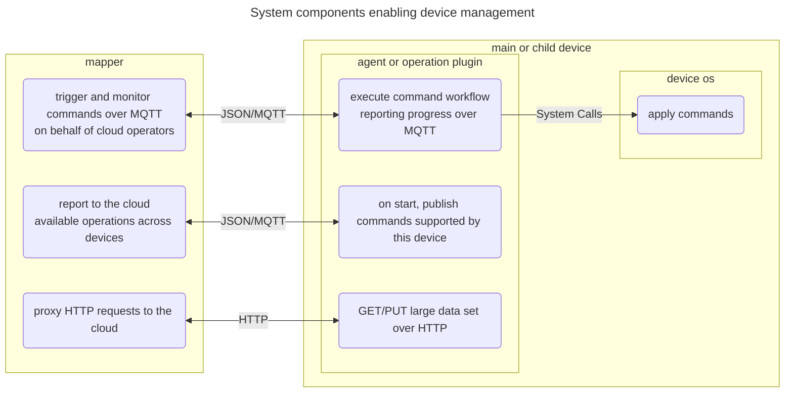

import DocCardList from '@theme/DocCardList';

# The Agent and Operations Plugins

The __agent__ and the __operation plugins__ are the main components used by %%te%%
to enable edge device management from various clouds on diverse hardware,
giving the cloud operators a uniform interface to install software packages,
update configuration files, inspect log files, restart devices ...

The API between the mappers and the agent is designed to abstract device location, operating system, file system and hardware.
__Any service securely connected to the local MQTT bus can trigger commands as well as respond to commands.__

- The agent and the operation plugins interact with the operating system,
  running the appropriate sequences of checks and actions
  in response to command requests initiated by [mappers](../mappers) on behalf of cloud operators.
- `tedge-agent` is the out-of-the-box implementation of the device management APIs provided by %%te%%.
  It can run on the main device as well as child devices.
  It can be replaced with any other user-developed components that implement these device management APIs 
  addressing specific requirements or hardware.
- %%te%% also provides the tools to define, extend and combine *user-defined operation workflows*
  that rule the sequence of steps applied when an *operation* is triggered by an operator or a software component.

- MQTT is used to *declare* which operations are supported by each device,
  to *trigger* commands and to *monitor* their progress up to completion.
- HTTP is used to *transfer* files between devices independently of their file systems.

<DocCardList />