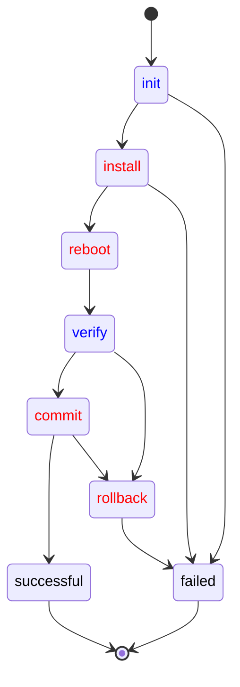

## Overview

An agent developer can define application specific [operation workflows](./device-management-api.md#mqtt-driven-workflows)
to control how an operation is performed on a device.
%%te%% **tedge-agent** provides the tools to:

- override existing workflows
- define new states and actions such as pre-requisite or post-execution checks 
- introduce new transitions such as rollbacks or conditional executions
- create new workflows, combining workflows and steps

## Example

Here is an example where three software components participate in a `firmware_update` command.
- The **tedge-mapper** creates the initial state of the command
  providing the required information to install a new version of the device firmware;
  and then waits for the final outcome (in black).
- The **tedge-agent** handles the main steps (in red): downloading the file and installing it where expected.
- User-provided **scripts** handle domain-specific checks (in blue)
  to timely schedule the command as well as to ensure the configuration file is not corrupted and properly installed.



### Key points

Observe on the example that:

- At any state, *one and only one* participant is responsible to move the operation forward.
- Publishing a state to the MQTT command topic, can be seen as passing the baton from one participant to another.
  The mapper creates the **init** state and then lets the other components work.
  The agent tells the installation has been successful by publishing the **reboot** state,
  but do nothing till the domain-specific component has checked the file and move the command state to **install**.
- Each software component has to know only *some* states of the whole workflow:
  - the states they are responsible for
  - the states they create to pass the control.
- The compatibility of two participants, one advancing to the new state owned by the other, is only defined by the message payload:
  - all the property fields, required to make progress at some state, must be provided by the previous participant.

### Benefits

The benefits are that:
- A participant can be substituted by another implementation as long as the substitute implementation
  is ready to process at least all the states processed by the former implementation.
- Extra states and participants can be added as long as each state is owned by one participant.
  - For instance, an agent developer can introduce a **rollback** state in the `firmware_update` workflow,
    associated by another software component responsible for these rollbacks.
- The same executable can be used to handle operations on different targets.
  For instance, the **tedge-agent** can run on the main device `te/device/main//`
  as well as on a child-device identified by `te/device/child-xyz//`.
- Specific versions of the same workflow can be defined on different targets.
  The main and child devices can each run their own version of a workflow for an operation.
  As an example, an agent developer can define an extra rollback state on the main device but not on the child devices.
- A specific executable can be substituted on a specific target.
  If for some reasons, **tedge-agent** cannot be installed on a child-device,
  then a specific implementation of the `firmware_update` MQTT API can be used to serve firmware updates
  on that specific hardware.

## Operation API

As several software components have to collaborate when executing a command, each operation must define a specific API.
This API should be based on the principles of MQTT-driven workflow and defines:
- the well-known operation name such `firmware_update` or `restart`
- user documentation of the required input and the expected outcome of an operation request
- the set of observable states for a command and the possible state sequences
- for each state:
  - the well-known name such as **download** or **downloaded**
  - the schema of the state payload and the required parameters to process a command at this stage
  - developer documentation on the role of each parameter and the expected checks and actions
- the schema for the capability message sent when the operation is enabled on some %%te%% entity or component
  - developer documentation on the role of each field of the capability message

A workflow implementation is free to define the states a command can go through
as well as the message payload attached to each state.

However, there are some rules and best practices.

- Three states are mandatory: **init**, **successful** and **failed**.
- **init** must be the unique initial state of the workflow.
  - This state must give all the information required to execute the command.
  - Having no other initial states is important so any command requester (as the mapper)
    can trigger commands in a systematic manner *even* if the workflow is updated.
- **successful** and **failed** must be the unique terminal states of the workflow.
  - The payload of the **failed** state should contain a `reason` property telling what failed.
  - Having no other terminal states is important so any command requester (as the mapper)
    can await the termination of a command in a systematic manner *even* if the workflow is updated.
- A workflow API should define *no-op* states with no pre-defined actions
  and which sole purpose is to give an agent developer the opportunity to *insert* its own logic and extra steps.
  - A *no-op* state is a state which has a single direct transition to the next state.
  - As an example, having a **downloaded** *no-op* state, with a direct transition to an **install** state which uses the downloaded file,
    lets an agent operator override the automatic transition, say to check the downloaded file *before* moving the **install** state.
  - The **init** state should be a *no-op* state.

### Operation Implementation

A workflow implementation for a specific operation must implement the actions specified for each non *no-op* state.
This implementation has some freedom, notably to implement extra checks and actions but also to add new states.

However, there are some rules and best practices.

- All the state messages must be published as retained with QoS 1.
- A workflow implementation should not reject a state message payload with unknown fields.
  - It's also important to keep these unknown fields in the following states.
  - This is important as we want to *extend* the workflow of an operation.
    A software component added by the user might need these *extra* fields the plugin is not aware of.
- A workflow implementation must not react on *no-op* states nor terminal states.
  - The transition from a *no-op* state must be handled either by %%te%% as direct transition
    or overridden by the user with domain-specific checks and actions.
  - The terminal states, a.k.a **successful** and **failed**, are owned by the process which created the **init** state (in practice, the mapper).
    Only this process should clear the retained message state for an operation instance by sending an empty payload on command's topic.

## User-defined Operation Workflow

%%te%% provides a mechanism to define, extend and combine workflows.

This mechanism is provided by the **tedge-agent** which gathers a set of user-defined workflows
and combined them with the builtin workflows implemented by the agent itself.

Each workflow is defined using a TOML file stored in `/etc/tedge/operations`. Each specifies:
- the command name that it should trigger on
  such as `firmware_update` or `restart`
- the list of states
- for each state:
  - the state name as defined by the operation API
  - an action to process the command at this stage, e.g.
    - run a script
    - trigger a sub operation
    - let the agent applies the builtin behavior
  - instructions on how to proceed given the successful or failed outcome of the action.

```toml title="file: firmware_update_example.toml"
operation = "firmware_update"

on_error = "failed"

[init]
  script = "/usr/bin/firmware_handler.sh plan"
  on_success = "executing"
  on_error = { status = "failed", reason = "not timely" }
  
[executing]
  action = "proceed"
  on_success = "install"

[install]
  script = "/usr/bin/firmware_handler.sh install ${.payload.url}"
  on_success = "reboot"

[reboot]
  script = "/usr/bin/firmware_handler.sh reboot"
  on_exec = "verify"

[verify]
  script = "/usr/bin/firmware_handler.sh verify"
  on_success = "commit"
  on_error = { status = "rollback", reason = "sanity check failed" }

[commit]
  script = "/usr/bin/firmware_handler.sh commit"
  on_success = "successful"
  on_error = { status = "rollback", reason = "commit failed" }

[rollback]
  script = "/usr/bin/firmware_handler.sh rollback"
  on_success = "failed"

[successful]
  action = "cleanup"

[failed]
  action = "cleanup"
```

%%te%% combines all these workflows to determine what has to be done
when a state message is published for a command on a topic matching the global topic filter for commands,
i.e. `te/+/+/+/+/cmd/+/+`.
- Each running instance of the __tedge_agent__ reacts only on commands targeting its own device.
- If a user-defined workflow has been defined for this operation, then this workflow is used to determine the required action.
- If no workflow has been defined by the user for this operation, then the built-in workflow is used.
- If there is no workflow or no defined action for the current state,
  then the __tedge_agent__ simply waits for another component to take over the command.

### Script Execution

A script can be attached to a command state. 

```
[state]
script = "/full/path/command [args]" 
```

This script is given as a plain command line possibly with arguments.

Data extracted from the command status topic and message payload can be passed as argument to the script.

- `"/bin/new-command.sh ${.topic} ${.payload}"` passes two arguments to the `/bin/new-command.sh` program.
  - The first one is the full command request topic (*e.g.* `te/device/main/cmd///restart/c8y-mapper-123`).
  - The second one is the full json payload (*e.g.* `{"status': "init"}`).
- Specific path expressions can be used to pass specific excerpts.
  - `${.}` is a json for the whole message including the `topic` and the `payload`.
  - `${.topic}` is the command request topic (*e.g.* `te/device/main/cmd///restart/c8y-mapper-123`)
  - `${.topic.target}` is the command target identity  (*e.g.* `device/main/cmd//`)
  - `${.topic.operation}` is the command operation  (*e.g.* `restart`)
  - `${.topic.cmd_id}` is the command request unique identifier  (*e.g.* `c8y-mapper-123`)
  - `${.payload}` is the whole command json payload (*e.g.* `{"status': "init"}`)
  - `${.payload.status}` is the command current status (*e.g.* `"init"`)
  - `${.payload.x.y.z}` is the json value extracted from the payload following the given `x.y.z` path if any.
  - `${.payload.some.unknown.path}` is substituted for the empty string `""`,
     the rational being that the *payload* object represents a free-form value.
  - When the root object is unknown (*e.g.* `${.unknown-object.some.path}`), the argument is passed unchanged to the script.
  - An argument can contain a combination of path expressions and literals:
    - in a context where the operation instance payload is  `{"x":"X", "y":"Y"}`
    - the template `"prefix-${.payload.x}-separator-${.payload.y}-suffix"`
    - is replaced by `"prefix-X-separator-Y-suffix"`.
- These substitutions are applied using the following rules:
  - The script command is first tokenized using shell escaping rules.
    *e.g.* `"sudo systemctl restart tedge-mapper-${.payload.mapperType}"`
    is interpreted as the `sudo` command with 3 parameters.
  - Then all the path expressions of each parameter are expended using the command current topic and payload.
    *e.g.* `"tedge-mapper-${.payload.mapperType}"` is interpreted as `"tedge-mapper-c8y"`
    (assuming the JSON payload contains a `mapperType` field with `"c8y"` as string value).
  - These substitutions apply to the command itself as well as all its arguments.
  - Any ill-formed path expression is left unchanged.

The script exit status and output is used to determine the next step for the command.
- If the script cannot be launched or return a non-zero status, the command request is marked as __failed__.
- If the script successfully returns, its standard output is used to update the command state payload.
  - From this output, only the excerpt between a `:::begin-tedge:::` header and a `:::end-tedge:::` trailer is decoded.
    This is done to ease script authoring. A script can emit arbitrary output on its stdout,
    and just have to surround its workflow updates with the `:::begin-tedge:::` and `:::end-tedge:::` markers.
  - If this excerpt is a json payload, this payload is injected into the previous message payload
    (adding new fields, overriding overlapping ones, keeping previous unchanged ones).
  - If this excerpt is a json payload with a `status` field, then this status is used as the new status for the command.
- If the script output is empty, then the exit status of the process is used to determine the next step. 

### Next step determined by script exit status

The exit status of the script processing a command state
can be used to determine the next state of the workflow.

The workflow can specify for each exit code:
- the next command status
- a failure reason

```toml
script = "/some/script.sh with some args"
on_exit.0 = "next_state"                                  # next state for an exit status
on_exit.1 = { status = "retry_state", reason = "busy"}    # next status with fields 
on_exit.2-5 = { status = "fatal_state", reason = "oops"}  # next state for a range of exit status
on_exit._ = "failed"                                      # wildcard for any other non successful exit
on_kill = { status = "failed", reason = "killed"}         # next status when killed
```

- `on_success` is syntactic sugar for `on_exit.0`
- `on_error` is syntactic sugar for `on_exit._`
- This is an error to provide more than one handler for an exit code (overlapping ranges).
- If no reason is provided for an exit code, the default reason is `"${program} exited with ${code}"`.
- If no reason is provided for the on kill handler, the reason is `"${program} killed by ${code}"`.
- The default for the `on-error` and `on-kill` status is `"failed"`.
- There is no default for the `on-success` status.
  In such a case the output of the script is used to determine the next status.

If the standard output of the script contains a JSON object surrounded by `:::begin-tedge:::` and `:::end-tedge:::` markers,
then this object is injected in the command state message payload.
There are two exceptions, though.
The `status` and `reason` fields are determined after the exit code and not the standard output.

### Next step determined by script output

The output of the script processing a command state
can be used to determine the next state of the workflow.

For that to work:
- An `on_stdout` handler must be provided, listing all the states that can possibly be dictated by the script output. 
- Neither `on_success` nor `on_exit.0` status must be given as this would make the next status computed after the exit code.
- The standard output of the script must emit a JSON object surrounded by `:::begin-tedge:::` and `:::end-tedge:::` markers.
- This JSON object must provide a `status` field and possibly a `reason` field.

```toml
script = "/some/script.sh with some args"                                # no given `on_exit.0` status
on_error = { status = "fatal_state", reason = "fail to run the script"}  # possibly some `on_error` and `on_kill` handlers
on_stdout = ["state-1", "state-2", "state-3"]                            # the list of status accepted as next status
```

- If the script is successful and its output returns some `status` and `reason` fields, these are used for the next state.
- If the script is successful but its output contains no `status` field, then `on_error` is used.
- If the script cannot be executed, is killed or return an error with no specific `on_exit` handler,
  then the `status` and `reason` fields are determined by the `on_error` and `on_kill` handlers
  (or if none where provided using the default `on_error` and `on_kill` handlers).
- If the script is successful or returns an expected exit code (i.e. one with a specific `on_exit` handler),
  then the fields of the JSON object extracted from the script output are injected into the command state message payload.
  - This is done in the successful as well as the failed cases.
  - If a `status` field is also provided by the message payload,
    then the `status` provided by the workflow definition trumps the value provided by the script.
  - For the `reason` field, the rule is reversed:
    the value provided by the script trumps the `reason` provided by the workflow definition if any.

### Background scripts

A workflow state can be handled using a *background script*.
When executed, as a detached process, by the __tedge_agent__ no response nor exit status is expected from the script.
In any case the workflow will be moved to the given next state.
And this move to the next state is even persisted *before* the script is executed.
This can notably be used to restart the device or the agent.
After the restart, the workflow will resume in the state specified by the workflow.

```toml
[agent-restart]
background_script = "sudo systemctl restart tedge-agent"
on_exec = "waiting-for-restart"

[waiting-for-restart]
script = "/some/script.sh checking restart"
on_stdout = [ "successful_restart", "failed_restart"]
```

Note that:
- No `on_exit` nor `on_kill` status can be provided, as the script is not monitored.
- If the script cannot be launched, the workflow will be moved to the final `"failed"` state.

### 🚧 Sub-Operation Execution {#sub-operation-execution}

:::info
🚧 The syntax for triggering other workflows from an existing workflow is still being finalized so please avoid using it in production environments.
:::

An operation workflow can trigger a command defined by another workflow.

```toml
[<state-name>]
operation = "<sub-operation-name>"
input_script = "/some/script/which/stdout/is/used/as/sub-operation/init/state"
input.x = "some static value"
input.y = "${.payload.y}"
on_exec = "<next-state-waiting-for-sub-operation>"
```

Operation specific arguments can be provided to the sub-operation instance,
and data extracted from the calling command status topic and message payload can be injected into these arguments.

- For instance, `input.url = "http://127.0.0.1:8000/tedge/file-transfer/foo.txt"`
  adds an `url` property to the init message of the sub-operation.
- Similarly, `input.url = "${.payload.config_update.url}"`
  adds an `url` property to the init message of the sub-operation, extracting this url from the calling command state.
- Several such arguments can be added to the sub-operation initial state payload.
  - All these individual arguments are combined into a JSON object value published on the sub-operation MQTT topic.
  - The calling command excerpts injected into this initial state are defined using the same path conventions as for script handlers.
  - If an `input.status` value is provided, this value will be ignored and replaced by `"init"`
    as this is the only valid value for the initial state of a command.
  - If no value at all is provided for `input`, then the default value is `{"status" = "init"}`.
- For cases where there is no one-to-one relationship between the properties of the current operation state
  and the properties of sub-operation init state, the sub-operation init state can be computed using a script.
  - `input_script = "/some/script/which/stdout/is/used/as/sub-operation/init/state"`
  - The input script can be passed parameters extracted from the current command state,
    *e.g.* `input_script = "/bin/extra_configuration_updates.sh ${.payload.device_profile}"`
  - When the input script is successful, its stdout is used to derive the init state of the sub-operation
      - From this output, only the excerpt between a `:::begin-tedge:::` header and a `:::end-tedge:::` trailer is decoded.
      - If this excerpt is a json payload, this payload is injected into the previous message payload
        (adding new fields, overriding overlapping ones, keeping previous unchanged ones).
      - If this excerpt is a json payload with a `status` field, then this status is ignored and its value replaced by `"init"`.
  - When the input script fails, no subcommand is created and the command moves to the `failed` state.
  - If both a script and explicit input properties are provided, the script output is applied first and the explicit properties second.
- The sub-operation name can be dynamic and extracted from the payload of the triggering operation.
  - As an example, `operation = "${.payload.sub-operation}"` triggers the operation
    which name is given by the `sub-operation` property of the command payload. 
- There is no way to assign a command identifier for the new sub-operation instance.
  - This identifier is generated by %%te%%, which creates, monitors and clears the MQTT topic for the sub-operation.

From an execution perspective, triggering a sub-operation is similar to running a background script.

- The calling command workflow is paused while the sub-operation is processed.
- The calling workflow moves to an `on_exec` state from where the sub-operation execution is watched until success, failure or timeout.
- A specific `"await-operation-completion"` action is to be used for this `on_exec` state where the sub-operation completion is awaited.
- The steps following the sub-operation completion are defined on the `on_exec` state with `on_success`, `on_error` and `on_timeout` handlers.

For example, a configuration update can be triggered with:

```toml
[trigger_config_update]
operation = "config_update"
input.tedgeUrl = "http://127.0.0.1:8000/tedge/file-transfer/example/config_update/mosquitto-1234"
input.type = "mosquitto"
on_exec = "waiting_for_config_update"

[waiting_for_config_update]
action = "await-operation-completion"
timeout_second = 600
on_timeout = "timeout_config_update"
on_success = "successful_config_update"
on_error = { status = "failed", reason = "fail to update the config"}
```

### Setting step execution timeout

The execution time of the state transitions of a workflow can be limited using timeouts.
- A default timeout can be set at the level of an operation for all the transitions.
- Individual timeout can be set to each state of the workflow.

```toml
timeout_second = 300
on_timeout = { status = "failed", reason = "timeout" }
```

Some scripts cannot be directly controlled.
This is notably the case for the background scripts restarting the device.
For those any timeout has to be set on the waiting state.

```toml
["device-restart"]
background_script = "sudo reboot"
on_exec = "waiting-for-restart"

["waiting-for-restart"]
action = "await-agent-restart"
timeout_second = 600
on_timeout = "timeout_restart"
on_success = "successful_restart"
```

### Running builtin actions

Builtin actions can be used to control a command at some state.

```toml
["<state>"]
action = "<action-name> <possibly-with-arguments>"
```

As for scripts, these actions can be complemented with handlers dictating how to proceed when the action is successful or failed.
The set of accepted handlers for an action are the following:

- `on_success = "<state>"` defines the next state when the action is successful
- `on_error = { status = "<state>", reason = "<message>"}` defines the next state when the action failed
- `timeout_second = 3600` the number of second given to the action to execute
- `on_timeout = { status = "<state>", reason = "<message>"}` defines the next state when the action is not be completed within the time limit 

Currently, here are the available actions:

- `await-agent-restart` awaits for **tedge-agent** to restart
- `await-operation-completion` awaits for a sub-operation to reach a success, failure or timeout
- `proceed` is a no-op action, simply proceeding to the next state, which is useful when a builtin operation is customized
   but no specific behavior has to be added on a workflow extension point.
- `cleanup` marks the terminal state of the workflow where the command has been fully processed
  and where the original requester is expected to clean up the command retained message storing its state.
- ( *deprecated* ) `builtin` is used when a builtin operation is overwritten by a custom workflow and indicates that for that state
  the builtin action has to be applied. For backward compatibility, this keyword is rewritten by the agent
  as a combination of `operation = "builtin:<operation-name>"` and `action = "await-operation-completion"`.
- ( *deprecated* ) `restart` trigger a device restart. For backward compatibility, this keyword is rewritten by the agent
  as a combination of `operation = "restart"` and `action = "await-operation-completion"`.
 
#### Awaiting the agent to restart

When the expected outcome of a script is to restart the device or the agent,
this script cannot be monitored end-to-end by the agent which will die executing the script.
The success or failure of the script can only be detected when the agent resumes.

This is done using a combination of the `background_script` directive with an additional state
that awaits the agent restart using the `await-agent-restart` action after the script is triggered.

1. The script is declared as a `background_script` with an `on_exec` handler.
   This handler tells the agent to move to the next state awaiting the agent restart after the script is executed.
   The agent persists this next state on disk before launching the script that can result in a reboot.
2. The action attached to this next state is to `await-agent-restart`
   with two handlers for the successful and timeout cases.
3. On a successful reboot, the agent resumes from this persisted state awaiting restart and simply moves to the successful case.
4. If for some reason, no restart happens within the given timeout window, the agent moves to the `on_timeout` operation state.

```toml
["device-restart"]
background_script = "sudo reboot"
on_exec = "waiting-for-restart"

["waiting-for-restart"]
action = "await-agent-restart"
timeout_second = 600
on_timeout = "timeout_restart"
on_success = "successful_restart"
```

As for regular scripts, the parameters of a background script can be populated from the current command state,
as in `background_script = "sudo shutdown --reboot ${.payload.reboot_delay}"`

#### Awaiting Sub-Command Completion

When a sub `operation` is executed, the operation workflow moves to a waiting state which `action` must be `await-operation-completion`.
This waiting state specifies the next step of the calling workflow on success, failure or timeout of the sub-operation
using the `on_success`, `on_error` and `on_timeout` properties respectively.

The `await-operation-completion` action also tells how to inject the outcome of the sub-operation into the invoking command state.
- This is done by attaching values to `output` subfields, as in `output.x.y.z = "${.payload.x.y.z}"`
- Many independent subfields can be added. They will all be injected into the current payload of the command state, leaving the other fields untouched.
- The invoking command payload cannot be overridden as a whole. Subfields can be added and updated but not removed.
- Specific path expressions can be used to extract specific excerpts from the sub-operation final state.
- `${.}` denotes the whole sub-operation final message including the `topic` and the `payload`.
- `${.topic}` is the sub-operation request topic
- `${.topic.target}` is the sub command target identity
- `${.topic.operation}` is the sub command operation
- `${.topic.cmd_id}` is the sub command request unique identifier
- `${.payload}` is the whole sub command json payload
- `${.payload.status}` is the sub command final status
- `${.payload.x.y.z}` is the json value extracted from the payload following the given `x.y.z` path if any.
- If given `${.some.unknown.path}`, the subfield is assigned the unchanged expression.

```toml
[waiting_for_config_update]
action = "await-operation-completion"
output.some.new.command.field = "${.payload.of.the.sub.command}"
timeout_second = 600
on_timeout = "timeout_config_update"
on_success = "successful_config_update"
on_error = { status = "failed", reason = "fail to update the config"}
```

#### Cleanup

Used to automatically cleanup the retained command from the MQTT broker after the workflow execution completes.
To be used only on terminal states: `successful` and `failed`.

```toml
["successful"]
action = "cleanup"

["failed"]
action = "cleanup"
```

#### Proceed

`proceed` simply let the command proceeds to the next state.

Adding such a no-op step helps to later customize the workflow
without changing the observable sequence of steps a command has to go through.

This is notably used by all the builtin operations that proceed from the *init* state to the *scheduled* state:

```toml
[init]
action = "proceed"
on_success = "scheduled"
```

Adding some pre-processing step is then simply done by replacing the `proceed` action with something more specific:

```toml
[init]
script = "/usr/bin/check-if-operation-is-timely.sh ${.}"
on_success = "scheduled"
on_error = { status = "failed", reason = "not timely" }
```

### 🚧 Customizing builtin operations

:::info
🚧 The syntax for customizing builtin workflows is still being finalized so please avoid using it in production environments.
:::

__tedge-agent__ supports out-of-the-box a set of so-called builtin operations:
`software_list`, `software_update`, `restart`, `config_snapshot`, `config_update`, `log_upload`.

The workflows of these builtin operations can be customized.

For each, there are *two* workflows: an internal workflow and a customized version of the former.
- The `builtin:<operation-name>` operation workflow describes the builtin behavior as provided by __tedge-agent__.
- The `<operation-name>` operation workflow rules the actual behavior of __tedge-agent__,
  possibly invoking `builtin:<operation-name>` behind the scene.
- When a user or a mapper triggers a command over MQTT for that `<operation-name>`,
  by publishing an init message on `te/+/+/+/+/cmd/builtin:<operation-name>/+`,
  __tedge_agent__ uses the customized version of the workflow for that operation.
  - From MQTT, there is no way to trigger directly the builtin version of an operation,
    i.e. there is no `te/+/+/+/+/cmd/builtin:<operation-name>/+` command topic.
  - The builtin versions are only internal triggered by the agent from a customized workflow. 
- On a fresh install of %%te%%, the `<operation-name>` is simply a copy of `builtin:<operation-name>`.
  - This copy is not materialized on the file system, but created in memory by the agent when no customized version is found.
- A customized version for an `<operation-name>` is provided as a TOML workflow definition file in `/etc/tedge/operations`
  for that operation, as for any user provided workflow.
  - By convention, this file is named after the operation name, as in `/etc/tedge/operations/software_update.toml`.
    However, this is not mandatory: the operation is determined by the `operation` property, e.g. `operation = "software_update"`.
  - If this definition is valid, then it will be used by the agent as the `<operation-name>` workflow.
- The customized version of an `<operation-name>` can invoke its builtin version
  with a step triggering `operation = "builtin:<operation-name>"`.
  - A customized workflow can also be a complete rework of the feature, ignoring the builtin behavior.
  - However, the builtin behavior can only be invoked from the workflow for the same operation
    (e.g. `builtin:sofware_update` can only be invoked from `sofware_update`).

In order to customize a builtin operation, the first step is to materialize its definition in `/etc/tedge/operations`.
For instance, here is the builtin workflow for the `software_update` operation:

```toml title="/etc/tedge/operations/software_update.toml"
operation = "software_update"            # any builtion operation can be customized

["init"]
action = "proceed"                       # open to customization
on_success = "scheduled"

[scheduled]
operation = "builtin:software_update"    # trigger the built-in behavior for software update
on_exec = "executing"

[executing]
action = "await-operation-completion"    # awaiting the builtin operation to complete
on_success = "successful"

[successful]
action = "cleanup"                       # waiting for the mapper to clean up the command

[failed]
action = "cleanup"                       # waiting for the mapper to clean up the command
```

The action for the `"init"` state is a `"proceed"` action, meaning nothing specific is done by the __tedge-agent__
and that a user can provide its own implementation.

By contrast, for the `scheduled` and `executing` states, the work is delegated to the __tedge-agent__
and this is where the main task of the operation is performed, in that case, installing software.

Here is a customized version of the same operation. 

```toml title="/etc/tedge/operations/software_update.toml"
operation = "software_update"                             # a customized workflow

[init]
script = "/usr/bin/schedule-software-update.sh ${.}"      # one can override any `proceed` action  - here with a checking step
on_success = "scheduled"
on_error = { status = "failed", reason = "not timely" }

[scheduled]
operation = "builtin:software_update"                     # trigger the built-in behavior for software update
on_success = "executing"

[executing]
action = "await-operation-completion"                     # awaiting the builtin operation to complete
on_success = "commit"                                     # with customized chaining rules
on_error = "rollback"

[commit]
script = "/usr/bin/commit-software-update.sh ${.}"        # one can add extra steps - here a commit step
on_success = "successful"

[rollback]
script = "/usr/bin/rollback-software-update.sh ${.}"      # one can add extra steps - here a rollback step
on_success = "failed"

[successful]
action = "cleanup"                                        # terminal steps cannot be changed

[failed]
action = "cleanup"
```

