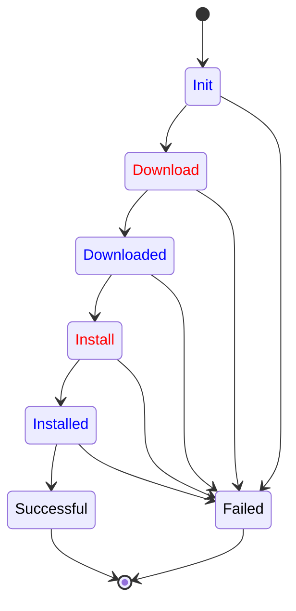

# User-defined Operation Workflows

An agent developer can define application specific *operation workflows*.
Thin-edge `tedge-agent` provides the tools to:

- override existing workflows
- define new states and actions such as pre-requisite or post-execution checks 
- introduce new transitions such as rollbacks or conditional executions
- create new workflows, combining workflows and steps

## Example

Here is an example where three software components participate in a `configuration-update` command.
- The `tedge-mapper` creates the initial state of the command
  providing the required information to install a new version for a configuration file;
  and then waits for the final outcome (in black).
- The `tedge-config-plugin` handles the main steps (in red): downloading the file and installing it where expected.
- User-provided scripts handle domain-specific checks (in blue)
  to timely schedule the command as well as to ensure the configuration file is not corrupted and properly installed.



### Benefits

Observe on the example that:

- At any state, *one and only one* participant is responsible to move the operation forward.
- Publishing a state to the MQTT command topic, can be seen as passing the baton from one participant to another.
  The mapper creates the `Init` state and then lets the other components work.
  The plugin tell the download has been successful by publishing the `Downloaded` state,
  but do nothing till the domain-specific component has checked the file and move the command state to `Install`.
- Each software component has to know only *some* states of the whole workflow:
  - the states they are responsible for
  - the states they create to pass the control.
- The compatibility of two participants, one publishing the state owned by the other, is only defined by the message payload:
  - all the property fields, required to make progress at some state, must be provided by the previous participant.

The benefits are that:
- A participant can be substituted by another implementation as long as the substitute implementation
  is ready to process at least all the state processed by the former implementation.
  - This is the key principle used by thin-edge to provide extensible operation support.
  - The `tedge-configuration-plugin` defines the `Init`, `Downloaded`, `Installed` states
    with no specific behavior beyond proceeding to the next step;
    so, a domain specific component can be substituted to add extra checks and actions before moving forward.
- Extra states and participants can be added as long as each state is owned by one participant.
  - For instance, an agent developer can introduce a `Rollback` state in the `configuration-update` workflow,
    associated by another software component responsible for these rollbacks.

Furthermore, specific versions of the same workflow can be defined on different targets.
Indeed, all the status updates for a command on a given thin-edge entity or component
are published on an MQTT topic which prefix is the entity identifier.
- The same executable can be used to handle operations on different targets.
  For instance, the `tedge-configuration-plugin` can run on the main device `te/device/main//`
  as well as on a child-device identified by `te/device/child-xyz//`.
- A specific executable can be substituted on a specific target.
  If for some reasons, `tedge-configuration-plugin` cannot be installed on a child-device,
  then a specific implementation of the `configuration-update` MQTT API can be used to serve configuration updates
  on, say, `te/micro-controller/xyz//`.
- A workflow can be extended differently for each target.
  As an example, an agent developer can define an extra rollback state on the main device but not on the child devices.

## Operation API

As several software components have to collaborate when executing a command, each operation must define a specific API.
This API should be based on the principles of MQTT-driven workflow and defines:
- the well-known operation name such `restart` or `software-update`
- user documentation of the required input and the expected outcome of an operation request
- the set of observable states for a command and the possible state sequences
- for each state:
  - the well-known name such as `Download` or `Downloaded`
  - the schema of the state payload and the required parameters to process a command at this stage
  - developer documentation on the role of each parameter and the expected checks and actions
- the schema for the capability message sent when the operation is enabled on some thin-edge entity or component
  - developer documentation on the role of each field of the capability message

A workflow implementation is free to define the states a command can go through
as well as the message payload attached to each state.

However, there are some rules and best practices.

- Three states are mandatory: `Init`, `Successful` and `Failed`.
- `Init` must be the unique initial state of the workflow.
  - This state must give all the information required to execute the command.
  - Having no other initial states is important so any command requester (as the mapper)
    can trigger commands in a systematic manner *even* if the workflow is updated.
- `Successful` and `Failed` must be the unique terminal states of the workflow.
  - The payload of the `Failed` state should contain a `reason` property telling what failed.
  - Having no other terminal states is important so any command requester (as the mapper)
    can await the termination of a command in a systematic manner *even* if the workflow is updated.
- A workflow API should define *no-op* states with no pre-defined actions
  and which sole purpose is to give an agent developer the opportunity to *insert* its own logic and extra steps.
  - A *no-op* state is a state which has a single direct transition to the next state.
  - As an example, having a `Downloaded` *no-op* state, with a direct transition to an `Install` state which uses the downloaded file,
    let an agent operator override the automatic transition, say to check the downloaded file *before* moving the `Install` state.
  - The `Init` state should be a *no-op* state.

### Operation Implementation

A workflow implementation for a specific operation must implement the actions specified for each non *no-op* state.
This implementation has some freedom, notably to implement extra checks and actions but also to add new states.

However, there are some rules and best practices.

- All the state messages must be published as retained with QoS 1.
- A workflow implementation should not reject a state message payload with unknown fields.
  - It's also important to keep these unknown fields in the following states.
  - This is important as we want to *extend* the workflow of an operation.
    A software component added by the user might need these *extra* fields the plugin is not aware of.
- A workflow implementation must not react on *no-op* states nor terminal states.
  - The transition from a *no-op* state must be handled either by thin-edge as direct transition
    or overridden by the user with domain-specific checks and actions.
  - The terminal states, a.k.a `Successful` and `Failed`, are owned by the process which created the `Init` state (in practice, the mapper).
    Only this process should clear the retained message state for an operation instance by sending an empty payload on command's topic.

### Workflow Overriding

Thin-edge provides a mechanism to override, extend and combine workflows.

This mechanism is provided by the `tedge-agent` which gather a set of user-defined workflows
and combined them with the builtin workflows implemented by the agent itself and the thin-edge operation plugins.

Each workflow is defined using a TOML file that specifies:
- the operation target and name defined as a topic filter
  such as `te/device/main///cmd/software-update/+` or `te/device/main/service/+/cmd/restart/+`
- the list of states
- for each state:
  - the state name as defined by the operation API
  - the name of the state owner which is the process that is responsible for advancing a command at this state
    (the default being `tedge`, meaning that thin-edge is responsible for running the state checks and actions)
  - the set of states which can be an outcome for this state actions
  - possible extra instructions on how to process the command at this stage, e.g.
    - run a script
    - emit an event
    - raise an alarm

```toml title="file: workflow-example.toml"
target = "te/device/main///cmd/configuration-update/+"

[Init]
  next = ["Download", "Failed"]
  script = "/bin/schedule-configuration-update.sh"
    
[Download]
  owner = "tedge-configuration-plugin"
  next = ["Downloaded", "Failed"]

[Downloaded]
  script = "/bin/check-configuration-file.sh"
  next = ["Install", "Failed"]

[Install]
  owner = "tedge-configuration-plugin"
  next = ["Installed", "Failed"]
        
[Installed]
  script = "/bin/check-configuration-update.sh"
  next = ["Successful", "Failed"]

[Successful]
  event = "te/device/main///e/operations"
  next = []
  
[Failed]
  alarm = "te/device/main///a/operations"
  next = []
```

Thin-edge combines all these workflows to determine what has to be done
when a state message is published for a command on one topic matching the global topic filter for commands,
i.e. `te/+/+/+/+/cmd/+/+`. Given an actual command state message, thin-edge
- keeps only the workflows which target topic filter matches the topic of the message
- then keeps only the workflows that define a behavior for the state of the message payload
- and then uses priority rules to select a single workflow: the workflow ruling this command at that stage

The priority rules give a higher priority to the workflow that are user-defined than to those pre-defined by thin-edge.
If several user-defined workflows are matching a command state,
then the alphabetic order of the workflow definition file names is used:
`001-configuration-update.toml` being of higher priority than `002-configuration-update.toml`.

