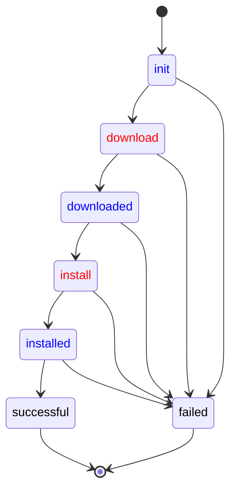

import ProposalBanner from '@site/src/components/ProposalBanner'

<ProposalBanner/>

## Overview

An agent developer can define application specific [operation workflows](./device-management-api.md#mqtt-driven-workflows)
to control how an operation is performed on a device.
Thin-edge **tedge-agent** provides the tools to:

- override existing workflows
- define new states and actions such as pre-requisite or post-execution checks 
- introduce new transitions such as rollbacks or conditional executions
- create new workflows, combining workflows and steps

## Example

Here is an example where three software components participate in a `firmware_update` command.
- The **tedge-mapper** creates the initial state of the command
  providing the required information to install a new version for a configuration file;
  and then waits for the final outcome (in black).
- The **tedge-agent** handles the main steps (in red): downloading the file and installing it where expected.
- User-provided scripts handle domain-specific checks (in blue)
  to timely schedule the command as well as to ensure the configuration file is not corrupted and properly installed.



### Key points

Observe on the example that:

- At any state, *one and only one* participant is responsible to move the operation forward.
- Publishing a state to the MQTT command topic, can be seen as passing the baton from one participant to another.
  The mapper creates the **init** state and then lets the other components work.
  The agent tells the download has been successful by publishing the **downloaded** state,
  but do nothing till the domain-specific component has checked the file and move the command state to **install**.
- Each software component has to know only *some* states of the whole workflow:
  - the states they are responsible for
  - the states they create to pass the control.
- The compatibility of two participants, one advancing to the new state owned by the other, is only defined by the message payload:
  - all the property fields, required to make progress at some state, must be provided by the previous participant.

### Benefits

The benefits are that:
- A participant can be substituted by another implementation as long as the substitute implementation
  is ready to process at least all the states processed by the former implementation.
  - This is the key principle used by thin-edge to provide extensible operation support.
  - The **tedge-agent** defines the **downloaded** and *installed** states
    with no specific behavior beyond proceeding to the next step;
    so, a domain specific component can be substituted to add extra checks and actions before moving forward.
- Extra states and participants can be added as long as each state is owned by one participant.
  - For instance, an agent developer can introduce a **rollback** state in the `firmware_update` workflow,
    associated by another software component responsible for these rollbacks.

Furthermore, specific versions of the same workflow can be defined on different targets.
The main and child devices can each run their own version of a workflow for an operation.
Indeed, all the status updates for a command on a given thin-edge entity or component
are published on an MQTT topic with the entity identifier as the prefix.
- The same executable can be used to handle operations on different targets.
  For instance, the **tedge-agent** can run on the main device `te/device/main//`
  as well as on a child-device identified by `te/device/child-xyz//`.
- A specific executable can be substituted on a specific target.
  If for some reasons, **tedge-agent** cannot be installed on a child-device,
  then a specific implementation of the `firmware_update` MQTT API can be used to serve firmware updates
  on, say, `te/micro-controller/xyz//`.
- A workflow can be extended differently for each target.
  As an example, an agent developer can define an extra rollback state on the main device but not on the child devices.

## Operation API

As several software components have to collaborate when executing a command, each operation must define a specific API.
This API should be based on the principles of MQTT-driven workflow and defines:
- the well-known operation name such `firmware_update` or `restart`
- user documentation of the required input and the expected outcome of an operation request
- the set of observable states for a command and the possible state sequences
- for each state:
  - the well-known name such as **download** or **downloaded**
  - the schema of the state payload and the required parameters to process a command at this stage
  - developer documentation on the role of each parameter and the expected checks and actions
- the schema for the capability message sent when the operation is enabled on some thin-edge entity or component
  - developer documentation on the role of each field of the capability message

A workflow implementation is free to define the states a command can go through
as well as the message payload attached to each state.

However, there are some rules and best practices.

- Three states are mandatory: **init**, **successful** and **failed**.
- **init** must be the unique initial state of the workflow.
  - This state must give all the information required to execute the command.
  - Having no other initial states is important so any command requester (as the mapper)
    can trigger commands in a systematic manner *even* if the workflow is updated.
- **successful** and **failed** must be the unique terminal states of the workflow.
  - The payload of the **failed** state should contain a `reason` property telling what failed.
  - Having no other terminal states is important so any command requester (as the mapper)
    can await the termination of a command in a systematic manner *even* if the workflow is updated.
- A workflow API should define *no-op* states with no pre-defined actions
  and which sole purpose is to give an agent developer the opportunity to *insert* its own logic and extra steps.
  - A *no-op* state is a state which has a single direct transition to the next state.
  - As an example, having a **downloaded** *no-op* state, with a direct transition to an **install** state which uses the downloaded file,
    lets an agent operator override the automatic transition, say to check the downloaded file *before* moving the **install** state.
  - The **init** state should be a *no-op* state.

### Operation Implementation

A workflow implementation for a specific operation must implement the actions specified for each non *no-op* state.
This implementation has some freedom, notably to implement extra checks and actions but also to add new states.

However, there are some rules and best practices.

- All the state messages must be published as retained with QoS 1.
- A workflow implementation should not reject a state message payload with unknown fields.
  - It's also important to keep these unknown fields in the following states.
  - This is important as we want to *extend* the workflow of an operation.
    A software component added by the user might need these *extra* fields the plugin is not aware of.
- A workflow implementation must not react on *no-op* states nor terminal states.
  - The transition from a *no-op* state must be handled either by thin-edge as direct transition
    or overridden by the user with domain-specific checks and actions.
  - The terminal states, a.k.a **successful** and **failed**, are owned by the process which created the **init** state (in practice, the mapper).
    Only this process should clear the retained message state for an operation instance by sending an empty payload on command's topic.

### Workflow Overriding

Thin-edge provides a mechanism to override, extend and combine workflows.

This mechanism is provided by the **tedge-agent** which gathers a set of user-defined workflows
and combined them with the builtin workflows implemented by the agent itself.

Each workflow is defined using a TOML file stored in `/etc/tedge/operations`. Each specifies:
- the command name that it should trigger on
  such as `firmware_update` or `restart`- the list of states
- for each state:
  - the state name as defined by the operation API
  - the set of states which can be an outcome for this state actions
  - possible extra instructions on how to process the command at this stage, e.g.
    - run a script
    - restart the device

```toml title="file: firmware_update_example.toml"
operation = "firmware_update"

[init]
  script = "/usr/bin/firmware_handler.sh plan"
  next = ["scheduled", "failed"]

[scheduled]
  next = ["install"]

[install]
  script = "/usr/bin/firmware_handler.sh install ${.payload.url}"
  next = ["reboot", "failed"]

[reboot]
  next = "verify"

[verify]
  script = "/usr/bin/firmware_handler.sh verify"
  next = ["commit", "rollback"]

[commit]
  next = ["successful", "rollback_reboot"]

[rollback]
  script = "/usr/bin/firmware_handler.sh rollback"
  next = ["rollback_reboot"]

[rollback_reboot]
  next = ["failed"]

[successful]
  next = []

[failed]
  next = []
```

Thin-edge combines all these workflows to determine what has to be done
when a state message is published for a command on a topic matching the global topic filter for commands,
i.e. `te/+/+/+/+/cmd/+/+`.
- Each running instance of the __tedge_agent__ reacts only on commands targeting its own device.
- If a user-defined workflow has been defined for this operation, then this workflow is used to determine the required action.
- If no workflow has been defined by the user for this operation, then the built-in workflow is used.
- If there is no workflow or no defined action for the current state,
  then the __tedge_agent__ simply waits for another component to take over the command.

### Built-in Actions

For operations supported by the __tedge-agent__, the built-in behavior is the default.
In other words, if no alternative actions is specified by a user-provided workflow,
the commands are processed following the built-in behavior.

If alternative actions are only given on some states, then the built-in behavior is applied to all others.
This gives the ability to override parts of the built-in operation workflow.

The __successful__ and __failed__ states are also handled in a specific way.
Only the command issuer is supposed to react on those,
pushing a retained empty message on the command request topic when done.
This ends the command workflow.

### Script Execution

A script can be attached to a command state. 

```
[state]
script = "/full/path/command [args]" 
```

This script is given as a plain command line possibly with arguments.

Data extracted from the command status topic and message payload can be passed as argument to the script.

- `"/bin/new-command.sh ${.topic} ${.payload}"` passes two arguments to the `/bin/new-command.sh` program.
  - The first one is the full command request topic (*e.g.* `te/device/main/cmd///restart/c8y-mapper-123`).
  - The second one is the full json payload (*e.g.* `{"status': "init"}`).
- Specific path expressions can be used to pass specific excerpts.
  - `${.}` is a json for the whole message including the `topic` and the `payload`.
  - `${.topic}` is the command request topic (*e.g.* `te/device/main/cmd///restart/c8y-mapper-123`)
  - `${.topic.target}` is the command target identity  (*e.g.* `device/main/cmd//`)
  - `${.topic.operation}` is the command operation  (*e.g.* `restart`)
  - `${.topic.cmd_id}` is the command request unique identifier  (*e.g.* `c8y-mapper-123`)
  - `${.payload}` is the whole command json payload (*e.g.* `{"status': "init"}`)
  - `${.payload.status}` is the command current status (*e.g.* `"init"`)
  - `${.payload.x.y.z}` is the json value extracted from the payload following the given `x.y.z` path if any.
  - If given `${.some.unknown.path}`, the argument is passed unchanged to the script.

The script exit status and output is used to determine the next step for the command.
- If the script cannot be launched or return a non-zero status, the command request is marked as __failed__.
- If the script successfully returns, its standard output is used to update the command state payload.
  - From this output, only the excerpt between a `:::begin-tedge:::` header and a `:::end-tedge:::` trailer is decoded.
    This is done to ease script authoring. A script can emit arbitrary output on its stdout,
    and just have to surround its workflow updates with the `:::begin-tedge:::` and `:::end-tedge:::` markers.
  - If this excerpt is a json payload, this payload is injected into the previous message payload
    (adding new fields, overriding overlapping ones, keeping previous unchanged ones).
  - If this excerpt is a json payload with a `status` field, then this status is used as the new status for the command.
- If the script output is empty, then the exit status of the process is used to determine the next step. 

### Restart action

A workflow can trigger a device restart, using the builtin __restart__ action.

This action is controlled by three states:
- the *on_executing* state to which the workflow moves before the reboot is triggered
- the *on_success* state to which the workflow resumes after a successful device reboot
- the *on_error* state to which the workflow resumes in case the reboot fails

For instance, the following triggers a reboot from the `reboot_required` state
and moves to `restarting` waiting for the device to restart
and finally to either `successful_restart` or `failed_restart`,
depending on the actual status of the reboot. 

```
[reboot_required]
script = "restart"
next = ["restarting", "successful_restart", "failed_restart"]
```

:::note
This file format is not finalized and will likely be revised.
:::

## Proposal for improvements

### Next step determined by script exit status

The exit status of the script processing a command state
can be used to determine the next state of the workflow.

The workflow can specify for each exit code:
- the next command status
- a failure reason

```toml
script = "/some/script.sh with some args"
on_exit.0 = "next_state"                                  # next state for an exit status
on_exit.1 = { status = "retry_state", reason = "busy"}    # next status with fields 
on_exit.2-5 = { status = "fatal_state", reason = "oops"}  # next state for a range of exit status
on_exit._ = "failed"                                      # wildcard for any other non successful exit
on_kill = { status = "failed", reason = "killed"}         # next status when killed
```

- `on_success` is syntactic sugar for `on_exit.0`
- `on_error` is syntactic sugar for `on_exit._`
- This is an error to provide more than one handler for an exit code (overlapping ranges).
- If no reason is provided for an exit code, the default reason is `"${program} exited with ${code}"`.
- If no reason is provided for the on kill handler, the reason is `"${program} killed by ${code}"`.
- The default for the `on-error` and `on-kill` status is `"failed"`.
- There is no default for the `on-success` status.
  In such a case the output of the script is used to determine the next status.

If the standard output of the script contains a JSON object surrounded by `:::begin-tedge:::` and `:::end-tedge:::` markers,
then this object is injected in the command state message payload.
There are two exceptions, though.
The `status` and `reason` fields are determined after the exit code and not the standard output.

### Next step determined by script output

The output of the script processing a command state
can be used to determine the next state of the workflow.

For that to work:
- no `on_success` nor `on_exit.0` status must be given as this would make the next status computed after the exit code
- the standard output of the script must emit a JSON object surrounded by `:::begin-tedge:::` and `:::end-tedge:::` markers.
- this JSON object must provide a `status` field and possibly a `reason` field.

```toml
script = "/some/script.sh with some args"                                # no given `on_exit.0` status
on_error = { status = "fatal_state", reason = "fail to run the script"}  # possibly some `on_error` and `on_kill` handlers
next = ["state-1", "state-2", "state-3"]                                 # the list of status accepted as next status
```

- If the script is successful and its output returns some `status` and `reason` fields, these are used for the next state.
- If the script is successful but its output contains no `status` field, then `on_error` is used.
- If the script cannot be executed, is killed or returns a non-zero code,
  then the `status` and `reason` fields are determined by the `on_error` and `on_kill` handlers
  (or if none where provided using the default `on_error` and `on_kill` handlers).
- The fields of the JSON object extracted from the script output are injected into the command state message payload
  - This is done in the successful as well as the failed cases,
    for all the fields, except for the `status` and `reason` fields.
  - Notably, when the script returns with a non-successful status code,
    the `on_error` definition trumps over any `status` and `reason` fields provided over the script stdout.

### Using a script to trigger a restart

A workflow state can be handled using a *background script*.
When executed, as a detached process, by the __tedge_agent__ no response nor exit status is expected from the script.
In any case the workflow will be moved to the given next state.
And this move to the next state is even persisted *before* the script is executed.
This can notably be used to restart the device or the agent.
After the restart, the workflow will resume in the state specified by the workflow.

```toml
["agent-restart"]
background_script = "sudo systemctl restart tedge-agent"
on_exec = "waiting-for-restart"

["waiting-for-restart"]
script = "/some/script.sh checking restart"
next = ["waiting-for-restart", "successful_restart", "failed_restart"]
```

Note that:
- No `on_exit` nor `on_kill` status can be provided, as the script is not monitored.
- If the script cannot be launched, the workflow will be moved to the final `"failed"` state.

### Appropriate syntax for restart action

First proposal:
```toml
["device-restart"]
builtin_action = "restart"
on_exec = "waiting-for-restart"
on_success = "successful_restart"
on_error = "failed_restart"
```

Pros:
- closer to the internal behavior

Cons:
- state with no representation

Alternative proposal:

```toml
["device-restart"]
builtin_action = "restart"
on_exec = "waiting-for-restart"

["waiting-for-restart"]
builtin_action = "waiting-for-restart"
on_success = "successful_restart"
on_error = "failed_restart"
```

Pros:
- closer to the observed behavior
- no implicit state

Cons:
- the two states must be consistent

### Setting step execution timeout

The execution time of the state transitions of a workflow can be limited using timeouts.
- A default timeout can be set at the level of an operation for all the transitions.
- Individual timeout can be set to each state of the workflow.

```toml
timeout_second = 300
on_timeout = { status = "failed", reason = "timeout" }
```

Some scripts cannot be directly controlled.
This is notably the case for the restart builtin action and the background scripts.
For those any timeout has to be set on the waiting state.

```toml
["device-restart"]
builtin_action = "restart"
on_exec = "waiting-for-restart"

["waiting-for-restart"]
builtin_action = "waiting-for-restart"
timeout_second = 600
on_timeout = "timeout_restart"
on_success = "successful_restart"
on_error = "failed_restart"
```

### Role of next states

Do we need to explicitly list the `next` states for each state?

Cons:
- less specific than states with specific purpose as on `on_success` or `on_exit.1`
- most of the time redundant

Pros:
- documentation
- sanity checks