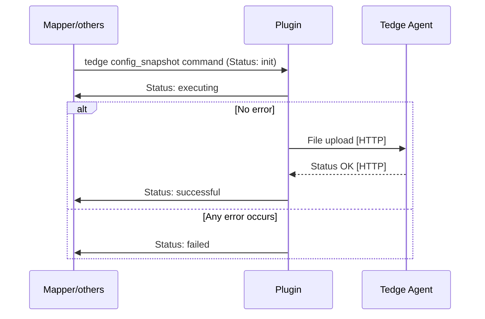
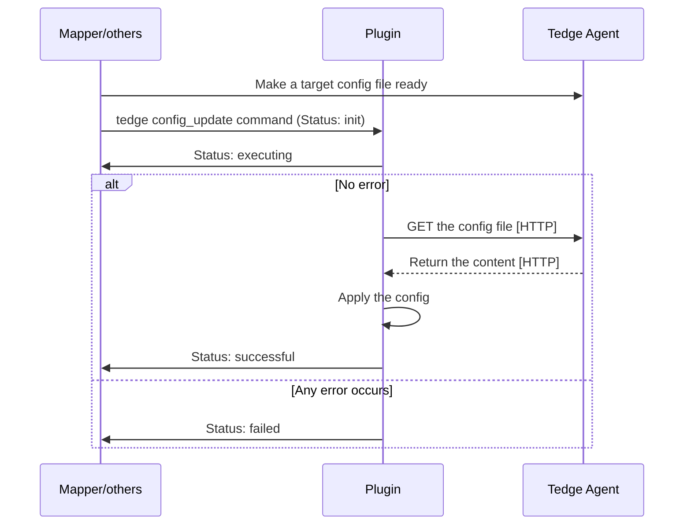

# Configuration Management Plugin

Thin-edge provides an operation plugin to manage device configuration files.

* This management is bi-directional:
  * A device can act as a reference,
    with all the managed files being uploaded to the [tedge file transfer repository](../tedge-file-transfer-service.md)
    and stored there as a configuration snapshot.
  * A configuration update can be pushed from the tedge file transfer repository to any devices of the same type,
    i.e. supporting the same kind of configuration files.
  * This plugin, combined with a cloud mapper, enables configuration management from the cloud.
* With this operation plugin, the device owner defines the list of files
  (usually configuration files, but not necessarily).
* The plugin configuration itself can be managed both locally and from the cloud,
  meaning, the device owner can update the list of files to be managed from the cloud using the cloud mapper.
* The configuration files are managed according to their type,
  a name chosen by the device owner to categorize each configuration.
  By default, the full path of a configuration file on the device is used as its type.
* When files are downloaded from the tedge file transfer repository to the device where the plugin is installed,
  __these files are stored in the target path with a temporary name first__.
  They are atomically renamed, only after a fully successful download to avoid breaking the system with half-downloaded files.
* When a downloaded file is copied to its target, the Unix user, group and mode are preserved.
* Once an update has been downloaded from the tedge file transfer repository to the target device,
  __the plugin publishes an operation status update message on the local thin-edge MQTT bus__.
  The device software must subscribe to these messages if any action is required,
  such as checking the content of the file, to pre-processing it, or restarting a daemon.
* The configuration plugin can be installed on both the main thin-edge device and the child-device.
* The plugin has a dependency on the `tedge.toml` configuration file to get the MQTT hostname, port, and device identifier.

In summary, the responsibilities of the plugin are:
  * to define the list of files under configuration management,
  * to notify the local MQTT bus when this list is updated,
  * to upload these files to the tedge file transfer repository on demand,
  * to download the files pushed from the tedge file transfer repository,
  * to ensure that the target files are atomically updated after a successful download,
  * to notify the device software when the configuration is updated.

By contrast, the plugin is not responsible for:
  * checking that the uploaded files are well-formed,
  * restarting the configured processes,
  * establishing any direct connection to clouds.

A user-specific component installed on the device
  can implement more sophisticated configuration use-cases by:
  * listening for configuration updates on the local thin-edge MQTT bus,
  * restarting the appropriate processes when needed,
  * declaring intermediate files as the managed files,
    to have the opportunity to check or update their content
    before moving them to the actual targets.

## Installation

As part of this plugin installation:
* On systemd-enabled devices, the service definition file for this plugin is also installed.

Once installed, the `tedge-configuration-plugin` runs as a daemon on the device,
listening to configuration snapshot commands on the `<root>/<identifier>/cmd/config_snapshot/+` [MQTT topic](../mqtt-api.md#command-examples) 
and to configuration update commands on the `<root>/<identifier>/cmd/config_update/+` [MQTT topic](../mqtt-api.md#command-examples).

## Configuration

The `tedge-configuration-plugin` configuration is stored by default under `/etc/tedge/plugins/tedge-configuration-plugin.toml`

This [TOML](https://toml.io/en/) file defines the list of files to be managed by the plugin.
Each configuration file is defined by a record with:
* The full `path` to the file.
* An optional configuration `type`. If not provided, the `path` is used as `type`.
  This `type` is used to declare the supported configuration file and then to trigger operations on that file.
  All the configuration `type`s are declared as the supported config list to the local MQTT bus on startup
  and on changes to the `plugins/tedge-configuration-plugin.toml` file.
* Optional unix file ownership: `user`, `group` and octal `mode`.
  These are only used when a configuration file pushed via a `config_update` command doesn't exist on the device,
  and a new one is created with these ownership parameters.
  When a configuration file is already present on the device,
  this plugin preserves its existing ownership, ignoring these parameters.

```toml title="file: /etc/tedge/plugins/tedge-configuration-plugin.toml"
files = [
  { path = '/etc/tedge/tedge.toml', type = 'tedge.toml' },
  { path = '/etc/tedge/mosquitto-conf/c8y-bridge.conf', type = 'c8y-bridge' },
  { path = '/etc/tedge/mosquitto-conf/tedge-mosquitto.conf', type = 'tedge-mosquitto' },
  { path = '/etc/mosquitto/mosquitto.conf', type = 'mosquitto', user = 'mosquitto', group = 'mosquitto', mode = 0o644 }
]
```

On start and whenever this file is updated, the configuration plugin sends
the supported config types declaration message with a retained flag
to the `config_snapshot` and `config_update` command topics
with the set of `type`s listed in that configuration file
(implicitly adding the `tedge-configuration-plugin` type also to that set).
The message can be observed over the MQTT bus of the thin-edge device.

Given that `mqtt.topic_root` and `mqtt.device_topic_id` are set to `te` and `device/main//` for the main device,
the message to declare the supported configuration types is as follows.

```sh te2mqtt
tedge mqtt pub -r 'te/device/main///cmd/config_snapshot' '{
  "types": ["tedge-configuration-plugin", "tedge.toml", "/etc/tedge/mosquitto-conf/c8y-bridge.conf", "/etc/tedge/mosquitto-conf/tedge-mosquitto.conf", "mosquitto"]
}'
```

```sh te2mqtt
tedge mqtt pub -r 'te/device/main///cmd/config_update' '{
  "types": ["tedge-configuration-plugin", "tedge.toml", "/etc/tedge/mosquitto-conf/c8y-bridge.conf", "/etc/tedge/mosquitto-conf/tedge-mosquitto.conf", "mosquitto"]
}'
```

:::note
* The file `/etc/tedge/plugins/tedge-configuration-plugin.toml` itself doesn't need to be listed.
  This is implied, so the list can *always* be configured from the configuration plugin.
  The `type` for this self configuration file is `tedge-configuration-plugin`.
* If the file `/etc/tedge/plugins/tedge-configuration-plugin.toml`
  is not found, empty, ill-formed or not-readable
  then only `tedge-configuration-plugin.toml` is declared as a supported configuration type.
:::
  
The behavior of the `tedge-configuration-plugin` is also controlled
by the configuration of thin-edge:

* `tedge config get mqtt.bind.address`: the address of the local MQTT bus.
* `tedge config get mqtt.bind.port`: the TCP port of the local MQTT bus.
* `tedge config get mqtt.topic_root`: the root of the [MQTT topic scheme](../mqtt-api.md) to publish and subscribe.
* `tedge config get mqtt.device_topic_id`: the identifier of the [MQTT topic scheme](../mqtt-api.md) to publish and subscribe.

## Handling config snapshot commands

During a config snapshot operation, the plugin uploads a requested configuration file to the tedge file transfer repository.

The plugin subscribes to config snapshot commands on the `<root>/<identifier>/cmd/config_snapshot/+` MQTT topics.
For example, it subscribes to the following topic for the main device.

```sh te2mqtt
tedge mqtt sub 'te/device/main///cmd/config_snapshot/+'
```

To start a new config snapshot with the ID "1234" on the device named "example", a component has to publish the following message over MQTT:

```sh te2mqtt
tedge mqtt pub -r 'te/device/main///cmd/config_snapshot/1234' '{
  "status": "init",
  "tedgeUrl": "http://127.0.0.1:8000/tedge/file-transfer/example/config_snapshot/mosquitto-1234",
  "type": "mosquitto"
}'
```

Upon receiving a configuration snapshot command, the plugin performs the following actions:
   1. The plugin uses the `type` information (`mosquitto`) to look up the target path from the `tedge-configuration-plugin.toml` file
   and retrieves the requested configuration content from the corresponding `path`(`/etc/mosquitto/mosquitto.conf`).
   2. It then performs a `PUT` request to the `tedgeUrl` specified in the command's payload to upload the content.

Throughout the process, the plugin updates the command status via MQTT by publishing a retained message
to the same `<root>/<identifier>/cmd/config_snapshot/<id>` topic where the command is received.
The payload contains all the received data along with the `path` information.

When the plugin receives a new config snapshot command, it updates the status to `executing`.
After successfully uploading the file to the file transfer repository,
the plugin updates the status to `successful`.
If any unexpected error occurs, the plugin updates the status to `failed`,
providing a comprehensive `reason` for the failure.

As a result, the operation status update message for the example above looks like this:

```sh te2mqtt
tedge mqtt pub -r 'te/device/main///cmd/config_snapshot/1234' '{
  "status": "successful",
  "tedgeUrl": "http://127.0.0.1:8000/tedge/file-transfer/example/config_snapshot/mosquitto-1234",
  "type": "mosquitto",
  "path": "/etc/mosquitto/mosquitto.conf"
}'
```

### Flow



## Handling config update commands

During a config update operation, the plugin downloads a requested configuration file
from the tedge file transfer repository and moves it to the target path.

The plugin subscribes to config update commands on the `<root>/<identifier>/cmd/config_update/+` MQTT topics.
For example, it subscribes to the following topic for the main device.

```sh te2mqtt
tedge mqtt sub 'te/device/main///cmd/config_update/+'
```

To start a new config update with the ID "1234" on the device named "example", a component has to publish the following message over MQTT:

```sh te2mqtt
tedge mqtt pub -r 'te/device/main///cmd/config_update/1234' '{
  "status": "init",
  "tedgeUrl": "http://127.0.0.1:8000/tedge/file-transfer/example/config_update/mosquitto-1234",
  "remoteUrl": "http://www.my.url",
  "type": "mosquitto"
}'
```

Upon receiving a configuration update command, the plugin performs the following actions:
   1. It performs a `GET` request to the `tedgeUrl` specified in the command to retrieve the content.
   2. The plugin then uses the `type` information (`mosquitto`) to to look up the target path from the `tedge-configuration-plugin.toml` file
   and applies the new configuration content to the corresponding `path`(`/etc/mosquitto/mosquitto.conf`).

Throughout the process, the plugin updates the command status via MQTT
by publishing a retained message to the same `<root>/<identifier>/cmd/config_update/<id>` topic
where the command is received.
The payload contains all the received data along with the `path` information.

Upon receiving a new config update command, the plugin updates the status to `executing`.
After successfully completing all operation steps, the plugin updates the status to `successful`.
If any unexpected error occurs,
the plugin updates the status to `failed` along with a comprehensive `reason` for the failure.

As a result, the operation status update message for the example above looks like this.

```sh te2mqtt
tedge mqtt pub -r 'te/device/main///cmd/config_update/1234' '{
  "status": "successful",
  "tedgeUrl": "http://127.0.0.1:8000/tedge/file-transfer/example/config_update/mosquitto-1234",
  "remoteUrl": "http://www.my.url",
  "type": "mosquitto",
  "path": "/etc/mosquitto/mosquitto.conf"
}'
```

### Flow



## Usage

```sh
tedge-configuration-plugin --help
```

```run command="tedge-configuration-plugin --help" lang="text" title="Output"
Thin-edge device configuration management

Usage: tedge-configuration-plugin [OPTIONS]

Options:
      --debug                                        Turn-on the debug log level
      --config-dir <CONFIG_DIR>                      [default: /etc/tedge]
      --mqtt-topic-root <MQTT_TOPIC_ROOT>            
      --mqtt-device-topic-id <MQTT_DEVICE_TOPIC_ID>  
  -h, --help                                         Print help (see more with '--help')
  -V, --version                                      Print version

On start, `tedge-configuration-plugin` notifies of its 
managed configuration files and sends this list via MQTT.
`tedge-configuration-plugin` subscribes to the topics for the commands `config_snapshot`
and `config_update`.

The thin-edge `CONFIG_DIR` is used:
* to find the `tedge.toml` where the following configs are defined:
  ** `mqtt.bind.address` and `mqtt.bind.port` to connect to the tedge MQTT broker
  ** `mqtt.topic_root` and `mqtt.device_topic_id`: for the MQTT topics to publish to and subscribe from
* to find/store the `tedge-configuration-plugin.toml`: the plugin configuration file
```

## Logging

The `tedge-configuration-plugin` reports progress and errors on its `stderr`.
