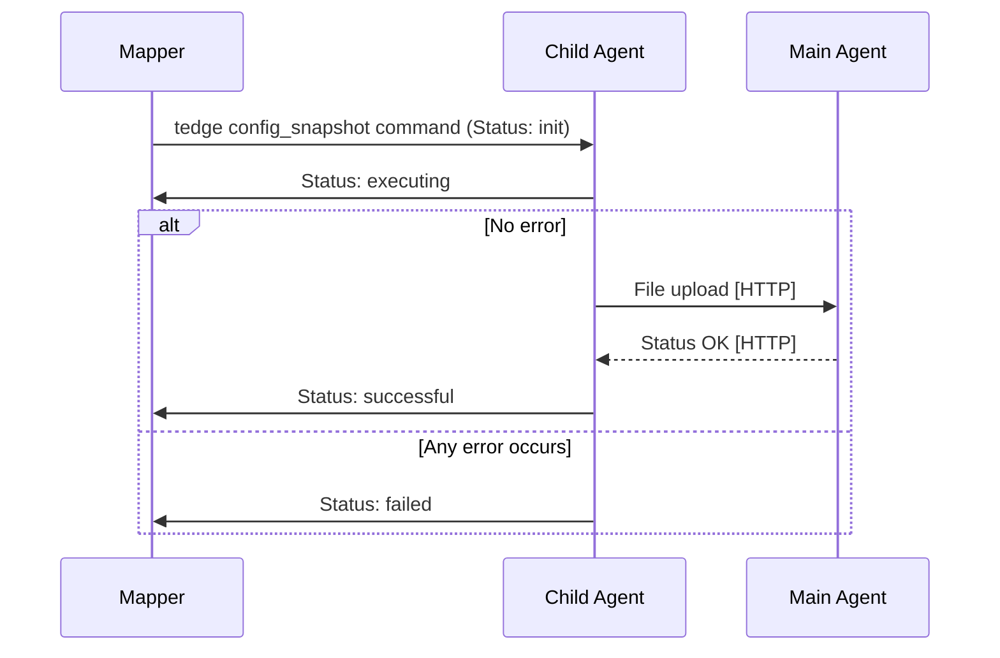
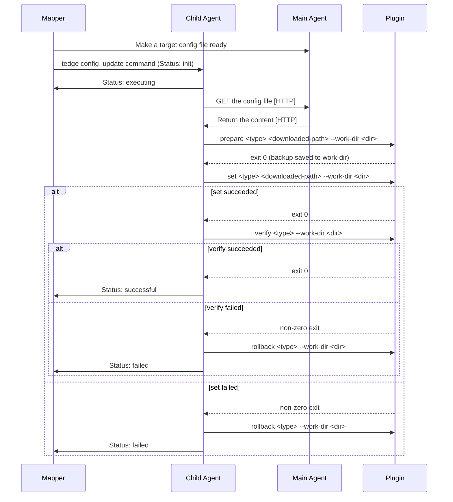

# Configuration Management

%%te%% implements an operation to manage device configuration files.

* The __tedge-agent__ enables configuration management on its running device
  and, combined with a cloud mapper, extends this capability to enable configuration management from the cloud.
* This management is bi-directional:
  * A device can act as a reference,
    with all the managed files being uploaded to the [tedge file transfer repository](../file-transfer-service.md)
    and stored there as a configuration snapshot.
  * A configuration update can be pushed from the tedge file transfer repository to any devices of the same type,
    i.e. supporting the same kind of configuration files.
* On each device running the agent, the device owner defines the list of files to be managed
  (usually configuration files, but not necessarily).
* The configuration of this feature itself can be managed both locally and from the cloud,
  meaning, the device owner can update the list of files to be managed from the cloud using the cloud mapper.
* The configuration files are managed according to their type,
  a name chosen by the device owner to categorize each configuration.
  By default, the full path of a configuration file on the device is used as its type.
* When files are downloaded from the tedge file transfer repository to the target device,
  __these files are stored in the target path with a temporary name first__.
  They are atomically renamed, only after a fully successful download to avoid breaking the system with half-downloaded files.
* When a downloaded file is copied to its target, the Unix user, group and mode are preserved.
* Once an update has been downloaded from the tedge file transfer repository to the target device,
  __the agent publishes an operation status update message on the local %%te%% MQTT bus__.
  The device software must subscribe to these messages if any action is required,
  such as checking the content of the file, to pre-processing it, or restarting a daemon.

In summary, the responsibilities of the agent regarding configuration management are:
  * to define the list of files under configuration management,
  * to notify the local MQTT bus when this list is updated,
  * to upload these files to the tedge file transfer repository on demand,
  * to download files pushed from the tedge file transfer repository,
  * to delegate preparation, application, verification, and rollback of config updates to config plugins,
  * to notify the device software when the configuration is updated.

By contrast, the agent is not responsible for:
  * checking that the uploaded files are well-formed,
  * restarting the configured processes (this is delegated to config plugins),
  * establishing any direct connection to clouds.

A user-specific component installed on the device
  can implement more sophisticated configuration use-cases by:
  * listening for configuration updates on the local %%te%% MQTT bus,
  * restarting the appropriate processes when needed,
  * declaring intermediate files as the managed files,
    to have the opportunity to check or update their content
    before moving them to the actual targets.

## Configuration

The configuration file used by the agent for configuration management is stored by default
under `/etc/tedge/plugins/tedge-configuration-plugin.toml`.
The file-based config types defined in this file are handle by the built-in `file` plugin.

This [TOML](https://toml.io/en/) file defines the list of files to be managed by the agent.
Each configuration file is defined by a record with:
* The full `path` to the file.
* An optional configuration `type`. If not provided, the `path` is used as `type`.
  This `type` is used to declare the supported configuration file and then to trigger operations on that file.
  All the configuration `type`s are declared as the supported config list to the local MQTT bus on startup
  and on changes to the `plugins/tedge-configuration-plugin.toml` file.
* Optional `service` name.
  When specified, the agent will restart that service after successfully applying a configuration update.
  For restarts, the service `restart` command defined in the `system.toml` is used.
  The specified `service` name is passed as the argument to the `restart` command.
* Optional unix file ownership: `user`, `group` and octal `mode`.
  These are only used when a configuration file pushed via a `config_update` command doesn't exist on the device,
  and a new one is created with these ownership parameters.
  When a configuration file is already present on the device,
  the agent preserves its existing ownership, ignoring these parameters.
* Optional unix directory ownership of the immediate parent of the file: `parent_user`, `parent_group` and octal `parent_mode`.
  These parameters apply only when the configuration file and its parent directories do not already exist on the device.
  In such cases, the immediate parent directory is created with the specified ownership and mode.
  Any missing directories above the immediate parent are created using the current user and group.
  If the file’s `user` is specified but `parent_user` is not, `parent_user` will default to the value of `user`.
  Similarly, if the file’s `group` is specified but `parent_group` is not, `parent_group` will default to the value of `group`.
  If the parent directories already exist, the agent preserves their existing ownership and ignores these parameters.

```toml title="file: /etc/tedge/plugins/tedge-configuration-plugin.toml"
files = [
  { path = '/etc/tedge/tedge.toml', type = 'tedge.toml' },
  { path = '/etc/tedge/mosquitto-conf/c8y-bridge.conf', type = 'c8y-bridge' },
  { path = '/etc/tedge/mosquitto-conf/tedge-mosquitto.conf', type = 'tedge-mosquitto' },
  { path = '/etc/collectd/collectd.conf', type = 'collectd-conf', service = 'collectd' },
  { path = '/etc/mosquitto/mosquitto.conf', type = 'mosquitto', user = 'mosquitto', group = 'mosquitto', mode = 0o644 },
  { path = '/etc/containers/certs.d/example/ca.crt', type = 'harbor-certificate', user = 'tedge', group = 'tedge', mode = 0o640, parent_user = 'root', parent_group = 'root', parent_mode = 0o755 },
]
```

On start and whenever this file is updated, the agent sends
the supported config types declaration message with a retained flag
to the `config_snapshot` and `config_update` command topics
with the set of `type`s listed in that configuration file
(implicitly adding the `tedge-configuration-plugin` type also to that set).
The message can be observed over the MQTT bus of the %%te%% device.

Given that `mqtt.topic_root` and `mqtt.device_topic_id` are set to `te` and `device/main//` for the main device,
the message to declare the supported configuration types is as follows.

```sh te2mqtt formats=v1
tedge mqtt pub -r 'te/device/main///cmd/config_snapshot' '{
  "types": ["tedge-configuration-plugin", "tedge.toml", "/etc/tedge/mosquitto-conf/c8y-bridge.conf", "/etc/tedge/mosquitto-conf/tedge-mosquitto.conf", "mosquitto"]
}'
```

```sh te2mqtt formats=v1
tedge mqtt pub -r 'te/device/main///cmd/config_update' '{
  "types": ["tedge-configuration-plugin", "tedge.toml", "/etc/tedge/mosquitto-conf/c8y-bridge.conf", "/etc/tedge/mosquitto-conf/tedge-mosquitto.conf", "mosquitto"]
}'
```

:::note
* The file `/etc/tedge/plugins/tedge-configuration-plugin.toml` itself doesn't need to be listed.
  This is implied, so the list can *always* be configured.
  The `type` for this self configuration file is `tedge-configuration-plugin`.
* If the file `/etc/tedge/plugins/tedge-configuration-plugin.toml`
  is not found, empty, ill-formed or not-readable
  then only `tedge-configuration-plugin.toml` is declared as a supported configuration type.
:::
  
The behavior of the agent is also controlled by the configuration of %%te%%:

* `tedge config get mqtt.bind.address`: the address of the local MQTT bus.
* `tedge config get mqtt.bind.port`: the TCP port of the local MQTT bus.
* `tedge config get mqtt.topic_root`: the root of the [MQTT topic scheme](../mqtt-api.md) to publish and subscribe.
* `tedge config get mqtt.device_topic_id`: the identifier of the [MQTT topic scheme](../mqtt-api.md) to publish and subscribe.

## Config Plugins

In addition to the file-based entries in `tedge-configuration-plugin.toml`,
configuration types can be provided by external plugins installed at `/usr/share/tedge/config-plugins` as well.
Each plugin is an executable that responds to `list`, `get`, `prepare`, `set`, `verify`, and `rollback` sub-commands.

When a plugin provides a type, the type name is published with a `::plugin-name` suffix
to distinguish it from file-based types.
For example, a plugin named `lighttpd` advertising `lighttpd.conf` makes the agent to publish:

```sh te2mqtt formats=v1
tedge mqtt pub -r 'te/device/main///cmd/config_snapshot' '{
  "types": ["tedge-configuration-plugin", "tedge.toml", "lighttpd.conf::lighttpd"]
}'
```

The suffix is stripped before the type is passed to the plugin sub-commands.

See [Configuration Management Plugins](../../extend/config-management.md) for details on authoring plugins.

## Handling config snapshot commands

During a config snapshot operation, the agent uploads a requested configuration file to the tedge file transfer repository.

The agent subscribes to config snapshot commands on the `<root>/<identifier>/cmd/config_snapshot/+` MQTT topics.
For example, it subscribes to the following topic for the main device.

```sh te2mqtt formats=v1
tedge mqtt sub 'te/device/main///cmd/config_snapshot/+'
```

To start a new config snapshot with the ID "1234" on the device named "example", a component has to publish the following message over MQTT:

```sh te2mqtt formats=v1
tedge mqtt pub -r 'te/device/main///cmd/config_snapshot/1234' '{
  "status": "init",
  "tedgeUrl": "http://127.0.0.1:8000/te/v1/files/example/config_snapshot/mosquitto-1234",
  "type": "mosquitto"
}'
```

:::note
The `tedgeUrl` is an optional field. If the user does not provide the URL, the agent will create it, and the link will be added while the operation is being processed.
:::

Upon receiving a configuration snapshot command, the agent performs the following actions:
   1. The agent uses the `type` information (`mosquitto`) to look up the target path from the `tedge-configuration-plugin.toml` file
   and retrieves the requested configuration content from the corresponding `path`(`/etc/mosquitto/mosquitto.conf`).
   For a plugin-backed type such as `lighttpd.conf::lighttpd`, the agent calls the plugin's `get` command
   and captures its stdout as the snapshot content.
   2. It then performs a `PUT` request to the `tedgeUrl` specified in the command's payload to upload the content.

Throughout the process, the agent updates the command status via MQTT by publishing a retained message
to the same `<root>/<identifier>/cmd/config_snapshot/<id>` topic where the command is received.
The payload contains all the received data along with the `path` information.

When the agent receives a new config snapshot command, it updates the status to `executing`.
After successfully uploading the file to the file transfer repository,
the agent updates the status to `successful`.
If any unexpected error occurs, the agent updates the status to `failed`,
providing a comprehensive `reason` for the failure.

As a result, the operation status update message for the example above looks like this:

```sh te2mqtt formats=v1
tedge mqtt pub -r 'te/device/main///cmd/config_snapshot/1234' '{
  "status": "successful",
  "tedgeUrl": "http://127.0.0.1:8000/te/v1/files/example/config_snapshot/mosquitto-1234",
  "type": "mosquitto",
  "path": "/etc/mosquitto/mosquitto.conf"
}'
```

### Flow


```mermaid
sequenceDiagram
  participant Mapper
  participant Child Agent
  participant Main Agent

  Mapper->>Child Agent: tedge config_snapshot command (Status: init)
  Child Agent->>Mapper: Status: executing
  alt No error
    Child Agent->>Main Agent: File upload [HTTP]
    Main Agent-->> Child Agent: Status OK [HTTP]
    Child Agent->>Mapper: Status: successful
  else Any error occurs
    Child Agent->>Mapper: Status: failed
  end
```

## Handling config update commands

During a config update operation, the agent downloads a requested configuration file
from the tedge file transfer repository and moves it to the target path.

The agent subscribes to config update commands on the `<root>/<identifier>/cmd/config_update/+` MQTT topics.
For example, it subscribes to the following topic for the main device.

```sh te2mqtt formats=v1
tedge mqtt sub 'te/device/main///cmd/config_update/+'
```

To start a new config update with the ID "1234" on the device named "example", a component has to publish the following message over MQTT:

```sh te2mqtt formats=v1
tedge mqtt pub -r 'te/device/main///cmd/config_update/1234' '{
  "status": "init",
  "tedgeUrl": "http://127.0.0.1:8000/te/v1/files/example/config_update/mosquitto-1234",
  "remoteUrl": "http://www.my.url",
  "type": "mosquitto"
}'
```

Upon receiving a configuration update command,
the agent executes the `config_update` workflow as defined in `/etc/tedge/operations/config_update.toml`,
which performs the following actions in sequence:

1. `download`: The agent downloads the new configuration file from the URL in the command payload
   using the built-in `download` action. The path of the downloaded file is stored as `downloadedPath`
   in the operation payload for subsequent steps.
1. `prepare`: The agent creates a temporary work directory to be passed as `--work-dir` to subsequent plugin commands
   and calls the plugin's `prepare` command (`builtin:config_update:prepare`).
   The plugin may perform steps like validating the new configuration or
   save a backup of the current configuration to the work directory.
1. `set`: The agent calls the plugin's `set` command (`builtin:config_update:set`) to apply the new configuration.
   If this step fails, the workflow proceeds to `rollback`.
1. `evaluate-agent-restart`: — If `"restartAgent": true` was set in the command payload,
   the agent proceeds to the `restart-agent` state or else proceed directly to `verify`.
1. `restart-agent`: The agent triggers a self-restart and immediately proceeds to `await-agent-restart` state.
1. `await-agent-restart`: Verify whether the restart succeeded.
1. `verify`: The agent calls the plugin's `verify` command (`builtin:config_update:verify`) to
   confirm the update was applied correctly.
   On success, work directory is deleted and proceed to `successful` state.
   On failure, the workflow proceeds to `rollback`.
1. `rollback` (on error): The agent calls the plugin's `rollback` command
   (`builtin:config_update:rollback`) to restore the previous configuration.
   Irrespective of the success or failure of this step, proceed to the `failed` state,
   after deleing the work directory.

For file-based config types defined in `tedge-configuration-plugin.toml`,
the built-in `file` plugin handles all plugin commands.

Throughout the process, the agent updates the command status via MQTT
by publishing a retained message to the same `<root>/<identifier>/cmd/config_update/<id>` topic
where the command is received.
The payload contains all the received data along with the `path` information.

Upon receiving a new config update command, the agent updates the status to `executing`.
After successfully completing all operation steps, the agent updates the status to `successful`.
If any unexpected error occurs,
the agent updates the status to `failed` along with a comprehensive `reason` for the failure.

As a result, the operation status update message for the example above looks like this.

```sh te2mqtt formats=v1
tedge mqtt pub -r 'te/device/main///cmd/config_update/1234' '{
  "status": "successful",
  "tedgeUrl": "http://127.0.0.1:8000/te/v1/files/example/config_update/mosquitto-1234",
  "remoteUrl": "http://www.my.url",
  "type": "mosquitto",
  "path": "/etc/mosquitto/mosquitto.conf"
}'
```

### Flow


```mermaid
sequenceDiagram
  participant Mapper
  participant Child Agent
  participant Main Agent
  participant Plugin

  Mapper->>Main Agent: Make a target config file ready
  Mapper->>Child Agent: tedge config_update command (Status: init)
  Child Agent->>Mapper: Status: executing
  Child Agent->>Main Agent: GET the config file [HTTP]
  Main Agent-->>Child Agent: Return the content [HTTP]
  Child Agent->>Plugin: prepare <type> <downloaded-path> --work-dir <dir>
  Plugin-->>Child Agent: exit 0 (backup saved to work-dir)
  Child Agent->>Plugin: set <type> <downloaded-path> --work-dir <dir>
  alt set succeeded
    Plugin-->>Child Agent: exit 0
    Child Agent->>Plugin: verify <type> --work-dir <dir>
    alt verify succeeded
      Plugin-->>Child Agent: exit 0
      Child Agent->>Mapper: Status: successful
    else verify failed
      Plugin-->>Child Agent: non-zero exit
      Child Agent->>Plugin: rollback <type> --work-dir <dir>
      Child Agent->>Mapper: Status: failed
    end
  else set failed
    Plugin-->>Child Agent: non-zero exit
    Child Agent->>Plugin: rollback <type> --work-dir <dir>
    Child Agent->>Mapper: Status: failed
  end
```

## Refresh Supported Config Types

To ensure that any newly installed services or configuration sources are immediately available for configuration management,
`tedge-agent` automatically reloads the plugins and refreshes the supported config types on the following events:

* A new config plugin is installed in the plugin directory (`/usr/share/tedge/config-plugins`)
* The `tedge-config-plugin.toml` file is updated
* A new software is installed with the agent (via the `software_update` command)

A refresh can also be triggered manually by sending sync signals to the agent as follows:

```sh
tedge mqtt pub te/device/main/service/tedge-agent/signal/sync_config '{}'
```

The agent reacts to all these events by gathering the latest supported config types from all the installed plugins
by invoking the `list` command on them,
and publishes the aggregated types to the `te/device/main///cmd/config_snapshot` and `te/device/main///cmd/config_update` meta topics.
