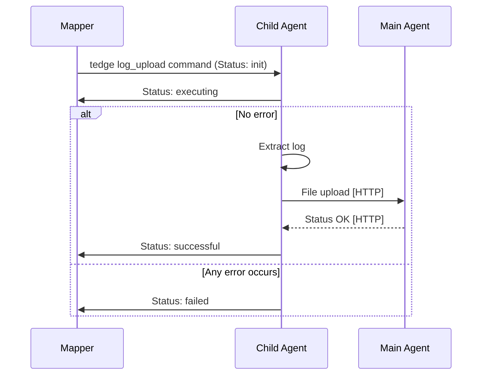

# Log file management

Thin-edge implements an operation to upload log files from the device to the cloud.

* The log file management feature on the main or a child device is provided by the __tedge-agent__ running on that device.
* The device owner can define the list of log files using the `tedge-log-plugin.toml` configuration file of the target device.
* Each entry in this file contains a log `type` and a `path` pattern,
  where the `type` is used to represent the logical group of log files matching the `path` pattern.
* Upon receiving a log file upload command for a given `type`, 
  the log files for that type are retrieved using the `path` pattern defined in this `tedge-log-plugin.toml`,
  matched against the requested time range, search text and maximum line count.
* The agent uploads the requested log file to the tedge file transfer repository.
  Its url is given by the received log upload command.
* The list of managed log files in `tedge-log-plugin.toml` can be updated locally or from cloud, for instance, by using the configuration management feature.
* However, the agent provides no direct connection to clouds, which is the responsibility of the cloud mapper.

## Configuration

Configuration of the log upload operation is stored by default under `/etc/tedge/plugins/tedge-log-plugin.toml`.
If it does not exist on startup, the agent creates the file with example contents.

This [TOML](https://toml.io/en/) file defines the list of log files that should be managed by the agent running on the device.
The paths to these files can be represented using [glob](https://en.wikipedia.org/wiki/Glob_(programming)) patterns.
The `type` given to these paths are used as the log type associated to a log path.

```toml title="file: /etc/tedge/plugins/tedge-log-plugin.toml"
files = [
  { type = "mosquitto", path = '/var/log/mosquitto/mosquitto.log' },
  { type = "software-management", path = '/var/log/tedge/agent/software-*' },
  { type = "c8y_CustomOperation", path = '/var/log/tedge/agent/c8y_CustomOperation/*' }
]
```

The agent parses this configuration file on startup for all the `type` values specified,
and sends the supported log types message to the MQTT local broker on the `<root>/<identifier>/cmd/log_upload` topic with a retained flag.

Given that `root.topic` and `device.topic` are set to `te` and `device/main//` for the main device,
the message to declare the supported log types is as follows.

```sh te2mqtt formats=v1
tedge mqtt pub -r 'te/device/main///cmd/log_upload' '{
  "types" : [ "mosquitto", "software-management", "c8y_CustomOperation" ]
}'
```

The agent continuously watches this configuration file for any changes and resends the JSON message with the `type`s in this file,
whenever it is updated.

:::note
If the file `/etc/tedge/plugins/tedge-log-plugin.toml` is ill-formed or cannot be read,
then a JSON message with an empty array for the `types` field is sent, indicating no log files are tracked.
:::

## Handling log upload commands

The agent subscribes to log upload commands on the [`<root>/<identifier>/cmd/log_upload/+` MQTT topic](../mqtt-api.md).
For example, it subscribes to the following topic for the main device.

```sh te2mqtt formats=v1
tedge mqtt sub 'te/device/main///cmd/log_upload/+'
```

A new log file upload command with the ID "1234" is published for the device named "example" by another component as below.

```sh te2mqtt formats=v1
tedge mqtt pub -r 'te/device/main///cmd/log_upload/1234' '{
  "status": "init",
  "tedgeUrl": "http://127.0.0.1:8000/tedge/file-transfer/example/log_upload/mosquitto-1234",
  "type": "mosquitto",
  "dateFrom": "2013-06-22T17:03:14.000+02:00",
  "dateTo": "2013-06-23T18:03:14.000+02:00",
  "searchText": "ERROR",
  "lines": 1000
}'
```

The agent then checks the `tedge-log-plugin.toml` file for the log `type` in the incoming message (`mosquitto`),
retrieves the log files using the `path` glob pattern provided in the configuration file for log upload,
including only the ones modified within the date range(`2013-06-22T17:03:14.000+02:00` to `2013-06-23T18:03:14.000+02:00`),
with the content filtered by the search text(`ERROR`) and the maximum line count(`1000`).

This filtered content is then uploaded to the URL received in the command as `tedgeUrl` via an HTTP PUT request.

During the process, the agent updates the command status via MQTT
by publishing a retained message to the same `<root>/<identifier>/cmd/log_upload/<id>` topic,
where the command is received.

On the reception of a new log file upload command, the agent updates the status to `executing`.
After successfully uploading the file to the file transfer repository, the agent updates the status to `successful`.
If any unexpected error occurs, the agent updates the status to `failed` with a `reason`.

Thus, the operation status update message for the above example looks like below.

```sh te2mqtt formats=v1
tedge mqtt pub -r 'te/device/main///cmd/log_upload/1234' '{
  "status": "failed",
  "reason": "The target log file for 'mosquitto' does not exist.",
  "tedgeUrl": "http://127.0.0.1:8000/tedge/file-transfer/example/log_upload/mosquitto-1234",
  "type": "mosquitto",
  "dateFrom": "2013-06-22T17:03:14.000+02:00",
  "dateTo": "2013-06-22T18:03:14.000+02:00",
  "searchText": "ERROR",
  "lines": 1000
}'
```

### Flow


