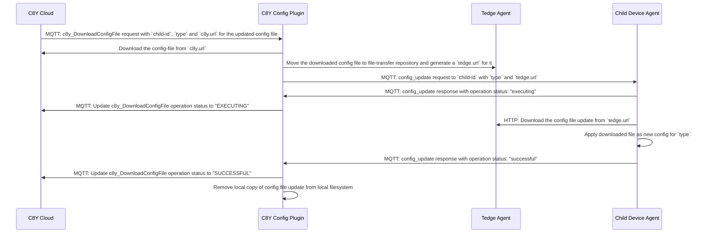
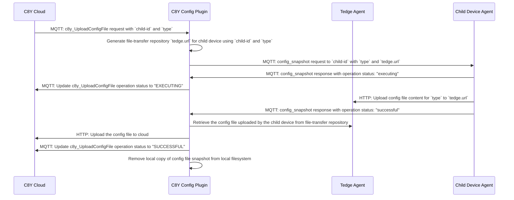

# Device Configuration Management using Cumulocity

Thin-edge provides an operation plugin to
[manage device configurations using Cumulocity](https://cumulocity.com/guides/users-guide/device-management/#to-retrieve-and-apply-a-configuration-snapshot-to-a-device-which-supports-multiple-configuration-types).

* This management is bi-directional:
  * A device can be taken as reference, all the managed files being uploaded to the cloud
    and stored there as a configuration snapshot.
  * A configuration snapshot can be pushed from the cloud to any devices of the same type,
    i.e. supporting the same kind of configuration files.
* With this operation plugin, the device owner defines the list of files
  (usually configuration files, but not necessarily),
  that will be managed from the cloud tenant.
* Notably, __the plugin configuration itself is managed from the cloud__,
  meaning, the device owner can update from the cloud the list of files to be managed.
* Cumulocity manages the configuration files accordingly to their type,
  a name that is chosen by the device owner to categorise each configuration.
  By default, the full path of a configuration file on the device is used as its type.
* When files are downloaded from the cloud to the device,
  __these files are stored in a temporary directory first__.
  They are atomically moved to their target path, only after a fully successful download.
  The aim is to avoid breaking the system with half downloaded files.
* When a downloaded file is copied to its target, the unix user, group and mod are preserved.
* Once a snapshot has been downloaded from Cumulocity to the device,
  __the plugin publishes a notification message on the local thin-edge MQTT bus__.
  The device software has to subscribe to these messages if any action is required,
  say to check the content of file, to pre-process it or to restart a daemon.
* The configuration plugin also manage configuration files for child-devices connected to the main thin-edge device.
  From the cloud point of view, these child-devices are configured exactly using the same user interface,
  with the ability to focus on a device, to upload the current configuration files,
  to push configuration updates and to configure the list of configuration files.
  Behind the scene, the behavior is a bit more complex,
  the configuration plugin acting as a proxy between the cloud and the child-devices.
  The configuration updates are downloaded from the cloud on the thin-edge device
  then made available to the child-devices over HTTP,
  MQTT being used to notify the availability of these configuration updates.
  The child-device software has to subscribe to these messages, download the corresponding updates,
  and notify the main thin-edge configuration plugin of the update status.
  A similar combination of MQTT and HTTP is used to let the main device
  request a child device for a configuration file actually in use.
* In other words, the responsibilities of the plugin are:
  * to define the list of files under configuration management
  * to notify the cloud when this list is updated,
  * to upload these files to the cloud on demand,  
  * to download the files pushed from the cloud,
  * to make sure that the target files are updated atomically after successful download,
  * to notify the device software when the configuration is updated,
  * to act as proxy for the child-devices that need configuration management,
  * to publish over a local HTTP server the configuration files and make them available to the child-devices,
  * to notify the child-devices when configuration updates are available,
  * to notify the child-devices when current configuration files are requested from the cloud,
  * to consume over a local HTTP server the configuration files pushed by the child-devices.
* By contrast, the plugin is not responsible for:
  * checking the uploaded files are well-formed,
  * restarting the configured processes,
  * installing the configuration files on the child-devices.
* For each child-device, a device-specific software component, referred to as a child-device agent, 
  is required to listen for configuration related MQTT notification
  and behave accordingly along the protocol defined by this configuration plugin.
  * Being specific to each type of child devices, this software has to be implemented specifically.
  * This software can be installed on the child device.
  * This software can also be installed on the main device,
    when the target device cannot be altered
    or connected to the main device over MQTT and HTTP.
* A user-specific component, installed on the device,
  can implement more sophisticated configuration use-cases by:
  * listening for configuration updates on the local thin-edge MQTT bus,
  * restarting the appropriate processes when appropriate,  
  * declaring intermediate files as the managed files,
    to have the opportunity to check or update their content
    before moving them to the actual targets.

## Installation

Assuming the configuration plugin `c8y-configuration-plugin`
has been installed in `/usr/bin/c8y-configuration-plugin`,
two files must be added under `/etc/tedge/operations/c8y/`
to declare that this plugin supports two Cumulocity operations:
uploading and downloading configuration files
(which respective SmartRest2 codes are `526` and `524`).

These two files are created on the very first startup of `c8y-configuration-plugin`:

```sh
ls -l /etc/tedge/operations/c8y/c8y_UploadConfigFile
```

```text title="Output"
-rw-r--r-- 1 tedge tedge 95 Mar 22 14:24 /etc/tedge/operations/c8y/c8y_UploadConfigFile
```

```sh
ls -l /etc/tedge/operations/c8y/c8y_DownloadConfigFile
```

```text title="Output"
-rw-r--r-- 1 tedge tedge 97 Mar 22 14:24 /etc/tedge/operations/c8y/c8y_DownloadConfigFile
```

The configuration plugin can also act as configuration proxy for child-devices.
For that to work for a child device named `$CHILD_DEVICE_ID`,
two files must be added under `/etc/tedge/operations/c8y/$CHILD_DEVICE_ID`
in order to declare the associated capabilities to Cumulocity.
These files are just empty files owned by the `tedge` user.

These two files are created by the plugin when the child-device agent uploads its supported configuration list to thin-edge.

```sh
ls -l /etc/tedge/operations/c8y/child-1
```

```text title="Output"
-rw-r--r-- 1 tedge tedge 97 Mar 22 14:24 /etc/tedge/operations/c8y/child-1/c8y_DownloadConfigFile
-rw-r--r-- 1 tedge tedge 95 Mar 22 14:24 /etc/tedge/operations/c8y/child-1/c8y_UploadConfigFile
```

```sh
ls -l /etc/tedge/operations/c8y/child-2
```

```text title="Output"
-rw-r--r-- 1 tedge tedge 97 Mar 22 14:24 /etc/tedge/operations/c8y/child-2/c8y_DownloadConfigFile
-rw-r--r-- 1 tedge tedge 95 Mar 22 14:24 /etc/tedge/operations/c8y/child-2/c8y_UploadConfigFile
```

The `c8y-configuration-plugin` has to be run as a daemon on the device, the latter being connected to Cumulocity.

On start of `tedge-mapper c8y` and on `/etc/tedge/operations/c8y` directory updates,
one can observe on the MQTT bus of the thin-edge device
the messages sent to Cumulocity to declare the capabilities of the main and child devices.
Here, the capabilities to upload and download configuration files
(possibly with other capabilities added independently):

```sh te2mqtt
tedge mqtt sub 'c8y/s/us/#'
```

```text title="Output"
[c8y/s/us] 114,c8y_Restart,c8y_SoftwareList,c8y_UploadConfigFile,c8y_DownloadConfigFile
[c8y/s/us/child-1] 114,c8y_UploadConfigFile,c8y_DownloadConfigFile
[c8y/s/us/child-2] 114,c8y_UploadConfigFile,c8y_DownloadConfigFile
```

## Configuration

The `c8y-configuration-plugin` configuration is stored by default under `/etc/tedge/c8y/c8y-configuration-plugin.toml`

This [TOML](https://toml.io/en/) file defines the list of files to be managed from the cloud tenant.
Each configuration file is defined by a record with:
* The full `path` to the file.
* An optional configuration `type`. If not provided, the `path` is used as `type`.
  This `type` is used to declare the configuration file to Cumulocity and then to trigger operations on that file.
  All the configuration `type`s for the main device are declared to the cloud on start
  and on change of the `c8y/c8y-configuration-plugin.toml` file.
* Optional unix file ownership: `user`, `group` and octal `mode`.  
  These are only used when a configuration file pushed from the cloud doesn't exist on the device.
  When a configuration file is already present on the device, this plugin never changes file ownership,
  ignoring these parameters.

```she
cat /etc/tedge/c8y/c8y-configuration-plugin.toml
```

```toml title="file: /etc/tedge/c8y/c8y-configuration-plugin.toml"
files = [
  { path = '/etc/tedge/tedge.toml', type = 'tedge.toml' },
  { path = '/etc/tedge/mosquitto-conf/c8y-bridge.conf' },
  { path = '/etc/tedge/mosquitto-conf/tedge-mosquitto.conf' },
  { path = '/etc/mosquitto/mosquitto.conf', type = 'mosquitto', user = 'mosquitto', group = 'mosquitto', mode = 0o644 }
]
```

Along this `c8y-configuration-plugin` configuration for the main device,
the configuration plugin expects a configuration file per child device
that needs to be configured from the cloud.
* The configuration for a child-device `$CHILD_DEVICE_ID`
  is stored by default under `/etc/tedge/c8y/$CHILD_DEVICE_ID/c8y-configuration-plugin.toml`
* These TOML files have the same schema as for the main device,
  listing the configuration `files` and giving for each a `path` and possibly a `type`.
* Note that the `path` doesn't need to be a file path.
  It can be a key path in some registry of the child device or any name that makes sense for the child device.
* As for the main device, the `type` is used to name the configuration file on the cloud.
  All the configuration `type`s for a child devices are declared to the cloud on start
  and on change of the `c8y/$CHILD_DEVICE_ID/c8y-configuration-plugin.toml` file.
* The `user`, `group` and `mode` can be provided for a child-device configuration file,
  notably when used by the child device,
  but will not be used by the main device if provided.  

```sh
ls -c1 /etc/tedge/c8y/*/c8y-configuration-plugin.toml
```

```text title="Output"
/etc/tedge/c8y/child-1/c8y-configuration-plugin.toml 
/etc/tedge/c8y/child-2/c8y-configuration-plugin.toml
```

```sh
cat /etc/tedge/c8y/child-1/c8y-configuration-plugin.toml
```

```toml title="file: /etc/tedge/c8y/child-1/c8y-configuration-plugin.toml"
files = [
  { path = '/var/camera.conf', type = 'camera' },
  { path = '/var/sounds.conf', type = 'sounds' },
]
```

```sh
cat /etc/tedge/c8y/child-2/c8y-configuration-plugin.toml
```

```toml title="file: /etc/tedge/c8y/child-2/c8y-configuration-plugin.toml"
files = [
  { path = '/var/ai/model' },
]
```

On start and when one of these files is updated, the configuration plugin sends
one [`119 SmartRest2 message`](https://cumulocity.com/guides/10.14.0/reference/smartrest-two/#119) per device
to Cumulocity with the set of `type`s listed by the configuration
(adding implicitly the `c8y-configuration-plugin` themselves).
These messages can be observed over the MQTT bus of the thin-edge device.
In the case of the example, 3 messages are sent - one for the main device and 2 for the child devices:

```sh te2mqtt
tedge mqtt sub 'c8y/s/us/#'
```

```text title="Output"
[c8y/s/us] 119,c8y-configuration-plugin,tedge.toml,/etc/tedge/mosquitto-conf/c8y-bridge.conf,/etc/tedge/mosquitto-conf/tedge-mosquitto.conf,mosquitto
[c8y/s/us/child-1] 119,c8y-configuration-plugin,camera,sounds
[c8y/s/us/child-2] 119,c8y-configuration-plugin,/var/ai/model
```

:::note
* The file `/etc/tedge/c8y/c8y-configuration-plugin.toml` itself doesn't need to be listed.
  This is implied, so the list can *always* be configured from the cloud.
  The `type` for this self configuration file is `c8y-configuration-plugin`.
* If the file `/etc/tedge/c8y/c8y-configuration-plugin.toml`
  is not found, empty, ill-formed or not-readable
  then only `c8y-configuration-plugin.toml` is managed from the cloud.
* Similarly, when there is a directory `/etc/tedge/c8y/$CHILD_DEVICE_ID/`
  but the file `/etc/tedge/c8y/$CHILD_DEVICE_ID/c8y-configuration-plugin.toml`
  is not found , empty, ill-formed or not-readable
  then only `$CHILD_DEVICE_ID/c8y-configuration-plugin.toml` is managed from the cloud.
* If the file `/etc/tedge/c8y/c8y-configuration-plugin.toml` is ill-formed
  or cannot be read then an error is logged, but the operation proceed
  as if the file were empty.
  Similarly, for any file `/etc/tedge/c8y/$CHILD_DEVICE_ID/c8y-configuration-plugin.toml`.
  So, the issue can be fixed from the cloud.
:::
  
The behavior of the `c8y-configuration-plugin` is also controlled
by the configuration of thin-edge:

* `tedge config get mqtt.bind.address`: the address of the local MQTT bus.
* `tedge config get mqtt.bind.port`: the TCP port of the local MQTT bus.
* `tedge config get tmp.path`: the directory where the files are updated
  before being copied atomically to their targets.

## Usage

```sh
c8y-configuration-plugin --help
```

```run command="c8y-configuration-plugin --help" lang="text" title="Output"
Thin-edge device configuration management for Cumulocity

USAGE:
    c8y-configuration-plugin [OPTIONS]

OPTIONS:
        --config-dir <CONFIG_DIR>
            [default: /etc/tedge]

        --debug
            Turn-on the debug log level.

            If off only reports ERROR, WARN, and INFO If on also reports DEBUG and TRACE

    -h, --help
            Print help information

    -i, --init
            Create supported operation files

    -V, --version
            Print version information

On start, `c8y-configuration-plugin` notifies the cloud tenant of the managed configuration files,
listed in the `CONFIG_FILE`, sending this list with a `119` on `c8y/s/us`.
`c8y-configuration-plugin` subscribes then to `c8y/s/ds` listening for configuration operation
requests (messages `524` and `526`).
notifying the Cumulocity tenant of their progress (messages `501`, `502` and `503`).

The thin-edge `CONFIG_DIR` is used to find where:
  * to store temporary files on download: `tedge config get tmp.path`,
  * to log operation errors and progress: `tedge config get log.path`,
  * to connect the MQTT bus: `tedge config get mqtt.client.port`.
```

## Logging

The `c8y-configuration-plugin` reports progress and errors on its `stderr`.

* All upload and download operation requests are logged, when received and when completed,
  with one line per file.
* All changes to the list of managed file is logged, one line per change.
* All errors are reported with the operation context (upload or download? which file?).

## Notifications

When a configuration file is successfully downloaded from the cloud,
the `c8y-configuration-plugin` service notifies this update over MQTT.

* The notification messages are published on the topic `tedge/configuration_change/{type}`,
  where `{type}` is the type of the configuration file that have been updated,
  for instance `tedge/configuration_change/tedge.toml`
* Each message provides the path to the freshly updated file as in `{ "path": "/etc/tedge/tedge.toml" }`.

:::note
* If no specific type has been assigned to a configuration file, then the path to this file is used as its type.
  Update notifications for that file are then published on the topic `tedge/configuration_change/{path}`,
  for instance `tedge/configuration_change//etc/tedge/mosquitto-conf/c8y-bridge.conf`.
* Since the type of configuration file is used as an MQTT topic name, the characters `#` and `+` cannot be used in a type name.
  If such a character is used in a type name (or in the path of a configuration file without explicit type),
  then the whole plugin configuration `/etc/tedge/c8y/c8y-configuration-plugin.toml` is considered ill-formed.
:::

## Configuration protocol between thin-edge and the child-devices

The configuration plugin `c8y-configuration-plugin` can act as a proxy between the cloud and a child-device.
However, for that to work, a client, referred to as child-device-agent, must be installed on the child device
to perform the actual configuration updates pushed by thin-edge on behalf of the cloud.
While the configuration plugin tells what need to be updated and when,
only the child device specific client can control where and how these updates can be applied.

* The responsibility of the configuration plugin is to
  * interact with the cloud, receiving the configuration update and configuration snapshot requests,
  * download/upload configuration files from/to the cloud to be exchanged with the child device
  * exchange configuration files with the child device via an HTTP-based file transfer service over the local network,
  * notify the child devices via MQTT when configuration files are to be updated or requested from the cloud,
  * listen to child devices' configuration operation status via MQTT messages and mirror those to the cloud.
* The child-device agent is an MQTT+HTTP client that
  * interact with the child-device system, accessing the actual configuration files
  * connect the main thin-edge device over the local MQTT bus,
  * listen over MQTT for configuration snapshot and update requests,
  * download and upload the configuration files on demand,
  * notify the progress of the configuration operations to the main device via MQTT.

For each kind of child device such an agent has to be implemented
and installed on the child-device hardware.
For a child device with closed software that cannot be altered,
one might have to install that agent with protocol adaptor on the main device.

Here is the protocol that has to be implemented by the child-device configuration client.
This protocol covers 4 interactions, the child devices:
1. Connecting to thin-edge
2. Uploading its supported configuration list to thin-edge
3. Downloading configuration file updates from thin-edge
4. Uploading current configuration files to thin-edge
5. Notifying thin-edge of configuration operation status updates

### The child device connects to the thin-edge parent device

From a TCP point of view, the child devices act as clients
and all the connections to thin-edge are established by the child devices.
* Thin-edge opens two ports for MQTT and HTTP over the local network.
  These ports are controlled on the main device `tedge config`:
  * `mqtt.external.bind.address`
  * `mqtt.external.bind.port`
  * `http.external.port`
* The child devices must know the main device IP address.
  * This is the address set for `mqtt.external.bind.address` on the main device.
  * For the very specific case, where the child-device agent runs on the main device,
    this connection address can be the `localhost`.
* On start, the child-device agent for configuration management,
  must connect over MQTT to thin-edge device.
  * It must use a session name that is unique on the thin-edge bus.
    `"$CHILD_DEVICE_ID/configuration"` is the recommendation.
  * It must subscribe to `tedge/$CHILD_DEVICE_ID/commands/req/#` to receive requests.
  * It has to publish responses under `tedge/$CHILD_DEVICE_ID/commands/res/#`.
* On demand, the child-device agent has to send HTTP requests to thin-edge.
  * These requests are REST requests (GET/PUT/DELETE) to exchange files.
  * The urls are forged by thin-edge telling the child devices
    where to get and put configuration files.
* Currently, all these connections are done without TLS support.
  * Hence, the main device must be configured so these MQTT and HTTP ports
    are only open on a local trusted network.

### The child device downloads configuration updates on notification

When a configuration file for a child device
is received from the cloud by the `c8y-configuration-plugin` daemon,
the configuration plugin manages the transfer of this file to the child device
and notifies the cloud on the progress of this configuration update operation.

The following diagram captures the required interactions between all relevant parties:



1. On reception of a configuration update for a child device named `$CHILD_DEVICE_ID`
   of a file `{ path = $PATH, type = $TYPE }` defined in `$CHILD_DEVICE_ID/c8y-configuration-plugin.toml` 
   the `c8y-configuration-plugin` downloads the new configuration content to the temporary directory defined by `tedge config get tmp.path`,
   and, on success, moves this content under the thin-edge file transfer HTTP root.
   * The file is moved to `$TEDGE_HTTP_ROOT/$CHILD_DEVICE_ID/config_update/$TYPE`
     making this file available under `http://$TEDGE_HTTP/tedge/file-transfer/$CHILD_DEVICE_ID/config_update/$TYPE`.
   * Note that the `$TYPE` is by default the `$PATH` if not provided by the configuration.  
1. Once the updated configuration is available over the local HTTP file transfer service,
   the `c8y-configuration-plugin` notifies the child device by publishing an MQTT message.
   * The topic is `tedge/$CHILD_DEVICE_ID/commands/req/config_update`
   * The payload is a JSON record with 3 fields
     * `"url": "http://$TEDGE_HTTP/tedge/file-transfer/$CHILD_DEVICE_ID/config_update/$TYPE"`
     * `"path": "$PATH"`
     * `"type": "$TYPE"` (if no `type` has been specified, then this field is omitted)
1. On reception of a configuration update on the topic `tedge/$CHILD_DEVICE_ID/commands/req/config_update`,
   The child-device agent for configuration management:
   1. `GET`s the content from the `url` specified by the notification message.
   1. Uses the `path` and `type` information to apply the new configuration content.
      Note that these pieces of information are provided by the child-device agent itself,
      and make sense only in the specific context of the device operating system and software.
1. While the configuration update is applied,
   the child-device agent for configuration management,
   notifies thin-edge over MQTT about the progress of this operation.
   1. These messages are published on the topic
      `tedge/$CHILD_DEVICE_ID/commands/res/config_update`
   1. There is three different payloads to notify the configuration operation started,
      succeed or failed for some reason.
   1. All these payloads are JSON records with 3 required fields:
      * `"status": "$STATUS"` where the status is either "executing", "successful" or "failed"
      * `"path": "$PATH"`
      * `"type": "$TYPE"`
      * `"reason": "$ERROR_MSG"` telling the cause of the error if any.
   1. The child-device agent must send at least a success or an error message,
      depending on the success of the `GET` and configuration operations.
      It should also send an executing message before starting to process the request.
1. On reception an operation status message,
   the `c8y-configuration-plugin` notifies the cloud accordingly.
   1. When a success or error message is finally received,
      then the configuration plugin cleans up all the temporary resources,
      notably removing the file under `$TEDGE_HTTP_ROOT/$CHILD_DEVICE_ID/config_update/$TYPE`.
   1. If a notification message is received while none is expected,
      i.e with a configuration file `type` that doesn't exist under `TEDGE_HTTP_ROOT/$CHILD_DEVICE_ID/config_update/`,
      then this notification message is ignored.

### The child device uploads current configuration snapshot on request

The configuration files actually used by a child device can be requested from the cloud.
As for configuration updates, the `c8y-configuration-plugin` daemon drive these requests
using a combination of MQTT to notify the child device of the request
and of HTTP to let the child device `PUT` the requested file.

The following diagram captures the required interactions between all relevant parties:



1. On reception of a configuration request for a child device named `$CHILD_DEVICE_ID`
   for a file `{ path = $PATH, type = $TYPE }` defined in `$CHILD_DEVICE_ID/c8y-configuration-plugin.toml`
   the `c8y-configuration-plugin` forwards this request to the child device by publishing an MQTT message
   telling which configuration is expected and where to upload it.
    * The topic is `tedge/$CHILD_DEVICE_ID/commands/req/config_snapshot`
    * The payload is a JSON record with 3 fields
        * `"url": "http://$TEDGE_HTTP/tedge/file-transfer/$CHILD_DEVICE_ID/config_snapshot/$TYPE"`
        * `"path": "$PATH"`
        * `"type": "$TYPE"` (if no `type` has been specified, then this field is omitted) 
    * The `url` conveys the fact the `c8y-configuration-plugin` expects that, on transfer success,
      the file will be stored `$TEDGE_HTTP_ROOT/$CHILD_DEVICE_ID/config_snapshot/$TYPE`.
      Note that when the `$TYPE` is not explicitly defined in `$CHILD_DEVICE_ID/c8y-configuration-plugin.toml`,
      then the `$PATH` is used as the configuration type.
1. On reception of a configuration request on the topic `tedge/$CHILD_DEVICE_ID/commands/req/config_snapshot`,
   The child-device agent for configuration management:
   1. Uses the `path` and `type` information to retrieve the requested configuration content.
   Note that these pieces of information are provided by the child-device agent itself,
   and make sense only in the specific context of the device operating system and software.
   1. `PUT`s the content to the `url` specified by the request message.
1. The child-device agent for configuration management,
   notifies thin-edge over MQTT about the progress of the configuration snapshot request.
    1. These messages are published on the topic
       `tedge/$CHILD_DEVICE_ID/commands/res/config_snapshot`
    1. There is three different payloads to notify the configuration operation started,
       succeed or failed for some reason.
    1. All these payloads are JSON records with 3 required fields:
        * `"status": "$STATUS"` where the status is either "executing", "successful" or "failed"
        * `"path": "$PATH"`
        * `"type": "$TYPE"`
        * `"reason": "$ERROR_MSG"` telling the cause of the error if any.
    1. The child-device agent must send at least a success or an error message,
       depending on the success of the `PUT` operation.
       It should also send an executing message before starting to process the request.
1. On reception of an operation status message,
   the `c8y-configuration-plugin` notifies the cloud accordingly.
    1. When a success message is received,
       then the configuration plugin transfers to the cloud the content `PUT` by the child-device
       under `$TEDGE_HTTP_ROOT/$CHILD_DEVICE_ID/config_snapshot/$TYPE` and
       finally removes this file when acknowledged by the cloud.
    1. If a notification message is received while none is expected for this type of configuration,
       then this notification message is ignored.
       
### The child device uploads its configuration file list on start and on change

The configuration files for a child device `$CHILD_DEVICE_ID` are defined in
the file `$TEDGE_CONFIG_DIR/c8y/$CHILD_DEVICE_ID/c8y-configuration-plugin.toml` on the thin-edge device.
But, the content of this file must be provided by the child-device agent
by uploading a `c8y-configuration-plugin.toml` with `"type": "c8y-configuration-plugin"` in its prescribed format.

The child-device must upload this file on its startup as well as when updated,
as if it received a config snapshot request for `c8y-configuration-plugin` type as follows:

1. On start-up, the child-device uploads this file (as well as on update of this file list),
   as if it received a config snapshot request for `c8y-configuration-plugin` type:
      1. Generate a `c8y-configuration-plugin.toml` with the supported config list in the prescribed format.
      2. Uploads this file to `http://$TEDGE_HTTP/tedge/file-transfer/$CHILD_DEVICE_ID/c8y-configuration-plugin` with a `PUT` call.
      3. On success of the upload, the child-device agent
         notifies the `c8y-configuration-plugin` with an MQTT message published on the topic
         `tedge/$CHILD_DEVICE_ID/commands/res/config_snapshot`
         with the payload containing a JSON record with `"type": "c8y-configuration-plugin"` but without the `status` field.
      4. Note that there is no need to send executing notification messages here,
         since this is a spontaneous operation and not triggered by an explicit config snapshot request.

2. The plugin does the following on receipt of the response with `"type": "c8y-configuration-plugin"`,
   received for the upload on `tedge/$CHILD_DEVICE_ID/commands/res/config_snapshot` topic.
   1. Take a copy of the transferred file under `$TEDGE_HTTP_ROOT/$CHILD_DEVICE_ID/config_snapshot/c8y-configuration-plugin`
      and puts this copy under `$TEDGE_CONFIG_DIR/c8y/$CHILD_DEVICE_ID/c8y-configuration-plugin.toml`
   2. Create two empty files `c8y_DownloadConfigFile` and `c8y_UploadConfigFile` under `/etc/tedge/operations/c8y/$CHILD_DEVICE_ID`
      to inform the Cumulocity mapper that this child device supports configuration management.
      On creation of these files, the mapper will automatically update child device twin with these supported operations.
   3. Send a SmartREST 119 message with the list of configuration files listed in the file
      (to which this file `$TEDGE_CONFIG_DIR/c8y/$CHILD_DEVICE_ID/c8y-configuration-plugin.toml`
      is implicitly added with type `c8y-configuration-plugin`).
