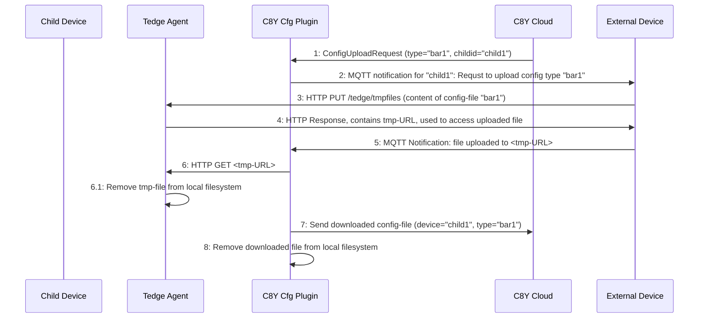
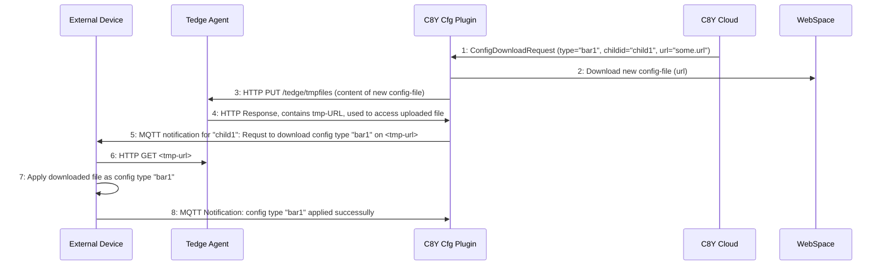

# Device Configuration Management using Cumulocity

Thin-edge provides an operation plugin to
[manage device configurations using Cumulocity](https://cumulocity.com/guides/users-guide/device-management/#to-retrieve-and-apply-a-configuration-snapshot-to-a-device-which-supports-multiple-configuration-types).

* This management is bi-directional:
  * A device can be taken as reference, all the managed files being uploaded to the cloud
    and stored there as a configuration snapshot.
  * A configuration snapshot can be pushed from the cloud to any devices of the same type,
    i.e. supporting the same kind of configuration files.
* With this operation plugin, the device owner defines the list of files
  (usually configuration files, but not necessarily),
  that will be managed from the cloud tenant.
* Notably, __the plugin configuration itself is managed from the cloud__,
  meaning, the device owner can update from the cloud the list of files to be managed.
* Cumulocity manages the configuration files accordingly to their type,
  a name that is chosen by the device owner to categorise each configuration.
  By default, the full path of a configuration file on the device is used as its type.
* When files are downloaded from the cloud to the device,
  __these files are stored in a temporary directory first__.
  They are atomically moved to their target path, only after a fully successful download.
  The aim is to avoid breaking the system with half downloaded files.
* When a downloaded file is copied to its target, the unix user, group and mod are preserved.
* Once a snapshot has been downloaded from Cumulocity to the device,
  __the plugin publishes a notification message on the local thin-edge MQTT bus__.
  The device software has to subscribe to these messages if any action is required,
  say to check the content of file, to preprocess it or to restart a daemon. 
* In other words, the responsibilities of the plugin are:
  * to define the list of files under configuration management
  * to notify the cloud when this list is updated,
  * to upload these files to the cloud on demand,  
  * to download the files pushed from the cloud,
  * to make sure that the target files are updated atomically after successful download,
  * to notify the device software when the configuration is updated.
* By contrast, the plugin is not responsible for:
  * checking the uploaded files are well-formed,
  * restarting the configured processes.
* A user-specific component, installed on the device,
  can implement more sophisticated configuration use-cases by:
  * listening for configuration updates on the local thin-edge MQTT bus,
  * restarting the appropriate processes when appropriate,  
  * declaring intermediate files as the managed files,
    to have the opportunity to check or update their content
    before moving them to the actual targets.

## Installation

Assuming the configuration plugin `c8y_configuration_plugin`
has been installed in `/usr/bin/c8y_configuration_plugin`,
two files must be added under `/etc/tedge/operations/c8y/`
to declare that this plugin supports two Cumulocity operations:
uploading and downloading configuration files
(which respective SmartRest2 codes are `526` and `524`).

These two files can be created using the `c8y_configuration_plugin --init` option:

```shell
$ sudo c8y_configuration_plugin --init

$ ls -l /etc/tedge/operations/c8y/c8y_UploadConfigFile
-rw-r--r-- 1 tedge tedge 95 Mar 22 14:24 /etc/tedge/operations/c8y/c8y_UploadConfigFile
  
$ ls -l /etc/tedge/operations/c8y/c8y_DownloadConfigFile
-rw-r--r-- 1 tedge tedge 97 Mar 22 14:24 /etc/tedge/operations/c8y/c8y_DownloadConfigFile
```

The `c8y_configuration_plugin` has to be run as a daemon on the device, the latter being connected to Cumulocity.

## Configuration

The `c8y_configuration_plugin` configuration is stored by default under `/etc/tedge/c8y/c8y-configuration-plugin.toml`

This [TOML](https://toml.io/en/) file defines the list of files to be managed from the cloud tenant.
Each configuration file is defined by a record with:
* The full `path` to the file.
* An optional configuration `type`. If not provided, the `path` is used as `type`.
* Optional unix file ownership: `user`, `group` and octal `mode`.  
  These are only used when a configuration file pushed from the cloud doesn't exist on the device.
  When a configuration file is already present on the device, this plugin never changes file ownership,
  ignoring these parameters.

```shell
$ cat /etc/tedge/c8y/c8y-configuration-plugin.toml
files = [
    { path = '/etc/tedge/tedge.toml', type = 'tedge.toml' },
    { path = '/etc/tedge/mosquitto-conf/c8y-bridge.conf' },
    { path = '/etc/tedge/mosquitto-conf/tedge-mosquitto.conf' },
    { path = '/etc/mosquitto/mosquitto.conf', type = 'mosquitto', user = 'mosquitto', group = 'mosquitto', mode = 0o644 }
  ]
```

Note that:
* The file `/etc/tedge/c8y/c8y-configuration-plugin.toml` itself doesn't need to be listed.
  This is implied, so the list can *always* be configured from the cloud.
  The `type` for this self configuration file is `c8y-configuration-plugin`.
* If the file `/etc/tedge/c8y/c8y-configuration-plugin.toml`
  is not found, empty, ill-formed or not-readable
  then only `c8y-configuration-plugin.toml` is managed from the cloud.
* If the file `/etc/tedge/c8y/c8y-configuration-plugin.toml` is ill-formed
  or cannot be read then an error is logged, but the operation proceed
  as if the file were empty.
  
The behavior of the `c8y_configuration_plugin` is also controlled
by the configuration of thin-edge:

* `tedge config get mqtt.bind_address`: the address of the local MQTT bus.
* `tedge config get mqtt.port`: the TCP port of the local MQTT bus.
* `tedge config get tmp.path`: the directory where the files are updated
  before being copied atomically to their targets.

## Usage

```shell
$ c8y_configuration_plugin --help
c8y_configuration_plugin 0.6.2
Thin-edge device configuration management for Cumulocity

USAGE:
    c8y_configuration_plugin [OPTIONS]

OPTIONS:
        --config-dir <CONFIG_DIR>      [default: /etc/tedge]
        --config-file <CONFIG_FILE>    [default: $CONFIG_DIR/c8y/c8y-configuration-plugin.toml]
        --debug                        Turn-on the debug log level
    -h, --help                         Print help information
    -i, --init                         Create supported operation files
    -V, --version                      Print version information

    On start, `c8y_configuration_plugin` notifies the cloud tenant of the managed configuration files,
    listed in the `CONFIG_FILE`, sending this list with a `119` on `c8y/s/us`.
    `c8y_configuration_plugin` subscribes then to `c8y/s/ds` listening for configuration operation
    requests (messages `524` and `526`).
    notifying the Cumulocity tenant of their progress (messages `501`, `502` and `503`).
    
    The thin-edge `CONFIG_DIR` is used to find where:
    * to store temporary files on download: `tedge config get tmp.path`,
    * to connect the MQTT bus: `tedge config get mqtt.port`.
```

## Logging

The `c8y_configuration_plugin` reports progress and errors on its `stderr`.

* All upload and download operation requests are logged, when received and when completed,
  with one line per file.
* All changes to the list of managed file is logged, one line per change.
* All errors are reported with the operation context (upload or download? which file?).

## Notifications

When a configuration file is successfully downloaded from the cloud,
the `c8y_configuration_plugin` service notifies this update over MQTT.

* The notification messages are published on the topic `tedge/configuration_change/{type}`,
  where `{type}` is the type of the configuration file that have been updated,
  for instance `tedge/configuration_change/tedge.toml`
* Each message provides the path to the freshly updated file as in `{ "path": "/etc/tedge/tedge.toml" }`.

Note that:
* If no specific type has been assigned to a configuration file, then the path to this file is used as its type.
  Update notifications for that file are then published on the topic `tedge/configuration_change/{path}`,
  for instance `tedge/configuration_change//etc/tedge/mosquitto-conf/c8y-bridge.conf`.
* Since the type of configuration file is used as an MQTT topic name, the characters `#` and `+` cannot be used in a type name.
  If such a character is used in a type name (or in the path of a configuration file without explicit type),
  then the whole plugin configuration `/etc/tedge/c8y/c8y-configuration-plugin.toml` is considered ill-formed.
* Notifications for child-devices and their external devices are handled differently, as configuration files are fetched/pushed from/to external devices via HTTP filetransfer. Thereby notifications are part of the filetransfer contract (details see section [Fetching/Pushing configuration file](#fetchingpushing-configuration-file-fromto-the-external-device) below).

## Configuration files for child devices

To manage configuration files for child-devices the `c8y_configuration_plugin` aspects as below are relevant:

* Associating with cloud's child-device twin, i.E. managing supported configuration list of child devices 
  * an external child device declares its supported config-types to thin-edge via MQTT
  * thin-edge maintaines the supported config-types of each child-device a separate config-file
  * the plugin is the one that associates the reported config-type list from the external to it's cloud device twin
  * these config-list files per child-device is also managed by Configuration Management feature from C8Y
* Consuming/Providing files from/to thin-edge via network
  * any configuration file exchange to/from the external child device is handled by an HTTP based filetransfer service provided by thin-edge

## Managing Supported Configuration List of child devices

To announce a child-devices configuration management capability child-device provisioning as described in [child-device reference documentation](child-devices.md#1-child-device-provisioning) is used.

The `capability specific JSON object` for `c8y_configuration_plugin` contains all configurations the external device provides.
Thereby each configuration appears with a `type` and with an optional field `path`.

The MQTT message is as below:

```json
{
   "configurations": [
     {
       "type": "<config type 1>"
     },
     {
       "type": "<config type 2>"
     },
     ...
   ]
}
```

Example:
```json
{
   "configurations": [
     {
       "type": "foo.conf"
     },
     {
       "type": "bar.conf"
     }
   ]
}
```

The `c8y_configuration_plugin` make use of the HTTP filetransfer feature of the `tedge_agent` to consume/provide the configuration-file (see [section below](#details-to-aspect-2-filetransfer-fromto-external-device) for more details about HTTP filetransfer). 

Whenever the `c8y_configuration_plugin` receivces that MQTT message it stores all contained information to a child-specific TOML file in `/etc/tedge/c8y/<childid>/c8y-configuration-plugin.toml`. When the file already exists it will be replaced with the new content. The format of that TOML file is according to section [Configuration](#configuration) above. Each individual child's TOML file is stored in a subfolder, where the subfolder name is the `childid`.

Example:

```bash
    $ tree /etc/tedge/c8y/
    /etc/tedge/c8y/
    ├── c8y-configuration-plugin.toml
    ├── child1
    │   └── c8y-configuration-plugin.toml
    └── child2
        └── c8y-configuration-plugin.toml    
```

The `c8y_configuration_plugin` adds per child-device the file `/etc/tedge/c8y/<childid>/c8y-configuration-plugin.toml` implicitely to the child-device's config listed. So the list can always be configured from the cloud. The `type` for this self configuration file is `c8y-configuration-plugin`.

Each time a child-device's TOML is modified (e.g. due to an incoming MQTT message, an incoming new configuration snapshot from the cloud, or a modification by a local process) the `c8y_configuration_plugin` takes care to define all necessary capabilities to the coresponding cloud's child-device twin. These are:
  - declaring _supported operations_ for configuration management: `c8y_UploadConfigFile` and `c8y_DownloadConfigFile`
  - declaring provided _configuration types_

**Declaring 'supported operations'**

To declare supported operations the `c8y_configuration_plugin` uses thin-edge's _Supported Operations API_. Therefore the `c8y_configuration_plugin` creates for each child-device two files under `/etc/tedge/operations/c8y/<childid>`.

Example, for child-device with childid `child1`:

```
/etc/tedge/operations/c8y/child1/c8y_UploadConfigFile
/etc/tedge/operations/c8y/child1/c8y_DownloadConfigFile
```

As soon as those files are created, thin-edge's _Supported Operations API_ takes care to send according supported operation declarations to cloud's child-device twins (see [documentation Supported Operations](../tutorials/supported_operations.md#supported-operations-for-child-devices)).

**Declaring 'provided configuration types'**

For all configuration `types` provided by the external device, the plugin sends an MQTT message to C8Y. Thereby all `types` will be combined in one single message as below:
  - topic: `c8y/s/us/<childid>`
  - payload: `119,<type 1>,<type 2>,<type 3>,...`<br/>
    Example: `119,foo.conf,bar.conf`

Note that the `c8y_configuration_plugin` does **not** create any child-device twin in the cloud. Instead the clouds child-device twins must be created upfront.


## Fetching/Pushing configuration file from/to the external device

To fetch/push configuration files to/from external devices, the `c8y_configuration_plugin` makes use of file-transfer HTTP APIs of the `tedge_agent`.
  
The HTTP filetransfer feature of the `tedge_agent` provides the service to transfer files from external devices to the local filesystem of the thin-edge device's, and vice versa.

  * `tedge_agent` serves PUT, GET and DELETE requests for temporary file upload, download and removal
    * a temporary file can be uploaded with an HTTP PUT request to `http://<thin-edge IP address>/tedge/tmpfiles`,
      where the HTTP response contains a _temporary URL_.
    * a temporary file can be downloaded with an HTTP GET request to `http://<ip address of thin-edge device>/<temporary URL>`

## Fetching configuration file from child device to cloud

A configuration file snapshot is fetched from an external device as illustrated below.



  1) At some point C8Y cloud sends a ConfigUploadRequest for type `bar.conf` for `child1` arrives at C8Y config plugin.
    The format of C8Y SmartREST message for config retrieval operation is: `526,<childid>,<config type>`. See [C8Y SmartREST doc](https://cumulocity.com/guides/reference/smartrest-two/#upload-configuration-file-with-type-526)<br/>
    Example: `526,child1,bar.conf`

  2) C8Y config plugin: notifies the external device `child1` via MQTT to upload it's current configuration to the thin-edge device

    Topic: `tedge/configuration/req/retrieve/{config type}/{childid}`<br/>
    Example: `tedge/configuration/req/retrieve/bar.conf/child1`<br/>  
    TODO: Investigate and decide about topic structure and payload in scheduled prototype (https://github.com/thin-edge/thin-edge.io/issues/1307) 
         
  3) external device child1: Uploads configuration file to the thin-edge device with the HTTP filetransfer feature.
  
    HTTP PUT request: `http://<ip address of thin-edge devicee>/tedge/tmpfiles`
    
  4) The response from the HTTP filetransfer feature contains a _temporary URL_, that is later used to uniquely access that uploaded file.<br/>
     Example for a _temporary URL_: `/tedge/tmpfiles/<random string>`

  5) external device child1: notifies the the plugin via MQTT about succeeded upload and the _temporary URL_.
 
    Topic: `tedge/configuration/res/retrieve/{config type}/{childid}`<br/>
    Example: `tedge/configuration/res/retrieve/bar.conf/child1`<br/>
    Payload: ` <temporary URL> `
       
    TODO: Investigate and decide about topic structure and payload in scheduled prototype (https://github.com/thin-edge/thin-edge.io/issues/1307). Unhappy paths also to be considered here.
  
  6) C8Y config plugin: recognizes the MQTT notification about the uploaded file and the _temprary URL_, 
                       and downloads the file using HTTP the filetransfer with the _temporary URL_ to some temporary location.
  
    Example for HTTP GET request: `http://<ip address of thin-edge device>/<temporary URL>`

  7) C8Y config plugin: sends the downloaded file to C8Y

  8) C8Y config plugin: removes the downloaded file from temporary location
  

## Pushing configuration file update to child device from cloud

A configuration file snapshot is pushed to an external device as illustrated below.



  1) At some point a ConfigDownloadRequest sent from cloud for type `bar.conf` for `child1` arrives at C8Y config plugin.
     The format of C8Y SmartREST message for config send operation is: `524,<childid>,<URL>,<config type>`. See [C8Y SmartREST doc](https://cumulocity.com/guides/reference/smartrest-two/#download-configuration-file-with-type-524)<br/>
    Example: `524,child1,http://www.my.url,bar.conf`
  2) C8Y config plugin: downloads the file based on the URL received from C8Y, to some temporary location

  3) C8Y config plugin: uploads the file to the thin-edge filetransfer feature, and removes it from the temporary location
  
    HTTP PUT request: `http://<ip address of thin-edge devicee>/tedge/tmpfiles`
    
  4) The response from the HTTP filetransfer feature contains a _temporary URL_, that is later used to uniquely access that uploaded file.<br/>
    Example for a _temporary URL_: `/tedge/tmpfiles/<random string>`

  5) C8Y config plugin: notifies the external device `child1` via MQTT to download the new configuration from the thin-edge device with the _temporary URL_.

    Topic: `tedge/configuration/req/send/{config type}/{childid}`<br/>
    Example: `tedge/configuration/req/send/bar.conf/child1`<br/>  
    Payload: ` <temporary URL> `<br/>
    TODO: Investigate and decide about topic structure and payload in scheduled prototype (https://github.com/thin-edge/thin-edge.io/issues/1307) 

  6) external device child1: Downloads configuration file from the thin-edge device with the HTTP filetransfer feature and the _temporary URL_, and filetransfer removes the file from it's local filesystem folder.
  
    Example for HTTP GET request: `http://<ip address of thin-edge device>/<temporary URL>`
    
  7) external device child1: applies the new configuration and notifies the the plugin via MQTT about success.
 
    Topic: `tedge/configuration/res/send/{config type}/{childid}`<br/>
    Example: `tedge/configuration/res/send/bar.conf/child1`<br/>
       
    TODO: Investigate and decide about topic structure and payload in scheduled prototype (https://github.com/thin-edge/thin-edge.io/issues/1307). Unhappy paths also to be considered here.

  8) C8Y config plugin: recognizes the MQTT notification and sends the result to C8Y.

    TO-BE-DEFINED:
    
      * Decide which error paths to be considered.
      * Decide if any timeout to be considerd when waiting for upload notification from external device.

