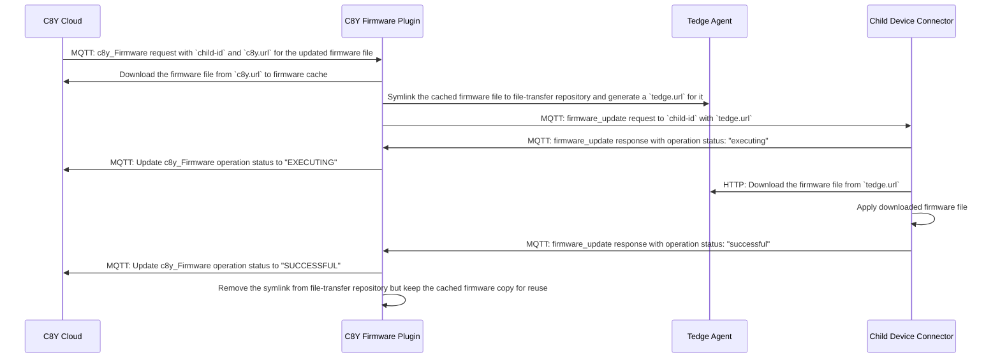

# Device Firmware Management using Cumulocity

Thin-edge provides an operation plugin to
[manage device firmware using Cumulocity](https://cumulocity.com/guides/users-guide/device-management/#firmware-repo).
Firmware management is currently supported only for child devices and not for the main tedge device.

## Installation

The plugin will be installed at `/usr/bin/c8y-firmware-plugin` by the debian package.
The systemd service definition files for the plugin are also installed at `/lib/systemd/system/c8y-firmware-plugin.service`.

No operations files are created under `/etc/tedge/operations/c8y/`
as this plugin doesn't support firmware updates for the tedge device.
Operation files for child devices must be created as part of their bootstrap process, which is explained later.

## Configuration

The plugin supports a single tedge configuration named `firmware.child.update.timeout`,
that defines the amount of time the plugin wait for a child device to finish a firmware update once the request is delivered.
The default timeout value is `3600s` and can be updated with:

```shell
sudo tedge config set firmware.child.update.timeout <another-value>
```

## Usage

```shell
c8y-firmware-plugin --help
```

```shell
<!-- cmdrun c8y-firmware-plugin --help -->
```

The `c8y-firmware-plugin` has to be run as a daemon on the device.
On systemd supported OSes, it can be run as a daemon service as follows:

```shell
systemctl start c8y-firmware-plugin
systemctl enable c8y-firmware-plugin
```

## Firmware update protocol between thin-edge and the child-devices

The plugin manages the download and delivery of firmware files for child-devices connected to the thin-edge device,
acting as a proxy between the cloud and the child-devices.
The firmware updates are downloaded from the cloud on the thin-edge device then made available to the child-devices over HTTP,
using MQTT to notify the availability of these firmware updates.
The child-device software has to subscribe to these MQTT messages, download the corresponding updates via HTTP,
and notify the firmware plugin of the update status via MQTT.

* The responsibilities of the plugin are:
  * to download the firmware files pushed from the cloud, caching it to be shared with child devices
  * to handle network failures during the download even on flaky networks
  * to publish the downloaded firmware files over a local HTTP server and make them available to the child-devices,
  * to notify the child-devices when firmware updates are available,
  * to receive forward the firmware update status updates from the child devices to the cloud
* By contrast, the plugin is not responsible for:
  * checking the integrity of the downloaded file which is a third-party binary
  * installing the firmware files on the child-devices.
* For each child-device, a device-specific software component, referred to as a `child-device-connector`, 
  is required to listen for firmware update related MQTT notifications from the plugin
  and behave accordingly along the protocol defined by this plugin.
  * Being specific to each type of child devices, this software has to be implemented specifically.
  * This software can be installed on the child device.
  * This software can also be installed on the main device,
    when the target device cannot be altered or connected to the main device over MQTT and HTTP.

### Child device connector connecting to thin-edge device

The `child-device-connector` interacts with thin-edge over its MQTT and HTTP APIs.
In cases where the child device connector is installed alongside thin-edge on the same device,
these APIs can be accessed via a local IP or even `127.0.0.1`.
The MQTT APIs are exposed via port 1883 and the HTTP APIs are exposed via port 8000, by default.
When the child device connector is running directly on the external child device,
the MQTT and HTTP APIs of thin-edge need to be accessed over the network using its IP address and ports,
which are configured using the tedge config settings `mqtt.client.host` or `mqtt.client.port` for MQTT
and `http.address` and `http.port` for HTTP.


### Child devices declaring firmware management support

But for child devices, the operation files must be created under `/etc/tedge/operations/c8y/$CHILD_DEVICE_ID`.
These files are not created by the plugin itself, but must be created by the child device connector or
by any other means for each child device as follows:


```shell
$ tree /etc/tedge/operations/c8y
/etc/tedge/operations/c8y
|-- child-1
|   `-- c8y_Firmware
`-- child-2
    `-- c8y_Firmware
```

Using the file watcher mechanism, the c8-mapper picks up the creation of these operation files
and report them as supported operations for the child device as follows:

```shell
$ tedge mqtt sub 'c8y/s/us/#'
[c8y/s/us/child-1] 114,c8y_Firmware
[c8y/s/us/child-2] 114,c8y_Firmware
```


### The child device connector handling firmware update requests from thin-edge device

When the plugin receives a firmware update request file for a child device,
it downloads the firmware file, caches it to be reused on other child devices as well
and exposes it to the child device via its file-transfer service. 
It also notifies the cloud on the progress of this firmware update operation
as and when it gets status updates from the child device.

The following diagram captures the required interactions between all relevant parties:



The following keywords are used in the following section for brevity:

* `TEDGE_DATA_PATH`: The path set by tedge config `data.path`. Default: `/var/tedge`
* `TEDGE_TMP_PATH`: The path set by tedge config `tmp.path`. Default: `/tmp`
* `FIRMWARE_CACHE_PATH`: `$TEDGE_DATA_PATH/cache`
* `FIRMWARE_OP_PATH`: `$TEDGE_DATA_PATH/firmware`
* `FILE_TRANSFER_REPO`: `$TEDGE_DATA_PATH/file-transfer`
* `TEDGE_HTTP_ADDRESS`: The combination of tedge configs `http.address`:`http.port`
* `OP_ID`: An operation ID
* `FILE_ID`: A firmware file id derived from the SHA-256 digest of the firmware url

1. The plugin, on recept of a `c8y_Firmware` request from Cumulocity for a child device named `$CHILD_DEVICE_ID`
   in the format `515,$CHILD_DEVICE_ID,$FIRMWARE_NAME,$FIRMWARE_VERSION,$FIRMWARE_URL`
   1. Validate if the same firmware update operation is already in progress
      by iterating over all the operation files in the `$FIRMWARE_OP_PATH` directory.
      The operation files contains the last `firmware_update` request's JSON payload along with the `device` ID.
      If an operation file with the `device` id, `name`, `version` and `url` fields matching
      the incoming `$FIRMWARE_NAME`,`$FIRMWARE_VERSION` and `$FIRMWARE_URL` is found,
      the same request is re-sent to the child device by just incrementing the `attempt` count value.
      The operation file content is also overwritten the with updated `attempt` count. 
   1. If a pending operation match is not found, do a look up if the firmware file for the given url already exists
      in its firmware cache at `$FIRMWARE_CACHE_PATH`.
      The file name for the lookup is derived from the SHA-256 digest of the firmware url.
      If a cached copy exists, the download is skipped.
   1. If not found in the firmware cache, the plugin downloads the firmware file from the `url` to `$TEDGE_TMP_PATH`.
   1. On successful download, the file is moved to the firmware cache at `$FIRMWARE_CACHE_PATH`
      with the name derived from the SHA-256 digest of the firmware url.
1. The cached firmware file is published via the file-transfer repository of `tedge-agent` 
   by creating a symlink to the cached firmware file is created in the file-transfer repository at
   `$FILE_TRANSFER_REPO/$CHILD_DEVICE_ID/firmware_update/$FILE_ID` making this file available via
   the HTTP endpoint: `http://$TEDGE_HTTP_ADDRESS/tedge/file-transfer/$CHILD_DEVICE_ID/firmware_update/$FILE_ID`.
1. Once the updated firmware file is published via the HTTP file transfer service,
   the plugin send the `firmware_update` request to the child device connector by publishing an MQTT message:
   * Topic: `tedge/$CHILD_DEVICE_ID/commands/req/firmware_update`
   * The payload is a JSON record with the following fields
     * `id`: A unique id generated by the plugin
     * `name`: Name of the firmware received in the cloud request
     * `version`:
     * `url`: The file-transfer service entry URL(`http://$TEDGE_HTTP_ADDRESS/tedge/file-transfer/$CHILD_DEVICE_ID/firmware_update/$FILE_ID`)
     * `sha256`: The SHA-256 checksum of the firmware file served via the `url`
     * `attempt`: The count that indicates if this request is being resent or not
1. On reception of the firmware update request on the topic `tedge/$CHILD_DEVICE_ID/commands/req/firmware_update`,
   the child device connector is expected to do the following:
   1. Send an acknowledgement of the receipt of the request by sending an executing status message via MQTT:
      * Topic: `tedge/$CHILD_DEVICE_ID/commands/res/firmware_update`
      * Payload must be a JSON record with the following fields
        * `id`: The `id` of the request
        * `status`: "executing"
   1. `GET`s the firmware file from the `url` specified by the notification message.
   1. Validate the integrity of the downloaded binary by matching its SHA-256 hash value
      against the `sha256` checksum value received in the request.
   1. Apply the downloaded firmware file update on the device using whatever device specific protocol.
1. After applying the update, send the final operation status update to thin-edge via MQTT:
   1. Topic: `tedge/$CHILD_DEVICE_ID/commands/res/firmware_update`
   1. The payload must be a JSON record with the following fields:
      * `id`: The `id` of the request received
      * `status`: `successful` or `failed` based on the result of updating the firmware
      * `reason`: The reason for the failure, applicable only for `failed` status.
1. On reception of an operation status message, the plugin maps it to SmartREST and forwards it to the cloud.
   * When a `success` or `failed` status message is finally received,
     then the plugin cleans up the corresponding operation file at `$FIRMWARE_OP_PATH/$OP_ID` and
     the firmware file entry in the file transfer repository at `$FILE_TRANSFER_REPO/$CHILD_DEVICE_ID/firmware_update/$FILE_ID`.
   * If a notification message is received while none is expected,
     i.e with an operation `id` that doesn't exist  `TEDGE_HTTP_ADDRESS_ROOT/$CHILD_DEVICE_ID/firmware_update/`,
     then this notification message is ignored.      

## Logging

The plugin logs its progress and errors on to its `stderr`.

* All upload and download operation requests are logged, when received and when completed,
  with one line per file.
* All changes to the list of managed file is logged, one line per change.
* All errors are reported with the operation context (upload or download? which file?).
