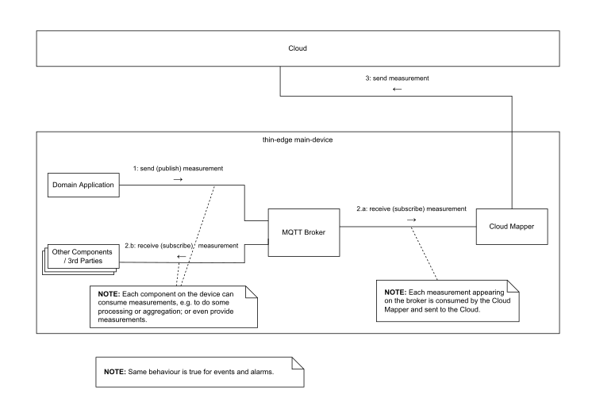

# thin-edge Data Model

The **data model** identifies all data send or received from/to **thin-edge** and its components, to interact with those.
For all data it defines format and explains behaviour.

## Use of MQTT

**thin-edge** expects the MQTT broker [mosquitto](https://mosquitto.org/) to be available on the device.
**thin-edge** uses **mosquitto** to consume and provide telemetry data. All telemetry data are reflected with specific MQTT topics and payload in JSON format.

**thin-edge** assumes **mosquitto** is configured in a secure manner, to avoid any inappropriate access to **thin-edge** topics and payload.
Any malicious access to the broker can hazard **thin-edge** and all connected devices. Mosquitto provides a wide range of authentication and access control options. For more details see _Authentication_ and _ACL_ (Access Control List) in [mosquitto documentation](https://mosquitto.org/man/mosquitto-conf-5.html).

### Telemetry Data on MQTT

All telemetry data (**Measurements**, **Events**, **Alarms**) are reflected with MQTT topics, where each has its specific subtopic (e.g. `tedge/measurements`, `tedge/events`, `tedge/alarms` etc.).

  * each provider of a **measurement**, **event** or **alarm** sends the occurring data to **thin-edge's** MQTT broker
    * a provider can be the domain application[^1], other SW components / 3rd parties
  * all processes (e.g. the domain application[^1], other SW components / 3rd parties) on the main-device and all child-devices can consume those telemetry data from the MQTT broker
  * the cloud mapper on the **main-device** picks-up _all_ telemetry data from the MQTT broker and transfers those to the cloud

The communication diagram below illustrates that behaviour.



### Telemetry Data for Child-Devices

All telemetry data provided to the MQTT bus are associated by **thin-edge** and all consumers with the thin-edge **main-device** or some **child-device** (see more details about **child-devices** in the [domain model](domain-model.md#child-devices)).

Therefore the `child-id` of the **child-device** is can be appended to the MQTT topic, if the message is meant for a **child-device**;
or no `child-id` is appended, if the message is meant for the **main-device**.

MQTT topics for the **main-device**:
```
tedge/measurements
tedge/events/<event-type>
tedge/alarms/<severity>/<alarm-type>
```

MQTT topics for a **child-device**, including the **child-device's** specific `child-id`:
```
tedge/measurements/<child-id>
tedge/events/<event-type>/<child-id>
tedge/alarms/<severity>/<alarm-type>/<child-id>
```


## Telemetry Data

**Telemetry Data** consists of **measurements**, **events** and **alarms**. Each is defined by a set of data-elements, each with specific behaviour.

### Measurements
**Measurements** carry values from physical **Sensors**[^1] or a device's **Domain Application**[^1];
e.g. voltage and current of an electricity meter, or current state of the manufacturing control process

#### MQTT topics for measurements

```
tedge/measurements

tedge/measurements/<child-id>
```

#### MQTT payload for measurements

A measurement can carry a **single value**, or **multiple values** all taken at a single point in time.

One MQTT message can contain a mixture of more than one single-value and multi-value measurements.

##### Example for a single-value measurement payload

```javascript
{
  "temperature":               // 'name' of that measurement
                 25.3,         // 'value' of that measurement
  "time": "2020-10-15T05:30:47+00:00",  // optional 'timestamp' of that measurement
}
```
##### Example for a multi-value measurement payload
```javascript
{
  "current": {                // 'name' of that measurement
    "L1": 9.5,               // the 1st 'value' of that measurement, named as "L1"
    "L2": 1.3                // the 2nd 'value' of that measurement, named as "L2"
    // ...even more values can occur
  },
  "time": "2020-10-15T05:30:47+00:00",  // optional 'timestamp' of that measurement
}
```


|Reference  |Description|
| --------- | --------- |
|`name`       |a string that identifies the measurement uniquely in context of the device|
|`value`      |the value that was sampled; can be named (especially in context of a multi-value measurement) or unnamed; must be an integer or floating point number|
|`timestamp`  |optional time that indicates when values were sampled; when not provided, thin-edge.io uses the current system time as the time of the sample; when provided must be conform to ISO 8601|

#### Behaviour of measurements
- thin-edge does not store any historical sampled values for measurements
- there is no initialization value for measurements; i.e. a measurement is not visible on thin-edge before the 1st sample was sent to thin-edge
- a measurement should never be published as MQTT retain message;
  That is as a single retained measurement might be consumed and processed more than once by a consuming software
  component (e.g. when that software component restarts and subscribes again).

### Events
**Events** are notifications that something happened on a device's environment or software system;
e.g. a sensor[^1] detected something like a door has been closed, or a system notification that e.g. a user has started an ssh session

#### MQTT topics for events
```
tedge/events/<event-type>

tedge/events/<event-type>/<child-id>
```

#### MQTT payload for events
```javascript
{
  // example of an event
  "text": "A user just logged in",     // 'text' message of that event
  "time": "2021-01-01T05:30:45+00:00", // optional 'timestamp' of that event
  "someOtherCustomFragment": {         // optional 'custom fragments'
    "nested": {
      "value": "extra info"
    }
  }
}
```

|Reference           |Description|
| ------------------ | --------- |
|`event-type`        |a string part of the MQTT topic, that identifies the event uniquely in context of the device|
|`text`              |carries a human readable event-text; must be UTF-8 encoded|
|`timestamp`         |optional time that indicates when the event has occurred; when not provided, thin-edge.io uses the current system time as the time of the event; when provided must be conform to ISO 8601|
|`custom fragments`  |additional fields are handled as custom specific information; if the connected cloud supports custom fragments its mapper transfers those accordingly to the cloud|

#### Behaviour of events
- thin-edge does not store any historical occurrences for events
- an event should never be published as MQTT retain message;
  That is as a single retained event might be consumed and processed more than once by a consuming software
  component (e.g. when that software component restarts and subscribes again).

### Alarms
**Alarms** are notifications about some critical behaviour of the device's environment or software system;
e.g. when a temperature sensor detects a temperature went out of its valid range

#### MQTT topics for alarms

```
tedge/alarms/<severity>/<alarm-type>

tedge/alarms/<severity>/<alarm-type>/<child-id>
```

#### MQTT payload for alarms

```javascript
{
  // example for an alarm
  "text": "Temperature is very high",  // 'text' message of that alarm
  "time": "2021-01-01T05:30:45+00:00", // optional 'timestamp' of that alarm
  "someOtherCustomFragment": {         // optional 'custom fragments'
    "nested": {
      "value": "extra info"
    }
  }
}
```

|Reference           |Description|
| ------------------ | --------- |
|`alarm-type`        |a string part of the MQTT topic, that identifies the alarm uniquely in context of the device|
|`severity`          |a string part of the MQTT topic, that indicates the severity of the alarm; must be `critical`, `major`, `minor` or `warning`|
|`text`              |carries a human readable alarm-text; must be UTF-8 encoded|
|`timestamp`         |optional time that indicates when the alarm has occurred; when not provided, thin-edge.io uses the current system time as the time of the alarm; when provided must be conform to ISO 8601|
|`custom fragments`  |additional fields are handled as custom specific information; if the connected cloud supports custom fragments its mapper transfers those accordingly to the cloud|

#### Behaviour of alarms
- thin-edge does not store any historical occurrences for alarms
- **alarms** are stateful; i.e. once raised, an **alarm** is active until it was explicitly cleared by the device's software or the cloud
- all alarms shall be published as MQTT retain message to reflect the alarm's stateful behaviour in the broker; The retain messages is kept in
  the MQTT broker as long as the alarm is raised. When a raised alarm is gone again, an empty retain message shall be published to clear
  the alarm message in the broker.

[^1]: details see "Domain Model" appendix [Device Domain](domain-model.md#device-overview) -->
